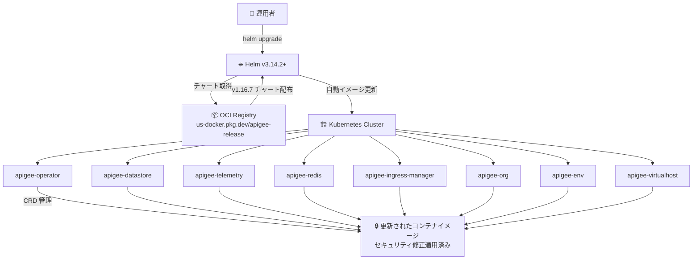

# Apigee hybrid: v1.16.7 パッチリリース

**リリース日**: 2026-07-10

**サービス**: Apigee hybrid

**機能**: v1.16.7 セキュリティパッチリリース

**ステータス**: Patch Release

📊 [このアップデートのインフォグラフィックを見る](https://takech9203.github.io/google-cloud-news-summary/20260710-apigee-hybrid-v1-16-7.html)

## 概要

2026 年 7 月 10 日、Google Cloud は Apigee hybrid ソフトウェアのパッチリリース v1.16.7 を公開した。本リリースはセキュリティ修正に焦点を当てたパッチリリースであり、各種 CVE (Common Vulnerabilities and Exposures) への対応が含まれている。

パッチリリースの特徴として、コンテナイメージが Apigee hybrid の Helm チャートに統合されているため、Helm チャートを通じてアップグレードすることでイメージも自動的に更新される。手動でのイメージ変更は通常不要であり、運用者の負担を最小限に抑えた形でセキュリティ対応が可能となっている。

本リリースは v1.16 系統の 7 番目のパッチであり、v1.16.0 (2025 年 12 月リリース) 以降、継続的にセキュリティ修正とバグフィックスが提供されている。直前のリリースは v1.16.6 (2026 年 6 月 19 日) であり、約 3 週間のサイクルでパッチがリリースされている。

**アップデート前の課題**

- v1.16.6 以前のバージョンに存在するセキュリティ脆弱性 (CVE) が未修正の状態であった
- コンテナイメージに含まれるライブラリやコンポーネントに既知の脆弱性が存在していた
- セキュリティコンプライアンス要件を満たすために最新パッチの適用が必要であった

**アップデート後の改善**

- 各種 CVE に対するセキュリティ修正が適用され、脆弱性リスクが低減された
- Helm チャートによる自動イメージ更新により、手動作業なしでセキュリティパッチを適用可能になった
- v1.16 系統の最新セキュリティ基準に準拠した状態に更新された

## アーキテクチャ図



Helm チャートによるパッチアップグレードフローを示す。運用者が `helm upgrade` を実行すると、OCI レジストリから v1.16.7 のチャートが取得され、全コンポーネントのコンテナイメージが自動的に更新される。

## サービスアップデートの詳細

### 主要機能

1. **セキュリティ修正 (CVE 対応)**
   - 各種セキュリティ脆弱性への対応が含まれる
   - コンテナイメージ内のライブラリおよびランタイムコンポーネントのセキュリティアップデート
   - 過去の v1.16.x パッチリリースの流れを踏襲し、セキュリティ修正が中心

2. **Helm チャート統合イメージ更新**
   - パッチリリースではコンテナイメージが Helm チャートに統合されている
   - `helm upgrade` コマンドの実行でイメージが自動的に v1.16.7 に更新される
   - hotfix リリースとは異なり、手動でのイメージタグ変更は不要

3. **累積的セキュリティ修正**
   - v1.16.6 までの全パッチ修正を含む累積リリース
   - v1.16.0-hotfix.1、v1.16.0-hotfix.2 での修正内容も統合済み

## 技術仕様

### リリースバージョン情報

| 項目 | 詳細 |
|------|------|
| バージョン | v1.16.7 |
| リリース種別 | パッチリリース |
| リリース日 | 2026-07-10 |
| 前バージョン | v1.16.6 (2026-06-19) |
| Helm バージョン要件 | v3.14.2 以上 |
| チャートレジストリ | oci://us-docker.pkg.dev/apigee-release/apigee-hybrid-helm-charts |

### Helm チャートコンポーネント

| Helm チャート | スコープ | コンポーネント |
|-------------|---------|--------------|
| apigee-operator | オペレーター | Apigee Operator |
| apigee-datastore | ストレージ | Cassandra |
| apigee-redis | インメモリストレージ | Redis |
| apigee-telemetry | レポーティング | Logger, Metrics |
| apigee-ingress-manager | Ingress | Apigee Ingress gateway |
| apigee-org | 組織 | Apigee Connect Agent, MART, Watcher |
| apigee-env | 環境 | Runtime, Synchronizer |
| apigee-virtualhost | 環境グループ | virtualhost |

### パッチリリースとホットフィックスの違い

| 項目 | パッチリリース (v1.16.7) | ホットフィックス |
|------|--------------------------|-----------------|
| イメージ更新方法 | Helm チャートに統合 (自動) | overrides.yaml で手動指定 |
| Helm チャート変更 | あり (新バージョン) | 通常なし |
| 提供目的 | 定期的なセキュリティ/バグ修正 | 緊急の重大修正 |
| 提供頻度 | 最大月 1 回 | 必要に応じて随時 |

## 設定方法

### 前提条件

1. Apigee hybrid v1.16.x が既にインストールされていること
2. Helm v3.14.2 以上がインストールされていること
3. Kubernetes クラスタへのアクセス権限があること
4. `overrides.yaml` ファイルが適切に設定されていること

### 手順

#### ステップ 1: Helm チャートのダウンロード

```bash
export CHART_REPO=oci://us-docker.pkg.dev/apigee-release/apigee-hybrid-helm-charts
export CHART_VERSION=1.16.7

helm pull $CHART_REPO/apigee-operator --version $CHART_VERSION --untar
helm pull $CHART_REPO/apigee-datastore --version $CHART_VERSION --untar
helm pull $CHART_REPO/apigee-env --version $CHART_VERSION --untar
helm pull $CHART_REPO/apigee-ingress-manager --version $CHART_VERSION --untar
helm pull $CHART_REPO/apigee-org --version $CHART_VERSION --untar
helm pull $CHART_REPO/apigee-redis --version $CHART_VERSION --untar
helm pull $CHART_REPO/apigee-telemetry --version $CHART_VERSION --untar
helm pull $CHART_REPO/apigee-virtualhost --version $CHART_VERSION --untar
```

OCI レジストリから v1.16.7 の全 Helm チャートを取得する。

#### ステップ 2: 推奨順序でアップグレード実行

```bash
# 1. Apigee Operator (ドライラン)
helm upgrade operator apigee-operator/ \
  --install \
  --namespace APIGEE_NAMESPACE \
  --atomic \
  -f overrides.yaml \
  --dry-run=server

# 1. Apigee Operator (実行)
helm upgrade operator apigee-operator/ \
  --install \
  --namespace APIGEE_NAMESPACE \
  --atomic \
  -f overrides.yaml

# 2. Apigee Datastore
helm upgrade datastore apigee-datastore/ \
  --install \
  --namespace APIGEE_NAMESPACE \
  --atomic \
  -f overrides.yaml

# 3. Apigee Telemetry
helm upgrade telemetry apigee-telemetry/ \
  --install \
  --namespace APIGEE_NAMESPACE \
  --atomic \
  -f overrides.yaml

# 4. Apigee Redis
helm upgrade redis apigee-redis/ \
  --install \
  --namespace APIGEE_NAMESPACE \
  --atomic \
  -f overrides.yaml

# 5. Apigee Ingress Manager
helm upgrade ingress-manager apigee-ingress-manager/ \
  --install \
  --namespace APIGEE_NAMESPACE \
  --atomic \
  -f overrides.yaml

# 6. Apigee Organization
helm upgrade $ORG_NAME apigee-org/ \
  --install \
  --namespace APIGEE_NAMESPACE \
  --atomic \
  -f overrides.yaml

# 7. Apigee Environment (各環境に対して実行)
helm upgrade ENV_RELEASE_NAME apigee-env/ \
  --install \
  --namespace APIGEE_NAMESPACE \
  --atomic \
  --set env=$ENV_NAME \
  -f overrides.yaml

# 8. Apigee Virtualhost
helm upgrade ENV_GROUP_RELEASE_NAME apigee-virtualhost/ \
  --install \
  --namespace APIGEE_NAMESPACE \
  --atomic \
  --set envgroup=$ENV_GROUP_NAME \
  -f overrides.yaml
```

推奨されるアップグレード順序に従い、各コンポーネントを順番にアップグレードする。各ステップで `--dry-run=server` を使用した事前確認を推奨する。

#### ステップ 3: アップグレードの検証

```bash
# Operator の確認
helm ls -n APIGEE_NAMESPACE
kubectl -n APIGEE_NAMESPACE get deploy apigee-controller-manager

# Datastore の確認
kubectl -n APIGEE_NAMESPACE get apigeedatastore default

# Organization の確認
kubectl -n APIGEE_NAMESPACE get apigeeorg

# Environment の確認
kubectl -n APIGEE_NAMESPACE get apigeeenv
```

全コンポーネントが `running` 状態であることを確認する。

## メリット

### ビジネス面

- **セキュリティコンプライアンス維持**: 最新の CVE 修正を適用することで、組織のセキュリティポリシーやコンプライアンス要件を満たすことができる
- **運用負荷の低減**: Helm チャートによる自動イメージ更新のため、パッチ適用の工数が最小限に抑えられる

### 技術面

- **自動イメージ更新**: Helm チャートに統合されたイメージにより、手動でのコンテナイメージ指定が不要
- **アトミックなアップグレード**: `--atomic` フラグにより、アップグレード失敗時に自動ロールバックが行われる
- **累積的パッチ**: 以前のホットフィックスの修正内容がすべて含まれるため、個別にホットフィックスを適用する必要がない

## デメリット・制約事項

### 制限事項

- v1.16.x 系のみが対象。v1.15.x 以前からのアップグレードは直接対応していない
- アップグレードは推奨順序に従う必要がある (apigee-operator を最初に更新)
- パッチリリースはセキュリティ修正のみであり、新機能は含まれない

### 考慮すべき点

- パッチ適用時は短時間のサービス中断が発生する可能性がある (ローリングアップデートにより最小化)
- 環境が複数ある場合、各環境に対して個別にアップグレードコマンドを実行する必要がある
- アップグレード前に `--dry-run=server` で事前確認を行うことが強く推奨される

## ユースケース

### ユースケース 1: 定期セキュリティパッチ適用

**シナリオ**: セキュリティポリシーにより、CVE 公開後 30 日以内にパッチ適用が求められる組織での対応

**実装例**:
```bash
# 月次メンテナンスウィンドウ内で実行
export CHART_VERSION=1.16.7
export CHART_REPO=oci://us-docker.pkg.dev/apigee-release/apigee-hybrid-helm-charts

# チャートダウンロード
for chart in apigee-operator apigee-datastore apigee-telemetry apigee-redis apigee-ingress-manager apigee-org apigee-env apigee-virtualhost; do
  helm pull $CHART_REPO/$chart --version $CHART_VERSION --untar
done

# 順次アップグレード (ドライランを含む)
helm upgrade operator apigee-operator/ --install --namespace apigee --atomic -f overrides.yaml
```

**効果**: セキュリティコンプライアンス要件を満たしつつ、自動化されたプロセスにより短時間でパッチ適用が完了する。

### ユースケース 2: マルチ環境でのパッチ展開

**シナリオ**: 本番環境、ステージング環境、開発環境を持つ大規模 Apigee hybrid デプロイメントでのパッチ適用

**効果**: ステージング環境で先行検証を行い、問題がないことを確認した上で本番環境に適用する段階的なアプローチが可能。

## 料金

Apigee hybrid のパッチリリースの適用自体に追加料金は発生しない。Apigee hybrid の料金は通常の Apigee サブスクリプションに含まれる。

詳細な料金については [Apigee 料金ページ](https://cloud.google.com/apigee/pricing) を参照。

## 関連サービス・機能

- **Apigee hybrid v1.16.6**: 直前のパッチリリース。HAProxy PROXY-protocol サポートが追加された
- **Apigee hybrid v1.16.0**: v1.16 系のベースリリース。Seccomp Profiles、apigee-guardrails サービスアカウント、UDCA 廃止が主要変更点
- **Helm**: Apigee hybrid のデプロイメントおよびアップグレードに使用されるパッケージマネージャー (v3.14.2+ 必須)
- **Google Kubernetes Engine (GKE)**: Apigee hybrid の推奨実行環境
- **cert-manager**: TLS 証明書管理。v1.16 では release 1.18/1.19 をサポート

## 参考リンク

- 📊 [インフォグラフィック](https://takech9203.github.io/google-cloud-news-summary/20260710-apigee-hybrid-v1-16-7.html)
- [公式リリースノート](https://cloud.google.com/release-notes#July_10_2026)
- [Apigee hybrid リリースノート](https://cloud.google.com/apigee/docs/hybrid/release-notes)
- [Apigee hybrid v1.16 アップグレードガイド](https://cloud.google.com/apigee/docs/hybrid/v1.16/upgrade)
- [Helm リファレンス](https://cloud.google.com/apigee/docs/hybrid/v1.16/helm-reference)
- [Apigee リリースプロセス](https://cloud.google.com/apigee/docs/release/apigee-release-process)
- [Apigee hybrid インストール: Helm チャート](https://cloud.google.com/apigee/docs/hybrid/v1.16/install-helm-charts)

## まとめ

Apigee hybrid v1.16.7 は、セキュリティ脆弱性の修正に焦点を当てた定期パッチリリースである。Helm チャートとの統合によりアップグレードプロセスが簡素化されており、推奨されるアップグレード順序に従って `helm upgrade` を実行するだけで全コンポーネントのセキュリティパッチを適用できる。v1.16.x を利用中の組織は、セキュリティコンプライアンス維持のため、計画的なパッチ適用を推奨する。

---

**タグ**: #Apigee #ApigeeHybrid #Security #PatchRelease #Helm #Kubernetes #CVE #v1.16.7
