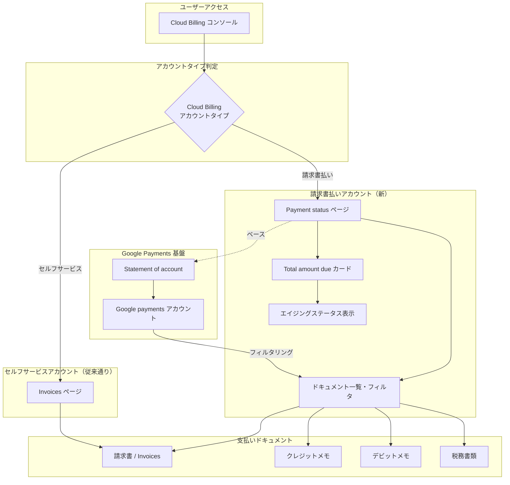

# Cloud Billing: Payment status ページによる請求書払いアカウント向けドキュメント管理の刷新

**リリース日**: 2026-07-10

**サービス**: Cloud Billing

**機能**: Payments documents for invoiced billing accounts available on Payment status page

**ステータス**: Feature

[このアップデートのインフォグラフィックを見る](https://takech9203.github.io/google-cloud-news-summary/20260710-cloud-billing-payment-status-page.html)

## 概要

Google Cloud は、請求書払い（Invoiced）の Cloud Billing アカウント向けに、支払いドキュメント（請求書、クレジットメモなど）へのアクセス方法を刷新しました。従来の「Invoices（請求書）」ページに代わり、新しい「Payment status（支払いステータス）」ページが Cloud Billing コンソールに導入されました。

この Payment status ページは、Google payments の Statement of account ページをベースとしており、Cloud Billing アカウントにリンクされた Google payments アカウントでフィルタリングされた支払いドキュメントをリアルタイムで表示します。これにより、請求書払いアカウントのユーザーは、財務状況をカスタマイズ可能なビューでリアルタイムに確認できるようになりました。

なお、セルフサービス（オンライン）の Cloud Billing アカウントは、引き続き従来の Invoices ページから支払いドキュメントにアクセスします。この変更は請求書払いアカウントのみに適用されます。

**アップデート前の課題**

- 請求書払いアカウントでは Invoices ページでドキュメントを確認する必要があり、リアルタイムの財務状況把握が困難だった
- 支払いドキュメントのフィルタリングやカスタマイズ機能が限定的だった
- Google payments アカウントとの連携が直感的ではなく、エイジングステータス（期限切れ状況）の可視化が不十分だった

**アップデート後の改善**

- Payment status ページにより、リアルタイムかつカスタマイズ可能な財務状況ビューが利用可能になった
- 請求書のエイジングステータス（未払い、期限間近、延滞など）が一目で確認できるようになった
- Google payments Statement of account との統合により、支払いドキュメントの一元管理が実現した

## アーキテクチャ図



この図は、アカウントタイプに応じたドキュメントアクセスフローを示しています。請求書払いアカウントは新しい Payment status ページを経由し、Google payments Statement of account をベースとしたリアルタイムビューでドキュメントにアクセスします。

## サービスアップデートの詳細

### 主要機能

1. **Payment status ページ（請求書払いアカウント向け）**
   - Invoices ページに代わる新しい支払い管理インターフェース
   - リアルタイムで財務状況を表示
   - カスタマイズ可能なビューを提供
   - Google payments Statement of account をベースとした設計

2. **Total amount due カード**
   - 未払い請求書をエイジングステータス別に分類表示
   - 「Not due yet（未到来）」「Due soon（間もなく期限）」「Overdue（延滞）」「At risk（リスクあり）」「Suspended（停止）」の5段階で管理
   - 各ステータスから該当する請求書を直接確認可能

3. **高度なドキュメント検索・フィルタ機能**
   - 発行月、ドキュメントタイプ、ステータスによるフィルタリング
   - AND/OR 演算子を使用したテキスト検索
   - カラムの表示/非表示およびカスタム配置
   - 個別または一括でのドキュメントダウンロード

## 技術仕様

### エイジングステータスの分類

| ステータス | 説明 | アクション |
|------|------|------|
| Not due yet | 期限が来ていない未払い請求書 | 通常対応不要 |
| Due soon | 20日以内に期限到来する請求書 | 支払い準備を推奨 |
| Overdue | 期限を超過した請求書 | 早急な支払いが必要 |
| At risk | 延滞しサービス停止リスクのある請求書 | 即時支払いが必要 |
| Suspended | アカウント停止中の請求書 | 支払い後にアカウント復活 |

### 必要な権限

Payment status ページへのアクセスには、以下のいずれかの Cloud Billing IAM ロールが必要です。

| ロール | 権限 |
|------|------|
| Billing Account Viewer | `billing.accounts.getPaymentInfo` |
| Billing Account Administrator | `billing.accounts.getPaymentInfo` |

## 設定方法

### 前提条件

1. 請求書払い（Invoiced）タイプの Cloud Billing アカウントを保有していること
2. Billing Account Viewer または Billing Account Administrator ロールが付与されていること

### 手順

#### ステップ 1: Cloud Billing コンソールにアクセス

Google Cloud コンソールで Manage billing accounts ページにサインインし、対象の Cloud Billing アカウント名をクリックします。

```
Google Cloud コンソール > Billing > アカウント名をクリック
```

#### ステップ 2: Payment status ページを開く

Billing ナビゲーションメニューから「Payment status」を選択します。

```
Billing ナビゲーションメニュー > Payment status
```

請求書払いアカウントでは、従来の「Invoices」メニュー項目が「Payment status」に置き換わっています。

#### ステップ 3: ドキュメントの確認とフィルタリング

Payment status ページで「View all invoices and memos」をクリックして全ドキュメントを表示し、フィルタ機能を使用して必要なドキュメントを絞り込みます。

```
Payment status > View all invoices and memos > Show filter > フィルタ条件を設定
```

## メリット

### ビジネス面

- **リアルタイム財務可視化**: 支払い状況をリアルタイムで確認でき、キャッシュフロー管理が改善される
- **延滞リスクの早期検知**: エイジングステータスにより、支払い遅延によるサービス停止リスクを事前に把握できる
- **業務効率の向上**: カスタマイズ可能なフィルタにより、必要なドキュメントへの迅速なアクセスが可能になる

### 技術面

- **Google payments 統合**: Google payments Statement of account との直接統合により、支払い情報の一貫性が向上
- **高度な検索機能**: AND/OR 演算子対応の検索機能により、大量のドキュメントから目的のものを効率的に特定可能
- **カスタマイズ性**: カラム配置やフィルタ設定のカスタマイズにより、チームのワークフローに最適化した表示が可能

## デメリット・制約事項

### 制限事項

- セルフサービス（オンライン）アカウントは対象外であり、引き続き Invoices ページを使用する
- Payment status ページは請求書払いアカウント専用のため、アカウントタイプによりアクセスするページが異なる
- 過去に異なる Google payments アカウントにリンクされていた場合、「View past accounts」から別途確認が必要

### 考慮すべき点

- 既存の Invoices ページへのブックマークやドキュメントリンクは更新が必要な場合がある
- チームメンバーへの新しいナビゲーション方法の周知が必要
- 請求書の PDF 版と CSV 版で利用可能になるタイミングに差がある（CSV は PDF より 1-2 日遅れる場合がある）

## ユースケース

### ユースケース 1: 経理部門による未払い請求書の管理

**シナリオ**: 大企業の経理部門が、複数の Cloud Billing アカウントにまたがる未払い請求書の状況をリアルタイムで把握し、延滞リスクを管理する。

**実装例**:
```
1. Payment status ページを開く
2. Total amount due カードで「Due soon」と「Overdue」のステータスを確認
3. 「View」をクリックして該当する請求書を特定
4. フィルタで「document status = open」を設定して未払い一覧を表示
5. 一括ダウンロードで社内システムに取り込み
```

**効果**: 支払い期限の管理が自動化され、サービス停止リスクを事前に回避できる

### ユースケース 2: 月次決算での請求書照合

**シナリオ**: 月次決算時に、特定の月のサービス利用に関する全請求書とクレジットメモを一括で取得し、社内会計システムと照合する。

**実装例**:
```
1. Payment status ページで「View all invoices and memos」をクリック
2. フィルタで「issue month = 対象月」を設定
3. AND 検索で特定のプロダクト名やプロジェクト名を指定
4. 該当ドキュメントを一括ダウンロード
```

**効果**: 月次決算の作業時間を短縮し、請求書の見落としを防止できる

## 料金

Payment status ページの利用自体に追加料金は発生しません。Cloud Billing コンソールの標準機能として提供されます。

請求書払いアカウントの請求サイクルは従来通りで、毎月の請求書は翌月の5営業日目までに利用可能になります。

## 利用可能リージョン

Payment status ページは、請求書払い（Invoiced）タイプの Cloud Billing アカウントを持つ全てのリージョンのユーザーが利用可能です。Google Cloud コンソールからグローバルにアクセスできます。

## 関連サービス・機能

- **Google payments Statement of account**: Payment status ページのベースとなっている Google payments のアカウント明細機能
- **Cloud Billing Transactions ページ**: 支払い履歴や領収書の確認に使用する別ページ
- **Cost Table レポート**: 請求書の詳細コスト内訳を確認するためのレポート機能
- **Cloud Billing Budget アラート**: 予算超過を検知するアラート機能との組み合わせで財務管理を強化

## 参考リンク

- [インフォグラフィック](https://takech9203.github.io/google-cloud-news-summary/20260710-cloud-billing-payment-status-page.html)
- [公式リリースノート](https://docs.cloud.google.com/release-notes#July_10_2026)
- [Get a Cloud Billing document such as an invoice, statement, or receipt](https://docs.cloud.google.com/billing/docs/how-to/get-invoice)
- [View your cost and payment history](https://docs.cloud.google.com/billing/docs/how-to/view-history)
- [Google payments Statement of account](https://support.google.com/paymentscenter/answer/7520537)
- [Cloud Billing アカウントタイプ](https://docs.cloud.google.com/billing/docs/concepts#billing_account_types)

## まとめ

今回のアップデートにより、請求書払いの Cloud Billing アカウントユーザーは、より直感的で機能豊富な Payment status ページを通じて支払いドキュメントを管理できるようになりました。エイジングステータスによる未払い管理、高度なフィルタ・検索機能、Google payments との統合により、企業の財務管理ワークフローが大幅に改善されます。請求書払いアカウントを利用している組織は、新しい Payment status ページのナビゲーション方法をチームに周知し、既存のブックマークやプロセスドキュメントを更新することを推奨します。

---

**タグ**: #CloudBilling #PaymentStatus #InvoicedAccounts #GooglePayments #FinancialManagement #BillingConsole
