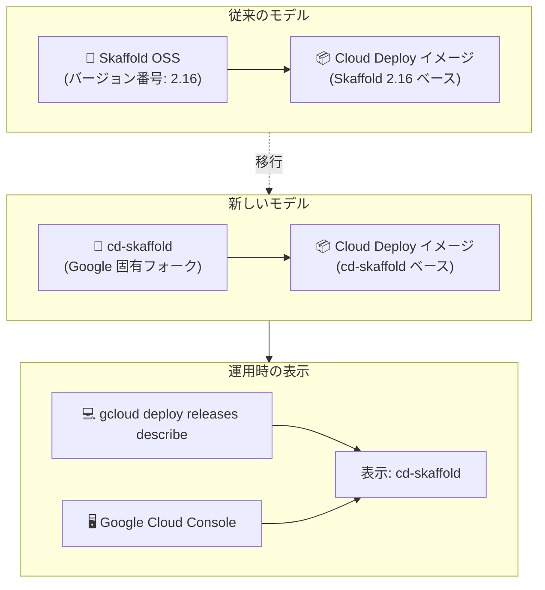

# Cloud Deploy: Google 固有の Skaffold フォーク (cd-skaffold) への移行

**リリース日**: 2026-07-10

**サービス**: Cloud Deploy

**機能**: Skaffold バージョンの cd-skaffold への変更

**ステータス**: Change (一般提供)

📊 [このアップデートのインフォグラフィックを見る](https://takech9203.github.io/google-cloud-news-summary/20260710-cloud-deploy-skaffold-fork.html)

## 概要

Cloud Deploy のイメージが、従来のオープンソース Skaffold から Google 固有のフォークである「cd-skaffold」を使用するように変更された。これにより、`gcloud deploy releases describe` コマンドの実行時や Google Cloud Console でリリースを表示した際に表示される Skaffold バージョンが、従来のバージョン番号 (例: 2.16) ではなく `cd-skaffold` と表示されるようになった。

この変更は、Cloud Deploy のセキュリティ体制を強化し、脆弱性への対応速度を向上させるための戦略的な決定である。従来のモデルでは、特定の Skaffold バージョンに対応するイメージを提供する必要があったが、Google 固有のフォークに移行することで、Cloud Deploy チームが独自のリリースサイクルで脆弱性パッチやツールバージョンの更新をより迅速に適用できるようになった。

対象ユーザーは Cloud Deploy を利用しているすべてのデベロッパーおよび DevOps エンジニアであり、特にリリースのバージョン情報を監視・管理しているチームに影響がある。

**アップデート前の課題**

- Cloud Deploy のイメージはオープンソースの Skaffold バージョン (例: 2.16) に紐づいており、セキュリティ脆弱性への対応がオープンソースのリリースサイクルに依存していた
- 特定の Skaffold バージョンに対応するイメージを個別に維持・管理する必要があり、脆弱性対応に時間がかかっていた
- バージョン番号が Skaffold のオープンソースリリースと同期しているため、Cloud Deploy 固有の改善を迅速にリリースしにくかった

**アップデート後の改善**

- Google 固有のフォーク (cd-skaffold) により、Cloud Deploy チームが独立してセキュリティパッチを適用可能になった
- 脆弱性への対応速度が向上し、Cloud Deploy のセキュリティ体制が強化された
- デフォルトツールバージョンの更新をより頻繁に実施できるようになった

## アーキテクチャ図



Cloud Deploy の Skaffold ランタイムが、オープンソース版からGoogle固有のフォーク (cd-skaffold) に移行したことを示す図。バージョン表示が従来の番号から `cd-skaffold` に変更されている。

## サービスアップデートの詳細

### 主要機能

1. **cd-skaffold フォークの採用**
   - Cloud Deploy イメージが Google 固有の Skaffold フォークを使用するように変更
   - オープンソース Skaffold をベースにしつつ、Cloud Deploy に最適化された修正やセキュリティパッチを独自に適用
   - Cloud Deploy の render および deploy 操作は引き続き Skaffold の機能を使用

2. **バージョン表示の変更**
   - `gcloud deploy releases describe` コマンドの出力で Skaffold バージョンが `cd-skaffold` と表示される
   - Google Cloud Console のリリース詳細画面でも同様に `cd-skaffold` と表示される
   - 従来のバージョン番号 (例: 2.16.1) ではなく、フォーク名称での表示に統一

3. **レガシー Skaffold バージョンとの共存**
   - 既存のレガシー Skaffold バージョン (例: 2.16) は有効期限まで引き続きサポートされる
   - `--skaffold-version` フラグで特定のレガシーバージョンを指定してリリースを作成することも可能
   - 新しいリリースではデフォルトで cd-skaffold が使用される

## 技術仕様

### バージョン確認方法

| 方法 | コマンド / 操作 | 表示内容 |
|------|----------------|----------|
| CLI | `gcloud deploy releases describe RELEASE_NAME --delivery-pipeline=PIPELINE --region=REGION --format='yaml(toolVersions)'` | `cd-skaffold` |
| CLI (レガシー) | `gcloud deploy releases describe RELEASE_NAME --format='yaml(skaffoldVersion)'` | レガシーバージョンのみ |
| Console | リリース詳細ページ | `cd-skaffold` |
| デフォルト確認 | `gcloud deploy get-config --project=PROJECT --region=REGION --format='yaml(defaultToolVersions)'` | デフォルトツールバージョン一覧 |

### ツールバージョン管理

```bash
# リリースに関連付けられたツールバージョンを確認
gcloud deploy releases describe RELEASE_NAME \
  --delivery-pipeline=PIPELINE_NAME \
  --project=PROJECT \
  --region=REGION \
  --format='yaml(toolVersions)'

# デフォルトのツールバージョンを確認
gcloud deploy get-config \
  --project=PROJECT \
  --region=REGION \
  --format='yaml(defaultToolVersions)'

# 特定のスキャフォールドバージョンを指定してリリースを作成 (レガシー)
gcloud deploy releases create RELEASE_NAME \
  --delivery-pipeline=PIPELINE_NAME \
  --skaffold-version=2.16 \
  --project=PROJECT \
  --region=REGION
```

## 設定方法

### 前提条件

1. Cloud Deploy API が有効化されていること
2. 適切な IAM 権限 (`clouddeploy.releases.create`, `clouddeploy.releases.get`) が付与されていること
3. gcloud CLI が最新バージョンにアップデートされていること

### 手順

#### ステップ 1: 現在のリリースの Skaffold バージョンを確認

```bash
# 既存リリースのSkaffoldバージョンを確認
gcloud deploy releases describe my-release \
  --delivery-pipeline=my-pipeline \
  --region=us-central1 \
  --format='yaml(toolVersions)'
```

新しいリリースでは `skaffold: cd-skaffold` と表示される。

#### ステップ 2: 新規リリースの作成 (デフォルト動作)

```bash
# 新規リリースはデフォルトで cd-skaffold を使用
gcloud deploy releases create my-new-release \
  --delivery-pipeline=my-pipeline \
  --region=us-central1 \
  --source=.
```

特別な設定は不要で、新規リリースは自動的に cd-skaffold を使用する。

## メリット

### ビジネス面

- **セキュリティリスクの低減**: Google 独自のリリースサイクルにより、脆弱性への対応が迅速化し、セキュリティインシデントのリスクが低減される
- **運用安定性の向上**: Cloud Deploy に最適化されたフォークにより、サービス固有の問題に対する修正が迅速に適用される

### 技術面

- **独立したセキュリティパッチ適用**: オープンソースのリリースサイクルに依存せず、脆弱性への即座の対応が可能
- **デフォルトツールバージョンの頻繁な更新**: 最新のツールバージョンをより頻繁にデフォルトに反映可能
- **Cloud Deploy 固有の最適化**: Google のインフラに最適化された改善を独自に適用可能

## デメリット・制約事項

### 制限事項

- `gcloud deploy releases describe` の出力で従来のセマンティックバージョン番号が表示されなくなるため、具体的な Skaffold バージョンを外部的に特定しにくくなる
- CI/CD パイプラインで Skaffold バージョン番号をパースしてバージョン管理を行っていた場合、スクリプトの更新が必要になる可能性がある
- レガシー Skaffold バージョン (2.16) は有効期限 (2026 年 7 月 13 日) まではサポートされるが、それ以降は使用不可

### 考慮すべき点

- 既存のリリース監視ダッシュボードやアラートで Skaffold バージョン番号を参照している場合、表示の変更に対応する必要がある
- オープンソース Skaffold の特定バージョンの機能に依存している場合、cd-skaffold での動作確認が推奨される
- 固定ツールバージョニング機能は引き続き利用可能で、リリースのライフサイクル全体を通じてツールバージョンが固定される

## ユースケース

### ユースケース 1: 既存パイプラインの自動移行

**シナリオ**: 既存の Cloud Deploy デリバリーパイプラインを運用しているチームが、新しいリリースを作成する場合

**実装例**:
```bash
# 通常通りリリースを作成 - 自動的に cd-skaffold が使用される
gcloud deploy releases create release-$(date +%Y%m%d) \
  --delivery-pipeline=my-app-pipeline \
  --region=us-central1 \
  --images=my-app=gcr.io/my-project/my-app:latest
```

**効果**: 特別な設定変更なしに、セキュリティが強化された cd-skaffold が自動的に適用される。既存の skaffold.yaml 設定ファイルの変更は不要。

### ユースケース 2: バージョン固定が必要なコンプライアンス環境

**シナリオ**: 特定の Skaffold バージョンでの動作検証が完了しており、規制要件としてバージョンを固定する必要がある環境

**実装例**:
```bash
# レガシーバージョンを明示的に指定 (有効期限内のみ)
gcloud deploy releases create release-compliance \
  --delivery-pipeline=regulated-pipeline \
  --skaffold-version=2.16 \
  --region=us-central1
```

**効果**: 有効期限内であれば従来のバージョン固定による運用を継続可能。ただし期限後は cd-skaffold への移行が必要。

## 料金

Cloud Deploy の料金体系自体に変更はない。Cloud Deploy は以下の料金構成となっている:

- アクティブなデリバリーパイプライン (2つ以上のターゲットを持つもの) に対する料金
- シングルターゲットのデリバリーパイプラインは無料
- 基盤となるサービス (Cloud Build、Cloud Storage) の利用料金は別途発生

詳細は [Cloud Deploy 料金ページ](https://cloud.google.com/deploy/pricing) を参照。

## 利用可能リージョン

Cloud Deploy がサポートする全リージョンで利用可能。[Cloud Locations ページ](https://cloud.google.com/about/locations) でサポートされるリージョンの一覧を確認可能。

## 関連サービス・機能

- **Cloud Build**: Cloud Deploy が Skaffold (cd-skaffold) を呼び出す際の実行環境として使用される
- **Skaffold**: Cloud Deploy のレンダリングおよびデプロイ操作の基盤。cd-skaffold はこのオープンソースプロジェクトのフォーク
- **GKE (Google Kubernetes Engine)**: Cloud Deploy のデプロイターゲットとして使用。cd-skaffold による manifest のレンダリングとデプロイが行われる
- **Cloud Run**: GKE と並ぶ Cloud Deploy のデプロイターゲット
- **Artifact Registry**: cd-skaffold を含むツールバージョンが格納されるリポジトリ (`cd-image-prod` プロジェクト)

## 参考リンク

- 📊 [インフォグラフィック](https://takech9203.github.io/google-cloud-news-summary/20260710-cloud-deploy-skaffold-fork.html)
- [公式リリースノート](https://docs.cloud.google.com/release-notes#July_10_2026)
- [Cloud Deploy での Skaffold の使用](https://docs.cloud.google.com/deploy/docs/using-skaffold)
- [ツールバージョンの選択](https://docs.cloud.google.com/deploy/docs/select-tool-version)
- [Cloud Deploy アーキテクチャ](https://docs.cloud.google.com/deploy/docs/architecture)
- [料金ページ](https://cloud.google.com/deploy/pricing)

## まとめ

今回の変更は Cloud Deploy のセキュリティ体制を強化するための重要なインフラストラクチャ変更である。ユーザーの skaffold.yaml 設定ファイルや既存のデリバリーパイプライン構成に変更は不要であり、機能的な影響は最小限に抑えられている。ただし、Skaffold バージョン番号に基づいた監視スクリプトやダッシュボードを使用している場合は、表示が `cd-skaffold` に変わることへの対応が推奨される。レガシーバージョン (2.16) のサポート期限 (2026 年 7 月 13 日) が迫っているため、まだレガシーバージョンを使用している場合は早急な移行計画の策定が必要である。

---

**タグ**: #CloudDeploy #Skaffold #cd-skaffold #CI/CD #セキュリティ #ツールバージョン #デリバリーパイプライン
