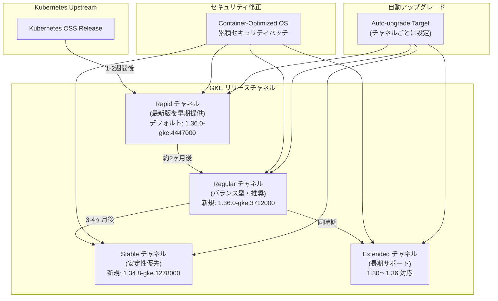

# Google Kubernetes Engine (GKE): バージョンアップデートとセキュリティ修正 (2026-R29)

**リリース日**: 2026-07-10

**サービス**: Google Kubernetes Engine (GKE)

**機能**: クラスタバージョン更新 (2026-R29) - リリースチャネル全体のバージョン追加とセキュリティパッチ

**ステータス**: 利用可能

📊 [このアップデートのインフォグラフィックを見る](https://takech9203.github.io/google-cloud-news-summary/20260710-gke-version-security-updates-r29.html)

## 概要

2026-R29 のバージョンアップデートとして、GKE の全リリースチャネル (Rapid、Regular、Stable、Extended) に新しいクラスタバージョンが追加されました。Rapid チャネルでは 1.36.0-gke.4447000 が新しいデフォルトバージョンとなり、各チャネルに複数の新バージョンが利用可能になっています。

今回のアップデートには、Container-Optimized OS (COS) イメージの累積セキュリティ修正が含まれており、ノードイメージレベルでの脆弱性対応が行われています。全チャネルの自動アップグレードターゲットも更新されており、クラスタの自動アップグレード先バージョンが変更されています。

このアップデートは、GKE クラスタを運用するすべてのプラットフォーム管理者に関係する定期的なバージョンリリースです。特にセキュリティパッチを含むため、運用中のクラスタのアップグレード計画を早期に検討することが推奨されます。

**アップデート前の課題**

- 以前のバージョンでは Container-Optimized OS に未修正のセキュリティ脆弱性が存在していた
- Rapid チャネルのデフォルトバージョンが古く、最新機能を活用するには手動設定が必要だった
- 一部のマイナーバージョンで最新のパッチリリースが利用できなかった

**アップデート後の改善**

- COS イメージの累積セキュリティ修正により、ノードレベルの脆弱性が解消された
- Rapid チャネルで 1.36.0-gke.4447000 がデフォルトとなり、新規クラスタが最新機能を自動的に利用可能
- 各チャネルに最新パッチバージョンが追加され、手動アップグレードの選択肢が拡大
- 自動アップグレードターゲットの更新により、セキュリティパッチが段階的に全クラスタに適用される

## アーキテクチャ図



GKE のリリースチャネルは階層的に構成されており、新バージョンは Rapid チャネルから段階的に Regular、Stable へと展開されます。各チャネルのクラスタは自動アップグレードターゲットに基づいて更新されます。

## サービスアップデートの詳細

### 主要機能

1. **Rapid チャネルの更新**
   - デフォルトバージョンが 1.36.0-gke.4447000 に変更
   - 新バージョン追加: 1.33.13-gke.1101000、1.34.9-gke.1287000、1.35.6-gke.1250000、1.36.0-gke.4681000、1.36.2-gke.1346000
   - 最新の Kubernetes 1.36 系列のパッチが利用可能

2. **Regular チャネルの更新**
   - 新バージョン追加: 1.33.12-gke.1270000、1.34.9-gke.1065000、1.35.6-gke.1049000、1.36.0-gke.3302004、1.36.0-gke.3712000
   - Kubernetes 1.36 が Regular チャネルで利用可能となり、GA として安定運用が推奨される状態

3. **Stable チャネルの更新**
   - 新バージョン追加: 1.33.12-gke.1165000、1.34.8-gke.1278000
   - 十分な検証期間を経たバージョンが追加され、安定性重視のクラスタで利用可能

4. **Extended チャネルの更新**
   - 1.30.14-gke.2816000 から 1.36.0-gke.3712000 まで幅広いバージョンを提供
   - 長期サポートが必要なクラスタ向けに、古いマイナーバージョンのセキュリティパッチも継続提供

5. **Container-Optimized OS セキュリティ修正**
   - COS イメージに累積セキュリティ修正が適用
   - ノードイメージレベルでの脆弱性対応が含まれる
   - セキュリティパッチは全チャネルの新バージョンに反映

## 技術仕様

### チャネル別バージョン一覧

| チャネル | デフォルト | 新規追加バージョン |
|----------|-----------|-------------------|
| Rapid | 1.36.0-gke.4447000 | 1.33.13-gke.1101000, 1.34.9-gke.1287000, 1.35.6-gke.1250000, 1.36.0-gke.4681000, 1.36.2-gke.1346000 |
| Regular | - | 1.33.12-gke.1270000, 1.34.9-gke.1065000, 1.35.6-gke.1049000, 1.36.0-gke.3302004, 1.36.0-gke.3712000 |
| Stable | - | 1.33.12-gke.1165000, 1.34.8-gke.1278000 |
| Extended | - | 1.30.14-gke.2816000 〜 1.36.0-gke.3712000 |

### リリースチャネルの特性比較

| 特性 | Rapid | Regular | Stable | Extended |
|------|-------|---------|--------|----------|
| マイナーバージョン提供開始 | upstream GA 後 1-2 週間 | Rapid 後 約2ヶ月 | Regular 後 3-4ヶ月 | Regular と同時期 |
| 自動アップグレード頻度 | 高 | 中 | 低 | 中 (パッチのみ) |
| SLA 対象 | 非対象 | 対象 | 対象 | 対象 |
| サポート期間 | 標準 14ヶ月 | 標準 14ヶ月 | 標準 14ヶ月 | 最大 24ヶ月 |

### バージョン確認コマンド

```bash
# 利用可能なバージョンの確認
gcloud container get-server-config \
  --zone=asia-northeast1-a \
  --format="yaml(channels)"

# 特定クラスタのアップグレードターゲット確認
gcloud container clusters describe CLUSTER_NAME \
  --zone=asia-northeast1-a \
  --format="yaml(currentMasterVersion,currentNodeVersion)"
```

## 設定方法

### 前提条件

1. gcloud CLI がインストール済みであること
2. 対象プロジェクトへの `container.admin` または `container.clusterAdmin` 権限があること
3. 対象クラスタがリリースチャネルに登録されていること

### 手順

#### ステップ 1: 現在のクラスタバージョンを確認

```bash
# クラスタの現在のバージョンとチャネルを確認
gcloud container clusters describe CLUSTER_NAME \
  --zone=ZONE \
  --format="table(name, currentMasterVersion, currentNodeVersion, releaseChannel.channel)"
```

現在のバージョンと登録チャネルを確認し、アップグレード計画を立てます。

#### ステップ 2: 利用可能なアップグレードバージョンを確認

```bash
# 特定クラスタのアップグレード候補を確認
gcloud container clusters get-upgrade-info CLUSTER_NAME \
  --location=LOCATION
```

自動アップグレードターゲットと手動アップグレード可能なバージョンを確認します。

#### ステップ 3: 手動アップグレードの実行 (任意)

```bash
# コントロールプレーンのアップグレード
gcloud container clusters upgrade CLUSTER_NAME \
  --zone=ZONE \
  --master \
  --cluster-version=1.36.0-gke.4447000

# ノードプールのアップグレード
gcloud container clusters upgrade CLUSTER_NAME \
  --zone=ZONE \
  --node-pool=NODE_POOL_NAME \
  --cluster-version=1.36.0-gke.4447000
```

セキュリティパッチを早期に適用する場合は、手動アップグレードを実施します。

#### ステップ 4: メンテナンスウィンドウの設定 (推奨)

```bash
# 自動アップグレードの時間帯を制御
gcloud container clusters update CLUSTER_NAME \
  --zone=ZONE \
  --maintenance-window-start="2026-07-11T02:00:00Z" \
  --maintenance-window-end="2026-07-11T06:00:00Z" \
  --maintenance-window-recurrence="FREQ=WEEKLY;BYDAY=SA,SU"
```

自動アップグレードが業務影響の少ない時間帯に実行されるよう設定します。

## メリット

### ビジネス面

- **セキュリティリスクの低減**: COS イメージの累積セキュリティ修正により、既知の脆弱性からクラスタを保護
- **運用の継続性**: チャネル別の段階的リリースにより、本番環境への影響を最小化しながらセキュリティパッチを適用可能
- **コンプライアンス対応**: 最新のセキュリティパッチ適用により、セキュリティ要件への準拠を維持

### 技術面

- **最新機能の利用**: Kubernetes 1.36 系列の最新パッチにより、新機能とバグ修正が利用可能
- **バージョン選択の柔軟性**: 各チャネルで複数バージョンが追加され、アップグレード先を柔軟に選択可能
- **Extended チャネルの LTS**: 1.30 から 1.36 まで幅広いバージョンの長期サポートにより、大規模環境のアップグレード計画に余裕を確保

## デメリット・制約事項

### 制限事項

- Rapid チャネルのバージョンは GKE SLA の対象外であり、未知の問題が含まれる可能性がある
- Extended チャネルの extended support 期間中はセキュリティパッチのみ提供され、新機能は含まれない
- 自動アップグレードのタイミングはリージョン・ゾーンによって異なり、即座に全クラスタに適用されるわけではない

### 考慮すべき点

- コントロールプレーンとノード間のバージョンスキューポリシー (ノードはコントロールプレーンの 2 マイナーバージョン前まで許容) に注意が必要
- 自動アップグレードターゲットの変更により、メンテナンスウィンドウ内でアップグレードが実行される可能性がある
- セキュリティパッチの適用を確実にするため、長期間メンテナンス除外を設定しているクラスタは手動アップグレードを検討すべき
- 非推奨 API を使用しているワークロードがある場合、マイナーバージョンアップグレード前に対応が必要

## ユースケース

### ユースケース 1: セキュリティパッチの早期適用

**シナリオ**: 金融系システムを GKE で運用しており、セキュリティパッチを可能な限り早く適用する必要がある。

**実装例**:
```bash
# Rapid チャネルの最新パッチバージョンに手動アップグレード
gcloud container clusters upgrade my-finance-cluster \
  --zone=asia-northeast1-a \
  --master \
  --cluster-version=1.36.0-gke.4681000

# ノードプールも同バージョンにアップグレード
gcloud container clusters upgrade my-finance-cluster \
  --zone=asia-northeast1-a \
  --node-pool=default-pool \
  --cluster-version=1.36.0-gke.4681000
```

**効果**: COS の累積セキュリティ修正が即座に適用され、既知の脆弱性からワークロードを保護。

### ユースケース 2: 段階的アップグレード戦略

**シナリオ**: マルチクラスタ環境で、開発 -> ステージング -> 本番の順にアップグレードを段階的に実施したい。

**実装例**:
```bash
# 開発クラスタ: Rapid チャネル (最新版を早期に検証)
gcloud container clusters update dev-cluster \
  --zone=asia-northeast1-a \
  --release-channel=rapid

# ステージングクラスタ: Regular チャネル (検証済みバージョン)
gcloud container clusters update staging-cluster \
  --zone=asia-northeast1-a \
  --release-channel=regular

# 本番クラスタ: Stable チャネル (十分な安定性を確保)
gcloud container clusters update prod-cluster \
  --zone=asia-northeast1-a \
  --release-channel=stable
```

**効果**: 各環境で適切なリスクレベルのバージョンを運用し、本番環境への影響を最小化しながら最新パッチの恩恵を受けられる。

### ユースケース 3: 長期運用クラスタの管理

**シナリオ**: レガシーアプリケーションが特定の Kubernetes バージョンに依存しており、マイナーバージョンのアップグレードを遅延させたい。

**効果**: Extended チャネルにより最大 24 ヶ月間同一マイナーバージョンを維持しつつ、セキュリティパッチは継続的に受け取ることが可能。

## 料金

GKE クラスタバージョンのアップグレード自体に追加料金は発生しません。

### 料金に関する注意事項

| 項目 | 料金 |
|------|------|
| バージョンアップグレード | 無料 (GKE 管理料金に含まれる) |
| Extended チャネル (extended support 期間中) | クラスタあたり追加料金が発生 |
| GKE Standard 管理料金 | $0.10/クラスタ/時間 |
| GKE Autopilot | vCPU、メモリ、ストレージの使用量に基づく |

Extended チャネルで extended support 期間 (標準サポート終了後の約 10 ヶ月間) に入ったクラスタには、追加のクラスタ管理料金が適用されます。

## 利用可能リージョン

GKE バージョンアップデートは全 Google Cloud リージョンで利用可能です。ただし、新バージョンの展開はリージョンおよびゾーンごとに段階的に行われるため、利用可能になるタイミングに差が生じる場合があります。

## 関連サービス・機能

- **Container-Optimized OS**: GKE ノードのデフォルト OS イメージ。今回のアップデートで累積セキュリティ修正が含まれる
- **GKE Security Bulletins**: GKE に影響するセキュリティ脆弱性の公開情報と対応パッチバージョンを提供
- **GKE Rollout Sequencing**: 複数クラスタ間のアップグレード順序を制御する機能
- **Maintenance Windows and Exclusions**: 自動アップグレードの実行タイミングを制御するメンテナンスポリシー
- **Cluster Notifications**: アップグレードイベントの通知を Cloud Logging や Pub/Sub で受信する機能

## 参考リンク

- 📊 [インフォグラフィック](https://takech9203.github.io/google-cloud-news-summary/20260710-gke-version-security-updates-r29.html)
- [公式リリースノート](https://docs.cloud.google.com/release-notes#July_10_2026)
- [GKE リリースチャネルのコンセプト](https://docs.cloud.google.com/kubernetes-engine/docs/concepts/release-channels)
- [GKE リリーススケジュール](https://docs.cloud.google.com/kubernetes-engine/docs/release-schedule)
- [GKE アップグレードのベストプラクティス](https://docs.cloud.google.com/kubernetes-engine/docs/best-practices/upgrading-clusters)
- [Container-Optimized OS リリースノート](https://docs.cloud.google.com/container-optimized-os/docs/release-notes)
- [GKE セキュリティ情報](https://docs.cloud.google.com/kubernetes-engine/security-bulletins)
- [GKE 料金ページ](https://cloud.google.com/kubernetes-engine/pricing)

## まとめ

今回の 2026-R29 バージョンアップデートは、GKE の全リリースチャネルに新バージョンを追加し、Container-Optimized OS の累積セキュリティ修正を含む重要な定期アップデートです。特に Rapid チャネルのデフォルトが 1.36.0-gke.4447000 に変更された点と、COS のセキュリティパッチが含まれる点に注目してください。運用中のクラスタについて、メンテナンスウィンドウの設定確認と、セキュリティパッチ適用のためのアップグレード計画を速やかに検討することを推奨します。

---

**タグ**: #GKE #Kubernetes #ReleaseChannel #SecurityUpdate #ContainerOptimizedOS #VersionUpdate #AutoUpgrade #ClusterManagement
