# Google Distributed Cloud (software only): バージョン 1.33.1000-gke.59 リリース

**リリース日**: 2026-07-10

**サービス**: Google Distributed Cloud (software only) for VMware / bare metal

**機能**: パッチリリース 1.33.1000-gke.59 - 脆弱性修正、VMware パッチリリース問題の解消、CA ローテーション障害の修正

**ステータス**: Available (GA)

📊 [このアップデートのインフォグラフィックを見る](https://takech9203.github.io/google-cloud-news-summary/20260710-google-distributed-cloud-1-33-1000.html)

## 概要

Google Distributed Cloud (software only) 1.33.1000-gke.59 が VMware 版およびベアメタル版の両方で利用可能になりました。本バージョンは Kubernetes v1.33.11-gke.100 上で動作し、セキュリティ脆弱性の修正に加え、VMware 版ではパッチリリースの配信を阻害していた問題の解消、ベアメタル版では自己管理クラスタ (admin、hybrid、standalone) における Certificate Authority (CA) ローテーションの致命的な障害が修正されています。

特に重要なのは、ベアメタル版の CA ローテーション障害の修正です。この問題は、CA ローテーションの最終フェーズにおいて、一時的なブートストラップクラスタから自己管理クラスタへ管理リソースを戻す際に失敗し、クラスタが管理不能な状態に陥るというものです。**本バージョンへのアップグレード前に CA ローテーションを実行すると、クラスタが管理不能になる可能性があるため、必ず先にアップグレードを実施してください。**

なお、6 月 17 日に発表された VMware 版のパッチリリース配信遅延問題が解消され、1.33.900 パッチがスキップされて本バージョン (1.33.1000) がリリースされています。同様に、1.34.600 および 1.35.200 もスキップされたパッチとして記録されています。

**アップデート前の課題**

- ベアメタル版の自己管理クラスタで CA ローテーションを実行すると、最終フェーズでリソースのピボット操作（ブートストラップクラスタから本番クラスタへの管理リソース移動）が失敗し、クラスタが管理不能な状態に陥る可能性があった
- VMware 版で 6 月 17 日以降パッチリリースの配信が遅延しており、セキュリティ修正を含む最新パッチの適用ができなかった
- 既知のセキュリティ脆弱性が未修正のまま残っていた

**アップデート後の改善**

- CA ローテーションの最終フェーズにおけるリソースピボット操作の問題が解消され、自己管理クラスタで安全に CA ローテーションが実行可能になった
- VMware 版のパッチリリース配信問題が解消され、通常のリリースサイクルが復旧した
- セキュリティ脆弱性が修正され、クラスタのセキュリティ態勢が改善された

## アーキテクチャ図

```mermaid
flowchart TD
    subgraph before["修正前: CA ローテーション障害"]
        A[👤 管理者] -->|"bmctl update credentials\ncertificate-authorities rotate"| B[🔄 CA ローテーション開始]
        B --> C[📜 新 CA 生成・配布]
        C --> D[🖥️ ブートストラップクラスタ作成]
        D --> E[📦 管理リソースを\nブートストラップクラスタへ移動]
        E --> F[🔐 CA 切替処理]
        F --> G[📦 管理リソースを\n本番クラスタへ戻す]
        G -->|"❌ 失敗"| H[💀 クラスタ管理不能]
    end

    subgraph after["修正後: CA ローテーション正常動作"]
        I[👤 管理者] -->|"bmctl update credentials\ncertificate-authorities rotate"| J[🔄 CA ローテーション開始]
        J --> K[📜 新 CA 生成・配布]
        K --> L[🖥️ ブートストラップクラスタ作成]
        L --> M[📦 管理リソースを\nブートストラップクラスタへ移動]
        M --> N[🔐 CA 切替処理]
        N --> O[📦 管理リソースを\n本番クラスタへ戻す]
        O -->|"✅ 成功"| P[✅ ローテーション完了]
    end

    style H fill:#ff6b6b,color:#fff
    style P fill:#51cf66,color:#fff
```



CA ローテーションの最終フェーズでリソースピボット操作（一時ブートストラップクラスタから本番クラスタへの管理リソース移動）が失敗する問題の修正前後のフローを示しています。修正前はこのフェーズで失敗しクラスタが管理不能になりますが、修正後は正常に完了します。

## サービスアップデートの詳細

### 主要機能

1. **セキュリティ脆弱性の修正 (VMware / bare metal 共通)**
   - 最新のセキュリティ脆弱性に対する修正が含まれています
   - 詳細は各エディションの Vulnerability fixes ページを参照

2. **VMware パッチリリース配信問題の解消 (VMware 版)**
   - 2026 年 6 月 17 日に発表された「GDC software only for VMware のパッチリリースを阻害する遅延問題」が解消されました
   - これにより 1.33.900 がスキップされ、1.33.1000 として直接リリースされています

3. **CA ローテーション障害の修正 (bare metal 版) [Critical]**
   - 自己管理クラスタ (admin、hybrid、standalone) で CA ローテーションが失敗する致命的な問題を修正
   - 障害の発生箇所: ローテーションの最終フェーズで、一時ブートストラップクラスタから自己管理クラスタへ管理リソースを戻す操作
   - 障害の影響: クラスタが管理不能な状態に陥り、通常の管理操作ができなくなる
   - **対応必須**: 本バージョンにアップグレードした後に CA ローテーションを実施すること

## 技術仕様

### リリースバージョン情報

| 項目 | 詳細 |
|------|------|
| バージョン | 1.33.1000-gke.59 |
| Kubernetes バージョン | v1.33.11-gke.100 |
| 対象エディション | VMware / bare metal |
| 前バージョン (VMware) | 1.33.800-gke.75 (1.33.900 スキップ) |
| 前バージョン (bare metal) | 1.33.800-gke.75 (1.33.900 スキップ) |
| GKE On-Prem API 利用可能期間 | リリース後 7-14 日 |

### CA ローテーションの影響を受けるクラスタタイプ

| クラスタタイプ | 影響 | 説明 |
|---------------|------|------|
| Admin クラスタ | あり | 自己管理のため影響を受ける |
| Hybrid クラスタ | あり | 自己管理のため影響を受ける |
| Standalone クラスタ | あり | 自己管理のため影響を受ける |
| User クラスタ | なし | Admin クラスタが管理するため影響なし |

### CA ローテーションで管理される証明書

| CA の種類 | 目的 |
|-----------|------|
| etcd CA | API サーバーと etcd レプリカ間、および etcd レプリカ間の通信を保護 |
| Cluster CA | API サーバーと内部 Kubernetes API クライアント (kubelet、controller、scheduler) 間の通信を保護 |
| Front-proxy CA | 集約 API との通信を保護 |

## 設定方法

### 前提条件

1. 現在のクラスタバージョンが 1.33.x 系であること
2. `bmctl` (bare metal) または `gkectl` (VMware) の最新版がインストールされていること
3. **CA ローテーションを実施していないこと** (アップグレード前に CA ローテーションを実行すると障害が発生する)

### 手順

#### ステップ 1: アップグレード (bare metal 版)

```bash
# bmctl を使用してクラスタをアップグレード
bmctl upgrade cluster --cluster CLUSTER_NAME \
  --kubeconfig ADMIN_KUBECONFIG
```

`CLUSTER_NAME` をクラスタ名に、`ADMIN_KUBECONFIG` を管理クラスタの kubeconfig ファイルパスに置き換えてください。自己管理クラスタの場合は、そのクラスタ自身の kubeconfig ファイルを指定します。

#### ステップ 2: アップグレード (VMware 版)

```bash
# gkectl を使用してクラスタをアップグレード
gkectl upgrade cluster \
  --kubeconfig ADMIN_CLUSTER_KUBECONFIG \
  --config USER_CLUSTER_CONFIG
```

**重要**: Advanced admin クラスタでアップグレードが失敗した場合、外部ブートストラップクラスタを削除しないでください。再実行時には `--reuse-bootstrap-cluster` フラグを追加してください。

#### ステップ 3: CA ローテーションの実施 (アップグレード後)

```bash
# bare metal 版の CA ローテーション
bmctl update credentials certificate-authorities rotate \
  --cluster CLUSTER_NAME \
  --kubeconfig KUBECONFIG

# VMware 版の CA ローテーション
gkectl update credentials certificate-authorities rotate \
  --config USER_CLUSTER_CONFIG \
  --kubeconfig ADMIN_CLUSTER_KUBECONFIG
```

CA ローテーション後は、新しい kubeconfig ファイルが生成されます。古い kubeconfig は無効になるため、関係者に新しいファイルを配布してください。

## メリット

### ビジネス面

- **サービス継続性の確保**: CA ローテーション障害によるクラスタ管理不能リスクが排除され、計画的な証明書更新が安全に実施可能になる
- **セキュリティコンプライアンスの維持**: 定期的な CA ローテーションを安全に実行できるようになり、セキュリティポリシーへの準拠が容易になる

### 技術面

- **リソースピボット操作の安定化**: ブートストラップクラスタと本番クラスタ間の管理リソース移動が確実に成功するよう改善された
- **VMware パッチリリースパイプラインの復旧**: 6 月中旬から続いていた配信遅延が解消され、今後のパッチも通常通り配信される
- **Kubernetes v1.33.11 ベース**: 最新のセキュリティパッチが適用された Kubernetes 上で動作する

## デメリット・制約事項

### 制限事項

- リリース後、GKE On-Prem API クライアント (Google Cloud Console、gcloud CLI、Terraform) で利用可能になるまで 7-14 日を要する
- CA ローテーションは開始後に一時停止やロールバックができない
- CA ローテーション中はクラスタ管理操作 (アップグレード、バックアップなど) が実行できない
- CA ローテーション後は古い kubeconfig ファイルが無効になるため、全ユーザーへの再配布が必要

### 考慮すべき点

- **アップグレード順序の厳守**: 必ずアップグレードを完了してから CA ローテーションを実施すること。順序を誤るとクラスタが管理不能になる
- **サードパーティストレージベンダーの互換性**: アップグレード前に Google Distributed Cloud Ready storage partners ドキュメントで互換性を確認すること
- **HA 構成でない場合のダウンタイム**: 高可用性コントロールプレーンを持たないクラスタでは、CA ローテーション中に短時間のコントロールプレーンダウンタイムが発生する

## ユースケース

### ユースケース 1: 定期的な CA ローテーションの再開

**シナリオ**: セキュリティポリシーにより年次で CA ローテーションを実施する必要があるが、本障害のリスクを考慮して実施を見合わせていた管理者が、アップグレード後に安全に CA ローテーションを再開する。

**実装例**:
```bash
# 1. まずクラスタをアップグレード
bmctl upgrade cluster --cluster my-admin-cluster \
  --kubeconfig /path/to/kubeconfig

# 2. アップグレード完了を確認
kubectl get cluster my-admin-cluster -n cluster-my-admin-cluster \
  --kubeconfig /path/to/kubeconfig -o jsonpath='{.status.anthosBareMetalVersion}'

# 3. CA ローテーションを実行
bmctl update credentials certificate-authorities rotate \
  --cluster my-admin-cluster \
  --kubeconfig /path/to/kubeconfig
```

**効果**: TLS 証明書の有効期限切れ (デフォルト 1 年) を防ぎ、セキュリティポリシーへの準拠を維持できる。

### ユースケース 2: VMware 環境でのセキュリティパッチ適用

**シナリオ**: 6 月 17 日以降のパッチリリース遅延により、セキュリティ脆弱性の修正を適用できずにいた VMware 版のユーザーが、本リリースで最新のセキュリティパッチを一括適用する。

**効果**: 約 3 週間分のセキュリティ修正が適用され、クラスタのセキュリティ態勢が最新の状態に回復する。

## 料金

Google Distributed Cloud (software only) はオンプレミスクラスタに対して vCPU 単位で課金されます。本パッチリリースの適用に追加費用は発生しません。

詳細な料金情報については [GKE pricing](https://cloud.google.com/kubernetes-engine/pricing) を参照してください。

## 利用可能リージョン

Google Distributed Cloud (software only) はオンプレミス環境で動作するソフトウェアであり、特定のクラウドリージョンに依存しません。お客様のデータセンターやエッジロケーションに展開できます。リリース後 7-14 日で GKE On-Prem API クライアント (Google Cloud Console、gcloud CLI、Terraform) 経由でのインストール・アップグレードが可能になります。

## 関連サービス・機能

- **GKE Enterprise**: Google Distributed Cloud は GKE Enterprise の一部として提供され、フリート管理や統合監視などのエンタープライズ機能を利用可能
- **Connect Agent**: フリートメンバーシップを介した Google Cloud との接続を管理し、リモートからのクラスタ操作を実現
- **Cloud Monitoring / Cloud Logging**: クラスタおよびワークロードの監視・ログ管理を提供
- **Anthos Identity Service**: クラスタ認証の管理を提供し、CA ローテーション後の認証設定の更新に関連

## 参考リンク

- 📊 [インフォグラフィック](https://takech9203.github.io/google-cloud-news-summary/20260710-google-distributed-cloud-1-33-1000.html)
- [公式リリースノート](https://docs.cloud.google.com/release-notes#July_10_2026)
- [VMware 版リリースノート](https://docs.cloud.google.com/kubernetes-engine/distributed-cloud/vmware/docs/release-notes)
- [bare metal 版リリースノート](https://docs.cloud.google.com/kubernetes-engine/distributed-cloud/bare-metal/docs/release-notes)
- [bare metal 版 CA ローテーション手順](https://docs.cloud.google.com/kubernetes-engine/distributed-cloud/bare-metal/docs/how-to/ca-rotation)
- [VMware 版 CA ローテーション手順](https://docs.cloud.google.com/kubernetes-engine/distributed-cloud/vmware/docs/how-to/ca-rotation)
- [bare metal 版アップグレード手順](https://docs.cloud.google.com/kubernetes-engine/distributed-cloud/bare-metal/docs/how-to/upgrade)
- [VMware 版アップグレード手順](https://docs.cloud.google.com/kubernetes-engine/distributed-cloud/vmware/docs/how-to/upgrading)
- [脆弱性修正一覧 (bare metal)](https://docs.cloud.google.com/kubernetes-engine/distributed-cloud/bare-metal/docs/vulnerabilities)
- [脆弱性修正一覧 (VMware)](https://docs.cloud.google.com/kubernetes-engine/distributed-cloud/vmware/docs/vulnerabilities)
- [GKE 料金ページ](https://cloud.google.com/kubernetes-engine/pricing)

## まとめ

Google Distributed Cloud 1.33.1000-gke.59 は、ベアメタル版の自己管理クラスタにおける CA ローテーション障害という致命的な問題を修正した重要なパッチリリースです。CA ローテーションを計画している管理者は、**必ず本バージョンへのアップグレードを先に実施**してください。アップグレード前に CA ローテーションを実行すると、クラスタが管理不能な状態に陥るリスクがあります。また、VMware 版ユーザーにとっても約 3 週間のパッチリリース遅延が解消された初のリリースであり、速やかな適用を推奨します。

---

**タグ**: #GoogleDistributedCloud #GDC #BereMetal #VMware #Kubernetes #CARotation #SecurityPatch #OnPremise #GKEEnterprise #CertificateAuthority
