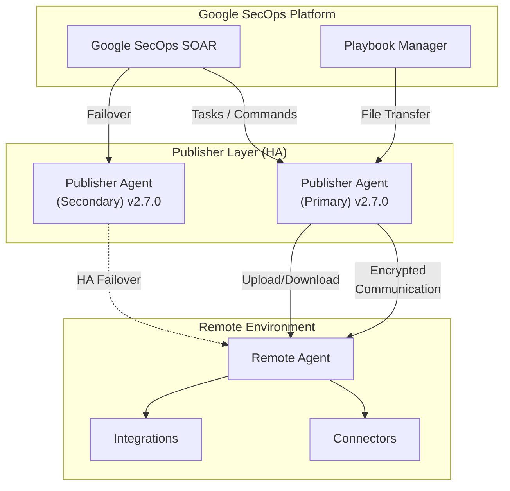

# Google SecOps SOAR: Release 6.3.92 全リージョン展開完了

**リリース日**: 2026-07-11

**サービス**: Google SecOps SOAR

**機能**: Release 6.3.92 (Publisher Agent Version 2.7.0 含む)

**ステータス**: GA (全リージョン展開完了)

[このアップデートのインフォグラフィックを見る](https://takech9203.github.io/google-cloud-news-summary/20260711-google-secops-soar-release-6-3-92.html)

## 概要

Google SecOps SOAR Release 6.3.92 が全リージョンで利用可能になった。本リリースは 2026 年 7 月 5 日に第 1 フェーズのリージョン (日本、インド、オーストラリア、カナダ、ドイツ、スイス) で展開が開始され、7 月 11 日に第 2 フェーズのリージョン (シンガポール、カタール、サウジアラビア、イスラエル、英国、イタリア、EU マルチリージョン、US マルチリージョン) への展開が完了した。

本リリースには内部およびカスタマーバグ修正に加え、Publisher Agent Version 2.7.0 が含まれている。Publisher Agent 2.7.0 では、Publisher の高可用性 (High Availability) サポートと、GCOM インフラストラクチャに移行済みのエージェントでのファイル転送機能が追加された。

**アップデート前の課題**

- Publisher Agent に高可用性の仕組みがなく、Publisher 障害時にリモートエージェントとの通信が途絶するリスクがあった
- GCOM インフラストラクチャに移行したリモートエージェントでは、プレイブックや SDK を通じたファイルのアップロード・ダウンロードができなかった
- Remote Agent の高可用性は利用可能だったが、Publisher 側での冗長化サポートが不足していた

**アップデート後の改善**

- Publisher Agent レベルでの高可用性サポートが追加され、Publisher 障害時の耐障害性が向上した
- GCOM インフラストラクチャ上のエージェントでプレイブックおよび SDK を使用したファイル転送 (アップロード/ダウンロード) が可能になった
- エンドツーエンドの高可用性構成が実現し、Remote Agent から Publisher まで一貫した冗長化が可能になった

## アーキテクチャ図

Publisher Agent 2.7.0 により、Publisher 層での高可用性 (Primary/Secondary 構成) が実現し、GCOM インフラ移行済みエージェントへのファイル転送もサポートされた。

## サービスアップデートの詳細

### 主要機能

1. **Publisher Agent 高可用性 (HA) サポート**
   - Publisher Agent レベルでのアプリケーション高可用性が追加された
   - 既存の Remote Agent HA (2025 年 3 月プレビュー開始) と組み合わせることで、エンドツーエンドの冗長構成が可能
   - Primary Publisher が利用不可になった場合、Secondary Publisher が自動的にタスクを引き継ぐ

2. **ファイル転送サポート (GCOM 移行済みエージェント)**
   - プレイブックおよび SDK を使用して、リモートエージェント経由でファイルのアップロード・ダウンロードが可能
   - GCOM (Google Cloud Operations Management) インフラストラクチャに移行済みのエージェントが対象
   - インシデント対応時のエビデンス収集やレポート生成ワークフローの自動化を支援

3. **内部およびカスタマーバグ修正**
   - プラットフォーム全体の安定性向上
   - 既知の不具合に対する修正を含む

## 技術仕様

### リリース展開スケジュール

| フェーズ | リージョン | 展開日 |
|---------|-----------|--------|
| 第 1 フェーズ | 日本、インド、オーストラリア、カナダ、ドイツ、スイス | 2026-07-05 |
| 第 2 フェーズ | シンガポール、カタール、サウジアラビア、イスラエル、英国、イタリア、EU、US | 2026-07-11 |

### Publisher Agent 高可用性の仕組み

| 項目 | 詳細 |
|------|------|
| フェイルオーバー方式 | 自動 (Primary 障害検知後に Secondary が引き継ぎ) |
| Remote Agent HA のダウンタイム閾値 | 30 秒 |
| ダウンタイム通知トリガー | 90 秒以上のダウン |
| データ保持期間 (Publisher) | 3 日間 (設定可能) |
| 通信方式 | エージェント → Publisher への一方向通信 (ポーリング) |
| 暗号化 | ハイブリッド暗号モデル (公開鍵 + 対称鍵) |

### Remote Agent セキュリティモデル

| 項目 | 詳細 |
|------|------|
| 認証 | エージェント固有のアプリケーションキー + 許可リスト |
| データ完全性 | デジタル署名による改ざん検知 |
| ポーリング間隔 | 5 秒ごと |
| Publisher データ保持 | 完了ジョブは即時削除 |

## メリット

### ビジネス面

- **運用継続性の向上**: Publisher 高可用性により、単一障害点が排除され、SOAR プラットフォームの稼働時間が向上
- **インシデント対応の効率化**: ファイル転送機能により、リモート環境からのエビデンス収集やマルウェアサンプルの取得をプレイブックで自動化可能
- **MSSP サービス品質の向上**: マルチテナント環境での安定性が向上し、SLA 遵守が容易に

### 技術面

- **エンドツーエンド HA**: Remote Agent HA と Publisher HA の組み合わせにより、リモート実行パス全体の冗長化が実現
- **自動化範囲の拡大**: SDK およびプレイブックからのファイル操作が可能になり、ワークフロー自動化の幅が広がる
- **セキュアな通信維持**: HA 構成でも暗号化通信とデジタル署名による整合性検証が維持される

## デメリット・制約事項

### 制限事項

- ファイル転送機能は GCOM インフラストラクチャに移行済みのエージェントのみが対象
- Publisher HA の詳細な設定手順は公式ドキュメントで別途確認が必要
- SOAR から Google Cloud への移行 (Stage 2) が未完了の場合、一部機能に制限がある可能性がある

### 考慮すべき点

- GCOM インフラへの移行が未完了のエージェントではファイル転送機能を利用できないため、移行計画の策定が必要
- SOAR 移行 Stage 2 の期限は 2026 年 9 月 30 日に延長されているが、早期の移行完了が推奨される
- Publisher Agent のアップデートは段階的に展開されるため、全リージョンでの利用可能タイミングにずれがある

## ユースケース

### ユースケース 1: インシデント対応時の自動エビデンス収集

**シナリオ**: セキュリティインシデント発生時に、リモートサイトのサーバーからログファイルやメモリダンプを自動的に収集する。

**効果**: ファイル転送機能により、アナリストが手動でリモート接続する必要がなくなり、初動対応時間が短縮される。プレイブックに組み込むことで、アラート発生と同時に証拠保全を開始できる。

### ユースケース 2: 高可用性 MSSP 環境での運用

**シナリオ**: 複数のクライアント環境を管理する MSSP が、Publisher 障害によるサービス中断を防止したい。

**効果**: Publisher HA により、Primary Publisher の障害時にも Secondary が自動的にタスクを引き継ぎ、クライアント環境との通信が維持される。Remote Agent HA と組み合わせることで、エンドツーエンドの耐障害性を確保できる。

## 利用可能リージョン

全リージョンで利用可能 (2026-07-11 時点):

- **第 1 フェーズ**: 日本、インド、オーストラリア、カナダ、ドイツ、スイス
- **第 2 フェーズ**: シンガポール、カタール、サウジアラビア、イスラエル、英国 (ロンドン)、イタリア、EU (マルチリージョン)、US (マルチリージョン)

## 関連サービス・機能

- **Google SecOps SIEM**: SOAR と統合されたセキュリティ情報イベント管理。アラートの取り込みとケース作成を担当
- **Chronicle API**: 統合された API により、Case、Alert、Integration 等のリソースをプログラマティックに管理可能
- **Remote Agent**: リモート環境でのアクション実行・コネクタ・ジョブを担当する軽量エージェント
- **Google Cloud IAM**: SOAR Permission Groups から移行可能な、きめ細かいアクセス制御 (2026 年 3 月 GA)

## 参考リンク

- [インフォグラフィック](https://takech9203.github.io/google-cloud-news-summary/20260711-google-secops-soar-release-6-3-92.html)
- [公式リリースノート](https://docs.cloud.google.com/chronicle/docs/soar/release-notes)
- [段階的リリース計画](https://docs.cloud.google.com/chronicle/docs/soar/overview-and-introduction/soar-gradual-release)
- [Remote Agent 高可用性ドキュメント](https://docs.cloud.google.com/chronicle/docs/soar/working-with-remote-agents/deploy-high-availability-for-remote-agents)
- [Remote Agent セキュリティ](https://docs.cloud.google.com/chronicle/docs/soar/working-with-remote-agents/remote-agent-security)
- [Remote Agent 概要](https://docs.cloud.google.com/chronicle/docs/soar/working-with-remote-agents/what-is-a-remote-agent)

## まとめ

Google SecOps SOAR Release 6.3.92 は、Publisher Agent 2.7.0 の高可用性サポートとファイル転送機能により、リモートエージェント運用の信頼性と機能性を大幅に向上させるアップデートである。特に MSSP やマルチサイト環境を運用する組織にとって、エンドツーエンドの冗長構成が実現可能になった点は重要である。GCOM インフラへの移行を完了し、Publisher HA を構成することで、これらの新機能を最大限に活用することを推奨する。

---

**タグ**: #GoogleSecOps #SOAR #SecurityOrchestration #RemoteAgent #HighAvailability #PublisherAgent #IncidentResponse #GCOM
