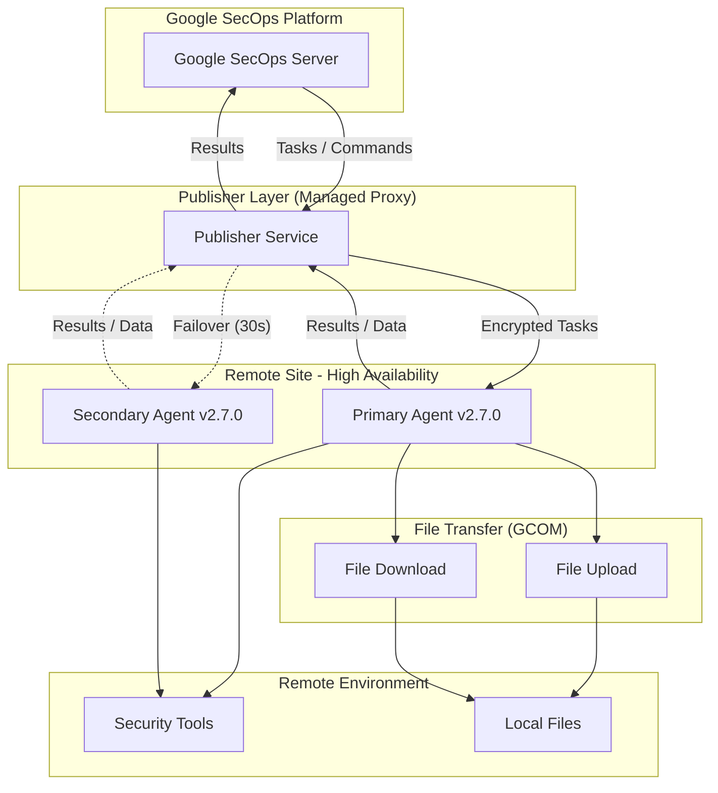

# Google SecOps (Chronicle): Publisher Agent Version 2.7.0

**リリース日**: 2026-07-12

**サービス**: Google SecOps (Chronicle SOAR)

**機能**: Publisher Agent Version 2.7.0

**ステータス**: 全リージョンで利用可能 (GA)

[このアップデートのインフォグラフィックを見る](https://takech9203.github.io/google-cloud-news-summary/20260712-google-secops-publisher-agent-2-7-0.html)

## 概要

Google SecOps (Chronicle) の Publisher Agent Version 2.7.0 が全リージョンで利用可能になりました。本バージョンは 2026 年 7 月 5 日に一部リージョンへの段階的ロールアウトが開始され、7 月 12 日に全リージョンへの展開が完了しています。

このリリースでは、Remote Agent に対する 2 つの重要な機能強化が含まれています。1 つ目は Publisher の高可用性 (High Availability) に対するアプリケーションレベルのサポート追加、2 つ目は GCOM インフラストラクチャに移行済みのエージェントにおけるファイル転送機能のサポートです。

これらの機能は、Managed Security Service Provider (MSSP) やエンタープライズ SOC チームにとって、リモート環境でのセキュリティオペレーションの信頼性と柔軟性を大幅に向上させるものです。

**アップデート前の課題**

- Publisher Agent が単一障害点 (SPOF) となっており、エージェント停止時にリモート実行環境との通信が完全に途絶する可能性があった
- リモートエージェント上でプレイブックや SDK を通じたファイルのアップロード・ダウンロードができなかった
- GCOM インフラストラクチャに移行したエージェントでファイル操作を伴うインシデント対応ワークフローを自動化する手段が限られていた

**アップデート後の改善**

- Publisher の高可用性サポートにより、プライマリエージェント障害時にセカンダリエージェントが 30 秒以内で自動的にテイクオーバーするようになった
- プレイブックおよび SDK を使用してリモートエージェント上でファイルのアップロード・ダウンロードが可能になった
- セキュリティオペレーションの自動化ワークフローにおいてファイル操作を含むエンドツーエンドの対応が実現した

## アーキテクチャ図



Publisher Agent v2.7.0 の高可用性構成とファイル転送機能を示すアーキテクチャ図。プライマリエージェントが停止した場合、セカンダリエージェントが 30 秒後に自動的にテイクオーバーし、ファイル転送を含むすべてのタスクを継続実行します。

## サービスアップデートの詳細

### 主要機能

1. **高可用性 (High Availability) サポート**
   - Publisher Agent にアプリケーションレベルの高可用性サポートが追加
   - プライマリエージェントが利用不可になった場合、セカンダリエージェントが 30 秒のダウンタイム後に自動的にリモート実行を引き継ぐ
   - タスク実行中にプライマリが失敗した場合、その特定タスクは失敗となるが、保留中の他のすべてのタスクは即座にセカンダリに転送される
   - プライマリエージェント 1 つに対してセカンダリエージェント 1 つを構成可能

2. **ファイル転送サポート**
   - GCOM インフラストラクチャに移行済みのエージェントでファイルのアップロード・ダウンロードが可能に
   - プレイブックおよび SDK を通じてファイル操作を実行可能
   - インシデント対応時にリモート環境からのエビデンス収集やファイル配布を自動化

## 技術仕様

### Remote Agent デプロイ要件

| 項目 | 基本デプロイ | スケールアップデプロイ |
|------|-------------|----------------------|
| CPU | 4 コア | 8 コア |
| RAM | 8 GB | 16 GB |
| ストレージ | 100 GB | 100 GB |

### サポート対象 OS

| OS | バージョン |
|----|-----------|
| CentOS | 7.9 |
| RHEL | 8.7 |
| Debian | 12 |

### サポート対象コンテナエンジン

| エンジン | 備考 |
|---------|------|
| Podman | 新規インストールに推奨 |
| Docker | サポート対象 |

### 高可用性のフェイルオーバー仕様

| 項目 | 詳細 |
|------|------|
| フェイルオーバー時間 | 30 秒 |
| セカンダリ数上限 | プライマリ 1 つにつき 1 つ |
| タスク実行中の障害 | 実行中タスクは失敗、保留タスクはセカンダリに転送 |
| ダウンタイム通知 | 90 秒以上のダウンで自動通知 |

### ファイル転送の前提条件

GCOM インフラストラクチャへの移行が完了していること:

```bash
# 環境変数の確認例 (Podman)
podman exec CONTAINER_ID sh -c 'printf \
  "export ONE_PLATFORM_URL_DOMAIN=<domain>\n\
  export ONE_PLATFORM_URL_PROJECT=<project>\n\
  export ONE_PLATFORM_URL_LOCATION=<location>\n\
  export ONE_PLATFORM_URL_INSTANCE=<instance>\n\
  export GOOGLE_APPLICATION_CREDENTIALS=/opt/SiemplifyAgent/agent-key.json" \
  >> /home/siemplify_agent/.bash_profile'
```

## 設定方法

### 前提条件

1. Publisher Agent Version 2.7.0 以上がインストールされていること
2. Google Cloud サービスアカウントが構成済みであること (GCOM 移行済み)
3. コネクタが高可用性対応バージョンに再デプロイ済みであること

### 手順

#### ステップ 1: 高可用性の構成

1. SOAR Settings > Advanced > Remote Agents に移動
2. プライマリエージェントの「View more」をクリック
3. 「Add secondary agent」をクリック
4. セカンダリエージェントのセットアップ手順に従いインストール (手動またはDocker/Podman)

#### ステップ 2: エージェントのアップデート

1. プライマリエージェントを最新バージョンにアップデート
2. コネクタが古いバージョンの場合は再デプロイを実施
3. Remote Agents ページの「High Availability」カラムでセカンダリエージェントのステータスを確認

#### ステップ 3: ファイル転送の利用 (GCOM 移行済みエージェント)

1. エージェントが GCOM インフラストラクチャに移行済みであることを確認
2. プレイブックまたは SDK でファイルアップロード/ダウンロードアクションを構成
3. リモート実行で統合を有効化

## メリット

### ビジネス面

- **サービス継続性の向上**: 高可用性により Publisher Agent の単一障害点を排除し、セキュリティオペレーションの中断リスクを最小化
- **インシデント対応の迅速化**: ファイル転送機能によりリモート環境からのエビデンス収集やマルウェアサンプル取得を自動化し、対応時間を短縮
- **MSSP の運用効率化**: 複数顧客環境を管理する MSSP にとって、エージェントの信頼性向上により SLA 達成が容易に

### 技術面

- **自動フェイルオーバー**: 30 秒以内の自動切り替えにより人的介入なしでサービスを継続
- **プレイブック統合**: ファイル操作をプレイブックに組み込むことで、エンドツーエンドの自動化ワークフローを構築可能
- **SDK 対応**: Python SDK を通じたプログラマティックなファイル操作が可能

## デメリット・制約事項

### 制限事項

- ファイル転送機能は GCOM インフラストラクチャに移行済みのエージェントのみで利用可能
- 高可用性構成ではプライマリ 1 つにつきセカンダリ 1 つまでに限定
- タスク実行中にプライマリが障害を起こした場合、そのタスクは手動での再実行が必要

### 考慮すべき点

- GCOM 移行未完了のエージェントではファイル転送機能を利用できないため、移行計画の策定が必要
- 高可用性構成時はコネクタの再デプロイが必要な場合がある
- セカンダリエージェント用の追加サーバーリソース (CPU 4 コア / RAM 8 GB 以上) が必要

## ユースケース

### ユースケース 1: マルウェアインシデント対応の自動化

**シナリオ**: SOC アナリストがアラートを受信し、リモート環境のエンドポイントから疑わしいファイルを自動収集する必要がある場合。

**効果**: プレイブックでファイルダウンロードアクションを使用し、リモートエージェント経由で自動的にマルウェアサンプルを収集。VirusTotal 等の脅威インテリジェンスサービスとの連携も可能になり、対応時間を大幅に短縮。

### ユースケース 2: MSSP マルチテナント環境での高可用性運用

**シナリオ**: MSSP が複数の顧客環境に Remote Agent を展開し、24/7 のセキュリティモニタリングを提供している場合。

**効果**: 各顧客環境のプライマリエージェントにセカンダリを追加することで、エージェント障害時も 30 秒以内に自動復旧。SLA 違反のリスクを最小化し、顧客信頼性を向上。

### ユースケース 3: フォレンジックエビデンスの遠隔収集

**シナリオ**: セキュリティインシデント発生時に、地理的に離れた拠点からログファイルやメモリダンプを収集する必要がある場合。

**効果**: ファイル転送機能とプレイブックを組み合わせることで、物理的なアクセスなしにエビデンスを自動収集。対応の迅速化とコスト削減を実現。

## 利用可能リージョン

Publisher Agent Version 2.7.0 は 2026 年 7 月 12 日時点で全リージョンで利用可能です。段階的リリースの詳細については [Google SecOps SOAR 段階的リリース計画](https://docs.cloud.google.com/chronicle/docs/soar/overview-and-introduction/soar-gradual-release) を参照してください。

## 関連サービス・機能

- **Google SecOps SOAR**: セキュリティオーケストレーション、自動化、レスポンスのプラットフォーム。Publisher Agent はその Remote Agent コンポーネントの一部
- **Remote Agent High Availability**: セカンダリエージェントによる冗長構成。今回のリリースでアプリケーションレベルのサポートが追加
- **Google Cloud IAM**: SOAR Permission Groups から Google Cloud IAM への移行により、きめ細かいアクセス制御が可能
- **GCOM インフラストラクチャ**: Google Cloud ベースの通信基盤。サービスアカウント認証による Remote Agent の認証と通信を提供

## 参考リンク

- [インフォグラフィック](https://takech9203.github.io/google-cloud-news-summary/20260712-google-secops-publisher-agent-2-7-0.html)
- [公式リリースノート (SOAR)](https://docs.cloud.google.com/chronicle/docs/soar/release-notes)
- [Remote Agent の概要](https://docs.cloud.google.com/chronicle/docs/soar/working-with-remote-agents/what-is-a-remote-agent)
- [高可用性のデプロイ](https://docs.cloud.google.com/chronicle/docs/soar/working-with-remote-agents/deploy-high-availability-for-remote-agents)
- [Remote Agent の GCOM 移行](https://docs.cloud.google.com/chronicle/docs/soar/working-with-remote-agents/migrate-remote-agent-to-google)
- [Remote Agent のセキュリティ](https://docs.cloud.google.com/chronicle/docs/soar/working-with-remote-agents/remote-agent-security)
- [デプロイ要件](https://docs.cloud.google.com/chronicle/docs/soar/working-with-remote-agents/requirements-and-prerequisites)

## まとめ

Publisher Agent Version 2.7.0 は、Google SecOps の Remote Agent に高可用性とファイル転送という 2 つの重要な機能を追加するリリースです。特に MSSP やエンタープライズ SOC チームにとって、セキュリティオペレーションの信頼性と自動化能力が大幅に向上します。GCOM インフラストラクチャへの移行がまだの場合は、ファイル転送機能を活用するために移行を計画することを推奨します。

---

**タグ**: #google-secops #chronicle #publisher-agent #high-availability #file-transfer #soar
