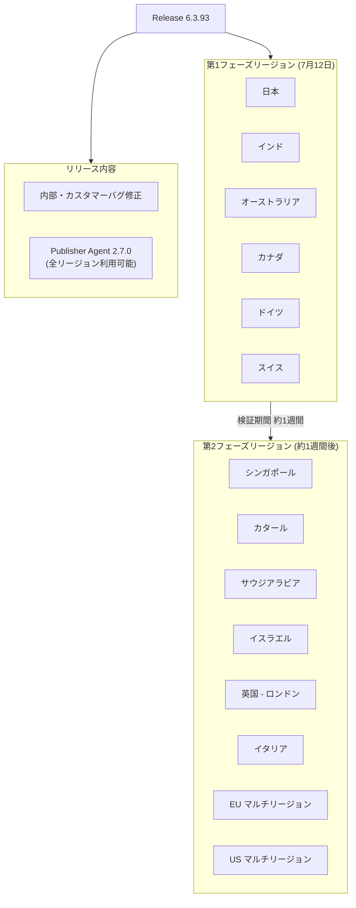

# Google SecOps SOAR: Release 6.3.93

**リリース日**: 2026-07-12

**サービス**: Google SecOps SOAR

**機能**: Release 6.3.93

**ステータス**: フェーズ1リージョンへのロールアウト中

📊 [このアップデートのインフォグラフィックを見る](https://takech9203.github.io/google-cloud-news-summary/20260712-google-secops-soar-release-6-3-93.html)

## 概要

Google SecOps SOAR Release 6.3.93 が、段階的リリース計画の第1フェーズリージョンへのロールアウトを開始しました。本リリースは内部およびカスタマー向けのバグ修正を含むメンテナンスリリースです。

加えて、Publisher Agent Version 2.7.0 が全リージョンで利用可能になりました。Publisher Agent 2.7.0 は、高可用性 (HA) サポートとファイル転送機能を備えた重要なアップデートであり、先週の第1フェーズロールアウトを経て、今回全リージョンに展開されています。

本リリースは、Google SecOps SOAR プラットフォームの安定性向上とリモートエージェント機能の強化を目的としたものであり、セキュリティオペレーションチーム全体に影響するアップデートです。

## アーキテクチャ図

Google SecOps SOAR のリリースは2段階のフェーズドロールアウト方式で展開されます。第1フェーズのリージョンでの検証完了後、約1週間後に第2フェーズのリージョンに展開されます。

## サービスアップデートの詳細

### 主要機能

1. **内部・カスタマーバグ修正**
   - プラットフォーム全体の安定性向上を目的とした内部バグ修正
   - カスタマーから報告されたバグの修正を含む
   - 具体的な修正内容は非公開 (セキュリティ上の配慮)

2. **Publisher Agent Version 2.7.0 (全リージョン展開)**
   - 高可用性 (HA) サポート: Publisher の高可用性に対するアプリケーションレベルのサポートを追加
   - ファイル転送サポート: GCOM インフラストラクチャに移行済みのエージェントにおいて、プレイブックおよび SDK を使用したファイルのアップロード・ダウンロードが可能に

## 技術仕様

### リリースロールアウト計画

| 項目 | 詳細 |
|------|------|
| リリースバージョン | 6.3.93 |
| ロールアウト方式 | 2段階フェーズドロールアウト |
| 第1フェーズ開始日 | 2026年7月12日 (日曜日) |
| 第2フェーズ予定日 | 2026年7月19日頃 |
| メンテナンスウィンドウ | 毎週日曜日 11:00-15:00 UTC |
| Publisher Agent バージョン | 2.7.0 |

### Publisher Agent 2.7.0 の機能詳細

| 機能 | 説明 |
|------|------|
| 高可用性 (HA) サポート | Publisher のアプリケーションレベルでの HA 対応 |
| ファイル転送 | プレイブックおよび SDK 経由でのファイルアップロード/ダウンロード |
| 対象条件 | GCOM インフラストラクチャに移行済みのエージェント |

### フェーズドロールアウト対象リージョン

| フェーズ | リージョン |
|----------|-----------|
| 第1フェーズ | 日本、インド、オーストラリア、カナダ、ドイツ、スイス |
| 第2フェーズ | シンガポール、カタール、サウジアラビア、イスラエル、英国 (ロンドン)、イタリア、EU マルチリージョン、US マルチリージョン |

## メリット

### ビジネス面

- **プラットフォームの安定性向上**: バグ修正によりセキュリティオペレーションの中断リスクが低減され、SOC チームの業務効率が向上
- **段階的ロールアウトによるリスク低減**: 第1フェーズでの検証を経てから全リージョンに展開されるため、問題発生時の影響範囲が限定的

### 技術面

- **Publisher Agent の HA 対応**: リモートエージェントの可用性が向上し、単一障害点が解消される
- **ファイル転送機能**: プレイブック内でのファイル操作が可能になり、自動化シナリオの幅が拡大
- **GCOM インフラ統合**: Google Cloud ネイティブなインフラストラクチャとの統合が進み、管理性が向上

## デメリット・制約事項

### 制限事項

- ファイル転送機能は GCOM インフラストラクチャに移行済みのエージェントのみ対象
- 第2フェーズリージョンのユーザーは、約1週間後まで本リリースの恩恵を受けられない
- Publisher Agent 2.7.0 の HA サポートはアプリケーションレベルでの対応であり、インフラレベルの冗長化は別途必要

### 考慮すべき点

- リモートエージェントの移行状況により、ファイル転送機能の利用可否が異なる
- メンテナンスウィンドウ中 (日曜日 11:00-15:00 UTC) にサービス中断が発生する可能性がある

## ユースケース

### ユースケース 1: リモートエージェントでのファイルベースのインシデント対応

**シナリオ**: SOC アナリストがプレイブックを使用して、リモート環境のエージェントからマルウェアサンプルやログファイルを収集し、サンドボックス分析ツールにアップロードする自動化フローを構築する。

**効果**: Publisher Agent 2.7.0 のファイル転送機能により、手動でのファイル収集が不要になり、インシデント対応時間が短縮される。

### ユースケース 2: 高可用性を活用した継続的セキュリティ監視

**シナリオ**: MSSP がクライアント環境に Publisher Agent を冗長構成で配置し、エージェントの障害時にも自動的にフェイルオーバーすることで、セキュリティ監視の継続性を確保する。

**効果**: HA サポートにより、リモートコネクタ、アクション、ジョブの信頼性が向上し、SLA 遵守が容易になる。

## 利用可能リージョン

Release 6.3.93 は以下のスケジュールで段階的に展開されます:

- **第1フェーズ (2026年7月12日)**: 日本、インド、オーストラリア、カナダ、ドイツ、スイス
- **第2フェーズ (2026年7月19日頃)**: シンガポール、カタール、サウジアラビア、イスラエル、英国 (ロンドン)、イタリア、EU マルチリージョン、US マルチリージョン

自身の割り当てリージョンが不明な場合は、Google SecOps 担当者に確認してください。

## 関連サービス・機能

- **Google SecOps SIEM**: SOAR と統合されたセキュリティ情報イベント管理プラットフォーム
- **Remote Agent**: オンプレミスおよびプライベートネットワーク環境でのアクション実行を可能にするコンポーネント
- **Google Cloud IAM**: SOAR Permission Groups の IAM への移行が進行中 (2026年9月30日期限)

## 参考リンク

- 📊 [インフォグラフィック](https://takech9203.github.io/google-cloud-news-summary/20260712-google-secops-soar-release-6-3-93.html)
- [公式リリースノート](https://docs.cloud.google.com/chronicle/docs/soar/release-notes#July_12_2026)
- [リリース計画ドキュメント](https://docs.cloud.google.com/chronicle/docs/soar/overview-and-introduction/soar-gradual-release)
- [Publisher Agent HA デプロイメント](https://docs.cloud.google.com/chronicle/docs/soar/working-with-remote-agents/deploy-high-availability-for-remote-agents)

## まとめ

Google SecOps SOAR Release 6.3.93 は、プラットフォームの安定性向上を目的としたバグ修正リリースであり、同時に Publisher Agent 2.7.0 の全リージョン展開を含む重要なアップデートです。特に HA サポートとファイル転送機能の追加により、リモートエージェントの活用範囲が大幅に拡大します。第1フェーズリージョンのユーザーは即座にアップデートの恩恵を受けることができ、第2フェーズリージョンのユーザーは約1週間後に展開される予定です。

---

**タグ**: #google-secops #chronicle #soar #release #bug-fixes #regional-rollout
