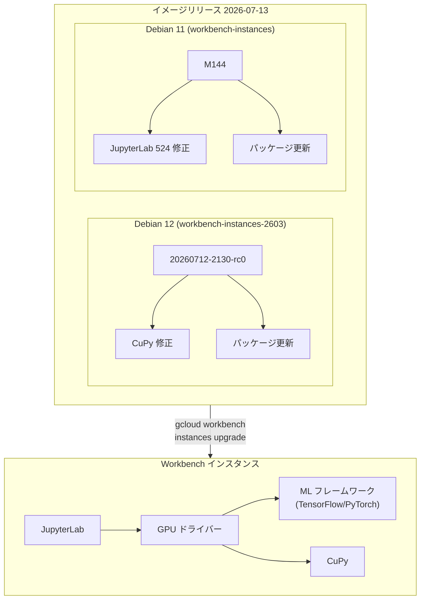

# Agent Platform Workbench: インスタンスイメージリリース (2026年7月13日)

**リリース日**: 2026-07-13

**サービス**: Agent Platform Workbench

**機能**: インスタンスイメージリリース (20260712-2130-rc0 / M144)

**ステータス**: 利用可能

📊 [このアップデートのインフォグラフィックを見る](https://takech9203.github.io/google-cloud-news-summary/20260713-agent-platform-workbench-image-release.html)

## 概要

Agent Platform Workbench (旧 Vertex AI Workbench) の新しいインスタンスイメージが2バージョン同時にリリースされました。Debian 12 ベースの最新リリーストラック (workbench-instances-2603) と、Debian 11 ベースのレガシーリリーストラック (workbench-instances) の両方が更新されています。

今回のリリースでは、GPU ワークロードに影響する2つの重要なバグ修正が含まれています。Debian 12 イメージでは CuPy のインストール問題が修正され、Debian 11 イメージでは GPU インスタンスで JupyterLab が HTTP 524 エラーで到達不能になる競合状態が修正されました。いずれも GPU を利用した AI/ML 開発ワークフローの安定性を大幅に向上させるものです。

対象ユーザーは、Agent Platform Workbench で GPU インスタンスを使用してディープラーニングや科学計算を行うデータサイエンティスト、ML エンジニア、および研究者です。

**アップデート前の課題**

- CuPy のインストールが壊れており、GPU を活用した NumPy 互換の高速数値計算ライブラリが利用できなかった (Debian 12 イメージ)
- GPU インスタンスで JupyterLab への接続時に競合状態が発生し、HTTP 524 (タイムアウト) エラーによりノートブック環境にアクセスできなくなることがあった (Debian 11 イメージ)
- 上流依存パッケージの更新が適用されておらず、セキュリティパッチや最新機能が利用できなかった

**アップデート後の改善**

- CuPy が正常にインストールされ、GPU アクセラレーションによる数値計算が即座に利用可能になった
- GPU インスタンスでの JupyterLab 起動の競合状態が解消され、安定的にノートブック環境にアクセスできるようになった
- 両イメージで上流依存パッケージが最新版に更新され、セキュリティと安定性が向上した

## アーキテクチャ図



この図は、2つのイメージリリーストラックと、それぞれに含まれる修正内容、および Workbench インスタンスの内部コンポーネント構成を示しています。

## サービスアップデートの詳細

### 主要機能

1. **20260712-2130-rc0 (workbench-instances-2603 - Debian 12)**
   - 上流依存パッケージの最新版をインストール
   - CuPy のインストールが壊れていた問題を修正
   - カレンダーバージョニング (YY.MM) に基づく最新リリーストラック

2. **M144 (workbench-instances - Debian 11)**
   - 上流依存パッケージの最新版をインストール
   - GPU インスタンスで JupyterLab が到達不能 (HTTP 524) になる競合状態を修正
   - マイルストーンバージョニングに基づくレガシーリリーストラック

3. **共通の改善点**
   - セキュリティパッチの適用
   - 依存パッケージの互換性向上
   - GPU ワークロードの安定性改善

## 技術仕様

### イメージバージョン比較

| 項目 | workbench-instances-2603 | workbench-instances (レガシー) |
|------|--------------------------|-------------------------------|
| バージョン | 20260712-2130-rc0 | M144 |
| OS | Debian 12 | Debian 11 |
| Python | 3.11+ | 3.11 |
| バージョニング方式 | 日付ベース (YYYYMMDD-HHMM-rcX) | マイルストーン (MXX) |
| 主な修正 | CuPy インストール修正 | JupyterLab HTTP 524 修正 |
| フレームワーク | TensorFlow / PyTorch / Base | TensorFlow / PyTorch / Base |

### CuPy について

CuPy は NVIDIA CUDA を利用した GPU アクセラレーション数値計算ライブラリです。NumPy および SciPy と高い互換性を持ち、既存のコードを最小限の変更で GPU 上で実行できます。

```python
# CuPy の基本的な使用例
import cupy as cp

# GPU 上での行列演算
x = cp.random.randn(1000, 1000)
y = cp.random.randn(1000, 1000)
z = cp.dot(x, y)  # GPU アクセラレーションによる行列積
```

## 設定方法

### 前提条件

1. Google Cloud プロジェクトが作成されていること
2. Notebooks API が有効化されていること
3. 適切な IAM 権限 (notebooks.instances.upgrade) を持っていること

### 手順

#### ステップ 1: 現在のイメージバージョンを確認

```bash
# インスタンスの現在のイメージバージョンを確認
gcloud workbench instances describe INSTANCE_NAME \
  --location=LOCATION
```

現在のイメージファミリーとバージョンが表示されます。

#### ステップ 2: インスタンスをアップグレード

```bash
# 同一イメージファミリー内で最新版にアップグレード
gcloud workbench instances upgrade INSTANCE_NAME \
  --location=LOCATION
```

レガシーリリーストラックから最新リリーストラックへ移行する場合:

```bash
# イメージファミリーを跨いだアップグレード
gcloud workbench instances upgrade INSTANCE_NAME \
  --location=LOCATION \
  --image-family=projects/deeplearning-platform-release/global/images/family/workbench-instances-2603
```

#### ステップ 3: Terraform でのアップグレード (同一ファミリー内)

```hcl
resource "google_workbench_instance" "vm_instance" {
  # ... other configurations
  gce_setup {
    vm_image {
      project = "cloud-notebooks-managed"
      family  = "workbench-instances-2603"
    }
  }
}
```

設定を適用してインスタンスを更新します。

## メリット

### ビジネス面

- **開発生産性の向上**: GPU インスタンスの安定性が改善され、JupyterLab の接続問題による作業中断が解消
- **迅速な環境セットアップ**: CuPy が正常にプリインストールされることで、環境構築にかかる時間を削減
- **運用コストの削減**: HTTP 524 エラーによるインスタンス再起動の必要性がなくなり、GPU リソースの無駄な消費を防止

### 技術面

- **GPU ワークロードの信頼性**: 競合状態の修正により、GPU インスタンスのブート時の安定性が大幅に向上
- **NumPy 互換の GPU 計算**: CuPy が正常に動作することで、既存の NumPy コードを最小限の変更で GPU アクセラレーション可能に
- **セキュリティ強化**: 上流パッケージの最新版適用により、既知の脆弱性に対する保護を強化

## デメリット・制約事項

### 制限事項

- イメージファミリーを跨いだアップグレード (例: workbench-instances から workbench-instances-2603) は Terraform ではサポートされず、gcloud CLI のみで実行可能
- 古いイメージバージョンへのダウングレードはサポートされず、新規インスタンスの作成が必要
- サードパーティの JupyterLab 拡張機能は引き続きサポート対象外

### 考慮すべき点

- アップグレード中はインスタンスが一時的に利用不可になるため、実行中のノートブックジョブがある場合は事前に完了させる必要がある
- レガシーリリーストラック (Debian 11) は将来的に廃止予定であり、新しいリリーストラック (Debian 12) への移行を計画すべき
- カスタムインストールした追加パッケージがアップグレード後も正常に動作するか確認が必要

## ユースケース

### ユースケース 1: GPU を利用した大規模行列計算

**シナリオ**: データサイエンティストが大規模な特徴量行列の演算を GPU で高速化したい場合。以前は CuPy のインストールが壊れていたため、手動でのビルドが必要だった。

**実装例**:
```python
import cupy as cp
import numpy as np

# CPU で前処理
data_cpu = np.load('features.npy')

# GPU に転送して高速計算
data_gpu = cp.asarray(data_cpu)
result_gpu = cp.linalg.svd(data_gpu)

# 結果を CPU に戻す
result_cpu = cp.asnumpy(result_gpu[0])
```

**効果**: CuPy が正常にプリインストールされるため、追加のセットアップなしで即座に GPU アクセラレーションを活用した数値計算が可能

### ユースケース 2: GPU インスタンスでの長時間トレーニング

**シナリオ**: ML エンジニアが GPU インスタンスで深層学習モデルのトレーニングを実行中、JupyterLab の接続が HTTP 524 エラーで切断され、進捗確認やデバッグができなくなっていた。

**効果**: 競合状態の修正により、GPU インスタンス起動後のJupyterLab接続が安定し、長時間のトレーニングジョブの監視やインタラクティブなデバッグが中断されなくなる

## 料金

Agent Platform Workbench のイメージアップグレード自体に追加料金は発生しません。費用はインスタンスの基盤となる Compute Engine リソースに基づきます。

### 料金例

| 構成 | 月額料金 (概算) |
|------|-----------------|
| n1-standard-4 + NVIDIA T4 (us-central1) | 約 $350-400/月 |
| n1-standard-8 + NVIDIA A100 (us-central1) | 約 $2,500-3,000/月 |
| n1-standard-4 (CPU のみ、参考) | 約 $100-150/月 |

※ 実際の料金は使用時間、リージョン、ディスクサイズにより異なります。アイドルシャットダウン機能を活用することでコストを最適化できます。

## 利用可能リージョン

Agent Platform Workbench インスタンスは、GPU が利用可能なすべての Google Cloud リージョンおよびゾーンで利用できます。GPU の種類によりゾーンの可用性が異なるため、[GPU regions and zones availability](https://docs.cloud.google.com/compute/docs/gpus/gpu-regions-zones) を参照してください。

## 関連サービス・機能

- **Vertex AI Training**: Workbench で開発したモデルをスケーラブルにトレーニングするためのマネージドサービス
- **Compute Engine GPU**: Workbench インスタンスの基盤となる GPU インフラストラクチャ
- **Container-Optimized OS**: カスタムコンテナベースの Workbench インスタンスのホスト OS
- **Artifact Registry**: カスタムコンテナイメージの保存・管理

## 参考リンク

- 📊 [インフォグラフィック](https://takech9203.github.io/google-cloud-news-summary/20260713-agent-platform-workbench-image-release.html)
- [公式リリースノート](https://docs.cloud.google.com/release-notes#July_13_2026)
- [イメージバージョン管理ドキュメント](https://docs.cloud.google.com/gemini-enterprise-agent-platform/notebooks/workbench/instances/manage-image-versions)
- [インスタンスのアップグレード](https://docs.cloud.google.com/gemini-enterprise-agent-platform/notebooks/workbench/instances/upgrade)
- [Agent Platform Workbench 概要](https://docs.cloud.google.com/gemini-enterprise-agent-platform/notebooks/workbench/introduction)

## まとめ

今回のイメージリリースは、GPU を利用する AI/ML 開発者にとって重要な安定性改善です。CuPy の修正と JupyterLab の接続問題の解消により、GPU ワークロードの信頼性が大幅に向上します。レガシーリリーストラック (Debian 11) を使用しているユーザーは、将来的な廃止に備えて workbench-instances-2603 (Debian 12) への移行を計画することを推奨します。

---

**タグ**: #AgentPlatformWorkbench #GPU #JupyterLab #CuPy #ImageRelease #Debian12 #Debian11 #MachineLearning #AI
