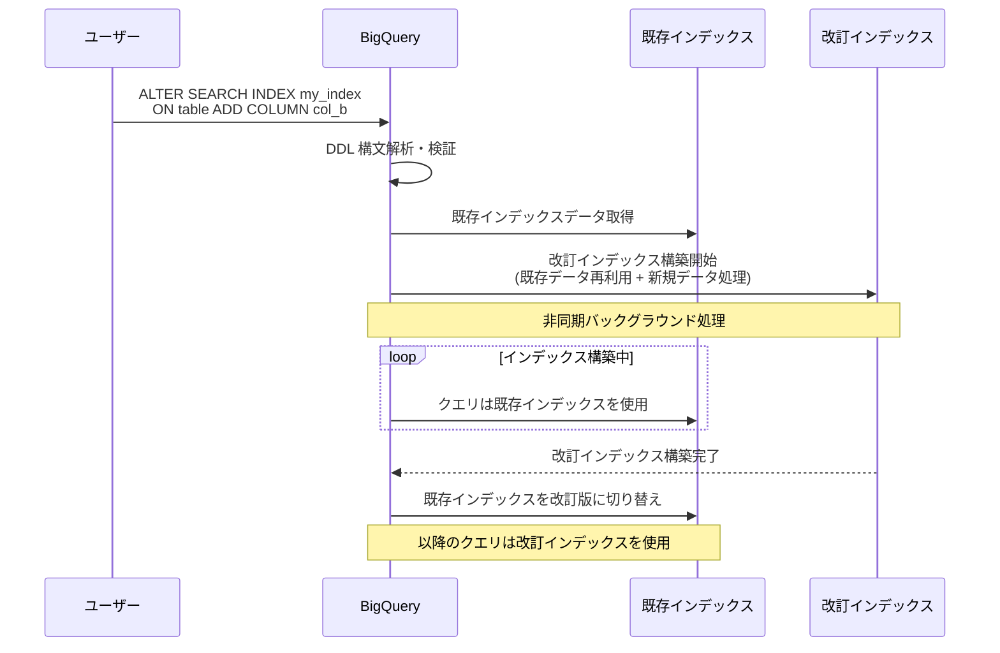

# BigQuery: ALTER SEARCH INDEX DDL ステートメント

**リリース日**: 2026-07-13

**サービス**: BigQuery

**機能**: ALTER SEARCH INDEX DDL ステートメントによる検索インデックスの構成変更

**ステータス**: Preview

📊 [このアップデートのインフォグラフィックを見る](https://takech9203.github.io/google-cloud-news-summary/20260713-bigquery-alter-search-index.html)

## 概要

BigQuery に ALTER SEARCH INDEX DDL ステートメントが追加され、既存の検索インデックスの構成をインプレースで変更できるようになりました。この機能により、インデックスの削除と再作成を行うことなく、カラムの追加・削除・変更やインデックスオプションの更新が可能になります。

特に大規模テーブルにおいて、この機能はインデックス管理の効率性を大幅に向上させます。BigQuery は変更内容に応じて既存のインデックスデータを可能な限り再利用し、非同期で改訂インデックスを構築します。改訂インデックスが十分に構築された時点で、ベーステーブルのインデックスとして自動的に切り替わります。

この機能は Preview 段階であり、Pre-GA Offerings Terms が適用されます。本番環境での利用にはサポートが限定的である点に留意が必要です。

**アップデート前の課題**

- 検索インデックスの構成を変更するには、既存インデックスを DROP してから新しい構成で CREATE し直す必要があった
- 大規模テーブルではインデックスの再作成に長時間とスロットリソースを要し、その間検索パフォーマンスが低下していた
- インデックスされるカラムを 1 つ追加するだけでも全体の再構築が必要で、インクリメンタルな変更ができなかった

**アップデート後の改善**

- ALTER SEARCH INDEX ステートメントにより、既存インデックスにカラムの追加・削除・変更をインプレースで実行可能になった
- BigQuery が既存のインデックスデータを再利用するため、変更コストが新規データの処理分に比例する（全体再構築が不要なケース）
- カラムの削除はメタデータのみの操作として即座に反映され、追加スロットを消費しない

## アーキテクチャ図



ALTER SEARCH INDEX 実行時のワークフローを示しています。BigQuery は既存インデックスを維持しながら非同期で改訂インデックスを構築し、完了後に自動的に切り替えます。

## サービスアップデートの詳細

### 主要機能

1. **カラムの追加 (ADD COLUMN)**
   - 既存のインデックスに新しいカラムを追加可能
   - カラムごとにデータ型やインデックス粒度のオプションを指定可能
   - IF NOT EXISTS 句により、既存カラムとの重複を安全に処理

2. **カラムの削除 (DROP COLUMN)**
   - インデックスからカラムを削除（REBUILD を指定しなければメタデータのみの操作）
   - IF EXISTS 句により、存在しないカラムの削除を安全に処理
   - ALL COLUMNS で作成されたインデックスからカラムを削除すると、ALL COLUMNS プロパティが失われる

3. **カラムオプションの変更 (ALTER COLUMN)**
   - 既存のインデックス済みカラムのオプション（data_types など）を変更
   - IF EXISTS 句により、存在しないカラムの変更を安全に処理

4. **インデックスレベルオプションの変更 (SET OPTIONS)**
   - インデックス全体のオプション（data_types、default_index_column_granularity など）を変更
   - NULL や空配列を指定してデフォルト値にリセット可能

5. **REBUILD オプション**
   - 複数種類の変更を組み合わせる場合に指定が必要
   - インデックス粒度の変更時に必要
   - 削除済みカラムのストレージを即座に解放したい場合に使用

## 技術仕様

### 構文

```sql
ALTER SEARCH INDEX [IF EXISTS] index_name
ON table_name
alter_action [, ...]
[REBUILD]
```

### alter_action の種類

| アクション | 構文 | 説明 |
|-----------|------|------|
| SET OPTIONS | `SET OPTIONS (index_option_list)` | インデックスレベルのオプションを変更 |
| ADD COLUMN | `ADD COLUMN [IF NOT EXISTS] column_name [OPTIONS (...)]` | カラムを追加 |
| DROP COLUMN | `DROP COLUMN [IF EXISTS] column_name` | カラムを削除 |
| ALTER COLUMN | `ALTER COLUMN [IF EXISTS] column_name SET OPTIONS (...)` | カラムオプションを変更 |

### 変更コスト一覧

| アクション | 説明 | コスト |
|-----------|------|--------|
| カラムの削除（REBUILD なし） | メタデータのみの即時変更 | 追加スロット不要 |
| カラムまたはデータ型の追加 | 新規データを処理し既存データを再利用 | 新規データ量に比例 |
| 粒度変更・複合変更・ストレージ解放 | インデックスを一から再構築 | 全インデックスデータ量に比例 |

### 必要な IAM 権限

| 権限 | リソース |
|------|----------|
| `bigquery.tables.get` | インデックスを更新するテーブル |
| `bigquery.tables.updateIndex` | インデックスを更新するテーブル |

### 前提条件

- インデックス対象テーブルを含むプロジェクトに、ジョブタイプ BACKGROUND のリザベーションアサインメントが存在すること
- 同一インデックスに対する ALTER SEARCH INDEX の同時実行は不可

## 設定方法

### 前提条件

1. 対象テーブルに既存の検索インデックスが作成されていること
2. BACKGROUND ジョブタイプのリザベーションが構成されていること
3. `bigquery.tables.get` および `bigquery.tables.updateIndex` 権限を持つロールが付与されていること

### 手順

#### ステップ 1: 既存インデックスの確認

```sql
SELECT table_name, index_name, ddl, coverage_percentage
FROM my_project.my_dataset.INFORMATION_SCHEMA.SEARCH_INDEXES
WHERE index_status = 'ACTIVE';
```

#### ステップ 2: カラムの追加

```sql
ALTER SEARCH INDEX my_index
ON dataset.my_table
ADD COLUMN new_column OPTIONS (data_types = ['INT64'], index_granularity = 'COLUMN');
```

#### ステップ 3: カラムオプションの変更

```sql
ALTER SEARCH INDEX my_index
ON dataset.my_table
ALTER COLUMN my_struct SET OPTIONS(data_types = ['STRING', 'INT64']);
```

#### ステップ 4: カラムの削除

```sql
ALTER SEARCH INDEX my_index
ON dataset.my_table
DROP COLUMN old_column;
```

#### ステップ 5: 複合変更（REBUILD 必須）

```sql
ALTER SEARCH INDEX my_index
ON dataset.my_table
ADD COLUMN new_col OPTIONS(data_types = ['INT64'], index_granularity = 'COLUMN'),
ALTER COLUMN my_struct SET OPTIONS(data_types = ['STRING', 'INT64']),
DROP COLUMN old_col,
SET OPTIONS(default_index_column_granularity = 'GLOBAL'),
REBUILD;
```

#### ステップ 6: 変更の進捗確認

```sql
SELECT table_name, index_name,
       last_index_alteration_info.status AS status,
       last_index_alteration_info.new_coverage_percentage AS coverage
FROM my_project.my_dataset.INFORMATION_SCHEMA.SEARCH_INDEXES;
```

## メリット

### ビジネス面

- **ダウンタイムの削減**: インデックスの削除・再作成が不要なため、検索パフォーマンスを維持したまま構成変更が可能
- **コスト効率の向上**: インクリメンタルな変更により、全体再構築に比べてスロット消費量を大幅に削減

### 技術面

- **インクリメンタル更新**: 既存インデックスデータを再利用し、新規データの処理のみで変更が完了（カラム追加時）
- **メタデータのみの操作**: カラム削除は即座にメタデータ更新で完了し、追加のスロットリソースを消費しない
- **非同期処理**: インデックス構築中も既存インデックスでクエリが実行されるため、クエリパフォーマンスに影響がない
- **進捗モニタリング**: INFORMATION_SCHEMA.SEARCH_INDEXES ビューで変更の進捗状況を追跡可能

## デメリット・制約事項

### 制限事項

- Preview 段階であり、Pre-GA Offerings Terms が適用される（本番環境での利用はサポートが限定的）
- 同一インデックスに対する ALTER SEARCH INDEX の並行実行は不可
- BACKGROUND ジョブタイプのリザベーションが必須（Standard エディションでは利用不可）
- ALL COLUMNS で作成されたインデックスからカラムを削除すると、ALL COLUMNS プロパティが失われ、新規カラムが自動インデックスされなくなる

### 考慮すべき点

- REBUILD なしでカラムを削除した場合、削除カラムのインデックスストレージは即座に解放されない（ベーステーブルのデータ削除を待つ必要がある）
- 削除済みカラムのデータが残存している間、検索クエリが必要以上のファイルをスキャンする可能性がある
- 全体再構築を避けるため、ADD と DROP を同一ステートメントで実行せず、別々のステートメントに分けることが推奨される
- インデックス変更のキャンセルは完了前のみ可能（BQ.CANCEL_INDEX_ALTERATION システムプロシージャを使用）

## ユースケース

### ユースケース 1: スキーマ進化に伴うインデックス更新

**シナリオ**: ECサイトの商品テーブルに新しいカラム（商品カテゴリの多言語対応カラム）が追加され、既存の検索インデックスにそのカラムを含めたい。テーブルサイズは数 TB で、インデックスの完全再作成には数時間かかる。

**実装例**:
```sql
ALTER SEARCH INDEX products_search_idx
ON ecommerce.products
ADD COLUMN category_multilang OPTIONS (data_types = ['STRING']);
```

**効果**: 新規カラムのデータのみ処理されるため、全体再構築に比べてインデックス更新時間とスロット消費を大幅に削減できる。

### ユースケース 2: 不要カラムの削除によるストレージ最適化

**シナリオ**: ログテーブルの検索インデックスに含まれる古いカラムが使用されなくなったため、インデックスから除外してストレージコストを削減したい。

**実装例**:
```sql
-- メタデータのみの即時削除（ストレージは遅延解放）
ALTER SEARCH INDEX logs_search_idx
ON analytics.access_logs
DROP COLUMN deprecated_field;

-- 即座にストレージを解放したい場合
ALTER SEARCH INDEX logs_search_idx
ON analytics.access_logs
DROP COLUMN deprecated_field,
REBUILD;
```

**効果**: メタデータのみの操作であれば追加スロット不要で即座に完了する。REBUILD を指定すればストレージも即座に解放される。

### ユースケース 3: データ型の拡張

**シナリオ**: 当初は STRING カラムのみで作成した検索インデックスに、INT64 型のカラム（注文番号やユーザー ID）も含めて SEARCH 関数で横断検索できるようにしたい。

**実装例**:
```sql
ALTER SEARCH INDEX order_search_idx
ON sales.orders
SET OPTIONS(data_types = ['STRING', 'INT64']);
```

**効果**: インデックス全体のデータ型設定を変更し、INT64 カラムも検索対象に含めることで、SEARCH 関数による統合検索の対象範囲が拡大する。

## 料金

ALTER SEARCH INDEX 自体に追加料金は発生しません。インデックスの構築・更新に使用されるスロットはリザベーション（BACKGROUND ジョブタイプ）から消費されます。

### 料金に影響する要素

| 要素 | 説明 |
|------|------|
| スロット消費 | BACKGROUND リザベーションのスロットを使用（共有プールまたは専用リザベーション） |
| ストレージ | インデックスデータのストレージ料金が発生 |
| 変更コスト | ADD はデータ量に比例、DROP はメタデータのみ、REBUILD は全量再構築 |

最新の料金詳細は [BigQuery 料金ページ](https://cloud.google.com/bigquery/pricing) をご確認ください。

## 関連サービス・機能

- **BigQuery SEARCH 関数**: 検索インデックスを活用した効率的なテキスト検索クエリ機能
- **BigQuery Reservations (BACKGROUND ジョブタイプ)**: インデックス管理ジョブの実行に使用されるスロット割り当て
- **CREATE SEARCH INDEX**: 検索インデックスの初期作成 DDL ステートメント
- **DROP SEARCH INDEX**: 検索インデックスの削除 DDL ステートメント
- **INFORMATION_SCHEMA.SEARCH_INDEXES**: インデックスのメタデータと変更状況を確認するビュー

## 参考リンク

- 📊 [インフォグラフィック](https://takech9203.github.io/google-cloud-news-summary/20260713-bigquery-alter-search-index.html)
- [公式リリースノート](https://docs.cloud.google.com/release-notes#July_13_2026)
- [ドキュメント: ALTER SEARCH INDEX statement](https://docs.cloud.google.com/bigquery/docs/reference/standard-sql/data-definition-language#alter_search_index_statement)
- [ドキュメント: Update a search index](https://docs.cloud.google.com/bigquery/docs/search-index#update_a_search_index)
- [ドキュメント: Search index overview](https://docs.cloud.google.com/bigquery/docs/search-index)
- [料金ページ](https://cloud.google.com/bigquery/pricing)

## まとめ

BigQuery の ALTER SEARCH INDEX ステートメントは、大規模テーブルにおける検索インデックスの運用管理を大幅に効率化する機能です。インデックスの削除と再作成という従来の手順をインクリメンタルな変更に置き換えることで、ダウンタイムの排除とコスト削減を実現します。現在 Preview 段階のため本番利用にはサポートが限定的ですが、大規模な検索インデックスを運用している環境では早期の検証を推奨します。

---

**タグ**: #BigQuery #SearchIndex #DDL #ALTER #インデックス管理 #Preview #全文検索 #パフォーマンス最適化
