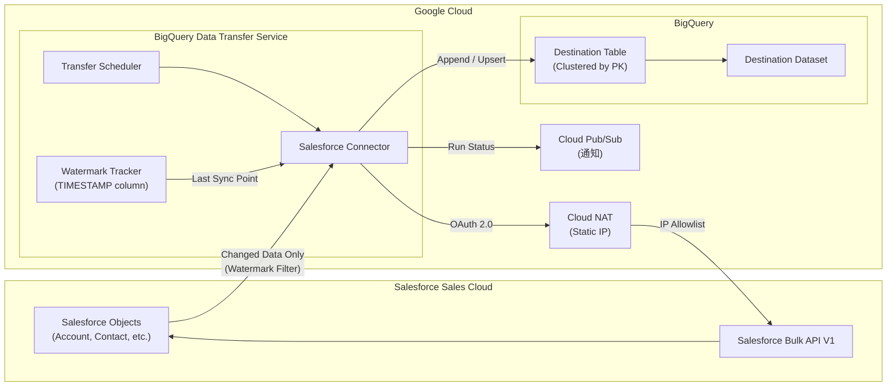

# BigQuery Data Transfer Service: Salesforce インクリメンタルデータ転送の一般提供開始

**リリース日**: 2026-07-13

**サービス**: BigQuery Data Transfer Service

**機能**: Salesforce インクリメンタルデータ転送 (Incremental Data Transfers)

**ステータス**: Generally Available (GA)

📊 [このアップデートのインフォグラフィックを見る](https://takech9203.github.io/google-cloud-news-summary/20260713-bigquery-data-transfer-salesforce-incremental.html)

## 概要

BigQuery Data Transfer Service における Salesforce からのインクリメンタル (差分) データ転送が一般提供 (GA) となりました。これにより、Salesforce Sales Cloud から BigQuery へのデータ転送時に、毎回全データを転送するのではなく、前回の転送以降に変更されたデータのみを効率的に転送できるようになります。

インクリメンタル転送では、ウォーターマークカラム (タイムスタンプ型) を使用して変更を追跡し、Append (追記) または Upsert (更新/挿入) の2つの書き込みモードを選択できます。これにより、大規模な Salesforce データを持つ企業において、転送時間の短縮、コスト削減、BigQuery テーブルの鮮度向上が実現されます。

この機能は、CRM データを活用した分析基盤を構築する企業や、リアルタイムに近いデータ同期を必要とするデータエンジニアリングチームに特に有用です。

**アップデート前の課題**

- Salesforce から BigQuery へのデータ転送は全量転送 (Full Transfer) のみがサポートされており、毎回すべてのデータを再転送する必要があった
- 大規模な Salesforce データセットでは転送に長時間を要し、Salesforce API の処理制限に抵触するリスクがあった
- 全量転送によりネットワーク帯域やストレージコストが不必要に増大していた
- 頻繁なデータ同期が困難で、BigQuery 上のデータの鮮度が低かった

**アップデート後の改善**

- 前回転送以降の変更データのみを転送するインクリメンタルモードが GA として利用可能になった
- Append モードと Upsert モードの選択により、ユースケースに応じた柔軟なデータ書き込みが可能になった
- 転送データ量の大幅な削減により、転送時間の短縮と API 制限への抵触リスクが低減した
- より高頻度のデータ同期スケジュールが実用的になり、データの鮮度が向上した

## アーキテクチャ図



BigQuery Data Transfer Service の Salesforce コネクタが、ウォーターマークカラムを使用して前回同期時点以降の変更データのみを Salesforce Bulk API V1 経由で取得し、Append または Upsert モードで BigQuery テーブルに書き込むアーキテクチャを示しています。

## サービスアップデートの詳細

### 主要機能

1. **インクリメンタル転送モード**
   - 転送設定時に `ingestionType` を `incremental` に指定することで有効化
   - ウォーターマークカラム (TIMESTAMP 型) を使用して、前回転送以降の変更を追跡
   - 初回実行時は全量転送を行い、2回目以降は差分のみを転送

2. **Append 書き込みモード**
   - 新しい行のみを宛先テーブルに追加
   - レコードの作成時にのみ更新されるカラム (例: `CreatedDate`) をウォーターマークとして使用
   - 既存レコードのチェックを行わないため、重複の可能性がある点に注意

3. **Upsert 書き込みモード**
   - プライマリキーに基づいて行の更新または挿入を判定
   - 行が変更されるたびに更新されるカラム (例: `SystemModstamp`, `LastModifiedDate`) をウォーターマークとして使用
   - 宛先テーブルを最新の状態に保つのに最適

4. **複数アセットの同時転送**
   - 1つの転送設定で複数の Salesforce オブジェクトを指定可能
   - 各アセットに対して個別のウォーターマークカラムとプライマリキーを設定可能
   - 1転送設定あたり最大10アセットを推奨

## 技術仕様

### 転送パラメータ

| 項目 | 詳細 |
|------|------|
| データソース | `salesforce` |
| インジェストタイプ | `full` または `incremental` |
| 書き込みモード | `WRITE_MODE_APPEND` または `WRITE_MODE_UPSERT` |
| ウォーターマークカラム | TIMESTAMP 型のカラムのみ指定可能 |
| プライマリキー | Upsert モード時に必須、一意の値を持つカラム |
| 最小転送間隔 | 15分 |
| デフォルト転送間隔 | 24時間 |
| 推奨アセット数 | 転送設定あたり最大10 |
| 同時転送実行数 | 最大10 (全転送設定合計) |
| 使用 API | Salesforce Bulk API V1 version 64.0 |

### 認証パラメータ

```json
{
  "connector.authentication.oauth.clientId": "Consumer Key",
  "connector.authentication.oauth.clientSecret": "Consumer Secret",
  "connector.authentication.oauth.myDomain": "My Domain Name",
  "ingestionType": "incremental",
  "writeMode": "WRITE_MODE_UPSERT",
  "watermarkColumns": ["SystemModstamp", "CreatedDate"],
  "primaryKeys": [["Id"], ["master_label", "type"]],
  "assets": ["Account", "CaseHistory"]
}
```

## 設定方法

### 前提条件

1. Google Cloud プロジェクトで BigQuery Data Transfer Service API が有効化されていること
2. Salesforce Connected App が作成済みで、Consumer Key / Consumer Secret が取得済みであること
3. BigQuery に宛先データセットが作成済みであること
4. ネットワークアタッチメントと Cloud NAT (静的 IP) が設定済みであること
5. Salesforce 側で IP 許可リストが設定済みであること

### 手順

#### ステップ 1: Google Cloud Console から転送を作成

Google Cloud Console の BigQuery > Data Transfers ページに移動し、「Create transfer」をクリックします。Source として「Salesforce」を選択し、Ingestion type で「Incremental」を選択します。

#### ステップ 2: bq コマンドラインツールを使用する場合

```bash
bq mk --transfer_config \
  --target_dataset=mydataset \
  --data_source=salesforce \
  --display_name='Salesforce Incremental Transfer' \
  --params='{
    "assets": ["Account", "Contact"],
    "connector.authentication.oauth.clientId": "YOUR_CLIENT_ID",
    "connector.authentication.oauth.clientSecret": "YOUR_CLIENT_SECRET",
    "connector.authentication.oauth.myDomain": "YOUR_DOMAIN",
    "ingestionType": "incremental",
    "writeMode": "WRITE_MODE_UPSERT",
    "watermarkColumns": ["SystemModstamp", "SystemModstamp"],
    "primaryKeys": [["Id"], ["Id"]]
  }'
```

このコマンドにより、Account と Contact オブジェクトの差分転送が Upsert モードで設定されます。`SystemModstamp` をウォーターマークカラム、`Id` をプライマリキーとして使用します。

#### ステップ 3: スケジュールの設定

転送スケジュールを設定します。インクリメンタル転送では、最小15分間隔で実行可能です。大規模データの場合は、前回の転送が完了する十分な時間を確保してスケジュールを設定してください。

## メリット

### ビジネス面

- **データ鮮度の向上**: 差分転送により高頻度の同期が実用的になり、BigQuery 上の CRM データをほぼリアルタイムに保てる
- **コスト効率の改善**: 転送データ量の削減により、ネットワークコストと Salesforce API 使用量を大幅に削減
- **運用負荷の軽減**: マネージドサービスとして提供されるため、カスタム ETL パイプラインの構築・運用が不要

### 技術面

- **転送時間の短縮**: 変更データのみを転送するため、全量転送と比較して大幅に高速化
- **API 制限の回避**: Salesforce Bulk API の処理制限に抵触するリスクが低減
- **データ整合性**: Upsert モードでプライマリキーによる重複排除が自動的に行われる
- **クラスタリングの自動適用**: 宛先テーブルがプライマリキーで自動的にクラスタリングされ、クエリ性能が向上

## デメリット・制約事項

### 制限事項

- ウォーターマークカラムは TIMESTAMP 型のカラムのみ指定可能
- ウォーターマークカラムの値は単調増加である必要がある
- ソーステーブルの削除操作は同期されない (DELETE は反映されない)
- 1つの転送設定はインクリメンタルまたはフルのいずれか一方のみをサポート
- 初回インクリメンタル実行後はアセットリスト、書き込みモード、ウォーターマークカラム、プライマリキーの変更不可
- Salesforce Sales Cloud のみサポート (Marketing Cloud 等は非対応)
- Salesforce Bulk API V1 でサポートされていないエンティティは転送不可
- バイナリフィールドを含むオブジェクト (Attachment, ContentVersion, Document 等) は転送不可

### 考慮すべき点

- Append モードでは重複データが発生する可能性があるため、用途に応じてモードを慎重に選択する必要がある
- 初回実行は全量転送となるため、大規模データセットでは初回の転送時間が長くなる
- 転送設定後のパラメータ変更に大きな制約があるため、事前の設計が重要
- 同時実行数の制限 (10) があるため、多数のオブジェクトを転送する場合は転送設定の分散が必要

## ユースケース

### ユースケース 1: 営業パイプライン分析のリアルタイム化

**シナリオ**: 大企業の営業チームが Salesforce 上の商談データ (Opportunity) を BigQuery に転送し、Looker で営業パイプラインダッシュボードを構築している。従来は日次の全量転送のため、ダッシュボードのデータが最大24時間遅延していた。

**実装例**:
```bash
bq mk --transfer_config \
  --target_dataset=sales_analytics \
  --data_source=salesforce \
  --display_name='Opportunity Incremental Sync' \
  --params='{
    "assets": ["Opportunity", "OpportunityHistory"],
    "connector.authentication.oauth.clientId": "CLIENT_ID",
    "connector.authentication.oauth.clientSecret": "CLIENT_SECRET",
    "connector.authentication.oauth.myDomain": "mycompany",
    "ingestionType": "incremental",
    "writeMode": "WRITE_MODE_UPSERT",
    "watermarkColumns": ["SystemModstamp", "SystemModstamp"],
    "primaryKeys": [["Id"], ["Id"]]
  }'
```

**効果**: 15分間隔のインクリメンタル転送により、営業パイプラインダッシュボードがほぼリアルタイムで更新され、マネジメント層の意思決定速度が向上。全量転送と比較して転送データ量が約95%削減。

### ユースケース 2: 顧客マスター統合と CDC (Change Data Capture)

**シナリオ**: マルチチャネルで顧客接点を持つ企業が、Salesforce の Account/Contact データを BigQuery に集約し、統合顧客マスターを構築する。顧客情報の更新をリアルタイムに反映させ、マーケティングオートメーションやカスタマーサクセス施策に活用する。

**効果**: Upsert モードにより顧客レコードが常に最新状態に保たれ、重複のない統合顧客マスターを BigQuery 上で維持可能。カスタム ETL パイプラインの開発・運用コストを排除しつつ、高頻度のデータ同期を実現。

### ユースケース 3: コンプライアンス監査ログの蓄積

**シナリオ**: 金融機関が規制対応のため、Salesforce 上の活動履歴 (Task, Event) を BigQuery に蓄積し、監査証跡として保持する必要がある。

**効果**: Append モードと `CreatedDate` ウォーターマークの組み合わせにより、新規作成されたレコードのみを効率的に追加。完全な履歴データが BigQuery に蓄積され、長期保存とコンプライアンス分析に活用可能。

## 料金

BigQuery Data Transfer Service の Salesforce コネクタ自体の使用料は無料です。ただし、以下の標準料金が適用されます。

### 料金体系

| 項目 | 料金 |
|------|------|
| BigQuery Data Transfer Service (Salesforce) | 無料 |
| BigQuery ストレージ (アクティブ) | $0.02/GB/月 |
| BigQuery ストレージ (長期) | $0.01/GB/月 |
| BigQuery クエリ (オンデマンド) | $6.25/TB |
| BigQuery ロードジョブ | 無料 (クォータ内) |

### 料金例

| 使用量 | 月額料金 (概算) |
|--------|-----------------|
| 差分転送 10GB/日、累積ストレージ 300GB | ストレージ: $6/月 + クエリ料金 |
| 差分転送 100GB/日、累積ストレージ 3TB | ストレージ: $60/月 + クエリ料金 |

※ インクリメンタル転送の最大メリットは、転送自体のコストではなく、Salesforce 側の API 使用量削減とネットワーク転送量の削減にあります。BigQuery Reservations を使用している場合、ロードジョブは PIPELINE スロットを消費します。

## 利用可能リージョン

BigQuery Data Transfer Service はマルチリージョンリソースであり、BigQuery がサポートする全てのリージョンで利用可能です。転送設定は宛先データセットと同じロケーションに自動的に配置されます。主要な対応リージョンは以下の通りです。

- マルチリージョン: US, EU
- 東京: asia-northeast1
- 大阪: asia-northeast2
- その他全ての BigQuery サポートリージョン

※ ネットワークアタッチメントと VM インスタンスが異なるリージョンにある場合、クロスリージョンのデータ移動が発生する可能性があります。

## 関連サービス・機能

- **BigQuery**: 宛先データウェアハウス。転送されたデータの保存・分析に使用
- **Cloud NAT**: Salesforce への静的 IP アドレスでのアウトバウンド接続に必要
- **Cloud Pub/Sub**: 転送実行の成功/失敗通知に使用
- **Salesforce Bulk API V1**: データ取得に使用される Salesforce 側の API
- **BigQuery Data Transfer Service for Salesforce Marketing Cloud**: 別途提供される Marketing Cloud 用コネクタ
- **Datastream**: より広範な CDC (Change Data Capture) が必要な場合の代替サービス
- **Dataflow**: カスタム ETL パイプラインが必要な場合の代替サービス

## 参考リンク

- 📊 [インフォグラフィック](https://takech9203.github.io/google-cloud-news-summary/20260713-bigquery-data-transfer-salesforce-incremental.html)
- [公式リリースノート](https://docs.google.com/release-notes#July_13_2026)
- [Salesforce 転送の設定ドキュメント](https://docs.cloud.google.com/bigquery/docs/salesforce-transfer)
- [Salesforce 転送の概要](https://docs.cloud.google.com/bigquery/docs/salesforce-transfer-intro)
- [BigQuery Data Transfer Service 概要](https://docs.cloud.google.com/bigquery/docs/dts-introduction)
- [料金ページ](https://cloud.google.com/bigquery/pricing)

## まとめ

BigQuery Data Transfer Service における Salesforce インクリメンタルデータ転送の GA 化は、Salesforce を CRM として使用し BigQuery でデータ分析を行う企業にとって重要なアップデートです。全量転送と比較して転送データ量を大幅に削減し、高頻度同期を実用的にすることで、データの鮮度向上とコスト最適化を同時に実現します。Upsert モードによる自動的な重複排除と、プライマリキーベースのクラスタリングにより、運用面でも大きなメリットがあります。既に全量転送を使用しているユーザーは、要件に応じてインクリメンタル転送への移行を検討することを推奨します。

---

**タグ**: #BigQuery #DataTransferService #Salesforce #IncrementalTransfer #GA #ETL #データ統合 #CRM
