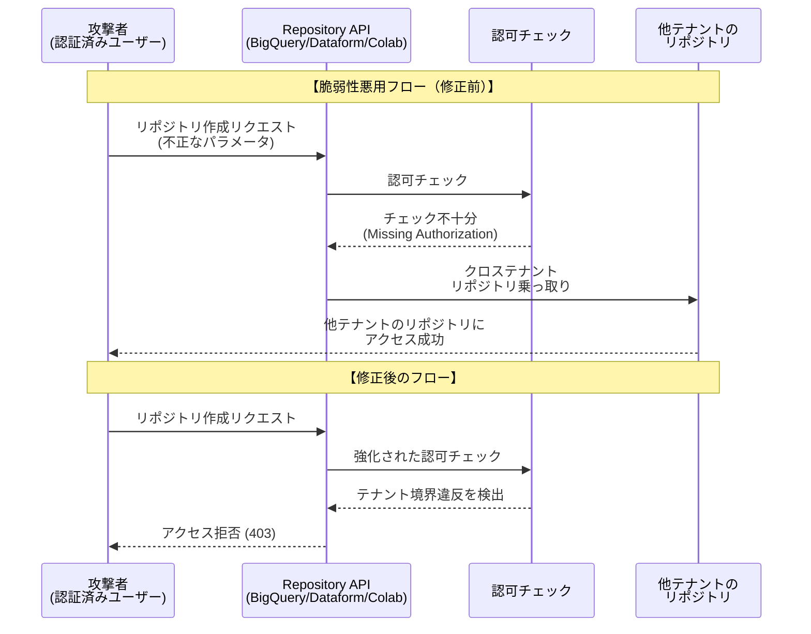

# BigQuery / Dataform / Colab Enterprise: セキュリティ脆弱性 GCP-2026-047 - Missing Authorization によるクロステナント リポジトリ乗っ取り

**リリース日**: 2026-07-13

**サービス**: BigQuery, Dataform, Colab Enterprise

**機能**: セキュリティ脆弱性 GCP-2026-047 (CVE-2026-14934)

**ステータス**: セキュリティ速報 (Security Bulletin)

:bar_chart: [このアップデートのインフォグラフィックを見る](https://takech9203.github.io/google-cloud-news-summary/20260713-bigquery-dataform-colab-security-gcp-2026-047.html)

## 概要

Google Cloud は 2026年7月13日、BigQuery、Dataform、Colab Enterprise のリポジトリ機能に存在した重大なセキュリティ脆弱性 (GCP-2026-047) に関するセキュリティ速報を公開しました。この脆弱性は CVE-2026-14934 として追跡されており、深刻度は「Critical（重大）」に分類されています。

この脆弱性は「Missing Authorization（認可の欠如）」に分類される問題で、リポジトリ作成時の認可チェックが不十分であったことに起因します。認証済みの攻撃者がこの脆弱性を悪用することで、権限を昇格させ、他のテナントのリポジトリを乗っ取る「クロステナント リポジトリ テイクオーバー」を実行できる可能性がありました。

Google は既に全ての影響を受けるプロダクトおよびサービスに対して緩和策を適用しており、顧客側での対応は不要です。

**アップデート前の課題**

- リポジトリ作成時の認可チェックが不十分であり、テナント境界を超えたアクセスが可能な状態だった
- 認証済みユーザーが権限昇格を行い、他テナントのリポジトリにアクセスできる可能性があった
- BigQuery、Dataform、Colab Enterprise の共有リポジトリ基盤に同一の脆弱性が存在していた

**アップデート後の改善**

- Google により緩和策が全ての影響を受けるサービスに適用済み
- リポジトリ作成時の認可チェックが強化され、クロステナントアクセスが防止される
- 顧客側での追加対応は不要であり、サービスは安全な状態で継続利用可能

## アーキテクチャ図



この図は、脆弱性の悪用フロー（修正前）と修正後の正常なフローを対比して示しています。修正前はリポジトリ作成時の認可チェックが不十分であったため、攻撃者がテナント境界を超えてアクセスできましたが、修正後は強化された認可チェックにより不正なアクセスが拒否されます。

## サービスアップデートの詳細

### 主要機能

1. **脆弱性の内容 (CVE-2026-14934)**
   - リポジトリ作成プロセスにおける認可チェック（Authorization）の欠如
   - 認証済みの攻撃者が権限昇格を実行可能
   - テナント間の境界を超えたリポジトリへの不正アクセス（クロステナント リポジトリ テイクオーバー）

2. **影響を受けるサービス**
   - BigQuery（リポジトリ機能）
   - Dataform（リポジトリ機能）
   - Colab Enterprise（リポジトリ機能）
   - これら3つのサービスは共通のリポジトリ基盤を共有しているため、同一の脆弱性の影響を受けた

3. **Google による緩和策**
   - 全ての影響を受けるプロダクトおよびサービスに対して緩和策が適用済み
   - 顧客側での対応は不要
   - 現時点で悪用の報告なし

## 技術仕様

### 脆弱性の詳細

| 項目 | 詳細 |
|------|------|
| セキュリティ速報 ID | GCP-2026-047 |
| CVE 番号 | CVE-2026-14934 |
| 公開日 | 2026-07-13 |
| 深刻度 | Critical（重大） |
| 脆弱性の種類 | Missing Authorization（認可の欠如） |
| 攻撃ベクトル | リポジトリ作成時の認可チェック不備 |
| 必要な前提条件 | 認証済みユーザー（Google Cloud アカウント保有） |
| 影響範囲 | クロステナント リポジトリ テイクオーバー |
| 顧客側の対応 | 不要（Google により修正済み） |

### 関連する IAM パーミッション

リポジトリ作成に関連する `dataform.repositories.create` パーミッションは以下の IAM ロールに含まれています。

| IAM ロール | ロール ID |
|------|------|
| BigQuery Admin | roles/bigquery.admin |
| BigQuery Job User | roles/bigquery.jobUser |
| BigQuery Studio User | roles/bigquery.studioUser |
| BigQuery User | roles/bigquery.user |
| Code Creator | roles/dataform.codeCreator |
| Code Editor | roles/dataform.codeEditor |
| Code Owner | roles/dataform.codeOwner |
| Colab Enterprise User | roles/aiplatform.colabEnterpriseUser |
| Dataform Admin | roles/dataform.admin |

## 設定方法

### 顧客側の対応

**顧客側でのアクションは不要です。** Google が既に全ての影響を受けるプロダクトおよびサービスに対して緩和策を適用しています。

### 推奨されるセキュリティ強化策（ベストプラクティス）

以下は今回の脆弱性への直接的な対応ではありませんが、リポジトリのセキュリティを強化するための推奨事項です。

#### ステップ 1: IAM ポリシーの監査

```bash
# Dataform リポジトリの IAM ポリシーを確認
gcloud dataform repositories get-iam-policy REPOSITORY_ID \
  --project=PROJECT_ID \
  --location=LOCATION
```

リポジトリに対する不要なアクセス権限が付与されていないか確認します。

#### ステップ 2: 組織ポリシーによるアクセス制限

```bash
# allAuthenticatedUsers の使用を制限する組織ポリシーを設定
gcloud resource-manager org-policies set-policy \
  --organization=ORGANIZATION_ID \
  policy.yaml
```

`iam.allowedPolicyMemberDomains` ポリシーを設定し、外部ユーザーへのアクセス付与を制限します。

#### ステップ 3: 監査ログの確認

```bash
# Cloud Audit Logs でリポジトリ関連のアクティビティを確認
gcloud logging read \
  'protoPayload.methodName="google.cloud.dataform.v1beta1.Dataform.CreateRepository"' \
  --project=PROJECT_ID \
  --freshness=30d
```

過去30日間のリポジトリ作成アクティビティを確認し、不審な操作がないか監査します。

## メリット

### ビジネス面

- **顧客対応不要**: Google が既に修正を適用しているため、顧客側でのダウンタイムやメンテナンス作業は発生しない
- **データ保護の維持**: クロステナントアクセスの防止により、機密性の高いコード資産とデータが保護される

### 技術面

- **テナント分離の強化**: リポジトリ作成時の認可チェックが強化され、マルチテナント環境でのセキュリティ境界が堅牢化
- **透明性のある情報公開**: CVE 番号の割り当てとセキュリティ速報による適切な脆弱性開示プロセス

## デメリット・制約事項

### 制限事項

- 脆弱性が存在した期間中に悪用が行われたかどうかの詳細は公開されていない
- 個々のテナントにおける影響の有無を確認するための具体的なツールは提供されていない

### 考慮すべき点

- 類似の脆弱性（GCP-2025-045 / CVE-2025-9118）が 2025年8月にも Dataform で報告されており、リポジトリ基盤のセキュリティには継続的な注意が必要
- `dataform.repositories.create` パーミッションを持つユーザーの範囲が広い（BigQuery User ロールなど基本的なロールにも含まれる）ため、最小権限の原則に基づく IAM 設計が重要
- Strict act-as mode の適用が 2026年4月に全リポジトリで強制化されており、これがリポジトリセキュリティの全体的な強化に寄与している

## ユースケース

### ユースケース 1: マルチテナント SaaS 環境での影響評価

**シナリオ**: 複数の顧客組織が同一の Google Cloud 環境を利用する SaaS プロバイダーが、自社環境での影響を評価する場合。

**実装例**:
```bash
# Cloud Asset Inventory を使用してリポジトリ一覧を取得
gcloud asset search-all-resources \
  --asset-types="dataform.googleapis.com/Repository" \
  --scope="organizations/ORG_ID"

# 監査ログでリポジトリ作成イベントを確認
gcloud logging read \
  'protoPayload.serviceName="dataform.googleapis.com" AND
   protoPayload.methodName="google.cloud.dataform.v1beta1.Dataform.CreateRepository"' \
  --organization=ORG_ID \
  --freshness=90d
```

**効果**: 組織内の全リポジトリを可視化し、脆弱性が存在した期間中の不審なリポジトリ作成アクティビティを特定できる。

### ユースケース 2: セキュリティコンプライアンス報告

**シナリオ**: 企業のセキュリティチームが経営層やコンプライアンス部門に対して、この脆弱性の影響と対応状況を報告する場合。

**効果**: Google によるサーバーサイドでの自動修正が完了しているため、顧客側での追加対応が不要であることを明確に報告できる。セキュリティ速報と CVE 番号を参照することで、第三者監査への対応も容易。

## 関連サービス・機能

- **Dataform セキュリティ速報**: Dataform 固有のセキュリティ速報ページで GCP-2026-047 の詳細が確認可能
- **Cloud Audit Logs**: リポジトリ作成・変更の監査ログによる事後確認が可能
- **IAM (Identity and Access Management)**: リポジトリへのアクセス権限管理の基盤
- **VPC Service Controls**: リポジトリを含むリソースへのアクセス境界設定
- **Organization Policy**: `iam.allowedPolicyMemberDomains` による外部アクセス制限
- **Security Command Center**: サービスエージェントの権限監視
- **Strict act-as mode**: 2026年4月より全 Dataform リポジトリで強制化されたセキュリティ機能

## 参考リンク

- :bar_chart: [インフォグラフィック](https://takech9203.github.io/google-cloud-news-summary/20260713-bigquery-dataform-colab-security-gcp-2026-047.html)
- [Google Cloud セキュリティ速報 GCP-2026-047](https://cloud.google.com/support/bulletins#GCP-2026-047)
- [Dataform セキュリティ速報](https://docs.cloud.google.com/dataform/docs/security-bulletins#gcp-2026-047)
- [BigQuery リリースノート (2026-07-13)](https://docs.cloud.google.com/bigquery/docs/release-notes)
- [Dataform リリースノート (2026-07-13)](https://docs.cloud.google.com/dataform/docs/release-notes)
- [Colab Enterprise リリースノート (2026-07-13)](https://docs.cloud.google.com/colab/docs/release-notes)
- [CVE-2026-14934](https://cve.mitre.org/cgi-bin/cvename.cgi?name=CVE-2026-14934)
- [Dataform アクセス制御ドキュメント](https://docs.cloud.google.com/dataform/docs/access-control)
- [Google Cloud Release Notes](https://docs.cloud.google.com/release-notes#July_13_2026)

## まとめ

GCP-2026-047 は BigQuery、Dataform、Colab Enterprise のリポジトリ基盤に影響する重大な認可の脆弱性でしたが、Google により既に修正が完了しており、顧客側での対応は不要です。ただし、これを機にリポジトリへのアクセス権限の監査、最小権限の原則に基づく IAM 設計の見直し、および監査ログの定期的な確認を実施することを推奨します。特に `dataform.repositories.create` パーミッションを持つユーザーの範囲が適切かどうかを確認することが重要です。

---

**タグ**: #BigQuery #Dataform #ColabEnterprise #Security #GCP-2026-047 #CVE-2026-14934 #MissingAuthorization #CrossTenant #RepositoryTakeover #Critical #SecurityBulletin
