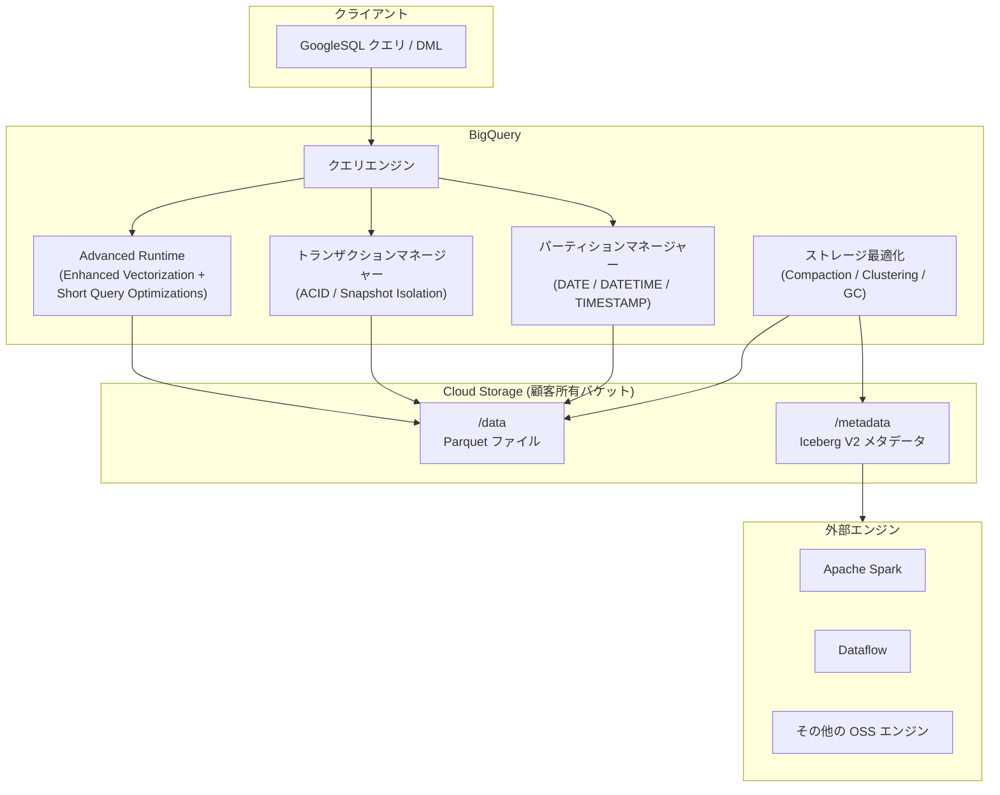

# BigQuery: Apache Iceberg マネージドテーブルのテーブルパーティショニング、マルチステートメントトランザクション、Advanced Runtime が GA

**リリース日**: 2026-07-13

**サービス**: BigQuery

**機能**: Apache Iceberg マネージドテーブル - テーブルパーティショニング、マルチステートメントトランザクション、Advanced Runtime の一般提供 (GA)

**ステータス**: GA (一般提供)

📊 [このアップデートのインフォグラフィックを見る](https://takech9203.github.io/google-cloud-news-summary/20260713-bigquery-iceberg-managed-tables-ga.html)

## 概要

BigQuery の Apache Iceberg マネージドテーブルにおいて、テーブルパーティショニング、マルチステートメントトランザクション、および Advanced Runtime の 3 機能が一般提供 (GA) となりました。これにより、オープンフォーマットのレイクハウスアーキテクチャにおいてエンタープライズグレードのデータ管理機能が本番環境で利用可能になります。

Apache Iceberg マネージドテーブルは、BigQuery の完全マネージド体験を維持しながら、顧客所有の Cloud Storage バケットにオープンな Iceberg テーブルフォーマットでデータを保存する機能です。今回の GA により、標準 BigQuery テーブルと同等のパーティショニング機能、ACID 特性を持つマルチステートメントトランザクション、およびクエリ実行を自動的に高速化する Advanced Runtime が Iceberg マネージドテーブルでも安定して利用できるようになりました。

**アップデート前の課題**

- Iceberg マネージドテーブルではパーティショニングによるクエリ最適化が限定的であった
- 複数テーブルにまたがる一貫性のある変更操作にトランザクション保証が不足していた
- Iceberg マネージドテーブルのクエリ性能が標準テーブルと比較して最適化されていなかった

**アップデート後の改善**

- DATE、DATETIME、TIMESTAMP カラムによるテーブルパーティショニングが GA で利用可能になり、クエリのスキャン範囲を効率的に制限可能になった
- ACID 特性とスナップショット分離を保証するマルチステートメントトランザクションが GA で利用可能になった
- Enhanced Vectorization と Short Query Optimizations を含む Advanced Runtime により、クエリ実行時間とスロット使用量が自動的に最適化されるようになった

## アーキテクチャ図



この図は、BigQuery の Iceberg マネージドテーブルにおける 3 つの GA 機能（Advanced Runtime、マルチステートメントトランザクション、テーブルパーティショニング）がクエリエンジンと Cloud Storage 間でどのように連携するかを示しています。

## サービスアップデートの詳細

### 主要機能

1. **テーブルパーティショニング**
   - DATE、DATETIME、TIMESTAMP カラムによる時間単位カラムパーティショニングに対応
   - 時間単位、日単位、月単位、年単位の粒度を選択可能
   - BigQuery が自動的にクエリを適切なパーティションにスコープする（Iceberg Hidden Partitioning と同様の動作）
   - クラスタリングとの併用も可能
   - パーティション有効期限の設定と更新に対応
   - 標準 BigQuery テーブルと同様の DML 文およびクエリ構文を使用可能

2. **マルチステートメントトランザクション**
   - 2026 年 7 月 2 日以降に作成された Iceberg マネージドテーブルでサポート
   - 標準 BigQuery テーブルと同様の方法でマルチステートメントトランザクションを使用可能
   - ACID 特性とスナップショット分離を保証
   - 複数テーブルへの同時変更や、単一テーブルへの複数段階の変更に最適
   - 標準のマルチステートメントトランザクション制限事項が適用

3. **BigQuery Advanced Runtime**
   - Enhanced Vectorization: CPU キャッシュサイズに整列したデータブロックで列方向に処理し、SIMD 命令を活用
   - Capacitor ストレージフォーマット内の特殊なデータエンコーディングを活用してフィルター評価を高速化
   - Expression Folding により決定論的関数と定数式を事前評価
   - Short Query Optimizations: 単一ステージで実行可能なクエリを動的に識別し、レイテンシとスロット消費を削減

## 技術仕様

### パーティショニング仕様

| 項目 | 詳細 |
|------|------|
| サポートされるカラム型 | DATE, DATETIME, TIMESTAMP |
| 粒度オプション | HOUR, DAY, MONTH, YEAR |
| クラスタリング併用 | 可能（最大 4 カラム） |
| パーティション有効期限 | 設定可能（期限切れデータはタイムトラベルウィンドウ後に GC） |
| Partition Evolution | 非サポート |

### Advanced Runtime の最適化内容

| 最適化 | 詳細 |
|------|------|
| Enhanced Vectorization | エンコード済みデータ上でのフィルター評価、特殊エンコーディングのクエリプラン伝搬 |
| Expression Folding | 決定論的関数・定数式の事前評価による述語の簡素化 |
| Short Query Optimizations | 分散シャッフル不要なクエリの単一ステージ実行 |
| Optional Job Creation Mode との連携 | ジョブの起動・メンテナンス・結果取得のレイテンシ最小化 |

### 必要な IAM ロール

| 操作 | 必要なロール |
|------|------|
| テーブル作成 | BigQuery Data Owner, BigQuery Connection Admin |
| テーブルクエリ | BigQuery Data Viewer, BigQuery User |
| Cloud Storage アクセス (接続サービスアカウント) | Storage Object User, Storage Legacy Bucket Reader |

## 設定方法

### 前提条件

1. Cloud Storage バケットの作成と設定
2. Cloud リソース接続の作成（バケットへの書き込み権限付与）
3. 必要な IAM ロールの付与

### 手順

#### ステップ 1: パーティション付き Iceberg マネージドテーブルの作成

```sql
CREATE TABLE my_project.my_dataset.my_iceberg_table (
  event_id STRING,
  event_name STRING,
  event_timestamp TIMESTAMP,
  user_id STRING
)
PARTITION BY DATE(event_timestamp)
CLUSTER BY user_id
WITH CONNECTION `my_project.us.my_connection`
OPTIONS (
  file_format = 'PARQUET',
  table_format = 'ICEBERG',
  storage_uri = 'gs://my-bucket/my-iceberg-table'
);
```

DATE、DATETIME、TIMESTAMP カラムを PARTITION BY 句で指定します。

#### ステップ 2: マルチステートメントトランザクションの使用

```sql
BEGIN TRANSACTION;

INSERT INTO my_project.my_dataset.my_iceberg_table
VALUES ('evt_001', 'purchase', CURRENT_TIMESTAMP(), 'user_123');

UPDATE my_project.my_dataset.my_iceberg_table
SET event_name = 'purchase_confirmed'
WHERE event_id = 'evt_001';

COMMIT TRANSACTION;
```

標準 BigQuery テーブルと同様の構文でトランザクションを使用できます。

## メリット

### ビジネス面

- **オープンフォーマットによるベンダーロックイン回避**: データが Iceberg V2 フォーマットで顧客所有のバケットに保存されるため、Spark 等の他エンジンからも直接アクセス可能
- **運用コスト削減**: パーティショニングによるスキャン範囲の削減と Advanced Runtime による自動最適化で、クエリコストを低減

### 技術面

- **データ整合性の向上**: マルチステートメントトランザクションによる ACID 保証で、複雑なデータパイプラインの信頼性が向上
- **クエリ性能の自動改善**: Advanced Runtime はコード変更不要で自動的にクエリを高速化（最大 45% 程度の実行時間削減が見込まれるケースあり）
- **ストレージの自動最適化**: Adaptive File Sizing、自動クラスタリング、ガベージコレクション、メタデータ最適化が自動実行

## デメリット・制約事項

### 制限事項

- マルチステートメントトランザクションは 2026 年 7 月 2 日以降に作成された Iceberg マネージドテーブルのみサポート
- パーティショニングカラムは DATE、DATETIME、TIMESTAMP 型のみ対応（INTEGER レンジパーティショニング等は非対応）
- Partition Evolution（パーティション定義の変更）は非サポート
- テーブル削除時、関連するデータファイルはガベージコレクションされない

### 考慮すべき点

- Iceberg マネージドテーブルのロードおよびエクスポート操作は Enterprise Edition の従量課金スロットを使用（標準テーブルではこれらの操作は無料）
- Cloud Storage のデータ処理料金およびネットワーク転送料金が別途発生する可能性がある

## ユースケース

### ユースケース 1: マルチエンジンのレイクハウス分析基盤

**シナリオ**: BigQuery でのインタラクティブ分析と Spark でのバッチ ETL を同じデータセットに対して実行する必要がある組織。パーティショニングによりスキャンコストを最適化しつつ、Iceberg V2 メタデータスナップショットを通じて Spark から直接アクセスする。

**実装例**:
```sql
-- パーティション付きテーブル作成
CREATE TABLE my_project.analytics.events (
  event_date DATE,
  event_type STRING,
  payload JSON
)
PARTITION BY event_date
WITH CONNECTION `my_project.us.analytics_conn`
OPTIONS (
  file_format = 'PARQUET',
  table_format = 'ICEBERG',
  storage_uri = 'gs://analytics-lake/events'
);

-- メタデータスナップショットのエクスポート（Spark アクセス用）
EXPORT TABLE METADATA FROM my_project.analytics.events;
```

**効果**: BigQuery と Spark の両方から単一コピーのデータにアクセスでき、データ複製が不要になる

### ユースケース 2: トランザクション保証付き ETL パイプライン

**シナリオ**: ファクトテーブルとディメンションテーブルを同時に更新する必要があるデータパイプラインで、不整合なデータが下流のダッシュボードに反映されることを防ぐ。

**実装例**:
```sql
BEGIN TRANSACTION;

-- ディメンションテーブル更新
MERGE INTO my_project.warehouse.dim_products AS target
USING staging.products_update AS source
ON target.product_id = source.product_id
WHEN MATCHED THEN UPDATE SET target.price = source.price;

-- ファクトテーブルへの挿入
INSERT INTO my_project.warehouse.fact_sales
SELECT * FROM staging.new_sales;

COMMIT TRANSACTION;
```

**効果**: ACID トランザクションにより、複数テーブルの変更がアトミックに適用され、分析レポートの整合性が保証される

## 料金

Iceberg マネージドテーブルの料金は以下の 3 つの要素で構成されます。

| 項目 | 料金体系 |
|------|----------|
| ストレージ | Cloud Storage 料金が適用（BigQuery 固有のストレージ料金なし） |
| ストレージ最適化 | Data Compute Units (DCUs) による秒単位課金 |
| クエリ・ジョブ | オンデマンド: 読み取りバイト数 (TiB 単位)、キャパシティ: スロット消費 (スロット時間単位) |

ロードおよびエクスポート操作は Enterprise Edition の従量課金スロットを使用します。

## 関連サービス・機能

- **Cloud Storage**: Iceberg マネージドテーブルのデータ保存先として使用
- **BigQuery Storage Write API**: ストリーミングデータの取り込みに使用（Spark、Dataflow コネクタ経由）
- **Dataform**: Iceberg マネージドテーブルのワークフロー内での作成に対応
- **Apache Spark**: Iceberg V2 メタデータスナップショットを通じたダイレクトクエリアクセスが可能
- **BigQuery Reservations**: Advanced Runtime を含むクエリ実行のキャパシティ管理

## 参考リンク

- 📊 [インフォグラフィック](https://takech9203.github.io/google-cloud-news-summary/20260713-bigquery-iceberg-managed-tables-ga.html)
- [公式リリースノート](https://docs.cloud.google.com/release-notes#July_13_2026)
- [Apache Iceberg マネージドテーブル ドキュメント](https://docs.cloud.google.com/bigquery/docs/biglake-iceberg-tables-in-bigquery)
- [BigQuery Advanced Runtime ドキュメント](https://docs.cloud.google.com/bigquery/docs/advanced-runtime)
- [マルチステートメントトランザクション ドキュメント](https://docs.cloud.google.com/bigquery/docs/transactions)
- [テーブルパーティショニング ドキュメント](https://docs.cloud.google.com/bigquery/docs/partitioned-tables)

## まとめ

今回の GA リリースにより、BigQuery の Apache Iceberg マネージドテーブルはエンタープライズ向けの本番ワークロードに必要な機能を備えた成熟したデータレイクハウスソリューションとなりました。パーティショニングによるコスト最適化、トランザクションによるデータ整合性保証、Advanced Runtime による自動性能改善の組み合わせは、オープンフォーマットのメリットを維持しながら BigQuery の利便性を最大限に活かしたいユーザーにとって重要なマイルストーンです。既存の Iceberg マネージドテーブルユーザーは、マルチステートメントトランザクションを使用する場合、テーブルの再作成（2026 年 7 月 2 日以降の作成が必要）を検討してください。

---

**タグ**: #BigQuery #ApacheIceberg #マネージドテーブル #パーティショニング #トランザクション #AdvancedRuntime #GA #レイクハウス #オープンフォーマット
