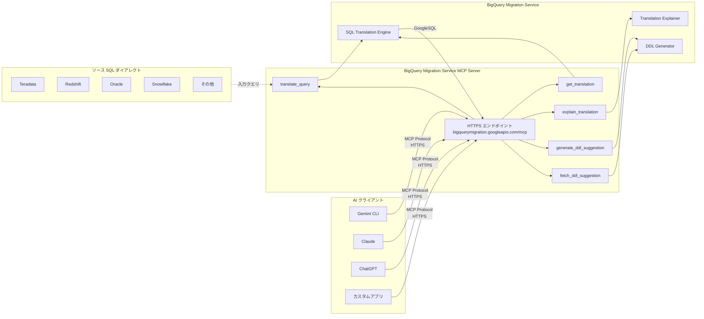

# BigQuery: Migration Service MCP Server による SQL 翻訳タスク

**リリース日**: 2026-07-13

**サービス**: BigQuery

**機能**: BigQuery Migration Service MCP server - SQL translation tasks

**ステータス**: Generally Available (GA)

[このアップデートのインフォグラフィックを見る](https://takech9203.github.io/google-cloud-news-summary/20260713-bigquery-migration-service-mcp-server.html)

## 概要

BigQuery Migration Service MCP (Model Context Protocol) server が一般提供 (GA) となりました。この MCP サーバーを使用することで、AI アプリケーションや LLM エージェントから直接 SQL 翻訳タスクを実行できるようになります。具体的には、各種 SQL ダイアレクトから GoogleSQL への変換、入力クエリからの DDL ステートメント生成、SQL 翻訳の説明取得が可能です。

このアップデートにより、Gemini CLI、ChatGPT、Claude などの AI アプリケーションから BigQuery Migration Service の SQL 翻訳機能にシームレスにアクセスできるようになります。MCP は LLM と外部データソースの接続を標準化するプロトコルであり、Google Cloud のマネージド HTTPS エンドポイントとして提供されます。

対象ユーザーは、既存のデータウェアハウス (Teradata、Redshift、Oracle、Snowflake など) から BigQuery への移行を計画・実行しているデータエンジニア、およびAI ツールを活用した開発ワークフローを構築しているチームです。

**アップデート前の課題**

- SQL 翻訳を行うには BigQuery コンソール、バッチ SQL トランスレーター、または REST API を直接使用する必要があった
- AI アシスタントや IDE から SQL 翻訳機能を呼び出すには独自の統合コードを開発する必要があった
- 翻訳結果の説明や DDL 生成を手動で実施する必要があり、ワークフローが断片化していた

**アップデート後の改善**

- MCP プロトコルに対応した任意の AI クライアントから SQL 翻訳を直接呼び出せるようになった
- 翻訳、説明、DDL 生成を AI エージェントのワークフロー内でシームレスに連携可能になった
- マネージド HTTPS エンドポイントにより、インフラ管理なしでセキュアに利用可能になった

## アーキテクチャ図



AI クライアントが MCP プロトコルを介して BigQuery Migration Service MCP Server に接続し、各種ツール (translate_query、explain_translation、generate_ddl_suggestion など) を呼び出すことで SQL 翻訳ワークフローを実行します。

## サービスアップデートの詳細

### 主要機能

1. **SQL クエリ翻訳 (translate_query)**
   - 各種 SQL ダイアレクトから GoogleSQL への自動変換
   - サポートされるソースダイアレクト: Teradata、BTEQ、Redshift、Oracle、HiveQL、Impala、SparkSQL、Snowflake、Netezza、Azure Synapse、Vertica、SQL Server、Presto、MySQL、PostgreSQL、DB2、Greenplum、SQLite
   - メタデータファイルを指定することで翻訳精度の向上が可能

2. **翻訳結果の説明 (explain_translation)**
   - 翻訳内容の詳細な説明を自然言語で取得
   - ソースダイアレクト固有の構文がどのように GoogleSQL に変換されたかの解説
   - 翻訳ログのエラー分析と次のステップの提案

3. **DDL ステートメント生成 (generate_ddl_suggestion / fetch_ddl_suggestion)**
   - 入力クエリから DDL ステートメントを自動生成
   - 生成された DDL を入力クエリに追加して翻訳品質を向上
   - RelationNotFound や AttributeNotFound エラーの解消に有効

4. **翻訳結果の取得 (get_translation)**
   - 翻訳ジョブのステータスと結果を取得
   - 翻訳ログの確認と品質評価

## 技術仕様

### MCP サーバー接続情報

| 項目 | 詳細 |
|------|------|
| サーバー名 | BigQuery Migration Service MCP server |
| エンドポイント | `https://bigquerymigration.googleapis.com/mcp` |
| トランスポート | HTTP (HTTPS) |
| プロトコル | JSON-RPC 2.0 |
| 認証 | Google Cloud 認証情報 / OAuth Client ID / エージェント ID |

### translate_query ツールの入出力スキーマ

**リクエスト (TranslateQueryRequest)**:

```json
{
  "parent": "projects/PROJECT_ID/locations/LOCATION",
  "inputQuery": "SELECT * FROM my_table WHERE col1 = 'value'",
  "sourceDialect": "Teradata",
  "metadataFilePath": "gs://BUCKET_NAME/PATH_TO_FILE.zip"
}
```

**レスポンス (TranslateQueryResponse)**:

```json
{
  "translatedQuery": "SELECT * FROM `project.dataset.my_table` WHERE col1 = 'value'",
  "translationId": "projects/PROJECT_ID/locations/LOCATION/workflows/WORKFLOW_ID",
  "translationState": "SUCCEEDED",
  "translationLogs": [
    {
      "severity": "INFO",
      "category": "SyntaxInfo",
      "message": "Translation completed successfully",
      "action": "",
      "effect": "NONE",
      "impactedObject": ""
    }
  ]
}
```

### 必要な権限

| ロール | 説明 |
|--------|------|
| `bigquerymigration.editor` | Migration Service の読み書きアクセス |
| `bigquerymigration.viewer` | Migration Service の読み取り専用アクセス |
| `roles/storage.objectAdmin` | Cloud Storage バケットへのアクセス (メタデータ使用時) |

## 設定方法

### 前提条件

1. Google Cloud プロジェクトが作成済みであること
2. BigQuery API が有効化されていること (BigQuery API を有効にすると MCP サーバーも有効になる)
3. 適切な IAM 権限が付与されていること

### 手順

#### ステップ 1: BigQuery Migration API の有効化

```bash
gcloud services enable bigquerymigration.googleapis.com
```

2022年2月15日以降に作成されたプロジェクトでは自動的に有効化されています。

#### ステップ 2: MCP クライアントの設定 (Gemini CLI の例)

```json
{
  "name": "BQMS-MCP",
  "version": "1.0.0",
  "mcpServers": {
    "BigQueryMigration": {
      "httpUrl": "https://bigquerymigration.googleapis.com/mcp",
      "authProviderType": "google_credentials",
      "oauth": {
        "scopes": [
          "https://www.googleapis.com/auth/bigquerymigration",
          "https://www.googleapis.com/auth/devstorage.read_only"
        ]
      },
      "timeout": 30000,
      "headers": {
        "x-goog-user-project": "PROJECT_ID"
      }
    }
  }
}
```

PROJECT_ID を実際のプロジェクト ID に置き換えてください。

#### ステップ 3: ツールの一覧確認

```bash
curl --location 'https://bigquerymigration.googleapis.com/mcp' \
  --header 'content-type: application/json' \
  --header 'accept: application/json, text/event-stream' \
  --data '{
    "method": "tools/list",
    "jsonrpc": "2.0"
  }'
```

tools/list メソッドは認証不要で実行できます。

#### ステップ 4: SQL 翻訳の実行

AI クライアントから以下のようなプロンプトを使用して翻訳を実行します:

```
Translate this query from Teradata:
SELECT TOP 10 * FROM sales_table WHERE sale_date > DATE '2024-01-01';
Use project my-project and location us.
```

## メリット

### ビジネス面

- **移行プロジェクトの加速**: AI アシスタントを活用することで SQL 翻訳ワークフローが大幅に効率化され、移行期間を短縮可能
- **コスト削減**: BigQuery Migration API の使用自体は無料であり、手動翻訳にかかる人的コストを削減
- **マルチベンダー対応**: 20 以上の SQL ダイアレクトに対応しており、様々なデータウェアハウスからの移行を統一的に支援

### 技術面

- **標準プロトコル対応**: MCP 標準に準拠しているため、対応する任意の AI クライアントから利用可能
- **マネージドインフラ**: Google Cloud がエンドポイントを管理するため、インフラの構築・運用が不要
- **セキュリティ**: 細粒度の認可制御、Model Armor によるプロンプト・レスポンスセキュリティ、監査ログの一元管理
- **翻訳品質の反復改善**: DDL 生成と再翻訳のフローにより、翻訳精度を段階的に向上可能

## デメリット・制約事項

### 制限事項

- 翻訳はベストエフォートで行われ、一部のスクリプトは手動翻訳が必要な場合がある
- プロジェクトあたり同時に実行可能な翻訳タスクは最大 10 件
- ソースファイルとメタデータファイルの合計数は 1000 件以下が推奨
- BigQuery Migration API のクォータと制限が適用される

### 考慮すべき点

- 複雑な SQL ステートメントや独自の拡張構文は翻訳精度が低下する可能性がある
- メタデータなしで翻訳を実行すると RelationNotFound や AttributeNotFound エラーが発生しやすい
- 翻訳結果は必ず検証テストを実施してから本番環境に適用すべき
- ヘルパー UDF (bqutil) を本番環境で直接使用することは推奨されず、自プロジェクトにデプロイする必要がある

## ユースケース

### ユースケース 1: IDE 内での対話的 SQL 翻訳

**シナリオ**: データエンジニアが IDE (VS Code など) で Teradata のクエリファイルを開き、AI アシスタントを通じて GoogleSQL に翻訳する。

**実装例**:
```
プロンプト: "Translate the Teradata query in this file sales_report.sql.
Use project my-project and location us.
Persist the output and translation logs into separate directories."
```

**効果**: IDE を離れることなくクエリ翻訳を完了でき、翻訳ログも自動保存されるため品質評価が容易になる。

### ユースケース 2: 翻訳品質の反復的改善

**シナリオ**: 初回翻訳で RelationNotFound エラーが発生した場合、DDL 生成と再翻訳を組み合わせて品質を改善する。

**実装例**:
```
1. "Translate this query from Oracle: [クエリ]"
2. "Assess the translation quality."
3. "Generate DDL for this input query."
4. "Prepend the generated DDL statements to the input query and retranslate."
```

**効果**: メタデータが利用できない場合でも、DDL 生成による段階的な翻訳品質の向上が可能。

### ユースケース 3: 大規模移行プロジェクトでの自動化

**シナリオ**: カスタムアプリケーションから MCP クライアントを実装し、数百のクエリファイルを自動的に翻訳・検証するパイプラインを構築する。

**効果**: 大量のクエリを効率的に翻訳し、翻訳ログを分析することで問題のあるクエリを特定し、優先的に対応可能。

## 料金

BigQuery Migration API (SQL 翻訳) の使用自体は無料です。

| 項目 | 料金 |
|------|------|
| SQL 翻訳 API の使用 | 無料 |
| 入出力ファイルの Cloud Storage 保存 | 通常の Cloud Storage 料金が適用 |
| BigQuery API の呼び出し | BigQuery の標準料金体系に準拠 |

ストレージ料金の詳細は [BigQuery Storage pricing](https://cloud.google.com/bigquery/pricing#storage) を参照してください。

## 関連サービス・機能

- **BigQuery バッチ SQL トランスレーター**: 大量のファイルを一括翻訳する場合に使用。MCP サーバーと同じ翻訳エンジンを利用
- **BigQuery インタラクティブ SQL トランスレーター**: BigQuery コンソールから対話的に SQL を翻訳する機能
- **BigQuery Migration Assessment**: 移行前のアセスメントツール。ワークロードの複雑さや互換性を事前に評価
- **BigQuery Data Transfer Service**: ソースシステムからのデータ転送を自動化するサービス
- **Google Cloud MCP サーバー**: BigQuery、Spanner、Cloud SQL など他の Google Cloud サービスの MCP サーバー群
- **Model Armor**: MCP サーバーのプロンプト・レスポンスに対するセキュリティ保護機能

## 参考リンク

- [インフォグラフィック](https://takech9203.github.io/google-cloud-news-summary/20260713-bigquery-migration-service-mcp-server.html)
- [公式リリースノート](https://docs.cloud.google.com/release-notes#July_13_2026)
- [BigQuery Migration Service MCP server ドキュメント](https://docs.cloud.google.com/bigquery/docs/use-bigquery-migration-mcp)
- [BigQuery Migration Service MCP リファレンス](https://docs.cloud.google.com/bigquery/docs/reference/migration/mcp)
- [BigQuery Migration 概要](https://docs.cloud.google.com/bigquery/docs/migration-intro)
- [Google Cloud MCP サーバー概要](https://docs.cloud.google.com/mcp/overview)
- [MCP クライアント設定ガイド](https://docs.cloud.google.com/mcp/configure-mcp-ai-application)
- [料金ページ](https://cloud.google.com/bigquery/pricing#storage)

## まとめ

BigQuery Migration Service MCP server の GA リリースにより、AI アプリケーションから標準化されたプロトコルで SQL 翻訳機能にアクセスできるようになりました。これは、AI 駆動の開発ワークフローにおいてデータウェアハウス移行を大幅に効率化する重要なアップデートです。既に BigQuery への移行を計画している組織は、この MCP サーバーを AI ツールに統合することで、翻訳・検証・改善のサイクルを加速させることを推奨します。

---

**タグ**: #BigQuery #MigrationService #MCP #SQLTranslation #GA #DataWarehouse #GoogleSQL #ModelContextProtocol
