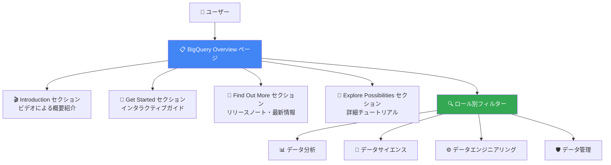

# BigQuery: Overview ページが GA (一般提供開始)

**リリース日**: 2026-07-13

**サービス**: BigQuery

**機能**: Overview ページ

**ステータス**: GA (一般提供)

[このアップデートのインフォグラフィックを見る](https://takech9203.github.io/google-cloud-news-summary/20260713-bigquery-overview-page-ga.html)

## 概要

BigQuery の Overview ページが一般提供 (GA) となった。このページは BigQuery コンソール内のハブとして機能し、チュートリアル、機能紹介、リソースへのアクセスを一元的に提供する。2025 年 11 月に Preview としてリリースされて以降、ユーザーフィードバックを反映して改善が重ねられ、今回の GA に至った。

Overview ページは、初めてクエリを実行するビギナーから高度な AI/ML 機能を活用するエキスパートまで、すべてのスキルレベルのユーザーに対してガイド付きパスを提供する。ロールや関心分野 (データ分析、データサイエンス、データエンジニアリング、データ管理) に応じてコンテンツをフィルタリングできるため、ユーザーは最も関連性の高いリソースに素早くアクセスできる。

この機能は BigQuery コンソールのナビゲーションメニューから直接アクセスでき、追加の設定や料金は不要である。BigQuery の学習効率とディスカバラビリティを大幅に向上させる重要なユーザーエクスペリエンスの改善である。

**アップデート前の課題**

- BigQuery の豊富な機能やチュートリアルが分散しており、ユーザーが自分に適したリソースを見つけにくかった
- 新規ユーザーが BigQuery を始める際に、どこから手を付ければよいか分かりにくかった
- スキルレベルやロールに応じた学習パスが体系化されていなかった
- 最新のリリースノートや機能アップデートを確認するために別のページに移動する必要があった

**アップデート後の改善**

- BigQuery コンソール内に統合されたハブから、チュートリアル・機能・リソースを一元的に発見できるようになった
- ロール別フィルタリング (データ分析、データサイエンス、データエンジニアリング、データ管理) でパーソナライズされたコンテンツを表示できるようになった
- インタラクティブなガイドを通じて、実践的に BigQuery の機能を学べるようになった
- GA として全ユーザーに安定して提供され、プロダクション環境での利用が保証されるようになった

## アーキテクチャ図



BigQuery Overview ページは中央ハブとして機能し、4 つのメインセクションとロール別フィルタリングを通じて、ユーザーを最適なリソースに導く構造になっている。

## サービスアップデートの詳細

### 主要機能

1. **Introduction セクション**
   - BigQuery の機能を紹介するビデオ概要を提供
   - ロールフィルターに応じて表示内容が動的に変化
   - BigQuery の全体像を素早く把握するための入口

2. **Get Started セクション**
   - 「Learning by doing」のコンセプトに基づくインタラクティブガイド
   - BigQuery の各機能の使い方をハンズオン形式で学習可能
   - 初心者から中級者が対象

3. **Find Out More セクション**
   - BigQuery のリリースノートを直接表示
   - 最新の機能アナウンスやアップデートをリアルタイムで確認可能
   - 別ページへの遷移なしで最新情報を把握

4. **Explore Possibilities セクション**
   - 特定機能に関する詳細なチュートリアルと学習機会を提供
   - AI/ML 機能を含む高度なユースケースへの道筋を示す
   - 中級者から上級者が対象

5. **カスタマイズ機能**
   - ロール別フィルター (データ分析、データサイエンス、データエンジニアリング、データ管理) でコンテンツをパーソナライズ
   - 個別カードの非表示設定 (ユーザーごとに保存)
   - セクションの折りたたみ (ユーザーごとに保存)

## 技術仕様

### アクセス方法

| 項目 | 詳細 |
|------|------|
| コンソール URL | `https://console.cloud.google.com/bigquery/overview` |
| ナビゲーション | BigQuery メニュー > Overview |
| 前提条件 | BigQuery API の有効化 |
| 必要な権限 | BigQuery の基本的な閲覧権限 |
| 追加費用 | なし (BigQuery コンソール機能の一部) |

### ロール別フィルター

| ロール | 対象ユーザー | コンテンツ例 |
|--------|-------------|-------------|
| Data analysis | アナリスト、BI ユーザー | SQL クエリ、可視化、レポート作成 |
| Data science | データサイエンティスト | BigQuery ML、AI 関数、予測モデル |
| Data engineering | データエンジニア | パイプライン、ETL、ストリーミング |
| Data administration | 管理者 | セキュリティ、監視、コスト最適化 |

## 設定方法

### 前提条件

1. Google Cloud プロジェクトが作成済みであること
2. BigQuery API が有効化されていること (新規プロジェクトでは自動的に有効)

### 手順

#### ステップ 1: Overview ページへのアクセス

```
Google Cloud コンソール > ナビゲーションメニュー > BigQuery > Overview
```

または、ブラウザで以下の URL に直接アクセス:

```
https://console.cloud.google.com/bigquery/overview
```

#### ステップ 2: ロール別フィルターの設定

1. Overview ページ上部のフィルターバーに移動
2. 自分のタスクまたはロールに最も合うオプションを選択:
   - Data analysis
   - Data science
   - Data engineering
   - Data administration

#### ステップ 3: コンテンツのカスタマイズ

1. 不要なカードは「More options > Hide card」で非表示に設定
2. 非表示にしたカードはセクション末尾の「Show hidden content」で再表示可能
3. セクション全体を折りたたむことも可能

## メリット

### ビジネス面

- **オンボーディング時間の短縮**: 新規ユーザーが BigQuery を使い始めるまでの時間を大幅に削減
- **学習効率の向上**: ロール別のガイド付きパスにより、ユーザーが自分に関連する情報を効率的に見つけられる
- **チーム全体の生産性向上**: スキルレベルを問わず全メンバーが BigQuery の最新機能を活用できる

### 技術面

- **ディスカバラビリティの向上**: 分散していた機能やリソースへのアクセスを集約
- **コンテキスト切り替えの削減**: BigQuery コンソール内でリリースノートやチュートリアルを確認可能
- **パーソナライズされた体験**: ユーザー設定が保存され、再訪問時にも最適化されたコンテンツを表示

## デメリット・制約事項

### 制限事項

- Overview ページのコンテンツは Google が提供するものに限定され、カスタムコンテンツの追加はできない
- ロールフィルターは 4 種類の固定カテゴリに限られる
- カスタマイズ設定はユーザー単位で保存されるため、チーム全体での統一設定はできない

### 考慮すべき点

- Overview ページは情報のハブであり、直接的なデータ処理機能は含まない
- 詳細な操作は Studio ページや各専用ページで行う必要がある
- チュートリアルコンテンツの更新頻度は Google の公開スケジュールに依存する

## ユースケース

### ユースケース 1: 新規チームメンバーのオンボーディング

**シナリオ**: データ分析チームに新しいアナリストが加わり、BigQuery の使い方を学ぶ必要がある。

**実装例**:
1. Overview ページにアクセス
2. フィルターバーで「Data analysis」を選択
3. Introduction セクションのビデオで BigQuery の概要を理解
4. Get Started セクションのインタラクティブガイドで初めてのクエリを実行
5. Explore Possibilities セクションでダッシュボード作成やスケジュールクエリを学習

**効果**: 体系化された学習パスにより、新メンバーが数時間で基本操作を習得。従来のドキュメント検索に比べて学習時間を大幅に短縮。

### ユースケース 2: 既存ユーザーの機能発見

**シナリオ**: 普段 SQL クエリのみを使っているデータエンジニアが、BigQuery の AI/ML 機能を活用したいと考えている。

**実装例**:
1. Overview ページにアクセス
2. フィルターバーで「Data science」を選択
3. Explore Possibilities セクションで BigQuery ML のチュートリアルを発見
4. Get Started のインタラクティブガイドで AI 関数 (AI.CLASSIFY, AI.GENERATE など) を試す

**効果**: 既存ユーザーが知らなかった機能を効率的に発見し、データ活用の幅を広げることが可能。

## 料金

BigQuery Overview ページの利用に追加料金は発生しない。BigQuery コンソールの標準機能として提供される。

BigQuery 全体の料金体系は以下の通り:

| 項目 | 料金 |
|------|------|
| Overview ページ利用 | 無料 |
| BigQuery 分析 (オンデマンド) | $6.25/TiB (最初の 1 TiB/月は無料) |
| ストレージ (論理) | $0.01/GiB (最初の 10 GiB は無料) |
| ストレージ (物理) | $0.02/GiB (最初の 10 GiB は無料) |

## 利用可能リージョン

BigQuery Overview ページは BigQuery が利用可能なすべてのリージョンおよびマルチリージョンで利用可能。コンソール機能であるため、リージョン制限はない。

## 関連サービス・機能

- **BigQuery Studio ページ**: リソース管理とクエリ実行のための主要ワークスペース。Overview ページから Studio ページへシームレスに移動可能。
- **BigQuery ML**: Overview ページの Data science フィルターから AI/ML 関連のチュートリアルにアクセス可能。
- **BigQuery Data Transfer Service**: データエンジニアリングロールのガイドパスで、データ転送の設定方法を学習可能。
- **BigQuery Agents ページ (Preview)**: データエージェントとの対話による自然言語でのデータ分析機能。
- **BigQuery Search ページ (Preview)**: 自然言語クエリによる Google Cloud リソースの検索機能。

## 参考リンク

- [インフォグラフィック](https://takech9203.github.io/google-cloud-news-summary/20260713-bigquery-overview-page-ga.html)
- [公式リリースノート](https://docs.cloud.google.com/release-notes#July_13_2026)
- [BigQuery コンソールドキュメント](https://docs.cloud.google.com/bigquery/docs/bigquery-web-ui)
- [BigQuery Overview ページ](https://console.cloud.google.com/bigquery/overview)
- [BigQuery 料金ページ](https://cloud.google.com/bigquery/pricing)

## まとめ

BigQuery Overview ページの GA は、BigQuery のユーザーエクスペリエンスを大幅に向上させるアップデートである。ロール別のガイド付きパスとインタラクティブなチュートリアルにより、新規ユーザーのオンボーディングが加速し、既存ユーザーも未活用の機能を効率的に発見できる。すべての BigQuery ユーザーに追加費用なしで提供されるため、チーム全体で積極的に活用することを推奨する。

---

**タグ**: #BigQuery #GA #Console #Overview #UX #オンボーディング #チュートリアル #ガイドパス
