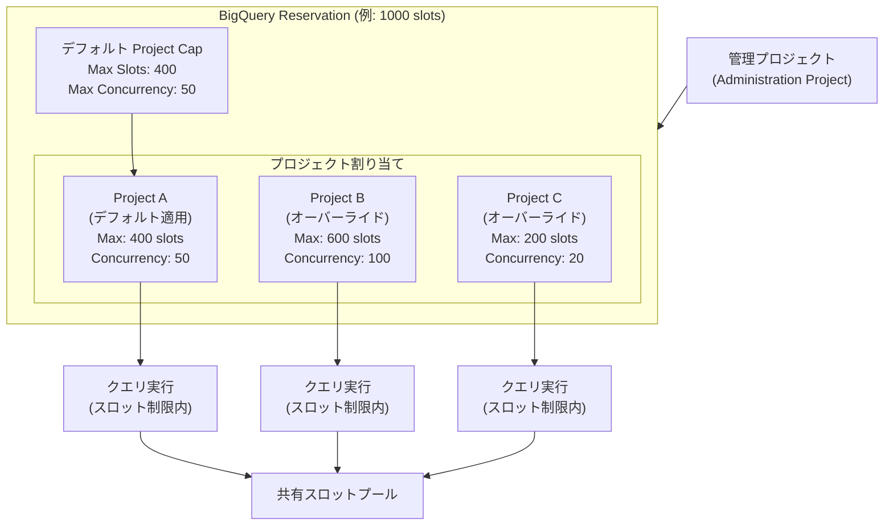

# BigQuery: Project Caps (Scheduling Policies)

**リリース日**: 2026-07-13

**サービス**: BigQuery

**機能**: Project Caps (Scheduling Policies) - リザベーション内のプロジェクトごとの最大スロット数と同時実行数の制限

**ステータス**: Preview

📊 [このアップデートのインフォグラフィックを見る](https://takech9203.github.io/google-cloud-news-summary/20260713-bigquery-project-caps.html)

## 概要

BigQuery の Project Caps（スケジューリングポリシー）は、リザベーション内の各プロジェクトに対して最大スロット消費量と最大同時実行クエリ数を制限できる新機能です。この機能により、BigQuery のデフォルトのフェアスケジューリング動作をカスタマイズし、特定のプロジェクトがリザベーション内の過剰なリソースを消費することを防止できます。

従来の BigQuery リザベーションでは、フェアスケジューリングにより全プロジェクトが均等にスロットを利用していましたが、ワークロードの優先度や重要度に応じたきめ細かい制御ができませんでした。Project Caps を使用することで、管理者はリザベーションレベルでデフォルトの制限を設定し、さらに個別プロジェクトごとにオーバーライドを構成できるようになります。

この機能は、マルチテナント環境で複数のチームやプロジェクトが同じリザベーションを共有する大規模組織にとって特に有用です。

**アップデート前の課題**

- フェアスケジューリングのみでは、特定のプロジェクトが一時的に大量のスロットを消費し、他のプロジェクトのパフォーマンスに影響を与える可能性があった
- プロジェクト単位での同時実行クエリ数の制限ができず、あるプロジェクトが大量のクエリを同時に投入すると全体のキューが詰まる可能性があった
- リザベーション内のリソース配分を細かく制御するには、複数のリザベーションに分割する必要があり管理が複雑化していた

**アップデート後の改善**

- リザベーションレベルでデフォルトのスロット上限と同時実行上限を設定し、全プロジェクトに一括適用できるようになった
- 個別プロジェクトごとにスケジューリングポリシーのオーバーライドを設定でき、優先度に応じた柔軟なリソース配分が可能になった
- 単一リザベーション内で複数プロジェクトのリソース利用を制御でき、リザベーション管理が簡素化された

## アーキテクチャ図



リザベーション内で各プロジェクトに Project Cap が適用される構造を示しています。デフォルトポリシーは全プロジェクトに適用され、個別のオーバーライドが設定されたプロジェクトはそちらが優先されます。

## サービスアップデートの詳細

### 主要機能

1. **Maximum Slots (最大スロット制限)**
   - リザベーション内の各プロジェクトが消費できるスロット数の上限を設定
   - 最小許容値は 100 スロット
   - 厳密なハードリミットではなく、近似的なキャップとして機能する
   - フェアスケジューリングで本来取得可能なスロット数を超えていても制限が適用される

2. **Maximum Concurrency (最大同時実行数制限)**
   - リザベーション内の各プロジェクトが同時に実行できるクエリ数の上限を設定
   - キャップはクエリのアドミッション時にのみ適用される
   - 実行中のクエリがキャンセルされることはない
   - 同時実行上限を現在の実行クエリ数未満に変更した場合、既存クエリが完了するまで新規クエリがキューイングされる

3. **プロジェクト固有のオーバーライド**
   - デフォルトのリザベーションレベル設定を、特定のプロジェクトに対して個別に上書き可能
   - アサインメントルール（Project Cap タイプ）として設定
   - プロジェクト単位のみサポート（フォルダー・組織レベルは非対応）

## 技術仕様

### 設定パラメータ

| 項目 | 詳細 |
|------|------|
| Maximum Slots | 最小値: 100、近似的なキャップとして適用 |
| Maximum Concurrency | アドミッション時に適用、実行中クエリは非キャンセル |
| 適用単位 | プロジェクト単位（フォルダー・組織は非対応） |
| 反映時間 | 変更後最大 1 分で適用 |
| Max Slots オーバーライド変更 | 新しいクエリの開始が必要 |
| Job Type | 未設定または JOB_TYPE_UNSPECIFIED のみ |

### 必要な IAM 権限

| 権限 | 用途 |
|------|------|
| `bigquery.reservations.create` | リザベーション作成（デフォルトポリシー設定含む） |
| `bigquery.reservationAssignments.create` | Project Cap アサインメント作成 |

対応する事前定義ロール:
- BigQuery Resource Editor
- BigQuery Resource Admin

## 設定方法

### 前提条件

1. BigQuery の容量ベース料金モデル（エディション）を使用していること
2. 管理プロジェクトにリザベーションが作成済みであること
3. BigQuery Resource Admin または BigQuery Resource Editor ロールが付与されていること

### 手順

#### ステップ 1: リザベーションレベルでデフォルト Project Cap を設定

**Google Cloud Console の場合:**

1. BigQuery ページに移動
2. ナビゲーションメニューから「Capacity management」を選択
3. リザベーションを作成または編集
4. Advanced settings セクションを展開
5. 「Override project concurrency」トグルをオンにし、値を入力
6. 「Override project max slots」トグルをオンにし、値を入力
7. 保存

#### ステップ 2: プロジェクト固有のオーバーライドを SQL で設定

```sql
CREATE ASSIGNMENT
  `admin_project.region-us.my_reservation.project_a_cap`
OPTIONS (
  assignee = 'projects/my-project-a',
  scheduling_policy_max_slots = 600,
  scheduling_policy_concurrency = 100
);
```

#### ステップ 3: bq コマンドラインで設定

```bash
bq mk \
  --project_id=ADMIN_PROJECT_ID \
  --location=us \
  --reservation_assignment \
  --reservation_id=my_reservation \
  --assignee_id=my-project-a \
  --assignee_type=PROJECT \
  --scheduling_policy_max_slots=600 \
  --scheduling_policy_concurrency=100
```

#### ステップ 4: 既存の設定を変更

```sql
ALTER ASSIGNMENT
  `admin_project.region-us.my_reservation.project_a_cap`
SET OPTIONS (
  scheduling_policy_max_slots = 800,
  scheduling_policy_concurrency = 150
);
```

設定を削除する場合は、値を `null` に設定するか、アサインメント自体を削除します。

#### ステップ 5: 設定の確認

```sql
SELECT *
FROM `region-us`.INFORMATION_SCHEMA.ASSIGNMENTS
WHERE assignment_type = 'PROJECT_CAP';
```

`INFORMATION_SCHEMA.ASSIGNMENTS` ビューの `scheduling_policy` 列と `assignment_type` 列で、アクティブなスケジューリングポリシーオーバーライドを確認できます。

## メリット

### ビジネス面

- **コスト予測性の向上**: プロジェクトごとのスロット消費上限を設定することで、各チームやプロジェクトのコストを予測可能にし、予算超過のリスクを軽減
- **SLA の保護**: 重要なプロジェクトのパフォーマンスを、他のプロジェクトの突発的なワークロードから保護可能
- **マルチテナント管理の簡素化**: 1 つのリザベーション内で複数のテナントのリソース利用を制御でき、リザベーションの乱立を防止

### 技術面

- **きめ細かいリソース制御**: フェアスケジューリングを超えた、プロジェクト単位での詳細なリソースガバナンスが可能
- **キューイング制御**: 同時実行数を制限することで、クエリキューの長さを制御し、レイテンシーの予測性を向上
- **運用の柔軟性**: デフォルトポリシーと個別オーバーライドの二層構造により、一般ルールと例外を簡潔に管理可能

## デメリット・制約事項

### 制限事項

- Preview 段階であり、本番環境での利用はサポートが限定的（Pre-GA Offerings Terms が適用）
- Maximum Slots は厳密なハードリミットではなく近似的なキャップ。瞬間的に設定値を超える可能性がある
- フォルダーおよび組織レベルでの Project Cap 設定は非対応（プロジェクト単位のみ）
- Maximum Slots のオーバーライド変更は、新しいクエリの開始を待って反映される
- 設定変更の反映に最大 1 分を要する

### 考慮すべき点

- 最小スロット値が 100 のため、小規模なリザベーション（数百スロット）では設定の粒度に制約がある
- 同時実行数の制限はアドミッション時のみ適用されるため、既存の実行中クエリ数が上限を超えていても即座にキャンセルされない
- Project Cap を過度に厳しく設定すると、アイドルスロットが発生してリザベーション全体の効率が低下する可能性がある
- フィードバックは bigquery-wlm-feedback@google.com に送信する必要がある

## ユースケース

### ユースケース 1: マルチチーム環境でのリソース分離

**シナリオ**: データエンジニアリングチーム、データサイエンスチーム、BI チームが同一リザベーション（1000 スロット）を共有している環境で、データサイエンスチームの大規模 ML トレーニングクエリが BI チームのダッシュボードクエリに影響を与えている。

**実装例**:
```sql
-- リザベーションのデフォルト設定（全プロジェクト共通）
-- Console から設定: Max Slots = 400, Max Concurrency = 50

-- データサイエンスプロジェクトに厳しい制限を設定
CREATE ASSIGNMENT
  `admin.region-us.shared_reservation.ds_cap`
OPTIONS (
  assignee = 'projects/data-science-prod',
  scheduling_policy_max_slots = 300,
  scheduling_policy_concurrency = 10
);

-- BI プロジェクトには緩い制限を設定
CREATE ASSIGNMENT
  `admin.region-us.shared_reservation.bi_cap`
OPTIONS (
  assignee = 'projects/bi-dashboard-prod',
  scheduling_policy_max_slots = 500,
  scheduling_policy_concurrency = 200
);
```

**効果**: BI ダッシュボードの応答時間が安定し、データサイエンスの大規模クエリによるスロット独占が防止される。

### ユースケース 2: 開発環境と本番環境のリソース制御

**シナリオ**: コスト最適化のために開発環境と本番環境を同一リザベーションに配置しているが、開発者のアドホッククエリが本番ジョブに影響を与えることがある。

**実装例**:
```sql
-- 開発プロジェクトのスロットと同時実行を厳しく制限
CREATE ASSIGNMENT
  `admin.region-us.main_reservation.dev_cap`
OPTIONS (
  assignee = 'projects/analytics-dev',
  scheduling_policy_max_slots = 200,
  scheduling_policy_concurrency = 20
);
```

**効果**: 開発環境からの突発的なクエリ負荷が本番環境に影響を与えなくなり、本番ジョブの安定性が向上する。

### ユースケース 3: SaaS プロバイダのテナント分離

**シナリオ**: SaaS プラットフォームにおいて、各テナント（顧客企業）ごとに Google Cloud プロジェクトを割り当てており、テナント間のリソース公平性を保証する必要がある。

**効果**: テナントごとのスロット消費量と同時実行数を制限することで、ノイジーネイバー問題を防止し、全テナントに対する SLA を保証できる。

## 料金

Project Caps 機能自体には追加料金はかかりません。料金はリザベーションで利用する BigQuery エディションのスロット料金に基づきます。

### BigQuery エディション別スロット料金

| エディション | 料金モデル | コミットメント割引 |
|-------------|-----------|-------------------|
| Standard | スロット時間単位（PAYG） | コミットメントなし |
| Enterprise | スロット時間単位（PAYG） | 1 年: 20% 割引、3 年: 40% 割引 |
| Enterprise Plus | スロット時間単位（PAYG） | 1 年: 20% 割引、3 年: 40% 割引 |

**注意**: Standard エディションでは最大 1,600 スロット、最大 10 リザベーションの制限があります。Enterprise / Enterprise Plus エディションでは最大 200 リザベーションまで作成可能で、Project Cap の設定にはこれらのエディションが推奨されます。

最新の料金詳細は [BigQuery 料金ページ](https://cloud.google.com/bigquery/pricing) をご確認ください。

## 利用可能リージョン

Project Caps は BigQuery リザベーションがサポートされる全リージョンおよびマルチリージョンで利用可能です。リザベーション作成時に指定したロケーションに従います。

## 関連サービス・機能

- **BigQuery Reservations**: Project Caps はリザベーション機能の一部として動作し、スロットベースの容量管理を前提とする
- **BigQuery Autoscaling**: オートスケーリングリザベーションと組み合わせて使用でき、スケールアップ時にもプロジェクト単位の制限が維持される
- **BigQuery Editions (Standard/Enterprise/Enterprise Plus)**: 利用可能なワークロード管理機能はエディションによって異なる
- **Idle Slot Sharing**: Project Cap で制限されたプロジェクトが使い切れないスロットは、他のプロジェクトにアイドルスロットとして共有される
- **Query Queues / Target Concurrency**: リザベーション全体の同時実行ターゲットと Project Cap の同時実行制限は独立して動作する

## 参考リンク

- 📊 [インフォグラフィック](https://takech9203.github.io/google-cloud-news-summary/20260713-bigquery-project-caps.html)
- [公式リリースノート](https://docs.cloud.google.com/release-notes#July_13_2026)
- [ドキュメント: Workload Management](https://docs.cloud.google.com/bigquery/docs/reservations-workload-management)
- [ドキュメント: Manage Workload Assignments](https://docs.cloud.google.com/bigquery/docs/reservations-assignments)
- [ドキュメント: Manage Workload Reservations](https://docs.cloud.google.com/bigquery/docs/reservations-tasks)
- [BigQuery Editions](https://docs.cloud.google.com/bigquery/docs/editions-intro)
- [料金ページ](https://cloud.google.com/bigquery/pricing)

## まとめ

BigQuery Project Caps（スケジューリングポリシー）は、マルチプロジェクト環境におけるリソースガバナンスの課題を解決する重要な機能です。リザベーション内で各プロジェクトのスロット消費量と同時実行数を制御することで、ノイジーネイバー問題を防止し、ワークロードの優先度に応じた柔軟なリソース配分を実現します。現在 Preview 段階ですが、複数チームがリザベーションを共有する組織では、早期に検証を開始し、GA に向けた運用設計を進めることを推奨します。

---

**タグ**: #BigQuery #Reservations #WorkloadManagement #ProjectCaps #SchedulingPolicies #SlotManagement #Preview #コスト管理 #マルチテナント
