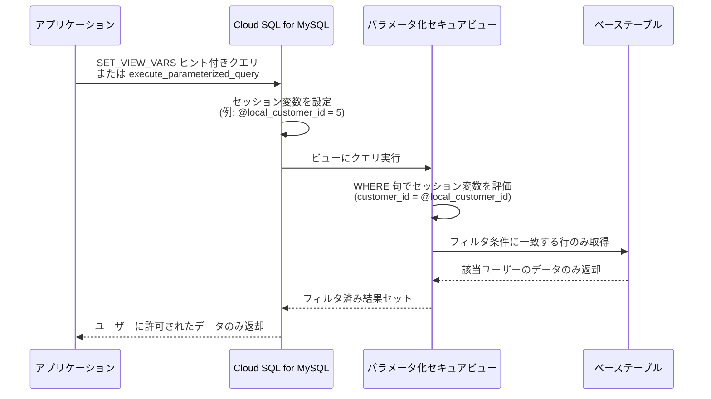

# Cloud SQL for MySQL: パラメータ化セキュアビュー

**リリース日**: 2026-07-13

**サービス**: Cloud SQL for MySQL

**機能**: パラメータ化セキュアビュー (Parameterized Secure Views)

**ステータス**: Preview

[このアップデートのインフォグラフィックを見る](https://takech9203.github.io/google-cloud-news-summary/20260713-cloud-sql-mysql-parameterized-secure-views.html)

## 概要

Cloud SQL for MySQL において、パラメータ化セキュアビュー (Parameterized Secure Views) が Preview として利用可能になりました。この機能は MySQL ビューの拡張であり、ビュー定義内でセッション変数を参照することで、ユーザーごとのデータアクセス制御を実現します。

パラメータ化セキュアビューを使用することで、異なるユーザーに対して個別の静的ビュー定義を作成する必要がなくなり、単一のビューで事前定義されたデータ範囲にわたる複数のクエリに柔軟に対応できます。特に、自然言語からSQL (NL2SQL) を使用するアプリケーションにおいて、プロンプトインジェクション攻撃やデータの意図しない漏洩を防ぐためのデータベースレベルのセキュリティ対策として有効です。

この機能を利用するには、Cloud SQL for MySQL 8.0.43 以降、かつメンテナンスバージョン R20260320.00_20 以降が必要です。

**アップデート前の課題**

- ユーザーごとに異なるデータアクセス範囲を設定するために、複数の静的ビューを個別に作成・管理する必要があった
- LLM が生成する SQL クエリがセキュリティ上意図しない範囲のデータを返す可能性があった
- エンドユーザーごとに個別のデータベースユーザーやロールを作成する必要があり、接続管理が複雑だった
- プロンプトインジェクション攻撃に対するデータベースレベルでの防御手段が限られていた

**アップデート後の改善**

- 単一のパラメータ化ビューで複数ユーザーのデータアクセスを柔軟に制御可能になった
- セッション変数を用いた行レベルセキュリティにより、ユーザーに対応するデータのみを返すことが保証される
- 単一のデータベースロールで全エンドユーザーに対応でき、ユーザー管理と接続管理が簡素化された
- クエリに対する自動的な制限が適用され、信頼されないクエリの実行リスクが軽減された

## アーキテクチャ図



この図は、アプリケーションがパラメータ化セキュアビューを通じてデータにアクセスする際のフローを示しています。セッション変数によってビューのフィルタ条件が動的に決定され、各ユーザーは自身に関連するデータのみを参照できます。

## サービスアップデートの詳細

### 主要機能

1. **セッション変数によるパラメータ化ビュー定義**
   - `CREATE VIEW` 文の `WHERE`、`ON`、`HAVING` 句でセッション変数 (`@variable_name`) を使用可能
   - 単一のビュー定義で複数のフィルタ条件をパラメータとして受け付け

2. **2つのクエリ実行方式**
   - `SET_VIEW_VARS` ヒントを使用した SELECT 文による直接クエリ
   - `mysql.execute_parameterized_query` ストアドプロシージャによるクエリ実行

3. **自動クエリ制限の適用**
   - パラメータ化セキュアビューに対するクエリは SELECT 文のみ許可
   - ユーザー定義関数やストアドプロシージャの呼び出しを禁止
   - 変数の代入を禁止
   - `execute_parameterized_query` 使用時は複数文の連結を禁止

4. **行レベルセキュリティの実現**
   - 悪意のある関数やオペレータがビューの処理完了前に行データにアクセスすることを防止
   - アプリケーションレベルの認証情報に基づく名前付きパラメータによるデータ制限

## 技術仕様

### バージョン要件

| 項目 | 要件 |
|------|------|
| MySQL バージョン | 8.0.43 以降 |
| メンテナンスバージョン | R20260320.00_20 以降 |
| データベースフラグ | `cloudsql_parameterized_secure_view` を有効化 |
| フラグ変更時の再起動 | 不要 |

### セッション変数の使用可能箇所

| 句 | 使用可否 |
|----|----------|
| WHERE | 可 |
| ON | 可 |
| HAVING | 可 |
| SELECT リスト | 不可 |
| その他 | 不可 |

## 設定方法

### 前提条件

1. Cloud SQL for MySQL インスタンスが MySQL 8.0.43 以降で稼働していること
2. メンテナンスバージョンが R20260320.00_20 以降であること

### 手順

#### ステップ 1: データベースフラグの有効化

`cloudsql_parameterized_secure_view` フラグをインスタンスに対して有効化します。このフラグ変更にはデータベースの再起動は不要です。

#### ステップ 2: パラメータ化セキュアビューの作成

```sql
-- WHERE 句でセッション変数を使用したビュー作成
CREATE VIEW v_orders AS
SELECT * FROM orders
WHERE customer_id = @local_customer_id
  AND year >= @earliest_year;
```

#### ステップ 3: ビューへのクエリ実行

方法 1: `SET_VIEW_VARS` ヒントを使用

```sql
SELECT /*+ SET_VIEW_VARS(local_customer_id=5, earliest_year=2021) */
  * FROM v_orders;
```

方法 2: `mysql.execute_parameterized_query` プロシージャを使用

```sql
CALL mysql.execute_parameterized_query(
  'SELECT * FROM db.v_orders',
  'local_customer_id = 5, earliest_year = 2021');
```

## メリット

### ビジネス面

- **ユーザー管理の簡素化**: 単一のデータベースロールで全エンドユーザーに対応でき、ユーザーごとの個別ロール作成が不要
- **NL2SQL アプリケーションのセキュリティ強化**: 自然言語クエリを利用するアプリケーションにおいて、データベースレベルでアクセス制御を実施し、意図しないデータ漏洩を防止

### 技術面

- **柔軟なアクセス制御**: 単一のビュー定義で複数のクエリパターンに対応し、静的ビューの乱立を回避
- **プロンプトインジェクション対策**: クエリ実行時の自動制限により、悪意あるクエリからデータを保護
- **運用負荷の軽減**: フラグ変更にデータベース再起動が不要であり、既存環境への導入が容易

## デメリット・制約事項

### 制限事項

- セッション変数は `WHERE`、`ON`、`HAVING` 句でのみ使用可能。SELECT リストなど他の箇所では使用不可
- パラメータ化セキュアビューに対して `EXPLAIN` は使用不可
- クエリは SELECT 文のみ許可され、ユーザー定義関数やストアドプロシージャの呼び出しは不可
- `execute_parameterized_query` 使用時は複数文の連結 (例: `SELECT * FROM a; DROP TABLE a;`) は不可
- Preview 機能のため、本番環境での利用は推奨されない。Pre-GA の利用規約が適用される

### 考慮すべき点

- MySQL 8.0.43 未満のバージョンでは利用不可。必要に応じてマイナーバージョンアップグレードが必要
- Preview 段階のため、サポートが限定的である可能性がある
- `SET_VIEW_VARS` ヒントで指定する変数は、ビューで参照されている全変数と一致する必要がある (過不足があるとエラー)

## ユースケース

### ユースケース 1: NL2SQL アプリケーションでのデータセキュリティ

**シナリオ**: ユーザーが自然言語で「自分の注文を見せて」と入力するアプリケーション。LLM が SQL に変換する際に意図しないデータ範囲のクエリが生成されるリスクがある。

**実装例**:
```sql
-- ビュー作成: customer_id でフィルタ
CREATE VIEW v_user_orders AS
SELECT order_id, order_date, status, total
FROM orders
WHERE customer_id = @local_customer_id;

-- アプリケーション側でユーザー認証情報に基づき変数を設定してクエリ
SELECT /*+ SET_VIEW_VARS(local_customer_id=12345) */
  * FROM v_user_orders;
```

**効果**: LLM がどのような SQL を生成しても、パラメータ化セキュアビューを経由する限り、認証されたユーザーに対応するデータのみが返却される。プロンプトインジェクション攻撃によるデータ漏洩リスクを軽減。

### ユースケース 2: マルチテナントアプリケーションでの行レベルアクセス制御

**シナリオ**: 複数の顧客がデータベースを共有するSaaSアプリケーションにおいて、各テナントが自身のデータのみにアクセスできるよう制御する。

**実装例**:
```sql
-- テナントごとのデータアクセスを制御するビュー
CREATE VIEW v_tenant_data AS
SELECT * FROM shared_table
WHERE tenant_id = @local_tenant_id;

-- テナント認証後にクエリ実行
CALL mysql.execute_parameterized_query(
  'SELECT * FROM app_db.v_tenant_data',
  'local_tenant_id = 42');
```

**効果**: 単一のデータベースロールで全テナントに対応でき、テナントごとの個別ユーザー作成が不要。接続プーリングの効率化にも寄与。

## 関連サービス・機能

- **Cloud SQL for MySQL**: パラメータ化セキュアビューのベースとなるマネージド MySQL サービス
- **Cloud SQL for PostgreSQL**: 同様のパラメータ化セキュアビュー機能が提供されている (PostgreSQL 版は `WITH (security_barrier)` 句と `$@variable_name` 構文を使用)
- **Vertex AI (NL2SQL)**: 自然言語から SQL を生成する AI 機能。パラメータ化セキュアビューと組み合わせることでセキュアな NL2SQL アプリケーションを構築可能

## 参考リンク

- [インフォグラフィック](https://takech9203.github.io/google-cloud-news-summary/20260713-cloud-sql-mysql-parameterized-secure-views.html)
- [公式リリースノート](https://docs.cloud.google.com/release-notes#July_13_2026)
- [パラメータ化セキュアビュー概要ドキュメント](https://docs.cloud.google.com/sql/docs/mysql/parameterized-secure-views)
- [パラメータ化セキュアビューの使用方法](https://docs.cloud.google.com/sql/docs/mysql/use-parameterized-secure-views)

## まとめ

Cloud SQL for MySQL のパラメータ化セキュアビューは、特に NL2SQL やアドホッククエリを許可するアプリケーションにおいて、データベースレベルでの行アクセス制御とセキュリティ強化を実現する重要な機能です。現在 Preview 段階のため本番環境での利用には注意が必要ですが、LLM を活用したアプリケーション開発において検証を開始することを推奨します。利用には MySQL 8.0.43 以降とメンテナンスバージョン R20260320.00_20 以降が必要です。

---

**タグ**: #CloudSQL #MySQL #Security #ParameterizedSecureViews #Preview #NL2SQL #RowLevelSecurity #DataAccess
