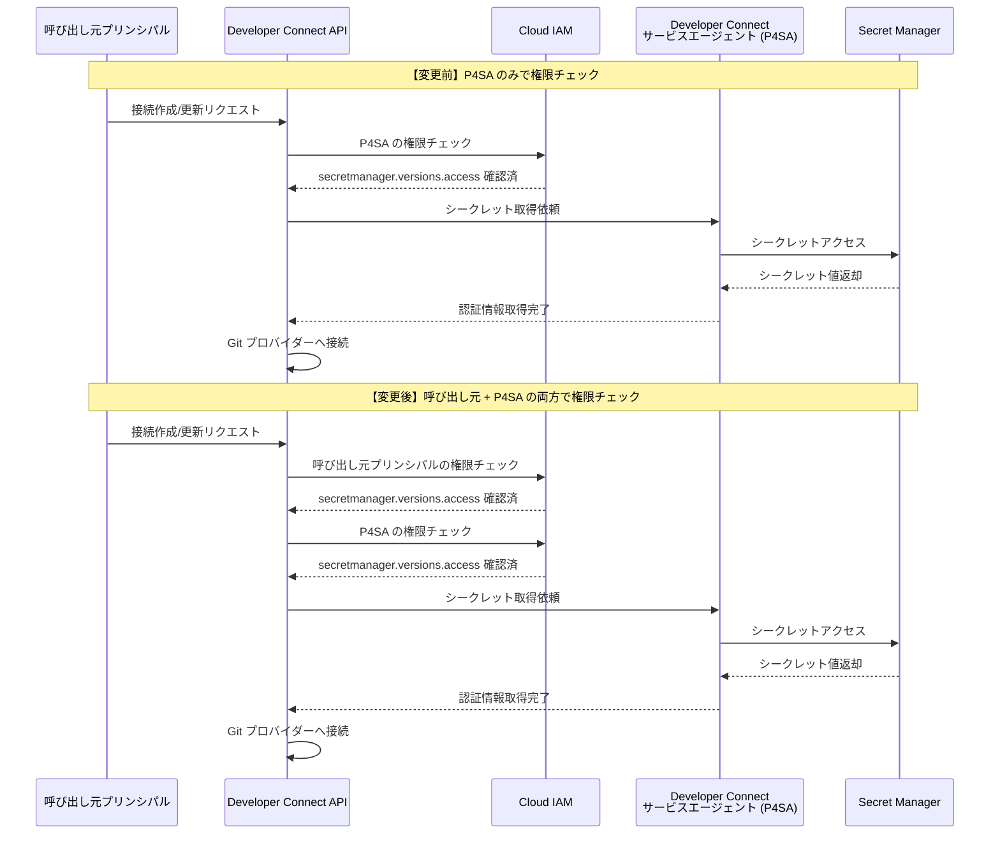

# Developer Connect: Secret Manager の呼び出し元プリンシパルに対する権限チェックの追加

**リリース日**: 2026-07-13

**サービス**: Developer Connect

**機能**: GitLab Enterprise および Bitbucket Data Center 接続における Secret Manager 権限チェックの強化

**ステータス**: セキュリティ強化

📊 [このアップデートのインフォグラフィックを見る](https://takech9203.github.io/google-cloud-news-summary/20260713-developer-connect-secret-manager-permissions.html)

## 概要

Developer Connect は、GitLab Enterprise (GLE) および Bitbucket Data Center (BBDC) 接続において、リポジトリ接続の作成・更新時に呼び出し元プリンシパル (calling principal) に対する Secret Manager の権限チェックを新たに実施するようになりました。これは最小権限の原則 (Principle of Least Privilege) に基づくセキュリティ強化です。

Developer Connect はサードパーティの Git プロバイダーへの認証に Secret Manager シークレットを使用します。従来、GitLab Enterprise および Bitbucket Data Center 接続では、参照されるシークレットは Developer Connect サービスエージェント (P4SA: `service-{projectNumber}@gcp-sa-devconnect.iam.gserviceaccount.com`) の資格情報のみで権限チェックが行われていました。これにより、接続管理権限を持つユーザーが、本来アクセスすべきでない Secret Manager のシークレットを間接的に読み取れる可能性がありました。

今回の変更により、Developer Connect は呼び出し元プリンシパル (エンドユーザーの資格情報) と P4SA の両方に対して `secretmanager.versions.access` IAM 権限を検証するようになりました。これにより、両方のプリンシパルがシークレットへのアクセス権を持っていることが保証されます。

**アップデート前の課題**

- P4SA の資格情報のみで権限チェックが行われていたため、呼び出し元ユーザーのシークレットアクセス権限が検証されなかった
- 接続管理権限 (`roles/developerconnect.admin`) を持つユーザーが、リポジトリ接続のホスト URI を攻撃者が制御するエンドポイントに向けることで、参照される Secret Manager シークレットを読み取れる可能性があった
- 最小権限の原則が完全には適用されていなかった

**アップデート後の改善**

- 呼び出し元プリンシパルと P4SA の両方に対して `secretmanager.versions.access` 権限が検証されるようになった
- シークレットへの不正アクセスのリスクが大幅に軽減された
- 最小権限の原則に沿ったセキュリティモデルが確立された

## アーキテクチャ図



上図は、変更前後の権限チェックフローの違いを示しています。変更後は、呼び出し元プリンシパルと P4SA の両方に対して `secretmanager.versions.access` 権限の検証が行われます。

## サービスアップデートの詳細

### 主要機能

1. **デュアル権限チェック (Dual Permission Check)**
   - 接続作成 (`connections.create`) 時に呼び出し元プリンシパルの `secretmanager.versions.access` 権限を検証
   - 接続更新 (`connections.update`) 時にも同様の権限チェックを実施
   - P4SA に対する既存の権限チェックは引き続き実施

2. **エンドユーザー資格情報による検証**
   - 呼び出し元のエンドユーザー資格情報 (end-user credentials) を使用して権限を確認
   - サービスアカウントキーやワークロードアイデンティティ連携による呼び出しにも適用

3. **対象範囲の限定**
   - GitLab Enterprise (GLE) 接続のみに適用
   - Bitbucket Data Center (BBDC) 接続のみに適用
   - GitHub、GitLab (SaaS)、Bitbucket Cloud 接続には影響なし

## 技術仕様

### 権限要件

| 項目 | 詳細 |
|------|------|
| 必要な IAM 権限 | `secretmanager.versions.access` |
| 推奨ロール | `roles/secretmanager.secretAccessor` (Secret Manager Secret Accessor) |
| チェック対象 | 呼び出し元プリンシパル + P4SA の両方 |
| 影響を受ける操作 | `connections.create`, `connections.update` |
| 影響を受ける接続タイプ | GitLab Enterprise (GLE), Bitbucket Data Center (BBDC) |
| P4SA 識別子 | `service-{PROJECT_NUMBER}@gcp-sa-devconnect.iam.gserviceaccount.com` |

### IAM ポリシー設定例

```json
{
  "bindings": [
    {
      "role": "roles/secretmanager.secretAccessor",
      "members": [
        "user:developer@example.com",
        "serviceAccount:service-123456789@gcp-sa-devconnect.iam.gserviceaccount.com"
      ]
    }
  ]
}
```

## 設定方法

### 前提条件

1. Google Cloud プロジェクトで Developer Connect API が有効化されていること
2. GitLab Enterprise または Bitbucket Data Center の接続が構成済み、または新規作成予定であること
3. Secret Manager に認証用シークレットが格納されていること

### 手順

#### ステップ 1: 呼び出し元プリンシパルにシークレットアクセス権限を付与

```bash
# 特定のシークレットに対して Secret Accessor ロールを付与
gcloud secrets add-iam-policy-binding SECRET_NAME \
    --member="user:DEVELOPER_EMAIL" \
    --role="roles/secretmanager.secretAccessor" \
    --project=PROJECT_ID
```

`SECRET_NAME` は Developer Connect 接続で使用するシークレットの名前、`DEVELOPER_EMAIL` は接続を作成・更新するユーザーのメールアドレスに置き換えてください。

#### ステップ 2: P4SA にもシークレットアクセス権限が付与されていることを確認

```bash
# Developer Connect サービスエージェントのシークレットアクセス権限を確認
gcloud secrets get-iam-policy SECRET_NAME \
    --project=PROJECT_ID \
    --format="table(bindings.role, bindings.members)"

# 必要に応じて P4SA に権限を付与
gcloud secrets add-iam-policy-binding SECRET_NAME \
    --member="serviceAccount:service-PROJECT_NUMBER@gcp-sa-devconnect.iam.gserviceaccount.com" \
    --role="roles/secretmanager.secretAccessor" \
    --project=PROJECT_ID
```

#### ステップ 3: 接続の作成または更新を実行

```bash
# GitLab Enterprise 接続の作成例
gcloud developer-connect connections create CONNECTION_NAME \
    --location=REGION \
    --gitlab-enterprise-config-host-uri="https://gitlab.example.com" \
    --gitlab-enterprise-config-read-authorizer-credential-secret-version="projects/PROJECT_ID/secrets/SECRET_NAME/versions/latest" \
    --gitlab-enterprise-config-authorizer-credential-secret-version="projects/PROJECT_ID/secrets/SECRET_NAME/versions/latest" \
    --project=PROJECT_ID
```

## メリット

### ビジネス面

- **コンプライアンス強化**: 最小権限の原則に基づくアクセス制御により、セキュリティ監査要件を満たしやすくなる
- **リスク軽減**: シークレットへの不正アクセスリスクが軽減され、データ漏洩の可能性が低下

### 技術面

- **多層防御 (Defense in Depth)**: 呼び出し元と P4SA の両方で権限チェックを行うことで、セキュリティレイヤーが追加される
- **最小権限の原則の徹底**: 接続管理権限だけではシークレットにアクセスできなくなり、明示的なシークレットアクセス権限が必要
- **透過的な適用**: 既存の接続には影響なく、新規作成・更新時のみチェックが実施される

## デメリット・制約事項

### 制限事項

- 対象は GitLab Enterprise (GLE) と Bitbucket Data Center (BBDC) 接続のみ。GitHub や GitLab SaaS、Bitbucket Cloud には適用されない
- 既存の接続を更新する際、これまで権限が不要だったユーザーに新たに `secretmanager.versions.access` 権限の付与が必要になる場合がある

### 考慮すべき点

- 接続の作成・更新で権限エラーが発生した場合は、呼び出し元プリンシパルに `roles/secretmanager.secretAccessor` ロールを付与する必要がある
- CI/CD パイプラインやオートメーションで接続を管理している場合、使用するサービスアカウントにもシークレットアクセス権限を付与する必要がある
- 組織ポリシーや VPC Service Controls との組み合わせにより、追加の設定が必要になる場合がある

## ユースケース

### ユースケース 1: エンタープライズ開発チームの GitLab Enterprise 接続管理

**シナリオ**: 大規模な開発組織で、複数のチームが GitLab Enterprise を使用しており、チームごとに異なるシークレットで接続を管理している場合。

**実装例**:
```bash
# チーム A のシークレットにチーム A のメンバーのみアクセス権を付与
gcloud secrets add-iam-policy-binding team-a-gitlab-token \
    --member="group:team-a@example.com" \
    --role="roles/secretmanager.secretAccessor" \
    --project=project-id

# チーム B は team-a-gitlab-token にはアクセスできない
# → チーム B が team-a の接続を更新しようとしても権限エラーになる
```

**効果**: チーム間のシークレット分離が確保され、あるチームのメンバーが他のチームの認証情報に間接的にアクセスすることを防止できる。

### ユースケース 2: セキュリティインシデント対応時のアクセス制御

**シナリオ**: セキュリティ監査で、Developer Connect の接続管理権限を持つユーザーが不必要に多くのシークレットにアクセスできることが発覚した場合。

**効果**: 今回の変更により、接続管理権限 (`developerconnect.admin`) とシークレットアクセス権限 (`secretmanager.secretAccessor`) が分離されるため、権限の棚卸しが容易になり、最小権限の原則に基づいたアクセス制御を実現できる。

## 関連サービス・機能

- **Secret Manager**: Developer Connect が Git プロバイダーへの認証に使用するシークレットを管理するサービス。`secretmanager.versions.access` 権限がチェック対象
- **Cloud IAM**: 権限チェックを行う基盤サービス。呼び出し元プリンシパルと P4SA の両方の権限を評価
- **Cloud Build**: 同様のセキュリティ強化 (GCP-2026-042) が適用されたサービス。Cloud Build でも GitLab Enterprise と Bitbucket Data Center 接続で同等の変更が実施済み
- **Developer Connect サービスエージェント (P4SA)**: `service-{PROJECT_NUMBER}@gcp-sa-devconnect.iam.gserviceaccount.com` として動作し、ユーザーに代わってリソースにアクセスするサービスアカウント

## 参考リンク

- 📊 [インフォグラフィック](https://takech9203.github.io/google-cloud-news-summary/20260713-developer-connect-secret-manager-permissions.html)
- [公式リリースノート](https://docs.cloud.google.com/release-notes#July_13_2026)
- [Developer Connect ドキュメント - アクセス制御](https://docs.cloud.google.com/developer-connect/docs/access-control)
- [Developer Connect - GitLab Enterprise 接続](https://docs.cloud.google.com/developer-connect/docs/connect-gitlab-enterprise)
- [Developer Connect - Bitbucket Data Center 接続](https://docs.cloud.google.com/developer-connect/docs/connect-bitbucket-dc)
- [Secret Manager - アクセス制御](https://docs.cloud.google.com/secret-manager/docs/access-control)
- [Cloud Build セキュリティ速報 GCP-2026-042](https://docs.cloud.google.com/build/docs/security-bulletins)

## まとめ

今回の Developer Connect のセキュリティ強化は、最小権限の原則に基づき、GitLab Enterprise および Bitbucket Data Center 接続における Secret Manager シークレットへのアクセスを呼び出し元プリンシパルレベルでも検証するものです。既存の接続には影響ありませんが、今後接続を新規作成または更新する際には、呼び出し元に `roles/secretmanager.secretAccessor` ロール (または `secretmanager.versions.access` 権限を含むカスタムロール) が付与されていることを確認してください。特に CI/CD パイプラインで接続管理を自動化している場合は、使用するサービスアカウントへの権限付与を忘れずに行うことを推奨します。

---

**タグ**: #DeveloperConnect #SecretManager #Security #IAM #GitLabEnterprise #BitbucketDataCenter #LeastPrivilege #AccessControl
