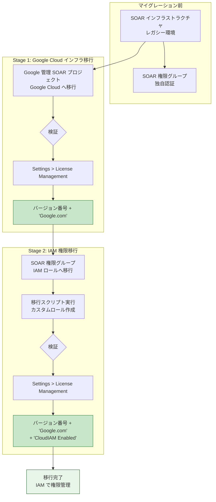

# Google SecOps: SOAR マイグレーション検証ステータス機能

**リリース日**: 2026-07-13

**サービス**: Google SecOps (Security Operations)

**機能**: SOAR migration to Google Cloud validation status

**ステータス**: GA (一般提供)

📊 [このアップデートのインフォグラフィックを見る](https://takech9203.github.io/google-cloud-news-summary/20260713-google-secops-soar-migration-validation.html)

## 概要

Google SecOps の SOAR (Security Orchestration, Automation, and Response) インフラストラクチャを Google Cloud へ移行するプロセスにおいて、移行の成功を検証するためのステータス表示機能が追加されました。管理者は SOAR Settings > License Management ページで、各ステージの完了状況を視覚的に確認できるようになります。

この機能により、2段階のマイグレーションプロセス (Stage 1: Google Cloud インフラへの移行、Stage 2: 権限の IAM ロールへの移行) の完了状況を、システムバージョン番号の後に表示されるインジケーターで即座に確認できます。Stage 1 完了後は「Google.com」、Stage 2 の権限移行完了後は「Google.com」と「CloudIAM Enabled」の両方が表示されます。

この検証機能は、Google SecOps 統合顧客および SOAR スタンドアロン顧客の両方を対象としており、移行プロセス全体の透明性と信頼性を向上させます。2026年9月30日の最終期限に向けて、管理者が移行の進捗を正確に把握し、必要なアクションを計画的に実施するための重要なツールとなります。

**アップデート前の課題**

移行ステータスの確認方法が限定的であり、管理者が移行完了を正確に把握することが困難でした。

- 移行が正常に完了したかどうかをプラットフォーム内で直接確認する手段がなかった
- Google からのメール通知に依存しており、リアルタイムでのステータス確認ができなかった
- Stage 1 と Stage 2 のどちらまで完了しているかを区別する明確な指標がなかった

**アップデート後の改善**

License Management ページで移行ステータスがインラインで表示されるようになりました。

- Stage 1 完了後、システムバージョン番号の後に「Google.com」が表示され、インフラ移行の成功を即座に確認可能
- Stage 2 の権限移行完了後、「Google.com」と「CloudIAM Enabled」の両方が表示され、IAM 統合の成功を確認可能
- 管理者が任意のタイミングで移行ステータスを自己確認でき、追加のサポート問い合わせが不要に

## アーキテクチャ図



この図は SOAR マイグレーションの 2 段階プロセスと、各ステージ完了時の検証チェックポイントを示しています。各ステージの完了は License Management ページのインジケーターで確認できます。

## サービスアップデートの詳細

### 主要機能

1. **Stage 1 検証インジケーター**
   - SOAR Settings > License Management ページでシステムバージョン番号の後に「Google.com」と表示
   - Google 管理の SOAR プロジェクトが Google Cloud インフラへ正常に移行されたことを示す
   - Stage 1 は Google が実施し、最大90分のダウンタイムを伴う

2. **Stage 2 検証インジケーター**
   - システムバージョン番号の後に「Google.com」と「CloudIAM Enabled」の両方を表示
   - SOAR 権限グループが Google Cloud IAM ロールへ正常に移行されたことを示す
   - IAM による集中的なアクセス制御が有効化されたことを確認

3. **セルフサービス検証**
   - 管理者がいつでも移行ステータスを確認可能
   - 追加ツールやサポートチケットなしで即座に検証
   - 移行の各ステージの進捗を明確に区別

## 技術仕様

### マイグレーションステージ詳細

| ステージ | 内容 | 検証表示 | 実施者 |
|----------|------|----------|--------|
| Stage 1 | SOAR プロジェクトを Google Cloud インフラへ移行 | 「Google.com」 | Google (自動) |
| Stage 1 (スタンドアロン) | SOAR 認証を Google Cloud へ移行 | 「Google.com」 | 顧客 |
| Stage 2 | 権限グループを IAM ロールへ移行 | 「Google.com」+「CloudIAM Enabled」 | 顧客 |
| Stage 2 | API を Chronicle API へ移行 | - | 顧客 |
| Stage 2 | Webhook を移行 | - | 顧客 |
| Stage 2 | リモートエージェントを移行 | - | 顧客 |
| Stage 2 | 監査ログを移行 | - | 顧客 |

### マイグレーション期限

| マイルストーン | 日付 |
|----------------|------|
| Stage 2 一般提供開始 | 2026年1月26日 |
| Stage 2 最終期限 | 2026年9月30日 |
| レガシー SOAR API 廃止 | 2026年9月30日 |
| siemplify-soar.com ドメイン廃止 | 2026年9月30日 |

### IAM ロール対応表

移行後に使用される主な IAM ロール:

| IAM ロール | タイトル | 説明 |
|------------|----------|------|
| roles/chronicle.admin | Chronicle API Admin | Google SecOps の全アクセス権 (SOAR Admin 権限含む) |
| roles/chronicle.editor | Chronicle API Editor | Google SecOps の編集アクセス権 |
| roles/chronicle.viewer | Chronicle API Viewer | Google SecOps の読み取り専用アクセス権 |
| roles/chronicle.limitedViewer | Chronicle API Limited Viewer | 制限付き読み取りアクセス権 |
| roles/chronicle.soarAdmin | Chronicle SOAR Admin | SOAR 設定と管理の完全な管理アクセス権 |

## 設定方法

### 前提条件

1. Google SecOps インスタンスへの管理者アクセス権
2. Stage 1 が完了していること (Stage 2 検証の場合)
3. Google Cloud コンソールと SOAR で同一の ID (メールアドレス) を使用していること

### 手順

#### ステップ 1: Stage 1 移行ステータスの確認

SOAR Settings > License Management ページに移動し、システムバージョン番号を確認します。

```
確認項目: システムバージョン番号の後に「Google.com」が表示されていること
例: v6.x.x.x Google.com
```

「Google.com」が表示されていれば、Stage 1 (Google Cloud インフラへの移行) が正常に完了しています。

#### ステップ 2: Stage 2 権限移行の実行

```bash
# Google Cloud コンソールで Google SecOps 管理設定に移動
# SOAR IAM Migration タブをクリック
# Migrate role bindings セクションから CLI コマンドをコピー

# Cloud Shell で移行スクリプトを実行
gcloud iam roles create SOAR_Custom_<permission_group> \
  --project="<YOUR_PROJECT_ID>" \
  --title="SOAR Custom <permission_group> Role" \
  --description="SOAR Custom role generated for IDP Mapping Group" \
  --stage=GA \
  --permissions=chronicle.cases.get,chronicle.cases.update,...
```

移行スクリプトは各権限グループに対してカスタム IAM ロールを作成し、ユーザーまたは IdP グループに割り当てます。

#### ステップ 3: Stage 2 移行ステータスの確認

```
確認項目: システムバージョン番号の後に「Google.com」と「CloudIAM Enabled」が表示されていること
例: v6.x.x.x Google.com CloudIAM Enabled
```

両方のインジケーターが表示されていれば、権限の IAM 移行が正常に完了しています。

## メリット

### ビジネス面

- **移行進捗の可視化**: 管理者が移行の各段階の完了を即座に確認でき、プロジェクト管理が容易に
- **サポート負荷の軽減**: セルフサービスで検証できるため、Google サポートへの問い合わせが削減
- **コンプライアンス対応**: 監査時に移行完了を証明するエビデンスとして利用可能

### 技術面

- **IAM 統合の確認**: Cloud IAM によるきめ細かいアクセス制御が有効化されたことを即座に検証
- **段階的移行のトラッキング**: 2段階の移行プロセスを明確に区別し、各ステージの完了を個別に確認
- **トラブルシューティングの効率化**: 移行に問題が発生した場合、どのステージで止まっているかを迅速に特定

## デメリット・制約事項

### 制限事項

- 検証インジケーターは権限の IAM 移行のみを反映し、API 移行やWebhook移行のステータスは含まれない
- Stage 2 の「CloudIAM Enabled」は権限移行スクリプト実行後にのみ表示され、他の Stage 2 タスク (API 移行、Webhook 移行等) の完了は反映しない
- IAM 有効化後にすべての Chronicle 定義済みロールが SOAR 権限付きでアクティベートされるため、意図しないアクセス拡大に注意が必要

### 考慮すべき点

- IAM 有効化後に問題が発生した場合は「Disable IAM」で権限グループに戻すことが可能だが、作成された IAM ロールとバインディングは削除されない
- 2026年9月30日の最終期限までに Stage 2 のすべてのタスクを完了する必要がある
- カスタム IAM ロールを使用する場合、SOAR 機能に必要なすべての権限が含まれていることを確認する必要がある

## ユースケース

### ユースケース 1: 移行完了の組織的な追跡

**シナリオ**: 大規模組織のセキュリティチームが、複数の Google SecOps インスタンスにわたる SOAR 移行の進捗を管理している。

**実装例**:
```
各インスタンスの管理者が以下を確認:
1. SOAR Settings > License Management に移動
2. バージョン番号の後のステータスを確認
   - "Google.com" のみ → Stage 1 完了、Stage 2 未着手
   - "Google.com CloudIAM Enabled" → Stage 2 権限移行完了
3. ステータスを組織の移行トラッキングシートに記録
```

**効果**: 複数インスタンスの移行状況を一元的に把握し、期限内に全インスタンスの移行を確実に完了

### ユースケース 2: 移行後のトラブルシューティング

**シナリオ**: Stage 2 の権限移行スクリプトを実行したが、一部ユーザーが 403 エラーでアクセスできない。

**実装例**:
```
1. SOAR Settings > License Management で "CloudIAM Enabled" を確認
   → 表示されていない場合: "Enable IAM" ボタンのクリックが完了していない
   → 表示されている場合: IAM ロールの権限不足が原因

2. IAM ロールの確認:
   - Google Cloud コンソール > IAM に移動
   - 対象ユーザーのロールを確認
   - カスタムロールに必要な SOAR 権限が含まれているか検証

3. 必要に応じて権限を追加:
   gcloud projects add-iam-policy-binding PROJECT_ID \
     --member="user:USER_EMAIL" \
     --role="roles/chronicle.editor"
```

**効果**: 検証インジケーターを起点にした体系的なトラブルシューティングにより、問題解決までの時間を短縮

## 料金

SOAR マイグレーション検証ステータス機能自体に追加料金は発生しません。Google SecOps の既存ライセンスに含まれる機能です。

### 料金への影響

| 項目 | 説明 |
|------|------|
| 検証機能 | 追加料金なし (既存ライセンスに含まれる) |
| IAM カスタムロール | Google Cloud IAM の標準料金 (追加料金なし) |
| Cloud Audit Logs | 移行後のログは Cloud Audit Logs として課金される場合あり |

## 利用可能リージョン

Google SecOps が利用可能なすべてのリージョンで検証ステータス機能が利用できます。Stage 1 移行後のインスタンスは Google Cloud インフラ上で動作し、Chronicle API のエンドポイントはリージョン別に提供されます (例: us-chronicle.googleapis.com, europe-chronicle.googleapis.com)。

## 関連サービス・機能

- **Google Cloud IAM**: 移行後の権限管理基盤。カスタムロールおよび定義済みロールによるきめ細かいアクセス制御を提供
- **Chronicle API**: Stage 2 で SOAR API の移行先となる統合 API。新しい v1 beta エンドポイントを提供
- **Cloud Audit Logs**: 移行後の SOAR 監査ログの出力先。Google Cloud の統合ログ管理で分析可能
- **Cloud Monitoring**: 移行後に利用可能になるモニタリング機能。SOAR インフラの可観測性を向上
- **Workforce Identity Federation**: 外部 IdP を使用する場合の認証統合基盤

## 参考リンク

- 📊 [インフォグラフィック](https://takech9203.github.io/google-cloud-news-summary/20260713-google-secops-soar-migration-validation.html)
- [公式リリースノート](https://docs.cloud.google.com/release-notes#July_13_2026)
- [SOAR マイグレーションガイド](https://docs.cloud.google.com/chronicle/docs/soar/admin-tasks/advanced/migrate-to-gcp)
- [SOAR 権限を IAM へ移行](https://docs.cloud.google.com/chronicle/docs/soar/admin-tasks/advanced/migrate-soar-permissions-iam)
- [移行前検証ガイド](https://docs.cloud.google.com/chronicle/docs/soar/admin-tasks/advanced/soar-pre-validation)
- [SOAR マイグレーション FAQ](https://docs.cloud.google.com/chronicle/docs/soar/admin-tasks/advanced/migrate-soar-faq)
- [Chronicle API エンドポイントへの移行](https://docs.cloud.google.com/chronicle/docs/soar/admin-tasks/advanced/api-migration-guide)

## まとめ

今回のアップデートにより、Google SecOps SOAR の Google Cloud への移行プロセスにおいて、管理者が移行ステータスをセルフサービスで確認できるようになりました。License Management ページでの「Google.com」および「CloudIAM Enabled」インジケーターにより、2段階の移行プロセスの各ステージの完了を即座に検証できます。2026年9月30日の最終期限に向けて、まだ移行が完了していない組織は早期に Stage 2 の計画を立て、権限移行スクリプトの実行と検証を実施することを推奨します。

---

**タグ**: #GoogleSecOps #SOAR #Migration #IAM #SecurityOperations #Chronicle #AccessControl #Validation
