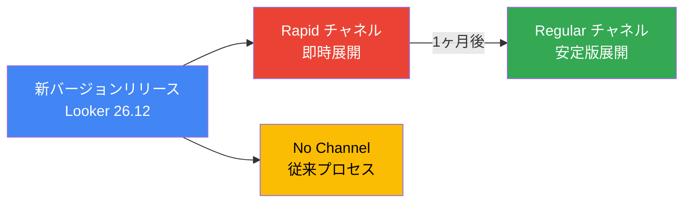

# Looker: バージョン 26.12 リリースチャネル展開開始

**リリース日**: 2026-07-13

**サービス**: Looker (Google Cloud core)

**機能**: Looker 26.12 リリースチャネル展開

**ステータス**: Deployment

📊 [このアップデートのインフォグラフィックを見る](https://takech9203.github.io/google-cloud-news-summary/20260713-looker-26-12-release.html)

## 概要

Looker (Google Cloud core) のリリースチャネルに最新バージョンの展開が開始されました。各チャネルの最新バージョンは以下の通りです:

- **Rapid チャネル**: Looker 26.12
- **Regular チャネル**: Looker 26.10
- **No Channel**: Looker 26.12

リリースチャネルは、Looker (Google Cloud core) インスタンスに新機能やアップデートが適用されるタイミングをより細かく制御するための仕組みです。組織のニーズに応じて、最新機能への早期アクセスと本番環境の運用安定性のバランスを取ることができます。

Looker のバージョン番号体系は X.Y.Z の3つの数字で構成されます。X はリリース年の下2桁、Y は月次バージョン（1月が0で始まり、以降偶数で増加）、Z はパッチリリースバージョンです。したがって、26.12 は 2026年7月のリリース、26.10 は 2026年6月のリリースに対応します。

## アーキテクチャ図



Looker のリリースチャネルモデルでは、Rapid チャネルが最初に新バージョンを受け取り、Regular チャネルはその1ヶ月後に同じバージョンを受け取ります。No Channel オプションは従来のリリースプロセスを維持します。

## サービスアップデートの詳細

### リリースチャネルの概要

1. **Rapid チャネル**
   - 新機能や改善への最速アクセスを提供
   - 非本番環境、ステージング、テストインスタンスに推奨
   - 毎月新しい Looker バージョンを受け取り、セキュリティアップデートは利用可能になり次第適用
   - メンテナンスウィンドウおよびメンテナンス拒否期間の設定不可
   - Looker (Google Cloud core) SLA の対象外

2. **Regular チャネル**
   - バランスの取れた安定性を提供し、月次ベースでアップデートを適用
   - 本番環境に推奨されるチャネル
   - Rapid チャネルの1ヶ月後に Looker バージョンを受信
   - メンテナンスウィンドウおよびメンテナンス拒否期間の設定が可能
   - 標準 SLA の対象
   - Accelerated Security Patching (ASP) フラグによる緊急セキュリティパッチの即時適用が可能

3. **No Channel オプション**
   - 従来の Looker (Google Cloud core) リリースプロセスを維持
   - リリースチャネルプレビュー期間中のデフォルト設定
   - 毎月新しいバージョンをバイナリおよびパッチロールアウトで受信
   - メンテナンスウィンドウおよびメンテナンス拒否期間の設定が可能
   - 標準 SLA の対象

### Looker 26.12 の主要な変更点

1. **FIPS 140-3 レベル1準拠のサポート (Google Cloud core のみ)**
   - Looker (Google Cloud core) が FIPS 140-3 レベル1準拠をサポート
   - 既存の FIPS 140-2 準拠インスタンスは 26.12 へのアップグレード時に自動的に FIPS 140-3 に移行

2. **Table Row Grouping (プレビュー)**
   - テーブルチャートのデータを階層的にグループ表示する機能
   - 新しいグループ化メニューオプションで外観をカスタマイズ可能
   - デフォルトで有効化

3. **KPI Visualization (プレビュー)**
   - KPI ビジュアライゼーションのプレビュー機能がデフォルトで有効化
   - スパークラインやバーチャートの追加、比較値の強化、スタイリングオプションの改善

4. **Increased Row Limit**
   - マップ、散布図、テーブルチャートの行制限を最大 50,000 行まで拡張可能

5. **バグ修正**
   - スケジュール済みコンテンツを含むフォルダアクセス時のクラッシュ修正
   - Advanced Control Governance (ACG) 有効時の Admin via IAM ロール権限修正
   - OIDC/SAML 認証管理ページのレイアウト修正
   - テーブルビジュアライゼーションの Reset Styles 動作修正
   - Workflows ページの表示権限修正
   - KPI ビジュアライゼーションの比較値表示修正

## 技術仕様

### リリースチャネル比較

| 項目 | Rapid | Regular | No Channel |
|------|-------|---------|------------|
| 主な用途 | 新機能への早期アクセス | 安定性とのバランス | 従来のリリースプロセス |
| 推奨環境 | 非本番/ステージング | 本番環境 | - |
| バージョンタイミング | 毎月 | Rapid の1ヶ月後 | 毎月 |
| メンテナンス拒否期間 | 設定不可 | 設定可能 | 設定可能 |
| メンテナンスウィンドウ | 設定不可 | 設定可能 | 設定可能 |
| SLA | 対象外 | 標準 SLA 対象 | 標準 SLA 対象 |
| ASP (緊急パッチ) | 不要 (即時適用) | オプションフラグで有効化可能 | 利用不可 |
| アップグレード通知 | パッチごとに72時間前 | 月次ロールアウトの72時間前 | パッチごとに72時間前 |

### 現在のチャネル別バージョン

| チャネル | 現在のバージョン | リリース月 |
|---------|----------------|-----------|
| Rapid | 26.12 | 2026年7月 |
| Regular | 26.10 | 2026年6月 |
| No Channel | 26.12 | 2026年7月 |

## 設定方法

### 前提条件

1. Looker (Google Cloud core) インスタンスが存在すること
2. インスタンスの管理権限があること

### 手順

#### ステップ 1: リリースチャネルの確認

```bash
gcloud looker instances describe INSTANCE_NAME \
  --region=REGION \
  --format config
```

このコマンドで RELEASE_CHANNEL フィールドと VERSION フィールドが返されます。

#### ステップ 2: リリースチャネルの変更

Google Cloud コンソールからインスタンスの設定を編集するか、gcloud CLI の `--release-channel=` フラグを使用してチャネルを変更できます。

#### ステップ 3: ASP の有効化 (Regular チャネルのみ)

```bash
gcloud looker instances update INSTANCE_NAME \
  --region=REGION \
  --accelerated-security-patch-enabled
```

## メリット

### ビジネス面

- **リスク軽減**: Rapid チャネルでテスト環境での事前検証を行い、Regular チャネルで本番環境に安定版を適用することで、本番障害リスクを低減
- **予測可能なアップデート管理**: Regular チャネルのメンテナンスウィンドウにより、ビジネスに影響の少ない時間帯にアップデートを計画可能

### 技術面

- **セキュリティの強化**: ASP フラグにより重要なセキュリティパッチを即時適用可能
- **段階的なバージョン検証**: Rapid チャネルで1ヶ月先行してバージョンを検証し、カスタム LookML や統合機能の互換性を確認可能

## デメリット・制約事項

### 制限事項

- リリースチャネル機能はプレビュー段階であり、「Pre-GA Offerings Terms」が適用される
- Rapid チャネルのバージョンは Looker (Google Cloud core) SLA の対象外
- Rapid チャネルではメンテナンスウィンドウとメンテナンス拒否期間を設定できない

### 考慮すべき点

- Rapid チャネルから Regular チャネルへの切り替え時、最大2ヶ月の遅延が発生する可能性がある
- Regular チャネルへの登録時、現在のバージョンから Regular の月次ケイデンスに揃えるまで一時的な遅延が発生する

## ユースケース

### ユースケース 1: 開発/本番環境の段階的アップデート

**シナリオ**: 企業が開発環境と本番環境の Looker インスタンスを持ち、新バージョンを事前検証してから本番に適用したい場合

**実装例**:
- 開発環境インスタンス: Rapid チャネルに設定
- 本番環境インスタンス: Regular チャネルに設定

**効果**: 開発環境で1ヶ月間新バージョンを検証した後、同じバージョンが自動的に本番環境に適用される。カスタム LookML やワークフローの互換性を事前に確認可能。

### ユースケース 2: セキュリティ重視の本番環境

**シナリオ**: 金融機関や医療機関など、セキュリティパッチの即時適用が求められるが、機能アップデートは安定性を重視したい場合

**実装例**:
- Regular チャネル + ASP (Accelerated Security Patching) フラグを有効化

**効果**: 通常の機能アップデートは予測可能な月次ケイデンスで適用されつつ、重要なセキュリティ修正は利用可能になり次第即座に適用される。

## 関連サービス・機能

- **Looker (original)**: Looker 26.12 は 2026年7月12日から Looker (original) インスタンスへの展開も開始
- **Looker Studio**: Google Cloud の別の BI ツールだが、リリースチャネルモデルは Looker (Google Cloud core) 固有の機能
- **Google Cloud コンソール**: リリースチャネルの設定と管理に使用

## 参考リンク

- 📊 [インフォグラフィック](https://takech9203.github.io/google-cloud-news-summary/20260713-looker-26-12-release.html)
- [公式リリースノート](https://docs.cloud.google.com/release-notes#July_13_2026)
- [リリースチャネルのドキュメント](https://docs.cloud.google.com/looker/docs/looker-core-release-process#release_channels)
- [Looker 26.12 リリースノート](https://docs.cloud.google.com/looker/docs/release-notes)

## まとめ

Looker (Google Cloud core) のリリースチャネルに Looker 26.12 の展開が開始されました。リリースチャネルモデルを活用することで、組織は開発環境での早期検証と本番環境の安定性を両立できます。Looker 26.12 では FIPS 140-3 準拠、Table Row Grouping、KPI Visualization の強化など、重要な新機能とバグ修正が含まれています。リリースチャネルがプレビュー段階であることを踏まえ、本番環境では Regular チャネルの利用を推奨します。

---

**タグ**: #Looker #GoogleCloud #ReleaseChannel #BI #DataAnalytics #バージョンアップデート
