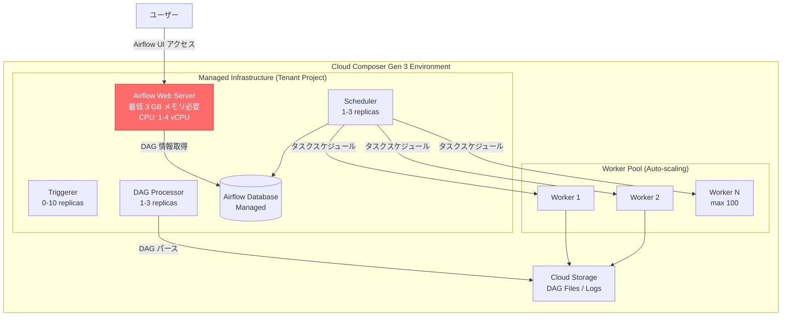

# Cloud Composer (Managed Airflow): Web Server Memory Requirement Issue in Gen 3

**リリース日**: 2026-07-13

**サービス**: Cloud Composer (Managed Service for Apache Airflow)

**機能**: Web Server メモリ要件の既知の問題 (Gen 3)

**ステータス**: Known Issue

📊 [このアップデートのインフォグラフィックを見る](https://takech9203.github.io/google-cloud-news-summary/20260713-managed-airflow-web-server-memory.html)

## 概要

Managed Airflow (Gen 3) の Airflow 2.11.1 ビルド (composer-3-airflow-2.11.1-build.7 以降) において、Airflow Web サーバーが最低 3 GB のメモリを必要とする既知の問題が確認されました。Small 環境プリセットのデフォルトメモリは 4 GB であるため、デフォルト設定では問題は発生しませんが、Web サーバーのメモリを 3 GB 未満にカスタマイズしている環境では、断続的な Out-of-Memory (OOM) 問題が発生する可能性があります。

この問題は、Airflow 2.11.1 のビルド 7 以降で導入された変更により、Web サーバーのメモリ消費量が増加したことに起因します。Cloud Composer Gen 3 では Web サーバーの最小メモリは 2 GB に設定されていますが、該当ビルドではその最小値では不十分となっています。影響を受けるユーザーは、Web サーバーのメモリを 3 GB 以上に増加させることで問題を解決できます。

**アップデート前の課題**

- Web サーバーのメモリを 2 GB (Gen 3 の最小値) に設定している環境で断続的な OOM が発生する
- OOM 発生時に Airflow UI が一時的に利用不可になり、DAG の監視・管理に支障が出る
- 問題の根本原因が明確でなく、ユーザーが対処方法を把握できない

**アップデート後の改善**

- 既知の問題として公式に文書化され、対処方法が明確になった
- Web サーバーメモリを 3 GB 以上に設定することで OOM を回避可能
- Small プリセット (デフォルト 4 GB) を使用している場合は影響なし

## アーキテクチャ図



Managed Airflow Gen 3 のアーキテクチャでは、Web サーバーはテナントプロジェクト内のマネージドインフラストラクチャで稼働します。赤色で示された Web サーバーが今回の問題の影響を受けるコンポーネントです。

## サービスアップデートの詳細

### 主要情報

1. **影響を受けるビルド**
   - composer-3-airflow-2.11.1-build.7 以降のすべてのビルド
   - Airflow バージョン: 2.11.1
   - Cloud Composer バージョン: Gen 3 (composer-3)

2. **問題の症状**
   - Airflow Web サーバーが断続的に OOM (Out-of-Memory) でクラッシュする
   - Airflow UI が一時的に応答不能になる
   - 環境のヘルスチェックで Web サーバーが unhealthy と報告される

3. **影響範囲**
   - Web サーバーのメモリが 3 GB 未満に設定されている環境のみ影響
   - Small プリセットのデフォルト (4 GB) を使用している場合は影響なし
   - カスタムでメモリを 2 GB や 2.5 GB に減らしている環境が対象

### 過去の類似問題

この問題は、Cloud Composer 3 で過去に報告された Web サーバーのリソース要件問題と類似しています:

- 2025年4月: Web サーバーが環境作成・更新時に最低 2 GB のメモリを必要とする問題
- 2025年4月: Web サーバーが初期化完了に最低 1 CPU を必要とする問題

## 技術仕様

### Web サーバーのリソース制限 (Gen 3)

| 項目 | 最小値 | 最大値 | ステップ | 推奨値 (本問題対応) |
|------|--------|--------|----------|---------------------|
| CPU | 1 vCPU | 4 vCPU | 0.5, 1, or 2の倍数 | 1 vCPU 以上 |
| メモリ | 2 GB | 32 GB | 0.25 GB | 3 GB 以上 |
| ストレージ | 0 GB | 100 GB | 1 GB | - |
| メモリ/CPU 比率 | 1 GB/vCPU | 8 GB/vCPU | - | - |

### 環境プリセット別のデフォルト設定

| プリセット | 対象 DAG 数 | 最大同時 DAG 実行 | 最大同時タスク | Web サーバーメモリ (デフォルト) |
|-----------|-------------|-------------------|----------------|-------------------------------|
| Small | 50 | 15 | 18 | 4 GB |
| Medium | 250 | 60 | 100 | 4 GB 以上 |
| Large | 1000 | 250 | 400 | 4 GB 以上 |
| Extra Large | 3000 | 750 | 2250 | 4 GB 以上 |

### WorkloadsConfig (API)

```json
{
  "config": {
    "workloadsConfig": {
      "webServer": {
        "cpu": 1,
        "memoryGb": 3,
        "storageGb": 1
      }
    }
  }
}
```

## 設定方法

### 前提条件

1. Cloud Composer Gen 3 環境が既に作成されていること
2. 該当ビルド (composer-3-airflow-2.11.1-build.7 以降) を使用していること
3. `composer.environments.update` 権限を持つ IAM ロール (composer.admin など)

### 手順

#### ステップ 1: 現在の Web サーバーメモリ設定を確認

```bash
gcloud composer environments describe ENVIRONMENT_NAME \
  --location LOCATION \
  --format="value(config.workloadsConfig.webServer.memoryGb)"
```

出力値が 3 未満の場合、以下のステップでメモリを増加させます。

#### ステップ 2: Web サーバーメモリを 3 GB 以上に増加

```bash
gcloud composer environments update ENVIRONMENT_NAME \
  --location LOCATION \
  --web-server-memory 3
```

このコマンドにより、Web サーバーのメモリが 3 GB に設定されます。Web サーバーの再起動が発生するため、一時的に Airflow UI が利用不可になります。

#### ステップ 3: 環境のヘルスステータスを確認

```bash
gcloud composer environments describe ENVIRONMENT_NAME \
  --location LOCATION \
  --format="value(state)"
```

状態が `RUNNING` に戻ることを確認します。

### Terraform での設定

```hcl
resource "google_composer_environment" "example" {
  name   = "example-environment"
  region = "us-central1"

  config {
    workloads_config {
      web_server {
        cpu        = 1
        memory_gb  = 3
        storage_gb = 1
      }
    }
  }
}
```

## メリット

### ビジネス面

- **安定した DAG 監視**: Web サーバーの OOM を解消することで、Airflow UI を通じた DAG の監視・管理が安定する
- **運用コストの削減**: 断続的な障害対応にかかる工数を削減できる

### 技術面

- **簡単な対処**: メモリ設定を変更するだけで問題を解決可能
- **ダウンタイムの最小化**: Web サーバー再起動のみで対応完了 (ワーカーやスケジューラーへの影響なし)
- **モニタリング活用**: `composer.googleapis.com/environment/web_server/memory/bytes_used` メトリクスで事前検知可能

## デメリット・制約事項

### 制限事項

- Web サーバーメモリを 3 GB 未満に設定するユースケース (コスト最適化目的) が制限される
- Web サーバーメモリの変更時に一時的な UI ダウンタイムが発生する
- 該当ビルドにおける根本的な修正ではなく、ワークアラウンドである

### 考慮すべき点

- メモリ増加に伴うコスト増加 (2 GB から 3 GB への変更で約 1 GB 分の追加コスト)
- Small プリセットのデフォルト (4 GB) を使用している場合は対応不要
- 今後のビルドで根本修正が行われる可能性があるため、リリースノートを継続的に確認すること
- Web サーバーのメモリ/CPU 比率の制約 (1-8 GB/vCPU) を超えないよう注意

## ユースケース

### ユースケース 1: コスト最適化で Web サーバーメモリを削減していた環境

**シナリオ**: 開発・テスト環境のコスト削減のため、Web サーバーのメモリを最小値の 2 GB に設定していた。Airflow 2.11.1 へのアップグレード後、断続的に UI が応答しなくなった。

**実装例**:
```bash
# 現在の設定確認
gcloud composer environments describe dev-environment \
  --location us-central1 \
  --format="value(config.workloadsConfig.webServer)"

# メモリを 3 GB に増加
gcloud composer environments update dev-environment \
  --location us-central1 \
  --web-server-memory 3
```

**効果**: Web サーバーの OOM が解消され、Airflow UI が安定稼働する。追加コストは 1 GB 分のメモリのみ。

### ユースケース 2: 新規環境作成時のプリセット選択

**シナリオ**: 新しい Cloud Composer Gen 3 環境を composer-3-airflow-2.11.1-build.7 以降で作成する際、Web サーバーのメモリを適切に設定する。

**効果**: Small 以上のプリセットを選択するか、カスタム設定の場合は Web サーバーメモリを 3 GB 以上に設定することで、初期段階から OOM を回避できる。

## 料金

Cloud Composer Gen 3 の料金は、コンピューティングリソースの使用量に基づきます。Web サーバーのメモリ増加は以下のコスト影響があります。

### コスト影響の目安

| 設定変更 | 追加メモリ | 月額追加コスト (概算) |
|----------|-----------|----------------------|
| 2 GB → 3 GB | +1 GB | Cloud Composer コンピュートの従量課金に準拠 |
| 2.5 GB → 3 GB | +0.5 GB | Cloud Composer コンピュートの従量課金に準拠 |
| 4 GB (デフォルト) | 変更なし | 追加コストなし |

詳細な料金については [Cloud Composer の料金ページ](https://cloud.google.com/composer/pricing) を参照してください。

## 関連サービス・機能

- **Cloud Monitoring**: Web サーバーのメモリ使用量メトリクス (`composer.googleapis.com/environment/web_server/memory/bytes_used`) で問題を検知可能
- **Cloud Composer 環境スケーリング**: Web サーバーの CPU・メモリ・ストレージの動的な調整機能
- **Cloud Composer 環境プリセット**: Small / Medium / Large / Extra Large の事前構成テンプレート
- **Cloud Composer Highly Resilient Mode**: 高可用性環境の構成 (本問題とは直接関係ないが、安定運用の観点で関連)

## 参考リンク

- 📊 [インフォグラフィック](https://takech9203.github.io/google-cloud-news-summary/20260713-managed-airflow-web-server-memory.html)
- [公式リリースノート](https://docs.cloud.google.com/release-notes#July_13_2026)
- [Cloud Composer 環境のスケーリング (Gen 3)](https://docs.cloud.google.com/composer/docs/composer-3/scale-environments)
- [Cloud Composer 環境の最適化](https://docs.cloud.google.com/composer/docs/composer-3/optimize-environments)
- [Cloud Composer 料金](https://cloud.google.com/composer/pricing)
- [Cloud Composer バージョニング概要](https://docs.cloud.google.com/composer/docs/composer-versioning-overview)

## まとめ

Managed Airflow Gen 3 の Airflow 2.11.1 (build.7 以降) では、Web サーバーが最低 3 GB のメモリを必要とする既知の問題が確認されています。Small プリセットのデフォルト設定 (4 GB) を使用している場合は影響ありませんが、コスト最適化のためにメモリを削減していた環境では対応が必要です。影響を受ける場合は、`gcloud composer environments update` コマンドで Web サーバーメモリを 3 GB 以上に設定してください。

---

**タグ**: #CloudComposer #ManagedAirflow #Gen3 #KnownIssue #WebServer #OOM #Memory #Airflow2.11.1 #Scaling #WorkloadConfiguration
