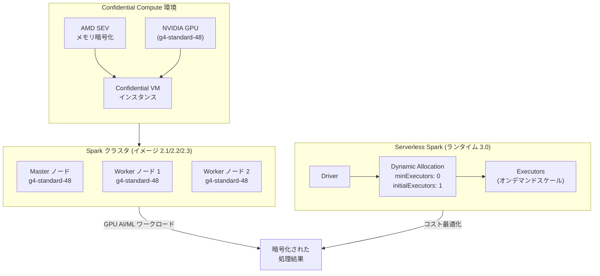

# Managed Service for Apache Spark: Confidential Compute GPU 対応とランタイム 3.0 Executor デフォルト変更

**リリース日**: 2026-07-13

**サービス**: Managed Service for Apache Spark

**機能**: Confidential Compute (g4-standard-48 GPU) 対応 / ランタイム 3.0 Executor デフォルト最適化

**ステータス**: Feature / Change

:bar_chart: [このアップデートのインフォグラフィックを見る](https://takech9203.github.io/google-cloud-news-summary/20260713-managed-spark-confidential-compute-runtime.html)

## 概要

Managed Service for Apache Spark (旧 Dataproc on Compute Engine) のクラスタイメージバージョン 2.1、2.2、2.3 において、g4-standard-48 GPU マシンタイプでの Confidential Compute がサポートされた。これにより、GPU ワークロードにおいてもインラインメモリ暗号化による機密データ保護が可能になり、規制産業や機密性の高い ML/AI ワークロードをよりセキュアに実行できるようになった。

同時に、Managed Service for Apache Spark (旧 Google Cloud Serverless for Apache Spark) のランタイム 3.0 において、Executor のデフォルト設定が変更され、初期割り当て数が大幅に削減された。これはコスト最適化を目的とした変更であり、真に必要なリソースのみを段階的にスケールアップする設計思想に基づいている。

さらに、全ランタイムバージョンにおいて `spark.scheduler.listenerbus.exitTimeout` が 30 秒に設定され、ジョブ終了時のイベントバス処理のタイムアウト制御が改善された。

**アップデート前の課題**

- Confidential Compute は GPU を搭載したマシンタイプでの対応が限定的で、g4-standard-48 は Spark クラスタで利用できなかった
- ランタイム 3.0 では初期 Executor 数が 2 に設定されており、小規模ジョブでもリソースが余剰に確保されていた
- `spark.scheduler.listenerbus.exitTimeout` が明示的に設定されておらず、ジョブ終了時にイベントバスの処理完了を長時間待つケースがあった

**アップデート後の改善**

- g4-standard-48 GPU マシンタイプで AMD SEV ベースの Confidential Compute が利用可能になり、GPU AI/ML ワークロードのセキュリティが強化された
- ランタイム 3.0 の初期 Executor 数が 1 に削減され、最小 Executor 数が 0 になったことで、完全なスケールトゥゼロが実現し、コスト効率が向上した
- listenerbus のタイムアウトが 30 秒に明示設定されたことで、ジョブ終了処理が安定し、不要なリソース保持が回避されるようになった

## アーキテクチャ図



クラスタデプロイメントでは Confidential Compute により GPU メモリを含むメモリ全体が暗号化される。サーバーレスデプロイメントではランタイム 3.0 の新デフォルトにより、真に必要なリソースのみが割り当てられる。

## サービスアップデートの詳細

### 主要機能

1. **Confidential Compute for g4-standard-48 GPU**
   - クラスタイメージバージョン 2.1、2.2、2.3 で利用可能
   - AMD SEV (Secure Encrypted Virtualization) テクノロジーを使用
   - AMD EPYC Turin プロセッサ搭載
   - Master ノードと Worker ノードの両方で g4-standard-48 を指定する必要がある
   - Ubuntu イメージ (サポートされる Ubuntu イメージ) の使用が必須

2. **ランタイム 3.0 Executor デフォルト変更**
   - `spark.dynamicAllocation.minExecutors`: 2 から 0 に変更
   - `spark.executor.instances`: 2 から 1 に変更
   - `spark.dynamicAllocation.initialExecutors`: 2 から 1 に変更
   - Dynamic Allocation による完全なスケールトゥゼロが可能に

3. **listenerbus exitTimeout の標準化**
   - 全ランタイムで `spark.scheduler.listenerbus.exitTimeout` を 30 秒に設定
   - ジョブ終了時のイベントバス処理タイムアウトが明確化
   - 異常なジョブ終了時のリソース解放が改善

## 技術仕様

### Confidential Compute 対応構成

| 項目 | 詳細 |
|------|------|
| マシンタイプ | g4-standard-48 |
| CPU プラットフォーム | AMD EPYC Turin |
| Confidential Computing テクノロジー | AMD SEV |
| 対応クラスタイメージ | 2.1, 2.2, 2.3 |
| GPU サポート | あり |
| ライブマイグレーション | 非対応 |
| プロビジョニングモデル | Standard (On-demand) / Spot |

### ランタイム 3.0 Executor プロパティ変更

| プロパティ | 変更前 (デフォルト) | 変更後 (新デフォルト) |
|-----------|-------------------|---------------------|
| `spark.dynamicAllocation.minExecutors` | 2 | 0 |
| `spark.executor.instances` | 2 | 1 |
| `spark.dynamicAllocation.initialExecutors` | 2 | 1 |
| `spark.scheduler.listenerbus.exitTimeout` | (未設定) | 30s |

### Confidential Compute の技術要件

```json
{
  "confidentialInstanceConfig": {
    "confidentialInstanceType": "SEV"
  },
  "machineType": "g4-standard-48",
  "scheduling": {
    "onHostMaintenance": "TERMINATE",
    "automaticRestart": true
  }
}
```

## 設定方法

### 前提条件

1. Confidential Compute 対応ゾーンで AMD EPYC Turin をサポートしていること
2. クラスタイメージバージョン 2.1、2.2、または 2.3 を使用すること
3. サポートされる Ubuntu イメージを使用すること

### 手順

#### ステップ 1: Confidential Compute 有効なクラスタの作成

```bash
gcloud dataproc clusters create CLUSTER_NAME \
    --confidential-compute-type=SEV \
    --image-version=2.3-ubuntu22 \
    --zone=ZONE \
    --master-machine-type=g4-standard-48 \
    --worker-machine-type=g4-standard-48 \
    --num-workers=2
```

Master と Worker の両方で g4-standard-48 を指定する。

#### ステップ 2: ランタイム 3.0 の Executor 設定のカスタマイズ (必要な場合)

```bash
gcloud dataproc batches submit spark \
    --runtime-version=3.0 \
    --properties="spark.dynamicAllocation.minExecutors=2,spark.dynamicAllocation.initialExecutors=4" \
    --class=com.example.MySparkJob \
    --jars=gs://my-bucket/my-job.jar
```

新デフォルトが不十分な場合、明示的にプロパティを上書きできる。

## メリット

### ビジネス面

- **規制対応の強化**: 金融、医療、政府機関などの規制産業において、GPU ベースの AI/ML ワークロードでデータ保護要件を満たせる
- **コスト削減**: ランタイム 3.0 の新デフォルトにより、小規模ジョブや間欠的なワークロードで不要なリソース消費が削減される
- **運用リスクの軽減**: listenerbus タイムアウトの明示化により、ジョブ終了処理の予測可能性が向上

### 技術面

- **インラインメモリ暗号化**: AMD SEV により、ハイパーバイザからもデータが保護されるハードウェアレベルのセキュリティ
- **スケールトゥゼロ**: minExecutors=0 により、アイドル時にはリソースを完全に解放可能
- **高速スタートアップ**: initialExecutors=1 により、ジョブ開始時のリソース取得が高速化し、obtainability が向上

## デメリット・制約事項

### 制限事項

- Confidential Compute はライブマイグレーションを**サポートしない**ため、ホストメンテナンス時にインスタンスが終了する
- g4-standard-48 の Confidential Compute は現在 **Preview** ステージ
- Confidential Compute 対応ゾーンが限定されており、すべてのリージョンで利用できるわけではない
- GPU ファームウェアのフラッシュは禁止 (システム不安定化のリスク)

### 考慮すべき点

- **既存ワークロードへの影響**: ランタイム 3.0 を使用中のワークロードで、initialExecutors=2 を前提としていた場合、スタートアップ時の並列度が低下する可能性がある
- **パフォーマンスプロファイルとの相互作用**: `spark.dynamicAllocation.profile=performance` を設定している場合、そのプロファイルの initialExecutors=10 が優先される
- **コスト影響の試算**: Executor 数削減はコスト削減につながるが、Dynamic Allocation のスケールアップ速度に依存するため、レイテンシに影響する可能性がある
- **listenerbus タイムアウト**: 30 秒のタイムアウトは大量のイベントを生成するジョブで不十分な場合がある

## ユースケース

### ユースケース 1: 医療画像の機密 AI 推論

**シナリオ**: 医療機関が患者の画像データを GPU を使用して AI 推論する場合、データのプライバシー保護が法規制で求められる。

**実装例**:
```bash
gcloud dataproc clusters create medical-ai-cluster \
    --confidential-compute-type=SEV \
    --image-version=2.3-ubuntu22 \
    --zone=us-central1-a \
    --master-machine-type=g4-standard-48 \
    --worker-machine-type=g4-standard-48 \
    --num-workers=4 \
    --properties="spark.executor.resource.gpu.amount=1"
```

**効果**: GPU メモリを含むすべてのメモリがハードウェアレベルで暗号化され、HIPAA 準拠のデータ処理が実現する。

### ユースケース 2: コスト最適化されたバッチ ETL パイプライン

**シナリオ**: 日次 ETL パイプラインで、データ量に応じてリソース使用量が大きく変動する場合。

**実装例**:
```bash
gcloud dataproc batches submit spark \
    --runtime-version=3.0 \
    --properties="spark.dynamicAllocation.maxExecutors=100" \
    --class=com.example.DailyETL \
    --jars=gs://my-bucket/etl.jar
```

**効果**: 最小 0 Executor からスタートし、実際のデータ量に応じて自動スケールするため、小データの日は最小コストで完了し、大データの日は最大 100 Executor までスケールアウトする。

## 料金

Managed Service for Apache Spark の料金はデプロイメントモデルにより異なる。

### 料金例

| デプロイメント | 課金単位 | 料金 |
|--------------|---------|------|
| Serverless (Standard) | DCU 時間 | $0.06/DCU 時間から |
| Serverless (Premium) | DCU 時間 | $0.089/DCU 時間から |
| クラスタ (管理費) | vCPU 時間 | $0.01/vCPU 時間から |
| Lightning Engine アドオン | vCPU 時間 | $0.0025/vCPU 時間から |

Confidential Compute 有効クラスタの場合、基盤の Compute Engine リソース費用に加えて管理費が課金される。g4-standard-48 インスタンスは GPU 搭載のため、通常の Compute Engine GPU 料金が適用される。

ランタイム 3.0 の新デフォルトにより、アイドル時のコストが削減される (minExecutors=0 によりスケールトゥゼロ)。

## 利用可能リージョン

Confidential Compute (g4-standard-48, AMD SEV) は AMD EPYC Turin をサポートするゾーンで利用可能。利用可能なゾーンは以下のコマンドで確認できる:

```bash
gcloud compute zones describe ZONE --format="value(availableCpuPlatforms)"
```

サーバーレスランタイム 3.0 はすべての Managed Service for Apache Spark 対応リージョンで利用可能。ランタイム 3.0 ではリージョン内のマルチゾーンへのノード配置がデフォルトで有効になり、リソースの obtainability が向上している。

## 関連サービス・機能

- **Confidential Computing**: Google Cloud のハードウェアベースのメモリ暗号化プラットフォーム。AMD SEV、AMD SEV-SNP、Intel TDX をサポート
- **Compute Engine GPU**: g4-standard-48 は NVIDIA RTX 6000 GPU を搭載した GPU 最適化マシンタイプ
- **Cloud KMS**: Confidential Compute と組み合わせて鍵管理を行うことで、保存時・転送時・使用時のデータ暗号化を包括的に実現
- **BigQuery**: Managed Service for Apache Spark と連携し、データレイクハウスのオープンフォーマット処理を実現
- **Cloud Monitoring**: Spark Dynamic Allocation のメトリクス (maximum-needed, running) を監視し、スケーリング動作を可視化

## 参考リンク

- :bar_chart: [インフォグラフィック](https://takech9203.github.io/google-cloud-news-summary/20260713-managed-spark-confidential-compute-runtime.html)
- [公式リリースノート](https://docs.cloud.google.com/release-notes#July_13_2026)
- [Confidential Compute ドキュメント](https://docs.cloud.google.com/managed-spark/docs/concepts/configuring-clusters/confidential-compute)
- [g4-standard-48 GPU マシンタイプ](https://docs.cloud.google.com/compute/docs/gpus#rtx-6000-gpus)
- [Spark ランタイム 3.0](https://docs.cloud.google.com/managed-spark/docs/concepts/versions/spark-runtime-3.0)
- [Dynamic Allocation プロパティ](https://docs.cloud.google.com/managed-spark/docs/concepts/autoscaling-serverless)
- [Managed Service for Apache Spark 料金](https://cloud.google.com/products/managed-service-for-apache-spark/pricing)
- [Confidential VM 対応構成](https://docs.cloud.google.com/confidential-computing/confidential-vm/docs/supported-configurations)

## まとめ

今回のアップデートは、Managed Service for Apache Spark のセキュリティとコスト効率の両面を強化する重要な変更である。g4-standard-48 GPU での Confidential Compute 対応により、機密データを扱う AI/ML ワークロードでもハードウェアレベルのメモリ暗号化が利用可能になった。また、ランタイム 3.0 の Executor デフォルト変更は、特に小規模ジョブや間欠的なワークロードでのコスト削減に直結する。既存の Runtime 3.0 ワークロードについては、initialExecutors の変更がスタートアップ性能に影響しないか確認し、必要に応じてプロパティを明示的に設定することを推奨する。

---

**タグ**: #ManagedServiceForApacheSpark #ConfidentialCompute #GPU #g4-standard-48 #DynamicAllocation #Runtime3.0 #SecurityUpdate #CostOptimization #AMD-SEV
