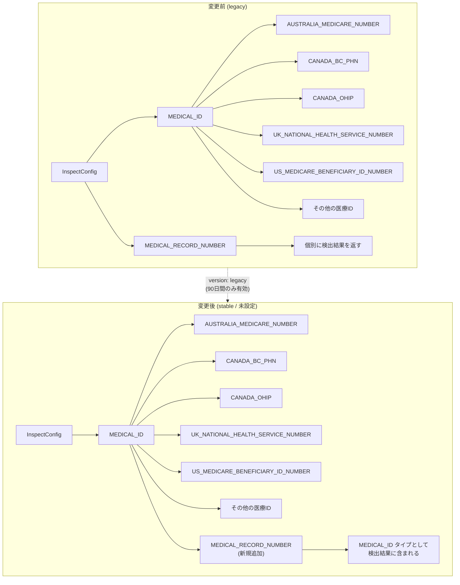

# Sensitive Data Protection (Cloud DLP): MEDICAL_ID infoType の動作変更 - MEDICAL_RECORD_NUMBER の統合

**リリース日**: 2026-07-13

**サービス**: Sensitive Data Protection (Cloud DLP)

**機能**: MEDICAL_ID infoType の検出範囲拡大 (MEDICAL_RECORD_NUMBER の統合)

**ステータス**: Change (破壊的変更 - 90日間の移行期間あり)

📊 [このアップデートのインフォグラフィックを見る](https://takech9203.github.io/google-cloud-news-summary/20260713-sensitive-data-protection-medical-id.html)

## 概要

Sensitive Data Protection (旧 Cloud DLP) において、MEDICAL_ID infoType の検出動作が変更されました。今回の変更により、InspectConfig で MEDICAL_ID infoType を使用する際に `InfoType.version` を未設定または `stable` に設定している場合、スキャン結果に MEDICAL_RECORD_NUMBER の検出結果が MEDICAL_ID タイプとして含まれるようになります。

この変更は、2026年5月11日に `latest` バージョンとして導入された機能が、30日間の検証期間を経て `stable` に昇格したことによるものです。今回の `stable` への昇格に伴い、従来の動作を維持したい場合は `InfoType.version` を `legacy` に設定する必要がありますが、この `legacy` オプションは90日間のみ利用可能です。

MEDICAL_ID は「汎用 (General) infoType」であり、個人を識別する医療IDを広くカバーするために設計されています。従来は AUSTRALIA_MEDICARE_NUMBER、CANADA_BC_PHN、CANADA_OHIP、CANADA_QUEBEC_HIN、KOREA_NHI_NUMBER、NEW_ZEALAND_NHI_NUMBER、SCOTLAND_COMMUNITY_HEALTH_INDEX_NUMBER、UK_NATIONAL_HEALTH_SERVICE_NUMBER、US_MEDICARE_BENEFICIARY_ID_NUMBER が含まれていましたが、今回 MEDICAL_RECORD_NUMBER が追加されました。

**アップデート前の課題**

- MEDICAL_ID infoType と MEDICAL_RECORD_NUMBER infoType は別々に検出されており、医療関連の識別子を包括的にスキャンするには両方を個別に指定する必要があった
- MEDICAL_RECORD_NUMBER を検出するには明示的に InspectConfig に追加する必要があり、設定漏れによる検出抜けのリスクがあった
- General infoType である MEDICAL_ID を使用しても、一般的な医療記録番号が検出範囲に含まれていなかった

**アップデート後の改善**

- MEDICAL_ID infoType を指定するだけで MEDICAL_RECORD_NUMBER も自動的に検出されるようになった
- General infoType の包括性が向上し、医療関連データの保護がより確実になった
- 設定の簡素化により、InspectConfig で指定する infoType の数を削減できる

## アーキテクチャ図



この図は、MEDICAL_ID infoType の検出範囲が拡大され、MEDICAL_RECORD_NUMBER が統合される前後の動作の違いを示しています。

## サービスアップデートの詳細

### 主要機能

1. **MEDICAL_RECORD_NUMBER の MEDICAL_ID への統合**
   - MEDICAL_RECORD_NUMBER の検出結果が MEDICAL_ID タイプとしてスキャン結果に含まれるようになった
   - これにより MEDICAL_ID は、医療記録番号を含むより包括的な医療識別子検出器として機能する
   - MEDICAL_RECORD_NUMBER は「汎用的な医療記録番号」を検出する infoType であり、感度レベルは SENSITIVITY_HIGH に分類される

2. **InfoType.version によるバージョン管理**
   - `stable` (またはデフォルト/未設定): 新しい動作 (MEDICAL_RECORD_NUMBER を含む)
   - `legacy`: 従来の動作 (MEDICAL_RECORD_NUMBER を含まない) - 90日間のみ利用可能
   - `latest`: 新しい動作 (2026年5月11日から利用可能だったもの)

3. **90日間の移行期間**
   - 2026年7月13日から90日間 (2026年10月11日頃まで) は `legacy` バージョンで従来の動作を維持可能
   - 移行期間終了後は `legacy` オプションが削除され、新しい動作のみとなる

## 技術仕様

### InfoType.version の動作一覧

| version 設定 | 動作 | MEDICAL_RECORD_NUMBER の扱い |
|------|------|------|
| 未設定 (デフォルト) | stable と同じ | MEDICAL_ID として検出される |
| `stable` | 新しい動作 | MEDICAL_ID として検出される |
| `latest` | 新しい動作 | MEDICAL_ID として検出される |
| `legacy` | 従来の動作 (90日間限定) | MEDICAL_ID に含まれない |

### MEDICAL_ID General infoType に含まれる Specific infoType 一覧

| Specific infoType | 説明 |
|------|------|
| AUSTRALIA_MEDICARE_NUMBER | オーストラリアのメディケア番号 |
| CANADA_BC_PHN | カナダBC州の個人健康番号 |
| CANADA_OHIP | カナダオンタリオ州健康保険プラン番号 |
| CANADA_QUEBEC_HIN | カナダケベック州健康保険番号 |
| KOREA_NHI_NUMBER | 韓国国民健康保険番号 |
| NEW_ZEALAND_NHI_NUMBER | ニュージーランドNHI番号 |
| SCOTLAND_COMMUNITY_HEALTH_INDEX_NUMBER | スコットランド地域健康指数番号 |
| UK_NATIONAL_HEALTH_SERVICE_NUMBER | 英国NHS番号 |
| US_MEDICARE_BENEFICIARY_ID_NUMBER | 米国メディケア受給者ID |
| **MEDICAL_RECORD_NUMBER** (新規) | 汎用的な医療記録番号 |

### InspectConfig の設定例

```json
{
  "inspectConfig": {
    "infoTypes": [
      {
        "name": "MEDICAL_ID",
        "version": "stable"
      }
    ],
    "minLikelihood": "POSSIBLE",
    "includeQuote": true
  }
}
```

## 設定方法

### 前提条件

1. Google Cloud プロジェクトで Sensitive Data Protection API が有効化されていること
2. 適切な IAM 権限 (`roles/dlp.user` 以上) が付与されていること

### 手順

#### ステップ 1: 現在の設定を確認する

```bash
# 既存の InspectTemplate を確認
gcloud dlp inspect-templates list --project=PROJECT_ID
```

InspectConfig で MEDICAL_ID や MEDICAL_RECORD_NUMBER を使用している箇所を確認します。

#### ステップ 2: 新しい動作を確認する (テスト)

```bash
# テストデータでスキャンを実行して新しい動作を確認
curl -s -X POST \
  "https://dlp.googleapis.com/v2/projects/PROJECT_ID/locations/global/content:inspect" \
  -H "Authorization: Bearer $(gcloud auth print-access-token)" \
  -H "Content-Type: application/json" \
  -d '{
    "inspectConfig": {
      "infoTypes": [{"name": "MEDICAL_ID"}],
      "includeQuote": true
    },
    "item": {
      "value": "Patient MRN: 12345678"
    }
  }'
```

新しい動作では、MEDICAL_RECORD_NUMBER に該当する値が MEDICAL_ID タイプとして返されます。

#### ステップ 3: 必要に応じて legacy バージョンを設定する (移行期間中)

```json
{
  "inspectConfig": {
    "infoTypes": [
      {
        "name": "MEDICAL_ID",
        "version": "legacy"
      }
    ]
  }
}
```

90日間の移行期間中に、既存のワークフローやアラートルールを新しい動作に対応させてください。

#### ステップ 4: 既存の InspectTemplate を更新する

```bash
# InspectTemplate から個別の MEDICAL_RECORD_NUMBER を削除する (重複防止)
gcloud dlp inspect-templates update TEMPLATE_ID \
  --project=PROJECT_ID \
  --location=global \
  --description="Updated for MEDICAL_ID change"
```

MEDICAL_ID と MEDICAL_RECORD_NUMBER の両方を指定していた場合、同一データに対して重複した検出結果が返される可能性があるため、MEDICAL_RECORD_NUMBER の個別指定を削除することを検討してください。

## メリット

### ビジネス面

- **コンプライアンス対応の強化**: MEDICAL_ID を指定するだけで医療記録番号も含めた包括的なスキャンが可能になり、HIPAA等の規制への対応が容易になる
- **データ保護の網羅性向上**: General infoType の包括性が向上することで、検出漏れによるデータ漏洩リスクが低減される

### 技術面

- **設定の簡素化**: InspectConfig で指定する infoType の数を削減でき、管理が容易になる
- **自動的な保護範囲の拡大**: General infoType を使用していれば、新しい検出器が追加された際に自動的に恩恵を受けられる
- **150 infoType 制限への対応**: リクエストあたり150個の infoType 上限に対して、General infoType の活用により効率的にカバレッジを確保できる

## デメリット・制約事項

### 制限事項

- `legacy` バージョンは90日間 (2026年10月11日頃まで) のみ利用可能であり、その後は新しい動作に完全移行される
- MEDICAL_ID と MEDICAL_RECORD_NUMBER の両方を InspectConfig に指定している場合、同一のコンテンツに対して重複した検出結果が返される可能性がある

### 考慮すべき点

- **破壊的変更への対応**: 既存のスキャン結果を基にしたアラートルールやダッシュボードが、検出結果の増加により影響を受ける可能性がある
- **コスト影響**: 検出結果の増加に伴い、BigQuery への書き込みや Security Command Center への通知が増加する可能性がある
- **下流処理の確認**: スキャン結果を消費するパイプラインやワークフローが、MEDICAL_ID タイプとして報告される MEDICAL_RECORD_NUMBER を適切に処理できるか確認が必要
- **テスト環境での検証**: 本番環境に影響する前に、テスト環境で新しい動作を検証することを強く推奨

## ユースケース

### ユースケース 1: 医療機関のデータプロファイリング

**シナリオ**: 病院のデータレイクに保存された患者データに対して、包括的な機密データスキャンを実施する場合。

**実装例**:
```json
{
  "inspectConfig": {
    "infoTypes": [
      {"name": "MEDICAL_ID"},
      {"name": "PERSON_NAME"},
      {"name": "DEMOGRAPHIC_DATA"}
    ],
    "minLikelihood": "LIKELY"
  }
}
```

**効果**: MEDICAL_ID を指定するだけで、メディケア番号、健康保険番号に加えて医療記録番号も一括で検出でき、HIPAA対応のデータ分類が効率化される。

### ユースケース 2: マルチクラウド環境でのデータ損失防止

**シナリオ**: Cloud Storage や BigQuery に保存された非構造化データに対して Discovery スキャンを実行し、医療情報の存在を自動検出する。

**効果**: MEDICAL_RECORD_NUMBER が MEDICAL_ID に統合されたことで、既存の Discovery 設定を変更することなく、より広い範囲の医療識別子が自動的に検出対象となる。Security Command Center との連携により、リスクのあるデータセットが自動的に報告される。

### ユースケース 3: legacy バージョンを活用した段階的移行

**シナリオ**: 既存のDLP結果に基づくアラートシステムが稼働しており、急な検出結果の増加がアラート疲れを引き起こす可能性がある場合。

**実装例**:
```json
{
  "inspectConfig": {
    "infoTypes": [
      {
        "name": "MEDICAL_ID",
        "version": "legacy"
      }
    ]
  }
}
```

**効果**: 90日間の移行期間中に legacy バージョンを使用しながら、並行してテスト環境で新しい動作を検証し、アラートルールの閾値調整やフィルタリング設定を更新した上で段階的に移行できる。

## 関連サービス・機能

- **Security Command Center**: Sensitive Data Protection の Discovery 結果を Security Command Center に送信し、データリスクの可視化と優先順位付けが可能
- **BigQuery**: スキャン結果の保存先として利用でき、検出結果の分析やレポーティングに活用
- **Cloud Healthcare API**: 医療データを扱う際に Sensitive Data Protection と組み合わせて HIPAA 準拠のデータ管理を実現
- **Dataplex Catalog**: Discovery 結果に基づいてデータアセットにアスペクトを自動付与し、データガバナンスを強化
- **Data Loss Prevention (DLP) API v2**: 今回の変更は DLP API v2 の InspectConfig に影響し、REST API、gcloud CLI、クライアントライブラリすべてに適用される

## 参考リンク

- 📊 [インフォグラフィック](https://takech9203.github.io/google-cloud-news-summary/20260713-sensitive-data-protection-medical-id.html)
- [公式リリースノート](https://docs.cloud.google.com/release-notes#July_13_2026)
- [Sensitive Data Protection リリースノート](https://docs.cloud.google.com/sensitive-data-protection/docs/release-notes)
- [InfoType detector reference](https://docs.cloud.google.com/sensitive-data-protection/docs/infotypes-reference)
- [General and specific infotype detectors](https://docs.cloud.google.com/sensitive-data-protection/docs/concepts-infotypes#general-specific-infotypes)
- [InfoType.version リファレンス](https://docs.cloud.google.com/sensitive-data-protection/docs/reference/rest/v2/InfoType)
- [InspectConfig リファレンス](https://docs.cloud.google.com/sensitive-data-protection/docs/reference/rest/v2/InspectConfig)

## まとめ

今回の変更は、Sensitive Data Protection の MEDICAL_ID General infoType に MEDICAL_RECORD_NUMBER を統合する破壊的変更です。`InfoType.version` を未設定または `stable` に設定している全てのユーザーに影響があります。90日間の移行期間中に、既存のスキャン設定、アラートルール、下流の処理パイプラインを確認し、新しい動作に対応させることを推奨します。特に MEDICAL_ID と MEDICAL_RECORD_NUMBER の両方を指定している構成では、重複検出を避けるために設定の見直しが必要です。

---

**タグ**: #SensitiveDataProtection #CloudDLP #MEDICAL_ID #MEDICAL_RECORD_NUMBER #InfoType #BreakingChange #データ保護 #コンプライアンス #HIPAA #セキュリティ
