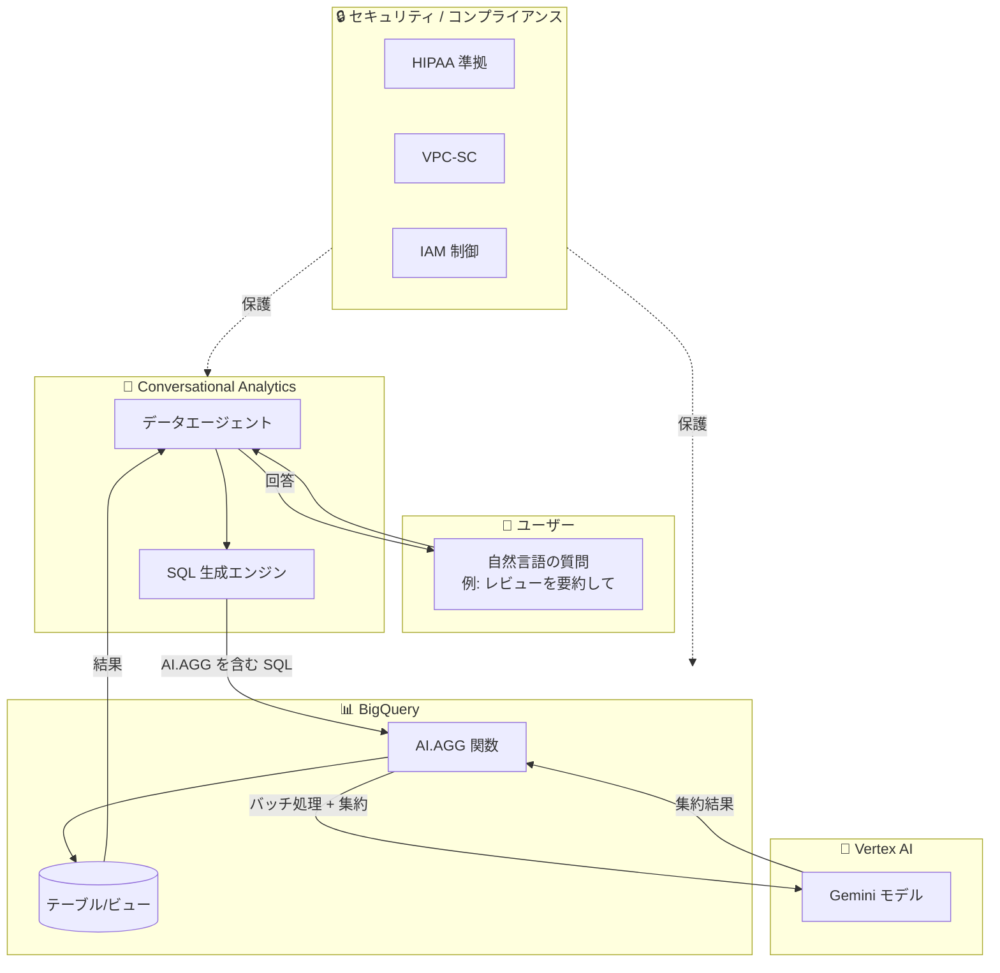

# BigQuery: Conversational Analytics - AI.AGG 関数サポートと HIPAA コンプライアンス対応

**リリース日**: 2026-07-14

**サービス**: BigQuery (Gemini in BigQuery)

**機能**: Conversational Analytics - AI.AGG 関数サポート / HIPAA コンプライアンス

**ステータス**: Preview (AI.AGG) / GA (HIPAA コンプライアンス)

:bar_chart: [このアップデートのインフォグラフィックを見る](https://takech9203.github.io/google-cloud-news-summary/20260714-bigquery-conversational-analytics-ai-agg-hipaa.html)

## 概要

BigQuery の Conversational Analytics (会話型分析) に 2 つの重要なアップデートが追加された。1 つ目は、自然言語による集約処理を実現する AI.AGG 関数のサポート (Preview)。2 つ目は、Gemini in BigQuery の一部として HIPAA コンプライアンスへの対応が発表され、医療・ヘルスケア分野のワークロードでも会話型分析が利用可能になった。

AI.AGG 関数は、Vertex AI の Gemini モデルを活用して自然言語の指示に基づくデータ集約を行う関数であり、テキストや画像データを処理して単一の文字列結果を返す。Conversational Analytics のデータエージェントとの対話において、「レビューを要約して」「最も多い話題は何か」といった集約型の質問に対して、より適切な SQL を自動生成できるようになる。

HIPAA コンプライアンス対応により、電子保護対象健康情報 (ePHI) を含むデータセットに対しても、BigQuery の会話型分析機能を適切な構成の下で利用可能になった。これにより、医療機関やヘルスケア企業がデータ分析の民主化を進める際の規制面での障壁が解消される。

**アップデート前の課題**

- Conversational Analytics で集約型の質問をする場合、AI.GENERATE などの汎用関数を使う必要があり、手動でバッチ処理ロジックを記述する必要があった
- Gemini のコンテキストウィンドウサイズを超えるデータの集約には、複雑なマルチレベルバッチ処理が必要だった
- HIPAA 対象のワークロードでは会話型分析機能の利用が制限されており、医療データの分析に自然言語インターフェースを活用できなかった
- ヘルスケア分野のアナリストは SQL の専門知識が必要で、データ分析の迅速化が困難だった

**アップデート後の改善**

- AI.AGG 関数により、データエージェントが集約型の質問に対して最適化された SQL を自動生成可能になった
- マルチレベル集約が自動的に実行され、Gemini コンテキストウィンドウを超える大規模データセットでも集約分析が可能になった
- HIPAA コンプライアンス対応により、適切な BAA (Business Associate Agreement) の下で ePHI データに対する会話型分析が利用可能になった
- 医療従事者やヘルスケアアナリストが SQL 知識なしにデータインサイトを取得できるようになった

## アーキテクチャ図



Conversational Analytics がユーザーの自然言語クエリを受け取り、AI.AGG 関数を含む SQL を自動生成する。AI.AGG は Vertex AI Gemini モデルを使用してマルチレベル集約を実行し、HIPAA 準拠のセキュリティ境界内で処理される。

## サービスアップデートの詳細

### 主要機能

1. **AI.AGG 関数の Conversational Analytics サポート (Preview)**
   - データエージェントとの対話や検証済み SQL クエリで AI.AGG 関数が利用可能
   - 自然言語の指示に基づいてデータを集約し、単一の文字列結果を返す
   - テキストデータおよび画像データ (ObjectRefRuntime 経由) の処理に対応
   - 自動マルチレベルバッチ処理により、Gemini コンテキストウィンドウを超えるデータセットにも対応

2. **HIPAA コンプライアンス対応**
   - Gemini in BigQuery の GA 機能として SOC 1/2/3、ISO/IEC 27001 に加え HIPAA コンプライアンスをカバー
   - Google Cloud の HIPAA BAA の対象サービスとして、ePHI データの処理が可能
   - データは選択したリージョン (US/EU) 内で処理され、データレジデンシー要件を尊重
   - VPC Service Controls によるセキュリティ境界の設定にも対応

3. **AI.AGG の主要ユースケース**
   - ユーザーレビューの感情分析とトレンド要約
   - マルチモーダルデータ (画像含む) のコンテンツ要約
   - AI エージェントパフォーマンスの分析
   - アプリケーションログの傾向分析

## 技術仕様

### AI.AGG 関数の構文

| 項目 | 詳細 |
|------|------|
| 構文 | `AI.AGG([DISTINCT] INPUT, INSTRUCTION [, connection_id => 'CONNECTION'] [, endpoint => 'ENDPOINT'])` |
| 入力データ型 | STRING、または STRING/ObjectRefRuntime/配列を含む STRUCT |
| 出力 | STRING (グループごとに 1 つの文字列) |
| 出力トークン上限 | グループあたり 10,000 トークン |
| 推奨最大行数 | クエリあたり 2,000 万行 |
| 推奨最大グループ数 | 1,000 グループ |
| 使用モデル | Vertex AI Gemini モデル (Thinking 不要モデル) |
| ステータス | Preview |

### セキュリティ・コンプライアンス

| 項目 | 詳細 |
|------|------|
| HIPAA | 対応 (BAA 必要) |
| SOC | 1/2/3 対応 |
| ISO | 27001 対応 |
| VPC-SC | 対応 |
| データレジデンシー | US/EU MREP (それ以外は Global) |
| データ暗号化 | 保存時・転送時ともに暗号化 |

### AI.AGG 関数の SQL 例

```sql
-- レビューの感情分析と要約
SELECT
  product_category,
  AI.AGG(
    review_text,
    'Summarize the overall sentiment and common themes in these reviews.'
  ) AS review_summary
FROM `project.dataset.product_reviews`
GROUP BY product_category;
```

```sql
-- Conversational Analytics エージェント経由の利用例
-- ユーザーが「各著者の記事トピックを要約して」と質問すると
-- エージェントが以下のような SQL を自動生成:
SELECT
  t.by,
  AI.AGG(
    t.text,
    'Tell me what topics the user talks about the most. Keep it concise.'
  ) AS common_topic
FROM `bigquery-public-data.hacker_news.full` AS t
WHERE t.text IS NOT NULL AND t.type = 'story'
GROUP BY t.by;
```

## 設定方法

### 前提条件

1. Google Cloud プロジェクトで BigQuery API、Vertex AI API、Gemini Data Analytics API を有効化
2. 適切な IAM ロールの付与 (bigquery.user、geminidataanalytics.dataAgentCreator)
3. HIPAA ワークロードの場合: Google Cloud との BAA (Business Associate Agreement) の締結
4. Cloud リソース接続の作成 (エンドユーザー認証を使用しない場合)

### 手順

#### ステップ 1: API の有効化

```bash
gcloud services enable bigquery.googleapis.com --project=PROJECT_ID
gcloud services enable aiplatform.googleapis.com --project=PROJECT_ID
gcloud services enable geminidataanalytics.googleapis.com --project=PROJECT_ID
gcloud services enable cloudaicompanion.googleapis.com --project=PROJECT_ID
```

#### ステップ 2: データエージェントの作成

BigQuery Studio のエージェントカタログからデータエージェントを作成し、対象テーブルをナレッジソースとして追加する。

#### ステップ 3: AI.AGG を活用した会話の開始

データエージェントに集約型の質問を投げかける:
- 「このデータの主要トレンドを要約して」
- 「レビューの全体的な感情を分析して」
- 「ユーザーが最も議論しているトピックは何か」

エージェントが自動的に AI.AGG 関数を含む SQL を生成・実行する。

#### ステップ 4: HIPAA 対応の構成 (医療ワークロードの場合)

```bash
# VPC Service Controls の設定 (推奨)
gcloud access-context-manager perimeters create PERIMETER_NAME \
    --resources="projects/PROJECT_NUMBER" \
    --restricted-services="bigquery.googleapis.com" \
    --title="BigQuery HIPAA Perimeter"
```

US または EU の Multi-Region Processing (MREP) ロケーションを使用し、データレジデンシー要件を満たす構成にする。

## メリット

### ビジネス面

- **データ分析の民主化**: SQL の専門知識がないビジネスユーザーやヘルスケアアナリストでも、自然言語で高度な集約分析が可能
- **医療分野での活用拡大**: HIPAA 準拠により、ePHI を含むデータセットに対する会話型分析が規制面で許可された
- **意思決定の迅速化**: 複雑な集約ロジックを手動で記述する必要がなくなり、インサイト取得までの時間を短縮
- **コンプライアンス負担の軽減**: Google Cloud のインフラレベルでの HIPAA 準拠により、個別の技術的対策の負担が軽減

### 技術面

- **自動マルチレベルバッチ処理**: AI.AGG は大規模データを自動的にバッチ分割し集約するため、コンテキストウィンドウの制限を意識する必要がない
- **汎用関数との差別化**: AI.GENERATE と異なり、グループ単位で 1 つの結果を返すため、集約処理に特化した効率的な実行が可能
- **マルチモーダル対応**: テキストだけでなく Cloud Storage 上の画像データも集約分析の対象にできる
- **VPC-SC 対応**: セキュリティ境界内でのデータ処理が保証され、ePHI の漏洩リスクを最小化

## デメリット・制約事項

### 制限事項

- AI.AGG 関数は Preview ステータスのため、本番環境での利用には注意が必要 (Pre-GA サービス利用規約が適用)
- クエリあたり推奨最大 2,000 万行、1,000 グループを超える場合はタイムアウトの可能性がある
- 出力はグループあたり 10,000 トークンに制限される
- 1 行あたり 10 MiB を超えるデータはエラーの原因になる可能性がある
- 10 以上の画像を含む単一入力行はスキップされる場合がある
- Thinking Budget を必要とする Gemini モデルは使用不可

### 考慮すべき点

- AI.AGG のバッチ処理により、ソースデータのトークン数より多くのトークンが Gemini に送信されるため、コストが増加する可能性がある
- HIPAA 対応には BAA の締結が前提であり、技術的設定だけでは不十分
- Assured Workloads パッケージには Gemini in BigQuery は含まれないため、より厳格なコンプライアンス要件 (FedRAMP High など) には対応していない
- Preview 期間中のサポートは bqml-feedback@google.com への連絡が必要
- Workforce Identity Federation 使用時に、Cloud リソース接続を指定せず数分以上かかるクエリが失敗する場合がある

## ユースケース

### ユースケース 1: 医療機関における患者フィードバック分析

**シナリオ**: 病院の品質改善チームが、患者満足度調査の自由記述回答を分析し、部門別の改善ポイントを特定したい。

**実装例**:
```sql
-- データエージェントへの質問:
-- 「各部門の患者フィードバックを要約し、改善すべき点を教えて」

-- エージェントが生成する SQL:
SELECT
  department,
  AI.AGG(
    feedback_text,
    'Summarize patient feedback sentiment and identify top improvement areas.'
  ) AS feedback_summary
FROM `hospital_data.patient_surveys`
WHERE survey_date >= '2026-01-01'
GROUP BY department;
```

**効果**: HIPAA 準拠の環境で ePHI を含むフィードバックデータを安全に分析し、SQL を書かずに部門別インサイトを取得できる。

### ユースケース 2: EC サイトのレビュー傾向分析

**シナリオ**: マーケティングチームが製品カテゴリごとのレビュー傾向を把握し、顧客が最も重視している製品特性を特定したい。

**実装例**:
```sql
-- データエージェントへの質問:
-- 「各製品カテゴリで顧客が最も議論しているポイントは何か」

-- エージェントが生成する SQL:
SELECT
  category,
  AI.AGG(
    STRUCT(review_title, review_body),
    'What are the top 3 aspects customers discuss most? Are they positive or negative?'
  ) AS review_insights
FROM `ecommerce.product_reviews`
GROUP BY category;
```

**効果**: 数十万件のレビューを自動的にバッチ処理・集約し、カテゴリ別のインサイトを一文で取得できる。

### ユースケース 3: マルチモーダルデータの分類・要約

**シナリオ**: 小売企業が Cloud Storage に保存された商品画像を分析し、カテゴリ分類の精度を検証したい。

**実装例**:
```sql
-- データエージェントへの質問:
-- 「商品画像の主要カテゴリを分析して」

SELECT
  AI.AGG(
    STRUCT(OBJ.GET_ACCESS_URL(ref, 'r')),
    'What are the major categories of these product images?'
  ) AS category_description
FROM `retail.product_images`;
```

**効果**: テキストだけでなく画像データも含めたマルチモーダルな集約分析を、自然言語の指示一つで実行できる。

## 料金

Conversational Analytics および AI.AGG 関数の利用には、以下の料金が発生する:

### 料金体系

| 項目 | 課金基準 |
|------|----------|
| BigQuery コンピュート | クエリ処理に使用されるスロット時間 (オンデマンドまたはエディション) |
| Vertex AI (Gemini) | AI.AGG から Gemini への入力/出力トークン数 |
| データエージェント | BigQuery コンピュート料金に含まれる |

- BigQuery の料金: [BigQuery pricing](https://cloud.google.com/bigquery/pricing)
- Vertex AI の料金: [Vertex AI pricing](https://cloud.google.com/vertex-ai/pricing#generative_ai_models)
- データエージェント料金: [Agent pricing](https://cloud.google.com/products/data-agents/pricing)

**注意**: AI.AGG はバッチ処理と集約のプロセスでソースデータ以上のトークンを Gemini に送信するため、入力データサイズだけでは正確なコスト見積もりが困難。`AI.COUNT_TOKENS` 関数で事前にトークン数を推定することを推奨。

## 利用可能リージョン

Conversational Analytics は以下の 3 つのロケーションをサポート:

| ロケーション | 説明 |
|-------------|------|
| US MREP | 米国内のナレッジソースを持つ場合のデフォルト |
| EU MREP | EU 内のナレッジソースを持つ場合のデフォルト |
| Global | 上記以外の場合のデフォルト |

AI.AGG 関数は Gemini モデルがサポートされるすべての BigQuery リージョンで実行可能。クエリ処理リージョンにサポートされる Gemini エンドポイントがない場合は、Global エンドポイントなど完全なエンドポイントを指定する必要がある。

## 関連サービス・機能

- **Vertex AI (Gemini)**: AI.AGG 関数のバックエンドとして Gemini モデルを使用し、自然言語ベースの集約処理を実行
- **Conversational Analytics API**: データエージェントの作成・管理をプログラマティックに行うための API。BigQuery、Looker、Data Studio から利用可能
- **Cloud Healthcare API**: HIPAA 準拠の医療データ管理サービス。BigQuery へのデータエクスポートと組み合わせて会話型分析を実現
- **VPC Service Controls**: セキュリティ境界を設定し、HIPAA ワークロードのデータ漏洩リスクを最小化
- **BigQuery AI 関数群 (AI.GENERATE, AI.CLASSIFY, AI.IF 等)**: Conversational Analytics がサポートする他の AI 関数。集約以外の用途 (生成、分類、条件判定) で利用
- **Data Studio**: Conversational Analytics のフロントエンドとして、BigQuery で作成したデータエージェントと対話可能

## 参考リンク

- :bar_chart: [インフォグラフィック](https://takech9203.github.io/google-cloud-news-summary/20260714-bigquery-conversational-analytics-ai-agg-hipaa.html)
- [公式リリースノート](https://docs.cloud.google.com/release-notes#July_14_2026)
- [AI.AGG 関数リファレンス](https://docs.cloud.google.com/bigquery/docs/reference/standard-sql/bigqueryml-syntax-ai-agg)
- [Conversational Analytics 概要](https://docs.cloud.google.com/bigquery/docs/conversational-analytics)
- [Gemini in BigQuery セキュリティ・プライバシー・コンプライアンス](https://docs.cloud.google.com/bigquery/docs/gemini-security-privacy-compliance)
- [BigQuery 料金ページ](https://cloud.google.com/bigquery/pricing)
- [Vertex AI 料金ページ](https://cloud.google.com/vertex-ai/pricing#generative_ai_models)

## まとめ

今回のアップデートにより、BigQuery Conversational Analytics は AI.AGG 関数のサポートで集約型分析の能力を大幅に強化し、HIPAA コンプライアンス対応でヘルスケア分野への適用範囲を拡大した。医療機関やヘルスケア企業のデータアナリストは、SQL の専門知識なしに自然言語で ePHI データの集約分析を実行でき、データドリブンな意思決定を加速できる。AI.AGG は現在 Preview であるため、本番環境への導入は GA 昇格後に検討し、まずは非本番データでの検証を推奨する。

---

**タグ**: #BigQuery #ConversationalAnalytics #AI.AGG #HIPAA #GeminiInBigQuery #Healthcare #Preview #NaturalLanguageAnalytics #DataAgents
