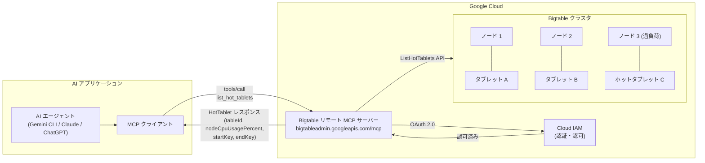

# Bigtable: list_hot_tablets MCP ツールが GA (一般提供) に

**リリース日**: 2026-07-14

**サービス**: Cloud Bigtable

**機能**: list_hot_tablets Model Context Protocol (MCP) ツール

**ステータス**: GA (一般提供)

[このアップデートのインフォグラフィックを見る](https://takech9203.github.io/google-cloud-news-summary/20260714-bigtable-list-hot-tablets-mcp-ga.html)

## 概要

Google Cloud は、Bigtable のリモート MCP サーバーで提供される `list_hot_tablets` ツールの一般提供 (GA) を発表しました。このツールにより、AI エージェントが Model Context Protocol (MCP) を通じて Bigtable クラスタのヘルスを問い合わせ、リソース集約型のタブレット (ホットタブレット) や過負荷状態のノード CPU をプログラム的に検出できるようになります。

MCP は、大規模言語モデル (LLM) や AI アプリケーションが外部データソースに接続するための標準プロトコルです。Bigtable のリモート MCP サーバー (`https://bigtableadmin.googleapis.com/mcp`) を通じて、Gemini CLI、Claude、ChatGPT などの AI アプリケーションから直接 Bigtable のクラスタヘルス情報を取得できます。これにより、データベース運用の自動化と AI 駆動の障害対応が実現します。

対象ユーザーは、Bigtable を運用する SRE、データベース管理者、および AI エージェントを活用したインフラ自動化を推進する DevOps エンジニアです。

**アップデート前の課題**

- ホットタブレットの検出には手動で gcloud CLI コマンドの実行や Admin API の呼び出しが必要だった
- AI エージェントが Bigtable のクラスタヘルス情報に直接アクセスする標準的な方法がなかった
- パフォーマンス問題の検出と対応に人手が介在し、対応時間が長くなりがちだった

**アップデート後の改善**

- AI エージェントが MCP 経由で直接ホットタブレット情報をクエリできるようになった
- 自動化されたパフォーマンス監視と障害検知パイプラインの構築が容易になった
- 運用トイルの削減と、AI 駆動の自律的なトラブルシューティングが可能になった

## アーキテクチャ図



AI エージェントが MCP クライアントを介して Bigtable リモート MCP サーバーに接続し、`list_hot_tablets` ツールを呼び出してクラスタ内のホットタブレット情報を取得するフローを示しています。

## サービスアップデートの詳細

### 主要機能

1. **list_hot_tablets MCP ツール**
   - Bigtable クラスタ内のホットタブレットをリスト表示する MCP ツール
   - ノード CPU 使用率の高い順にタブレットを返却
   - 最大 48 時間の時間範囲でクエリ可能 (過去 14 日以内)
   - 読み取り専用ツール (Read Only Hint: true) で安全に使用可能

2. **リモート MCP サーバー統合**
   - エンドポイント: `https://bigtableadmin.googleapis.com/mcp`
   - HTTP トランスポートによるリモート接続
   - OAuth 2.0 + IAM による認証・認可
   - Bigtable API を有効化するだけで自動的に利用可能

3. **AI エージェント互換性**
   - Gemini CLI、Claude、ChatGPT、カスタムアプリケーションに対応
   - JSON-RPC 2.0 プロトコルによる標準的な通信
   - ページネーション対応で大量のホットタブレット結果にも対応

## 技術仕様

### リクエストパラメータ

| パラメータ | 必須 | 説明 |
|------|------|------|
| projectId | 必須 | プロジェクト ID (例: "my-project") |
| instanceId | 必須 | インスタンス ID (例: "my-instance") |
| clusterId | 必須 | クラスタ ID (例: "my-cluster") |
| startTime | 任意 | 検索開始時刻 (RFC 3339 形式、デフォルト: Now) |
| endTime | 任意 | 検索終了時刻 (RFC 3339 形式、デフォルト: Now - 24h) |
| pageSize | 任意 | 1 ページあたりの最大結果数 |
| pageToken | 任意 | ページネーショントークン |

### レスポンスフィールド (HotTablet オブジェクト)

| フィールド | 説明 |
|------|------|
| tableId | ホットタブレットが属するテーブルの固有 ID |
| startTime | ホットタブレット期間の開始時刻 |
| endTime | ホットタブレット期間の終了時刻 |
| startKey | タブレットの開始行キー (inclusive) |
| endKey | タブレットの終了行キー (inclusive) |
| nodeCpuUsagePercent | ノードの平均 CPU 使用率 (0-100%) |

### MCP ツール呼び出し例

```json
{
  "method": "tools/call",
  "params": {
    "name": "list_hot_tablets",
    "arguments": {
      "projectId": "my-project",
      "instanceId": "my-instance",
      "clusterId": "my-cluster",
      "startTime": "2026-07-14T00:00:00Z",
      "endTime": "2026-07-14T12:00:00Z"
    }
  },
  "jsonrpc": "2.0",
  "id": 1
}
```

## 設定方法

### 前提条件

1. Google Cloud プロジェクトで Bigtable API が有効化されていること
2. 以下の IAM ロールが付与されていること:
   - `roles/mcp.toolUser` (MCP ツール呼び出し権限)
   - `roles/bigtable.admin` または `bigtable.viewer` 権限を含むロール

### 手順

#### ステップ 1: IAM ロールの付与

```bash
# MCP ツールユーザーロールの付与
gcloud projects add-iam-policy-binding PROJECT_ID \
  --member="serviceAccount:AGENT_SA@PROJECT_ID.iam.gserviceaccount.com" \
  --role="roles/mcp.toolUser"

# Bigtable 閲覧者ロールの付与 (ホットタブレットの一覧に必要)
gcloud projects add-iam-policy-binding PROJECT_ID \
  --member="serviceAccount:AGENT_SA@PROJECT_ID.iam.gserviceaccount.com" \
  --role="roles/bigtable.viewer"
```

エージェント用の専用サービスアカウントを作成し、最小権限の原則に従ってロールを付与します。

#### ステップ 2: MCP クライアントの設定

```json
{
  "mcpServers": {
    "bigtable": {
      "url": "https://bigtableadmin.googleapis.com/mcp",
      "transport": "http",
      "auth": {
        "type": "oauth2",
        "scope": "https://www.googleapis.com/auth/bigtable.admin"
      }
    }
  }
}
```

AI アプリケーションの MCP クライアント設定に Bigtable MCP サーバーのエンドポイントを追加します。

#### ステップ 3: ツールの呼び出しテスト

```bash
curl --location 'https://bigtableadmin.googleapis.com/mcp' \
  --header 'content-type: application/json' \
  --header 'accept: application/json, text/event-stream' \
  --header "authorization: Bearer $(gcloud auth print-access-token)" \
  --data '{
    "method": "tools/call",
    "params": {
      "name": "list_hot_tablets",
      "arguments": {
        "projectId": "my-project",
        "instanceId": "my-instance",
        "clusterId": "my-cluster"
      }
    },
    "jsonrpc": "2.0",
    "id": 1
  }'
```

正常なレスポンスが返却されることを確認します。

## メリット

### ビジネス面

- **運用コスト削減**: AI エージェントによる自動監視で、手動でのパフォーマンス監視作業が不要になり、SRE チームの負荷を軽減
- **障害対応時間の短縮**: AI エージェントがリアルタイムでホットタブレットを検出し、即座にアラートや修正提案を行うことで MTTR (平均修復時間) を短縮
- **プロアクティブな運用**: 問題が顕在化する前にパフォーマンス劣化の兆候を AI が検知し、予防的な対応が可能

### 技術面

- **標準プロトコル準拠**: MCP による標準化されたインターフェースで、特定のツールやライブラリに依存しない実装が可能
- **細粒度の監視**: 1 分単位のホットタブレット情報により、Key Visualizer では検出困難な短時間のホットスポットも発見可能
- **クラスタレベルの可視性**: テーブルを横断してクラスタ全体の CPU 使用状況を把握し、問題のあるテーブルを特定可能

## デメリット・制約事項

### 制限事項

- テーブルのデータ量がクラスタあたり 1 GB 未満の場合、ホットタブレット情報は利用不可
- テーブルが 1 GB に達してからホットタブレット情報が利用可能になるまで最大 1 時間のラグが発生
- 検索可能な時間範囲は最大 48 時間、過去 14 日以内に限定
- 15 分間隔内で同一タブレットが複数回ホットと判定された場合、最も CPU 使用率の高いもののみ返却

### 考慮すべき点

- AI エージェントに付与する IAM ロールは最小権限の原則に従い、`bigtable.viewer` を推奨 (`bigtable.admin` は過剰)
- MCP サーバーは API キーでの認証を受け付けないため、OAuth 2.0 による認証が必須
- エージェント用の専用サービスアカウントを作成し、アクセスの監視とログ取得を行うことを推奨
- Model Armor の有効化により、プロンプトインジェクション等のセキュリティリスクを軽減可能

## ユースケース

### ユースケース 1: AI 駆動の自動パフォーマンストリアージ

**シナリオ**: SRE チームが AI エージェントを使用して、Bigtable クラスタのパフォーマンス問題を自動的にトリアージするシステムを構築する。

**実装例**:
```json
{
  "method": "tools/call",
  "params": {
    "name": "list_hot_tablets",
    "arguments": {
      "projectId": "production-project",
      "instanceId": "user-data-instance",
      "clusterId": "us-central1-cluster",
      "startTime": "2026-07-14T10:00:00Z",
      "endTime": "2026-07-14T11:00:00Z"
    }
  },
  "jsonrpc": "2.0",
  "id": 1
}
```

**効果**: エージェントが定期的にホットタブレットを監視し、CPU 使用率が閾値を超えた場合に自動的に PagerDuty チケットを作成し、影響を受けるテーブルとキー範囲を含むレポートを生成する。

### ユースケース 2: スキーマ設計の問題検出と改善提案

**シナリオ**: AI エージェントがホットタブレットのパターンを分析し、行キースキーマの設計問題を特定して改善案を提示する。

**効果**: 単調増加する行キー (タイムスタンプベースなど) によるホットスポットをエージェントが自動検出し、キーのソルティングやハッシュ化などの具体的な改善策を提案する。Key Visualizer と組み合わせることで、より包括的な分析が可能になる。

### ユースケース 3: マルチテーブルクラスタの問題テーブル特定

**シナリオ**: 複数のテーブルを含むクラスタで、どのテーブルが CPU リソースを過剰に消費しているかを AI エージェントが自動判別する。

**効果**: クラスタレベルで動作する `list_hot_tablets` により、テーブルを横断した分析が可能。問題のテーブルを迅速に特定し、テーブル単位のスケーリングやトラフィック分散の判断を支援する。

## 料金

`list_hot_tablets` MCP ツールの利用自体に追加料金は発生しません。通常の Bigtable Admin API の呼び出しとして扱われます。

### 料金に影響する要素

| 項目 | 説明 |
|--------|-----------------|
| Bigtable ノード | クラスタのノード数に応じた時間課金 (ツール利用による追加課金なし) |
| MCP ツール呼び出し | 追加料金なし (Bigtable Admin API の一部として処理) |
| Cloud Audit Logs | データアクセス監査ログを有効にした場合の Cloud Logging 料金 |

## 利用可能リージョン

Bigtable リモート MCP サーバーはグローバルエンドポイント (`bigtableadmin.googleapis.com/mcp`) として提供されており、Bigtable インスタンスが存在するすべてのリージョンで利用可能です。Bigtable API が有効化されているプロジェクトであれば、追加のリージョン設定なしで使用できます。

## 関連サービス・機能

- **Key Visualizer**: Bigtable のキースペースアクセスパターンをヒートマップで可視化する診断ツール。`list_hot_tablets` と組み合わせて、より詳細なホットスポット分析が可能
- **Database Insights MCP サーバー**: Cloud Monitoring のメトリクスやクエリパフォーマンスを AI エージェントから取得するための別の MCP サーバー
- **Model Armor**: MCP ツール呼び出し時のプロンプトインジェクション対策や安全性制御を提供
- **Cloud Audit Logs**: MCP ツール呼び出しの監査ログを記録し、エージェントの行動を追跡

## 参考リンク

- [インフォグラフィック](https://takech9203.github.io/google-cloud-news-summary/20260714-bigtable-list-hot-tablets-mcp-ga.html)
- [公式リリースノート](https://docs.cloud.google.com/release-notes#July_14_2026)
- [Bigtable ホットタブレット ドキュメント](https://docs.cloud.google.com/bigtable/docs/hot-tablets)
- [Bigtable リモート MCP サーバーの使用](https://docs.cloud.google.com/bigtable/docs/use-bigtable-mcp)
- [list_hot_tablets MCP ツールリファレンス](https://docs.cloud.google.com/bigtable/docs/reference/admin/mcp/bigtable/mcp/tools_list/list_hot_tablets)
- [MCP サーバーとのエージェントインタラクションのセキュリティ](https://docs.cloud.google.com/bigtable/docs/secure-agent-interactions-mcp)
- [Bigtable 料金ページ](https://cloud.google.com/bigtable/pricing)

## まとめ

Bigtable の `list_hot_tablets` MCP ツールの GA は、AI エージェントによるデータベース運用自動化の重要な一歩です。SRE チームや DevOps エンジニアは、このツールを活用して AI 駆動のパフォーマンス監視パイプラインを構築し、ホットタブレットの早期検出と自動対応を実現できます。本番環境での利用が推奨される GA ステータスであるため、既存の AI エージェントワークフローへの組み込みを検討してください。

---

**タグ**: #Bigtable #MCP #ModelContextProtocol #HotTablets #AI #エージェント #パフォーマンス監視 #GA #運用自動化
