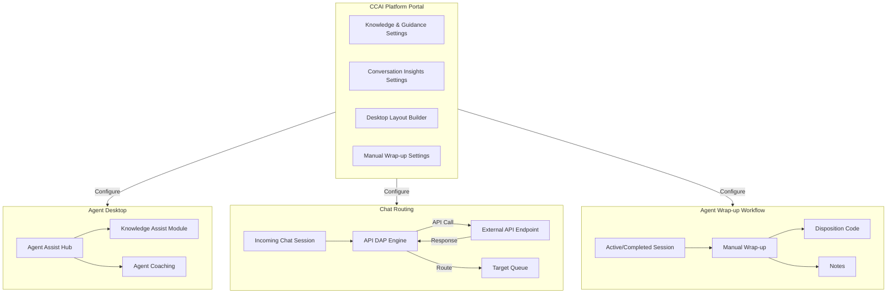

# Google Cloud CCaaS: Agent Assist Hub、Manual Wrap-up、API DAP for Chat

**リリース日**: 2026-07-14

**サービス**: Google Cloud Contact Center as a Service (CCaaS) / CCAI Platform

**機能**: Agent Assist Hub、Manual Wrap-up、API Direct Access Point for Chat

**ステータス**: Prerelease (次期バージョン予定)

[このアップデートのインフォグラフィックを見る](https://takech9203.github.io/google-cloud-news-summary/20260714-ccaas-agent-assist-hub.html)

## 概要

Google Cloud CCaaS (CCAI Platform) の次期バージョンにおいて、エージェントデスクトップの大幅な機能強化が発表された。中核となる Agent Assist Hub は、生成 AI ナレッジアシストとエージェントコーチング機能を単一の統合インターフェースに統合する新パネルであり、エージェントの生産性向上を目的としている。

加えて、Manual Wrap-up 機能により、エージェントが過去のインタラクションに対して遡及的にラップアップ時間・ディスポジションコード・メモを付与できるようになった。さらに、チャット向け API Direct Access Point (DAP) により、外部 API エンドポイントからのレスポンスに基づいてチャットセッションを自動的にキューにルーティングすることが可能になり、エンドユーザーがキューメニューから選択する手間が解消される。本リリースには複数の重要なバグ修正も含まれている。

**アップデート前の課題**

- ナレッジアシストとエージェントコーチングが別々のパネルに分散しており、エージェントが複数の UI 要素を切り替える必要があった
- エージェントがセッション終了後にディスポジションコードやメモを修正・追加する手段がなかった
- チャットチャネルでは API DAP が利用できず、エンドユーザーがキューメニューから手動で選択する必要があった
- メール転送時のスタック、Web チャットでのメッセージ未配信、キュー内での通話/チャットの滞留など信頼性の問題が存在していた

**アップデート後の改善**

- Agent Assist Hub により、ナレッジアシストとコーチングが統一されたインターフェースで利用可能になり、エージェントのワークフローが簡素化された
- Manual Wrap-up により、過去のセッションに対するディスポジションコードとメモの遡及的な修正・追加が可能になった
- API DAP for Chat により、チャットセッションの自動ルーティングが実現し、エンドユーザー体験が向上した
- 複数のバグ修正により、メール転送、チャットメッセージ配信、キューイング処理の信頼性が改善された

## アーキテクチャ図



Agent Assist Hub はエージェントデスクトップの中心的なパネルとして、ナレッジアシストとコーチング機能を統合する。管理者は CCAI Platform ポータルからすべての新機能を構成でき、API DAP はチャットの自動ルーティングを外部 API と連携して実現する。

## サービスアップデートの詳細

### 主要機能

1. **Agent Assist Hub**
   - エージェントデスクトップ上の新しいパネルとして、生成 AI ナレッジアシストとエージェントコーチングを統合
   - Knowledge Assist モジュールは既存のエージェントデスクトップ Knowledge Assist パネルの 1:1 機能置換
   - Settings > Call > Agent Assist および Settings > Chat > Agent Assist の設定が「Knowledge & Guidance」と「Conversation Insights」セクションに再編成
   - Desktop Layout Builder に新しい Agent Assist Hub パネルが追加
   - インスタンスは自動的にアップデートされ、管理者による設定変更は不要

2. **Manual Wrap-up**
   - エージェントが過去のインタラクションに対してラップアップ時間、ディスポジションコード、メモを付与可能
   - 完了済みセッションのディスポジションコードとメモの修正が可能
   - Settings > Operation Management > Wrap-up ペインに新しい「Manual Wrap-up」セクションが追加
   - エージェントアダプターに新しい「Previous Sessions」リストが表示

3. **API Direct Access Point (DAP) for Chat**
   - 外部 API エンドポイントからのレスポンスに基づいて、チャットセッションを自動的にキューにルーティング
   - エンドユーザーがキューメニューから選択する必要がなくなる
   - これまで IVR チャネルのみで利用可能だった API DAP がチャットチャネルにも拡張

### バグ修正 (主要なもの)

| 修正内容 | 影響範囲 |
|---------|---------|
| キュー間移動時にメールが「Transferring」状態でスタックする問題 | メールチャネル |
| Web チャット中にエンドユーザーがメッセージを受信できない問題 | Web チャットチャネル |
| 通話/チャットがキュー内に留まりエージェントに提供されない問題 | 全チャネル |
| 通話終了後にディスポジションパネルが表示されない問題 | 音声チャネル |
| Salesforce 連携の問題 | CRM 連携 |
| Zendesk で通話録音リンクが重複する問題 | CRM 連携 |
| エージェントデスクトップのミニチャットアダプターのレンダリングパフォーマンス | エージェントデスクトップ |

## 技術仕様

### Agent Assist Hub 設定構成

| 項目 | 詳細 |
|------|------|
| 設定パス (音声) | Settings > Call > Agent Assist > Knowledge & Guidance > Agent Assist Hub |
| 設定パス (チャット) | Settings > Chat > Agent Assist > Knowledge & Guidance > Agent Assist Hub |
| Desktop Layout Builder | Agent Assist Hub パネルをドラッグ&ドロップで配置 |
| 自動アップデート | 設定変更不要 (自動展開) |

### Manual Wrap-up 設定

| 項目 | 詳細 |
|------|------|
| 設定パス | Settings > Operation Management > Wrap-up > Manual Wrap-up |
| エージェント UI | Previous Sessions リスト (エージェントアダプター内) |
| 対象セッション | 完了済みの過去のインタラクション |
| 編集可能項目 | ディスポジションコード、メモ、ラップアップ時間 |

### API DAP for Chat の仕組み

| 項目 | 詳細 |
|------|------|
| HTTP メソッド | POST / GET |
| レスポンス形式 | JSON |
| マッチングロジック | Key-Value ペアによる条件評価 |
| 複数条件 | AND ロジックで複数 Key-Value ペアを評価可能 |
| 優先順位 | 複雑な条件を先に作成すること (先に作成した条件が優先) |

### API DAP 条件評価ロジック

```json
{
  "conditions": [
    {
      "key": "customer_tier",
      "value": "enterprise"
    },
    {
      "key": "issue_type",
      "value": "billing"
    }
  ],
  "target_queue": "enterprise-billing-queue"
}
```

## 設定方法

### 前提条件

1. CCAI Platform インスタンスが稼働していること
2. 管理者権限 (Contact Center AI Platform Admin ロール) を持っていること
3. Agent Assist が有効化されていること
4. API DAP for Chat を使用する場合、外部 API エンドポイントが準備されていること

### 手順

#### ステップ 1: Agent Assist Hub の確認

Agent Assist Hub はインスタンスの自動アップデートにより展開される。管理者は設定変更不要だが、以下の点に注意:

1. CCAI Platform ポータルで Settings > Call > Agent Assist を開き、「Knowledge & Guidance」セクションに Agent Assist Hub オプションが表示されることを確認
2. Settings > Operation Management > Agent Desktop > Desktop Layout で、Agent Assist Hub パネルが利用可能であることを確認

#### ステップ 2: エージェントへの周知 (重要)

アップデート時にサインイン中のエージェントは、Knowledge Assist モジュールが動作しなくなる:

1. エージェントにサインアウト→サインインの実施を周知
2. Critical deployment として営業時間外にアップデートされるインスタンスの場合、この問題は発生しない

#### ステップ 3: Manual Wrap-up の設定

1. CCAI Platform ポータルで Settings > Operation Management > Wrap-up を開く
2. 「Manual Wrap-up」セクションで機能を有効化
3. 必要に応じて、エージェントが修正可能な項目 (ディスポジションコード、メモ) を構成

#### ステップ 4: API DAP for Chat の設定

1. Settings > Queue > Web > Edit/View で対象キューを選択
2. Settings パネルで Access Point > + Create direct access point をクリック
3. Access Point Type で「API Response」を選択
4. 外部 API エンドポイントの URL を設定
5. Key-Value ペアの条件を設定 (複雑な条件を先に作成)
6. Create をクリック

## メリット

### ビジネス面

- **エージェント生産性の向上**: Agent Assist Hub による統合 UI により、ナレッジ検索とコーチングの切り替え時間が削減される
- **データ品質の改善**: Manual Wrap-up により、過去のセッションに対するディスポジションデータの正確性が向上し、分析精度が改善される
- **顧客体験の向上**: API DAP for Chat により、エンドユーザーのキュー選択が不要になり、初回応答時間が短縮される
- **運用信頼性の向上**: 複数のバグ修正により、メール、チャット、音声チャネルの安定性が改善される

### 技術面

- **設定の簡素化**: Agent Assist 関連設定が「Knowledge & Guidance」と「Conversation Insights」に論理的に再編成
- **デスクトップカスタマイズの柔軟性**: Desktop Layout Builder での Agent Assist Hub パネル配置により、組織固有のレイアウト最適化が可能
- **API 連携の拡張**: チャットチャネルへの API DAP 拡張により、IVR と同等の自動ルーティングがチャットでも実現
- **自動展開**: Agent Assist Hub は自動アップデートされるため、管理者の導入作業が最小限

## デメリット・制約事項

### 制限事項

- アップデート時にサインイン中のエージェントは Knowledge Assist モジュールが停止するため、サインアウト/サインインが必要
- Critical deployment 以外のインスタンスでは、営業時間中にアップデートが適用される可能性がある
- API DAP for Chat の条件評価は作成順序に依存するため、順序を誤ると意図しないルーティングが発生する

### 考慮すべき点

- エージェントへの事前周知が必要 (特にサインアウト/サインインの手順)
- API DAP for Chat を使用する場合、外部 API エンドポイントの可用性と応答速度がルーティング品質に直接影響する
- Manual Wrap-up の導入に際し、過去セッション修正に関するガバナンスポリシーの策定を検討すべき
- 既存の API DAP (IVR チャネル) との条件重複に注意が必要

## ユースケース

### ユースケース 1: 大規模コンタクトセンターでの Agent Assist Hub 活用

**シナリオ**: 保険会社のコンタクトセンターで、エージェントが複雑な保険請求に対応する際、ナレッジベースの検索とリアルタイムコーチングを同時に必要とする。

**効果**: Agent Assist Hub により、エージェントは単一パネル内でナレッジ記事の提案を受けながら、同時にコーチング指示も確認できる。パネル切り替えの手間が削減され、平均処理時間 (AHT) の改善が期待できる。

### ユースケース 2: Manual Wrap-up による品質管理改善

**シナリオ**: エージェントが緊急の次の通話に対応するため、前の通話のラップアップを完了できなかった。後から正確なディスポジションコードとメモを追加したい。

**効果**: Manual Wrap-up により、エージェントは後から Previous Sessions リストを使用して、前のセッションにディスポジションコードとメモを遡及的に追加・修正できる。これにより報告データの正確性が保たれ、マネージャーによる分析の信頼性が向上する。

### ユースケース 3: E コマースサイトでの API DAP for Chat による自動ルーティング

**シナリオ**: E コマースサイトのチャットサポートで、顧客のアカウント情報 (会員ランク、直近の注文状況) に基づいて、適切なサポートキューに自動ルーティングしたい。

**効果**: 外部 API エンドポイントが顧客の会員ランクと注文状況を返し、API DAP がその情報に基づいてチャットを自動的に適切なキュー (VIP サポート、注文問い合わせ、一般サポート等) にルーティングする。エンドユーザーはメニューから選択する必要がなくなり、接続までの時間が短縮される。

## 料金

CCAI Platform の料金は以下のモデルに基づく:

| 課金モデル | 説明 |
|-----------|------|
| Concurrent agents | 月間の同時サインインエージェント数の最大値 |
| Named agents | 月間のエージェントロールを持つユーザー数の最大値 |
| Minutes used | 月間のエージェントロールユーザーのサインイン分数 |

テレフォニー料金は従量課金で別途発生する。非本番インスタンス (Trial、Sandbox、Dev) は最大 250 同時セッションまでテレフォニー以外は無料。

詳細な料金については Google Cloud アカウントチームにお問い合わせください。

## 利用可能リージョン

CCAI Platform は複数の国とリージョンで利用可能。詳細は [CCAI Platform Locations](https://docs.cloud.google.com/contact-center/ccai-platform/docs/localities) ページを参照。

## 関連サービス・機能

- **Dialogflow CX**: バーチャルエージェントの構築に使用。CCAI Platform と統合してルーティング前の自動応答を実現
- **Agent Assist**: CCAI Platform の Agent Assist Hub に組み込まれるナレッジアシストとコーチングの基盤技術
- **Customer Experience Insights (CCAI Insights)**: セッションデータの分析。Manual Wrap-up で改善されたディスポジションデータを活用
- **Gemini Enterprise for CX**: CCAI Platform を含む Google のコンタクトセンター AI ソリューション全体のブランド
- **Salesforce / Zendesk**: 今回のバグ修正で連携の信頼性が改善された CRM プラットフォーム

## 参考リンク

- [インフォグラフィック](https://takech9203.github.io/google-cloud-news-summary/20260714-ccaas-agent-assist-hub.html)
- [公式リリースノート](https://docs.cloud.google.com/contact-center/ccai-platform/docs/release-notes#July_14_2026)
- [Agent Assist ドキュメント](https://docs.cloud.google.com/contact-center/ccai-platform/docs/agent-assist)
- [Direct Access Points (DAP) ドキュメント](https://docs.cloud.google.com/contact-center/ccai-platform/docs/dap)
- [Disposition コード設定](https://docs.cloud.google.com/contact-center/ccai-platform/docs/disposition-note)
- [Agent Desktop Layout ドキュメント](https://docs.cloud.google.com/contact-center/ccai-platform/docs/agent-desktop-create-desktop-layouts)
- [CCAI Platform 概要](https://docs.cloud.google.com/contact-center/ccai-platform/docs)
- [DAP API サンプル実装 (GitHub)](https://github.com/GoogleCloudPlatform/ccaas-dap-api)

## まとめ

本アップデートは Google Cloud CCaaS のエージェント体験と管理機能を大幅に強化するものである。Agent Assist Hub による AI 機能の統合、Manual Wrap-up による運用柔軟性の向上、API DAP for Chat によるチャットルーティングの自動化は、いずれもコンタクトセンターの効率と顧客満足度の向上に直結する。特に、アップデート展開時のサインアウト/サインイン要件についてエージェントへの事前周知を行い、API DAP を使用する場合は条件の作成順序に注意することが推奨される。

---

**タグ**: #GoogleCloud #CCaaS #CCAIPlatform #AgentAssist #ContactCenter #KnowledgeAssist #ChatRouting #DAP #WrapUp #DispositionCode #BugFix
