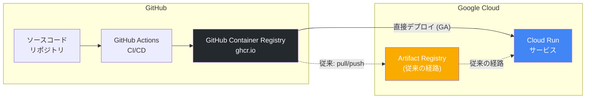

# Cloud Run: GitHub Container Registry (ghcr.io) からのコンテナイメージインポートが GA

**リリース日**: 2026-07-14

**サービス**: Cloud Run

**機能**: GitHub Container Registry Import Support

**ステータス**: GA (一般提供)

[このアップデートのインフォグラフィックを見る](https://takech9203.github.io/google-cloud-news-summary/20260714-cloud-run-ghcr-import-ga.html)

## 概要

Cloud Run が GitHub Container Registry (ghcr.io) からのパブリックコンテナイメージの直接デプロイを一般提供 (GA) として正式にサポートした。これにより、GitHub Container Registry に公開されているコンテナイメージを、Artifact Registry への事前コピーなしに Cloud Run へ直接デプロイできるようになった。

この機能は、GitHub でソースコードを管理し、GitHub Actions でコンテナイメージをビルドしている開発チームにとって、CI/CD パイプラインの大幅な簡素化を実現する。従来は GitHub Container Registry から Artifact Registry へのイメージ転送ステップが必要だったが、今回の GA によりそのステップを省略して直接デプロイが可能になった。

対象ユーザーは、GitHub エコシステムを活用して開発を行い、Google Cloud 上でサービスを運用するチーム、OSS プロジェクトを Cloud Run にデプロイしたいユーザー、および GitHub Actions ベースの CI/CD パイプラインを構築しているエンジニアである。

**アップデート前の課題**

- GitHub Container Registry のパブリックイメージを Cloud Run にデプロイするには、Artifact Registry へのコピーまたはリモートリポジトリの設定が必要だった
- CI/CD パイプラインに Docker pull/push のステップを追加する必要があり、デプロイ時間が増加していた
- Artifact Registry のストレージコストが二重に発生する場合があった
- GitHub Actions と Cloud Run 間のデプロイフローが複雑で、設定ミスによるデプロイ失敗のリスクがあった

**アップデート後の改善**

- ghcr.io のパブリックイメージ URL を直接指定して Cloud Run にデプロイ可能になった
- CI/CD パイプラインからイメージ転送ステップを削除でき、デプロイ時間が短縮された
- Artifact Registry を経由しないため、中間ストレージのコストが不要になった
- GA ステータスにより本番環境での利用が公式にサポートされ、SLA の対象となった

## アーキテクチャ図



GitHub Container Registry から Cloud Run へのデプロイフローを示す。実線が今回 GA となった直接デプロイパス、破線が従来の Artifact Registry を経由するパスを表す。

## サービスアップデートの詳細

### 主要機能

1. **パブリックイメージの直接デプロイ**
   - ghcr.io に公開されているコンテナイメージを直接指定してデプロイ可能
   - イメージはデプロイ時に Cloud Run にインポートされ、キャッシュされる
   - イメージのキャッシュは最大 1 時間保持される

2. **標準的なデプロイコマンドでの利用**
   - `gcloud run deploy` コマンドで ghcr.io の URL を直接指定可能
   - Google Cloud Console からの GUI デプロイにも対応
   - Terraform、YAML 設定ファイルからのデプロイも可能

3. **プライベートイメージへの対応 (Artifact Registry リモートリポジトリ経由)**
   - プライベートイメージの場合は Artifact Registry リモートリポジトリを設定することで対応可能
   - リモートリポジトリがプロキシとして機能し、キャッシュと認証を管理

## 技術仕様

### サポートされるレジストリとイメージ

| 項目 | 詳細 |
|------|------|
| サポートレジストリ | GitHub Container Registry (ghcr.io) |
| イメージ種別 | パブリックイメージ (直接デプロイ) |
| プライベートイメージ | Artifact Registry リモートリポジトリ経由で対応 |
| キャッシュ期間 | 最大 1 時間 |
| イメージレイヤー上限 | 9.9 GB (外部レジストリ経由の場合) |
| イメージ形式 | Docker イメージ (OCI 互換) |

### 対応するデプロイ方法

| 方法 | サポート状況 |
|------|------|
| gcloud CLI | 対応 |
| Google Cloud Console | 対応 |
| Terraform | 対応 |
| YAML (gcloud run services replace) | 対応 |
| Cloud Code (IDE プラグイン) | 対応 |

## 設定方法

### 前提条件

1. Google Cloud プロジェクトが作成済みであること
2. Cloud Run API が有効化されていること
3. デプロイ対象のイメージが ghcr.io でパブリック公開されていること
4. 必要な IAM ロール (Cloud Run Developer、Service Account User) が付与されていること

### 手順

#### ステップ 1: ghcr.io のパブリックイメージを直接デプロイ

```bash
# GitHub Container Registry のパブリックイメージを直接 Cloud Run にデプロイ
gcloud run deploy my-service \
  --image ghcr.io/OWNER/IMAGE:TAG \
  --region us-central1 \
  --allow-unauthenticated
```

`OWNER` は GitHub ユーザー名または Organization 名、`IMAGE` はリポジトリ名、`TAG` はイメージタグを指定する。

#### ステップ 2: デプロイの確認

```bash
# サービスの状態を確認
gcloud run services describe my-service --region us-central1

# サービス URL を取得
gcloud run services describe my-service --region us-central1 --format="value(status.url)"
```

デプロイが完了すると、Cloud Run がイメージをインポートし、サービスが利用可能になる。

#### ステップ 3: GitHub Actions との統合 (オプション)

```yaml
# .github/workflows/deploy.yml
name: Deploy to Cloud Run
on:
  push:
    branches: [main]

jobs:
  deploy:
    runs-on: ubuntu-latest
    permissions:
      packages: write
      contents: read
    steps:
      - uses: actions/checkout@v4

      - name: Login to GitHub Container Registry
        uses: docker/login-action@v3
        with:
          registry: ghcr.io
          username: ${{ github.actor }}
          password: ${{ secrets.GITHUB_TOKEN }}

      - name: Build and push
        uses: docker/build-push-action@v5
        with:
          push: true
          tags: ghcr.io/${{ github.repository }}:${{ github.sha }}

      - name: Deploy to Cloud Run
        uses: google-github-actions/deploy-cloudrun@v2
        with:
          service: my-service
          image: ghcr.io/${{ github.repository }}:${{ github.sha }}
          region: us-central1
```

GitHub Actions でイメージをビルドし、ghcr.io にプッシュした後、直接 Cloud Run にデプロイするワークフロー例。

## メリット

### ビジネス面

- **CI/CD パイプラインの簡素化**: Artifact Registry への中間コピーが不要になり、デプロイフローがシンプルになる
- **デプロイ時間の短縮**: イメージ転送ステップの削除により、リリースサイクルが高速化される
- **コスト削減**: 中間ストレージ (Artifact Registry) のストレージ料金が不要になるケースがある

### 技術面

- **GitHub エコシステムとのシームレスな統合**: GitHub Actions から直接 Cloud Run にデプロイ可能
- **運用負荷の軽減**: Artifact Registry リポジトリの管理やイメージ同期の設定が不要
- **GA ステータスによる信頼性**: SLA の対象となり、本番ワークロードでの利用が公式サポートされる
- **OSS イメージの直接利用**: GitHub で公開されている OSS コンテナイメージを追加設定なしでデプロイ可能

## デメリット・制約事項

### 制限事項

- パブリックイメージのみ直接デプロイに対応。プライベートイメージは Artifact Registry リモートリポジトリの設定が必要
- イメージレイヤーサイズは 9.9 GB が上限
- キャッシュ期間が最大 1 時間であるため、頻繁なイメージ更新時にはキャッシュが古い可能性がある
- 高可用性が必要な場合は Artifact Registry リモートリポジトリの利用が推奨される

### 考慮すべき点

- ghcr.io の可用性に依存するため、GitHub の障害時にはデプロイに影響する可能性がある
- Artifact Registry に比べてイメージの脆弱性スキャン (Artifact Analysis) が直接適用されない
- 組織のセキュリティポリシーによっては、外部レジストリからの直接デプロイが制限される場合がある
- VPC Service Controls 環境では追加の設定が必要になる場合がある

## ユースケース

### ユースケース 1: OSS プロジェクトの Cloud Run デプロイ

**シナリオ**: GitHub で公開されている OSS のウェブアプリケーションやツールを、自社の Google Cloud 環境で素早くデプロイしたい場合。

**実装例**:
```bash
# 公開 OSS イメージを直接デプロイ
gcloud run deploy oss-app \
  --image ghcr.io/open-source-org/web-app:v2.1.0 \
  --region asia-northeast1 \
  --allow-unauthenticated
```

**効果**: Artifact Registry へのコピーなしに数秒でデプロイ完了。OSS の新バージョンリリース時も即座に反映可能。

### ユースケース 2: GitHub Actions ベースの CI/CD パイプライン

**シナリオ**: GitHub でソースコードを管理し、GitHub Actions でビルド・テスト・デプロイまでを一貫して行いたいチーム。

**効果**: GitHub エコシステム内で完結する CI/CD パイプラインを構築でき、Google Cloud 側の設定を最小限に抑えられる。デプロイパイプラインの保守コストが削減される。

### ユースケース 3: マルチクラウド環境でのコンテナ共有

**シナリオ**: 複数のクラウドプロバイダーにまたがってサービスを運用しており、GitHub Container Registry を共通のイメージレジストリとして使用している場合。

**効果**: 同一のコンテナイメージを各クラウドプロバイダーに直接デプロイでき、レジストリの一元管理が可能になる。

## 料金

Cloud Run のデプロイ自体に追加料金は発生しない。コンテナイメージのインポートに伴うネットワーク転送料金も課金対象外である。料金は Cloud Run サービスの実行時リソース (vCPU、メモリ、リクエスト数) に基づいて発生する。

### 料金例 (Cloud Run 実行時)

| 項目 | 料金 (Tier 1 リージョン) |
|------|--------------------------|
| vCPU | $0.00002400/vCPU 秒 |
| メモリ | $0.00000250/GiB 秒 |
| リクエスト | $0.40/100 万リクエスト |
| 無料枠 (vCPU) | 毎月 180,000 vCPU 秒 |
| 無料枠 (メモリ) | 毎月 360,000 GiB 秒 |
| 無料枠 (リクエスト) | 毎月 200 万リクエスト |

## 利用可能リージョン

Cloud Run が利用可能な全リージョンで GitHub Container Registry からのデプロイが可能。Tier 1 リージョン (東京: asia-northeast1、米国: us-central1 など) および Tier 2 リージョン (ソウル: asia-northeast3、シドニー: australia-southeast1 など) の全リージョンで利用可能。

## 関連サービス・機能

- **Artifact Registry**: Google Cloud のコンテナレジストリ。プライベートイメージの管理や脆弱性スキャンが必要な場合に推奨。リモートリポジトリ機能で ghcr.io をプロキシとして構成可能
- **Cloud Build**: Google Cloud ネイティブの CI/CD サービス。GitHub リポジトリと連携してイメージビルドとデプロイを自動化
- **Artifact Analysis**: コンテナイメージの脆弱性スキャンサービス。Artifact Registry に格納されたイメージに対して自動スキャンを実行
- **Docker Hub**: もう一つの直接デプロイ対応レジストリ。Docker Official Images のデプロイに利用可能

## 参考リンク

- [インフォグラフィック](https://takech9203.github.io/google-cloud-news-summary/20260714-cloud-run-ghcr-import-ga.html)
- [公式リリースノート](https://docs.cloud.google.com/release-notes#July_14_2026)
- [Cloud Run コンテナデプロイ ドキュメント](https://docs.cloud.google.com/run/docs/deploying)
- [Artifact Registry リモートリポジトリ](https://docs.cloud.google.com/artifact-registry/docs/repositories/remote-repo)
- [Cloud Run 料金ページ](https://cloud.google.com/run/pricing)

## まとめ

Cloud Run の GitHub Container Registry (ghcr.io) からのパブリックイメージ直接デプロイが GA となったことで、GitHub エコシステムを活用した CI/CD パイプラインが大幅に簡素化される。本番環境での利用が公式にサポートされたため、GitHub Actions でビルドしたイメージを Artifact Registry を経由せずに直接 Cloud Run にデプロイするワークフローを検討すべきである。プライベートイメージや高可用性が必要な場合は、引き続き Artifact Registry リモートリポジトリの利用を推奨する。

---

**タグ**: #CloudRun #GitHubContainerRegistry #ghcr #GA #コンテナデプロイ #CI/CD #GitHub #GoogleCloud
