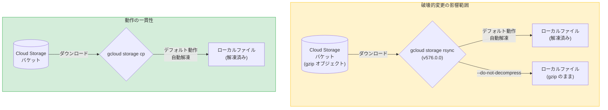

# Cloud SDK: 576.0.0 リリース

**リリース日**: 2026-07-14

**サービス**: Cloud SDK (gcloud CLI)

**機能**: Cloud SDK 576.0.0 - 破壊的変更、セキュリティ修正、多数の GA 昇格

**ステータス**: GA

📊 [このアップデートのインフォグラフィックを見る](https://takech9203.github.io/google-cloud-news-summary/20260714-cloud-sdk-576-0-0.html)

## 概要

Cloud SDK 576.0.0 は、2 つの破壊的変更を含む大型リリースです。最も影響が大きいのは `gcloud storage rsync` コマンドのデフォルト動作変更で、ダウンロード時に gzip ファイルが自動解凍されるようになりました。これは `gcloud storage cp` との動作一貫性を確保するための変更です。また、Linux 環境でバンドルされている Python が 3.14.6 に更新され、CVE-2026-34182 が修正されています。

本リリースでは、BigLake、Cloud Dataproc、Cloud IAP、Cloud KMS、Compute Engine、GKE、Looker、Developer Connect など多数のサービスで機能が GA に昇格しました。特に GKE の Rollbackable Upgrades (Two-Step Upgrades) は、コントロールプレーンのマイナーバージョンアップグレード時にロールバック可能な安全策を提供する重要な機能です。

新機能としては、Cloud Data Lineage の新コマンドグループ、Cloud KMS のシングルテナント HSM 関連フラグ、Compute Engine の多数の IAM コマンド追加などが含まれます。

**アップデート前の課題**

- `gcloud storage rsync` と `gcloud storage cp` で gzip ファイルのダウンロード時の動作が異なっていた (rsync は圧縮状態のまま保存、cp は自動解凍)
- Linux 環境のバンドル Python に CVE-2026-34182 の脆弱性が存在していた
- GKE のコントロールプレーンのマイナーバージョンアップグレードで、問題発生時にロールバックする手段が限定的だった (Preview のみ)
- Cloud KMS の trusted key wrapping 機能が Beta 段階だった

**アップデート後の改善**

- `gcloud storage rsync` が `gcloud storage cp` と同じ解凍動作をデフォルトで行い、一貫性が向上した
- `--do-not-decompress` フラグで従来の動作 (圧縮状態を維持) を選択可能
- CVE-2026-34182 が修正され、セキュリティリスクが解消された
- GKE の Two-Step Upgrades が GA となり、本番環境で安全にマイナーバージョンアップグレードが可能に
- Cloud KMS の export-trusted-key-wrapped / import-trusted-key-wrapped が GA に昇格

## アーキテクチャ図



この図は、v576.0.0 での `gcloud storage rsync` の動作変更を示しています。従来は gzip ファイルを圧縮状態のままダウンロードしていましたが、今回の変更で `gcloud storage cp` と同様に自動解凍がデフォルトになりました。

## サービスアップデートの詳細

### 破壊的変更

1. **gcloud storage rsync の gzip 自動解凍 (Cloud Storage)**
   - ダウンロード時に gzip ファイルがデフォルトで自動解凍されるようになった
   - `gcloud storage cp` と同じ動作に統一
   - 従来の動作 (gzip のまま保存) を維持するには `--do-not-decompress` フラグを使用
   - Cloud Storage のデコンプレッシブトランスコーディング (Content-Encoding: gzip が設定されたオブジェクト) に影響

2. **Linux バンドル Python の更新**
   - Python 3.14.6 に更新
   - CVE-2026-34182 のセキュリティ脆弱性を修正
   - gcloud CLI を Linux で使用しているすべてのユーザーに適用

### GA 昇格 (主要なもの)

1. **BigLake: Delta Sharing / Data Product Sharing**
   - `gcloud biglake delta-sharing <catalogs|shares|schemas|tables>` が GA
   - `gcloud biglake data-product-sharing publish` が GA
   - データ共有のワークフローが本番環境で利用可能に

2. **Cloud Dataproc: PySpark Notebook バッチ実行**
   - `gcloud dataproc batches submit pyspark-notebook` が GA
   - Jupyter Notebook をバッチジョブとして直接実行可能

3. **Cloud IAP: Agent Registry リソースタイプ**
   - `gcloud iap web` IAM コマンドで agent-registry リソースタイプが GA
   - エージェントレジストリの IAM 制御が本番環境で可能に

4. **Cloud KMS: Trusted Key Wrapping**
   - `gcloud kms keys versions export-trusted-key-wrapped` が GA
   - `gcloud kms keys versions import-trusted-key-wrapped` が GA
   - HSM 間での信頼できる鍵のエクスポート/インポートが本番利用可能に

5. **Compute Engine: 複数コマンドの GA 昇格**
   - 多数の IAM コマンド (test-iam-permissions) が GA
   - `--nat-ips-per-endpoint` フラグが GA
   - `--on-repair-allow-changing-zone` フラグが GA

6. **GKE: Rollbackable Upgrades (Two-Step Upgrades)**
   - `--control-plane-soak-duration` フラグが GA
   - コントロールプレーンのマイナーバージョンアップグレードを 2 段階で実行
   - ソーク期間中 (6 時間〜7 日間) にロールバック可能
   - `--managed-otel-scope` も GA に昇格

7. **Looker: Release Channel と Accelerated Security Patch**
   - `--release-channel` フラグが GA
   - `--accelerated-security-patch-enabled` フラグが GA
   - リリースチャネル選択とセキュリティパッチ高速適用が本番利用可能に

8. **Developer Connect: Insights Configs Deployment Events**
   - `insights-configs deployment-events` が GA
   - デプロイメントイベントのインサイト設定が本番利用可能に

### 新機能

1. **GKE: VPA Decision Logs、nodeVfioConfig、diskIoScheduler**
   - KCP_VPA オプションで VPA の意思決定ログを取得可能
   - nodeVfioConfig でノードレベルの VFIO 設定
   - diskIoScheduler でディスク I/O スケジューラの設定

2. **Cloud KMS: シングルテナント HSM**
   - `--hsm-trusted-wrapping` フラグが keys create / versions import に追加
   - `--crypto-key-version-name` と `--two-factor-public-key-pem` フラグが single-tenant-hsm proposal create に追加

3. **Compute Engine: 新コマンド**
   - 多数の `test-iam-permissions` コマンドが追加
   - `gcloud compute disks bulk set-labels` が追加
   - `gcloud compute hosts` が Beta に昇格

4. **Cloud Data Lineage: 新コマンドグループ**
   - `gcloud datalineage runs` コマンドグループ (データリネージの実行管理)
   - `gcloud datalineage lineage-events` コマンドグループ (リネージイベント管理)
   - プロセス、実行、リネージイベントの作成・一覧・記述・削除が可能

5. **Cloud Dataplex: 新フラグ**
   - `--enable-catalog-publishing` フラグ (データドキュメンテーションスキャン)
   - `--mode` フラグ (データプロファイルスキャンのプロファイリングモード指定)

6. **Cluster Director: Lustre 動的ティア**
   - `gcloud cluster-director clusters` で Lustre 動的ティアをサポート

## 技術仕様

### 破壊的変更: gcloud storage rsync の動作変更

| 項目 | v575.x.x 以前 | v576.0.0 以降 |
|------|--------------|--------------|
| gzip ファイルのダウンロード | 圧縮状態のまま保存 | 自動解凍して保存 (デフォルト) |
| 従来動作の維持方法 | N/A | `--do-not-decompress` フラグ |
| `gcloud storage cp` との一貫性 | 不一致 | 一致 |
| 影響条件 | N/A | Content-Encoding: gzip が設定されたオブジェクト |

### GKE Two-Step Upgrades の仕様

| 項目 | 詳細 |
|------|------|
| ソーク期間 | 最小 6 時間〜最大 7 日間 |
| ロールバック可能期間 | バイナリアップグレード完了後、エミュレートバージョンアップグレード前まで |
| 対象バージョン | 1.33 以降へのマイナーバージョンアップグレード |
| 自動アップグレード | ソーク期間中は無効化 |

### セキュリティ修正

| 項目 | 詳細 |
|------|------|
| CVE ID | CVE-2026-34182 |
| 対象 | Linux バンドル Python |
| 修正バージョン | Python 3.14.6 |
| 影響範囲 | Linux 環境で gcloud CLI を使用するすべてのユーザー |

## 設定方法

### 前提条件

1. Cloud SDK がインストールされていること
2. 適切な IAM 権限が設定されていること

### 手順

#### ステップ 1: Cloud SDK のアップデート

```bash
# Cloud SDK を最新バージョンに更新
gcloud components update

# バージョン確認
gcloud version
# Google Cloud SDK 576.0.0
```

#### ステップ 2: 破壊的変更への対応 (gcloud storage rsync)

```bash
# 従来の動作を維持する場合 (gzip ファイルを解凍せずにダウンロード)
gcloud storage rsync gs://my-bucket/data ./local-data --do-not-decompress --recursive

# 新しいデフォルト動作 (gzip ファイルを自動解凍してダウンロード)
gcloud storage rsync gs://my-bucket/data ./local-data --recursive
```

既存のスクリプトで `gcloud storage rsync` を使用している場合、gzip ファイルの取り扱いに注意が必要です。

#### ステップ 3: GKE Two-Step Upgrade の利用 (GA)

```bash
# 2 段階アップグレードの開始 (ソーク期間: 2 日 1 時間)
gcloud container clusters upgrade my-cluster \
  --location=us-central1 \
  --cluster-version=1.34.1-gke.1829001 \
  --control-plane-soak-duration=2d1h \
  --master

# ソーク期間中のロールバック (問題発生時)
gcloud container clusters upgrade my-cluster \
  --location=us-central1 \
  --cluster-version=1.33.x-gke.xxxxxxx \
  --master

# ソーク期間のスキップ (検証完了時)
gcloud container clusters complete-control-plane-upgrade my-cluster \
  --location=us-central1
```

## メリット

### ビジネス面

- **運用の一貫性向上**: `gcloud storage cp` と `rsync` の動作統一により、ストレージ操作の予測可能性が向上
- **セキュリティリスク低減**: CVE-2026-34182 の修正により、Linux 環境での gcloud CLI 利用がより安全に
- **本番環境での安全なアップグレード**: GKE Two-Step Upgrades の GA により、マイナーバージョンアップグレードのリスクを大幅に軽減

### 技術面

- **データリネージの CLI 管理**: Cloud Data Lineage のコマンドグループ追加により、リネージ情報の管理がプログラマティックに可能に
- **HSM 鍵管理の強化**: Cloud KMS の trusted key wrapping GA により、鍵のエクスポート/インポートがより安全に
- **ストレージ同期の最適化**: Parallel Composite Uploads の一時パーツのアトミッククリーンアップにより、ソフト削除コストを回避

## デメリット・制約事項

### 制限事項

- `gcloud storage rsync` の動作変更は後方互換性がないため、既存スクリプトの修正が必要な場合がある
- GKE Two-Step Upgrades は 1.33 以降へのマイナーバージョンアップグレードのみ対応
- Two-Step Upgrades のソーク期間中はコントロールプレーンとノードの自動アップグレードが無効化される
- `--do-not-decompress` フラグは、Cloud Storage のデコンプレッシブトランスコーディング対象オブジェクト (Content-Encoding: gzip が設定されたもの) にのみ関係する

### 考慮すべき点

- **CI/CD パイプラインへの影響**: `gcloud storage rsync` を使用する自動化スクリプトでは、ダウンロード後のファイルサイズやファイル形式が変わる可能性がある
- **整合性チェックの影響**: デコンプレッシブトランスコーディングが発生すると、CRC32c/MD5 チェックサムが元のオブジェクトと一致しなくなる
- **Python バージョン依存**: Linux 環境で gcloud CLI のバンドル Python に依存するスクリプトは、Python 3.14.6 への更新に伴う互換性確認が推奨される

## ユースケース

### ユースケース 1: CI/CD パイプラインでの gcloud storage rsync 移行

**シナリオ**: CI/CD パイプラインで `gcloud storage rsync` を使い、Cloud Storage バケットからデプロイ用のアセット (gzip 圧縮された JavaScript/CSS ファイル) を同期している場合。

**実装例**:
```bash
# 移行前: v576.0.0 以前の動作を維持するスクリプト
gcloud storage rsync gs://my-assets-bucket/dist ./deploy/assets \
  --do-not-decompress \
  --recursive

# 移行後: 新しいデフォルト動作を活用 (解凍済みファイルを直接デプロイ)
gcloud storage rsync gs://my-assets-bucket/dist ./deploy/assets \
  --recursive
```

**効果**: `--do-not-decompress` フラグの追加により既存の CI/CD パイプラインを即座に修正可能。長期的には、新しいデフォルト動作を活用してデプロイプロセスを簡素化できる。

### ユースケース 2: GKE クラスタの安全なマイナーバージョンアップグレード

**シナリオ**: 本番環境の GKE クラスタを 1.33 から 1.34 にアップグレードする際に、ワークロードの互換性を確認しながら安全に進めたい場合。

**実装例**:
```bash
# Step 1: 2 段階アップグレードを開始 (3 日間のソーク期間)
gcloud container clusters upgrade production-cluster \
  --location=asia-northeast1 \
  --cluster-version=1.34.1-gke.1829001 \
  --control-plane-soak-duration=3d \
  --master

# Step 2: ソーク期間中にモニタリング
# - アプリケーションメトリクス、ログ、Pod ステータスを確認
# - エラーレートとレイテンシを監視

# Step 3a: 問題なければアップグレード完了
gcloud container clusters complete-control-plane-upgrade production-cluster \
  --location=asia-northeast1

# Step 3b: 問題発生時はロールバック
gcloud container clusters upgrade production-cluster \
  --location=asia-northeast1 \
  --cluster-version=1.33.5-gke.1080000 \
  --master
```

**効果**: マイナーバージョンアップグレードのリスクを大幅に低減。問題発生時に即座にロールバックでき、本番環境の安定性を維持しながら最新バージョンへの移行が可能。

## 料金

Cloud SDK 自体は無料で提供されています。本リリースに含まれる機能 (GKE Two-Step Upgrades、Cloud KMS trusted key wrapping など) の利用料金は、それぞれのサービスの料金体系に従います。

## 利用可能リージョン

Cloud SDK はグローバルに利用可能です。各サービスの GA 昇格機能のリージョン可用性は、それぞれのサービスのドキュメントを参照してください。

## 関連サービス・機能

- **Cloud Storage**: gcloud storage rsync / cp の動作変更に直接関連。デコンプレッシブトランスコーディングの理解が重要
- **GKE (Google Kubernetes Engine)**: Rollbackable Upgrades、VPA Decision Logs、managed-otel-scope の GA 昇格
- **Cloud KMS**: trusted key wrapping の GA、シングルテナント HSM の新機能
- **Cloud Data Lineage**: 新コマンドグループの追加。Data Catalog との連携
- **BigLake**: Delta Sharing / Data Product Sharing の GA。データメッシュアーキテクチャの実現
- **Compute Engine**: IAM コマンドの拡充、hosts コマンドの Beta 昇格

## 参考リンク

- 📊 [インフォグラフィック](https://takech9203.github.io/google-cloud-news-summary/20260714-cloud-sdk-576-0-0.html)
- [公式リリースノート](https://docs.cloud.google.com/release-notes#July_14_2026)
- [Cloud SDK リリースノート (全バージョン)](https://docs.cloud.google.com/sdk/docs/release-notes)
- [gcloud storage rsync リファレンス](https://docs.cloud.google.com/sdk/gcloud/reference/storage/rsync)
- [Cloud Storage トランスコーディング](https://docs.cloud.google.com/storage/docs/transcoding)
- [GKE クラスタアップグレード](https://docs.cloud.google.com/kubernetes-engine/docs/how-to/upgrading-a-cluster)
- [Cloud KMS 鍵のインポート](https://docs.cloud.google.com/kms/docs/key-import)
- [Cloud Data Lineage](https://cloud.google.com/data-catalog/docs/concepts/about-data-lineage)

## まとめ

Cloud SDK 576.0.0 は、`gcloud storage rsync` の動作変更とセキュリティ修正を含む重要なリリースです。特に rsync を使用する既存のスクリプトや CI/CD パイプラインでは `--do-not-decompress` フラグの追加を検討してください。GKE Two-Step Upgrades の GA 昇格により、本番環境のクラスタアップグレードがより安全に実施可能になりました。Linux 環境を利用しているユーザーは、CVE-2026-34182 対策のため早急なアップデートを推奨します。

---

**タグ**: #CloudSDK #gcloud #CloudStorage #GKE #CloudKMS #BreakingChange #Security #GA #BigLake #ComputeEngine #DataLineage #Dataproc #Dataplex
