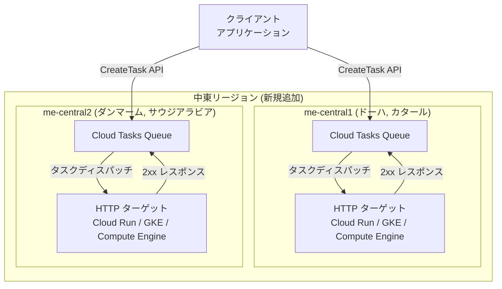

# Cloud Tasks: 中東リージョン (me-central1, me-central2) での提供開始

**リリース日**: 2026-07-14

**サービス**: Cloud Tasks

**機能**: 中東リージョン拡張 (me-central1, me-central2)

**ステータス**: GA (一般提供)

[このアップデートのインフォグラフィックを見る](https://takech9203.github.io/google-cloud-news-summary/20260714-cloud-tasks-me-central-regions.html)

## 概要

Cloud Tasks が新たに me-central1 (ドーハ、カタール) および me-central2 (ダンマーム、サウジアラビア) リージョンで利用可能になりました。これにより、中東地域のユーザーは低レイテンシで非同期タスク処理を実行できるようになります。

Cloud Tasks は、非同期タスクの実行を管理するフルマネージドサービスです。HTTP ターゲットや App Engine ターゲットに対してタスクをディスパッチし、信頼性の高いレート制御やリトライ機能を提供します。今回のリージョン拡張により、中東地域のデータレジデンシー要件を満たしつつ、タスクキューイング機能を活用できるようになります。

**アップデート前の課題**

- 中東地域に拠点を持つ組織が Cloud Tasks を利用する場合、ヨーロッパやアジアのリージョンを使用する必要があり、レイテンシが高かった
- カタールやサウジアラビアのデータレジデンシー規制に対応するためには、Cloud Tasks の利用を断念するか、別のアーキテクチャを検討する必要があった
- 中東地域のエンドユーザーに対するタスク処理のレスポンスが地理的距離により遅延していた

**アップデート後の改善**

- me-central1 (ドーハ) と me-central2 (ダンマーム) でキューを作成し、低レイテンシでタスクを処理できるようになった
- カタールおよびサウジアラビアのデータレジデンシー要件に準拠した非同期処理が可能になった
- 中東地域の Cloud Run、GKE、Compute Engine ワークロードとの統合がリージョン内で完結するようになった

## アーキテクチャ図



Cloud Tasks の中東リージョンでの基本的なタスク処理フローを示しています。クライアントアプリケーションが CreateTask API でタスクを作成し、Cloud Tasks がキューからワーカーにディスパッチします。

## サービスアップデートの詳細

### 主要機能

1. **me-central1 (ドーハ、カタール) での利用開始**
   - カタール国内でのデータ処理が可能に
   - HTTP ターゲットおよび App Engine ターゲットの両方をサポート
   - 既存のリージョンと同じ API および機能セットを提供

2. **me-central2 (ダンマーム、サウジアラビア) での利用開始**
   - サウジアラビア国内でのデータ処理が可能に
   - 同様に全てのターゲットタイプをサポート
   - GCC (湾岸協力会議) 諸国向けのワークロード配置に最適

3. **既存機能との完全互換**
   - レート制限 (最大 500 dispatches/秒)
   - リトライ設定 (最大 100 回の試行)
   - タスク重複排除 (タスク名による)
   - HTTP ターゲットのタイムアウト (デフォルト 10 分、最大 30 分)

## 技術仕様

### リージョン情報

| リージョン | ロケーション | 国 |
|------|------|------|
| me-central1 | ドーハ | カタール |
| me-central2 | ダンマーム | サウジアラビア |

### キューのデフォルト設定

| 項目 | 値 |
|------|------|
| maxDispatchesPerSecond | 500 |
| maxBurstSize | 100 |
| maxConcurrentDispatches | 1000 |
| maxAttempts | 100 |
| minBackoff | 0.100s |
| maxBackoff | 3600s |
| maxDoublings | 16 |

## 設定方法

### 前提条件

1. Google Cloud プロジェクトが作成済みであること
2. Cloud Tasks API が有効化されていること
3. 適切な IAM 権限 (roles/cloudtasks.admin または roles/cloudtasks.enqueuer) が付与されていること

### 手順

#### ステップ 1: me-central1 にキューを作成

```bash
gcloud tasks queues create my-queue \
  --location=me-central1
```

ドーハリージョンにタスクキューを作成します。

#### ステップ 2: me-central2 にキューを作成

```bash
gcloud tasks queues create my-queue \
  --location=me-central2
```

ダンマームリージョンにタスクキューを作成します。

#### ステップ 3: タスクの作成

```bash
gcloud tasks create-http-task \
  --queue=my-queue \
  --location=me-central1 \
  --url=https://my-service-xxxxx.run.app/handler \
  --method=POST \
  --body-content='{"key": "value"}'
```

作成したキューに HTTP ターゲットタスクを追加します。

## メリット

### ビジネス面

- **データレジデンシー対応**: カタールおよびサウジアラビアのデータ主権要件を満たしつつ、Cloud Tasks のフルマネージド機能を利用可能
- **中東市場への展開加速**: 中東地域をターゲットとするアプリケーションのバックエンド非同期処理を低レイテンシで実現

### 技術面

- **低レイテンシ**: 中東地域のワーカーサービスへのタスクディスパッチが同一リージョン内で完結
- **フルマネージド**: インフラ管理不要で、信頼性の高いタスクキューイングをリージョン内で利用可能

## デメリット・制約事項

### 制限事項

- 組織ポリシーで `us-central1` または `us-central2` のいずれかを制限する場合、両方のリージョンをポリシーに含める必要がある (Cloud Tasks 共通の制約)
- App Engine ターゲットを使用する場合、App Engine アプリが同一リージョンに存在する必要がある

### 考慮すべき点

- 新規リージョンでキューが利用可能になるまで数分かかる場合がある
- 削除したキューと同じ名前のキューを同一リージョンで再作成するには 7 日間待つ必要がある

## ユースケース

### ユースケース 1: 中東向け E コマースプラットフォームの注文処理

**シナリオ**: カタールやサウジアラビアで運営する E コマースサイトが、注文確認メール送信や在庫更新を非同期処理する

**実装例**:
```bash
gcloud tasks create-http-task \
  --queue=order-processing \
  --location=me-central1 \
  --url=https://order-service.run.app/process \
  --method=POST \
  --oidc-service-account-email=tasks-sa@my-project.iam.gserviceaccount.com
```

**効果**: 注文処理の非同期化により、ユーザーへのレスポンスが高速化し、リージョン内でデータが処理されるためコンプライアンス要件を満たす

### ユースケース 2: 金融サービスのバッチ処理

**シナリオ**: サウジアラビアの金融機関が、日次のトランザクション集計や報告書生成を Cloud Tasks で管理する

**効果**: データが me-central2 リージョン内に留まることで、金融規制のデータローカライゼーション要件に対応しつつ、信頼性の高い非同期処理を実現

## 料金

Cloud Tasks の料金はリージョンに関わらず共通の料金体系が適用されます。詳細は公式料金ページを参照してください。

## 利用可能リージョン

今回の追加により、Cloud Tasks は以下の中東リージョンで利用可能になりました。

| リージョン | ロケーション | ステータス |
|------|------|------|
| me-central1 | ドーハ、カタール | 新規追加 |
| me-central2 | ダンマーム、サウジアラビア | 新規追加 |

既存の利用可能リージョンには、Americas (9 リージョン)、Europe (5 リージョン)、Asia Pacific (9 リージョン) が含まれます。

## 関連サービス・機能

- **Cloud Run**: HTTP ターゲットとして Cloud Tasks と統合し、非同期リクエストを処理するワーカーとして機能
- **Cloud Scheduler**: 定期的なジョブスケジューリングに使用。Cloud Tasks と組み合わせることで、スケジュールベースのタスクキューイングが可能
- **Pub/Sub**: イベント駆動型メッセージングサービス。Cloud Tasks がリクエスト/レスポンス型であるのに対し、Pub/Sub はパブリッシュ/サブスクライブモデルを提供

## 参考リンク

- [インフォグラフィック](https://takech9203.github.io/google-cloud-news-summary/20260714-cloud-tasks-me-central-regions.html)
- [公式リリースノート](https://docs.cloud.google.com/release-notes#July_14_2026)
- [Cloud Tasks ドキュメント](https://docs.cloud.google.com/tasks/docs)
- [Cloud Tasks ロケーション](https://docs.cloud.google.com/tasks/docs/locations)
- [Cloud Tasks 料金](https://cloud.google.com/tasks/pricing)
- [キューの作成](https://docs.cloud.google.com/tasks/docs/creating-queues)

## まとめ

Cloud Tasks の me-central1 (ドーハ) および me-central2 (ダンマーム) リージョン対応により、中東地域でのデータレジデンシー要件を満たしながら非同期タスク処理を利用できるようになりました。カタールやサウジアラビアに拠点を持つ組織は、既存のキューを新リージョンに作成し直すことで、低レイテンシかつコンプライアンス準拠のタスク処理基盤を構築できます。

---

**タグ**: #CloudTasks #リージョン拡張 #中東 #me-central1 #me-central2 #カタール #サウジアラビア #非同期処理
