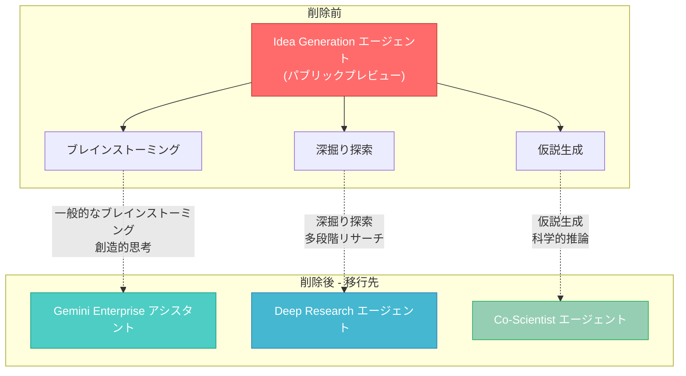

# Gemini Enterprise: Idea Generation エージェントの削除

**リリース日**: 2026-07-14

**サービス**: Gemini Enterprise

**機能**: Idea Generation エージェントの削除

**ステータス**: Announcement (削除)

[このアップデートのインフォグラフィックを見る](https://takech9203.github.io/google-cloud-news-summary/20260714-gemini-enterprise-idea-generation-removal.html)

## 概要

Gemini Enterprise の Idea Generation エージェントが、2026年7月14日の週をもって削除されました。このエージェントは2025年4月にプライベートプレビューとして導入され、2025年8月にパブリックプレビューへと移行したものですが、今回正式に提供終了となりました。

Idea Generation エージェントは、企業チームのイノベーションと問題解決を支援するために設計されたエージェントで、高度な AI とトーナメント方式の競争フレームワークを組み合わせてアイデアの生成とランク付けを行う機能を提供していました。今後、同様のニーズを持つユーザーは、用途に応じて Gemini Enterprise アシスタント、Deep Research エージェント、または Co-Scientist エージェントを使用することが推奨されています。

この変更は、Gemini Enterprise のエージェントポートフォリオの整理・統合の一環であり、各エージェントの専門性をより明確に分離する方向性を示しています。一般的なブレインストーミングはアシスタントに統合され、より高度な調査・研究用途には専用の Deep Research および Co-Scientist エージェントが対応します。

**アップデート前の課題**

- Idea Generation エージェントの機能が、アシスタントや他のエージェントと部分的に重複していた
- ユーザーが用途に応じてどのエージェントを使うべきか判断しにくい状況があった
- パブリックプレビューのまま GA に至らず、長期的なサポートや機能拡張が限定的だった

**アップデート後の改善**

- ブレインストーミング機能がアシスタントに統合され、追加のエージェント切り替えが不要になった
- Deep Research と Co-Scientist という専門性の高いエージェントに明確に機能が分離された
- エージェント選択の判断基準がシンプルになり、ユーザー体験が向上した

## アーキテクチャ図



Idea Generation エージェントの各機能に対する移行先を示す図。用途に応じて3つの代替手段から最適なものを選択できます。

## サービスアップデートの詳細

### 移行先エージェント

1. **Gemini Enterprise アシスタント**
   - 一般的なブレインストーミングや創造的思考に使用
   - チャット形式で即座にアイデアを生成可能
   - ファイルアップロード、コネクタ連携、メンション機能など豊富なコンテキスト入力に対応
   - コンテンツ作成支援 (ブログ記事、メール、ソーシャルメディア投稿のアウトライン生成など)

2. **Deep Research エージェント**
   - 深掘り探索や複合的なリサーチワークフローに使用
   - 計画 → 多ソース検索 → 反復 → 出力の多段階プロセスで詳細レポートを生成
   - Web 検索、エンタープライズデータ、MCP サーバーなど複数のソースに対応
   - インライン引用付きの包括的レポート、チャート、インフォグラフィックを出力
   - Agent ID: `deep-research-preview-04-2026`

3. **Co-Scientist エージェント**
   - 仮説生成や科学的推論に使用
   - マルチエージェントアーキテクチャ (Generation、Reflection、Ranking、Evolution、Proximity、Meta-review エージェント) による高度な推論
   - 薬剤リパーパシング、ターゲット発見、メカニズム解明などの科学的ユースケースに最適化
   - Elo ベースのトーナメントによる仮説の評価・優先順位付け

### 削除の経緯

1. **2025年4月9日**: Idea Generation がプライベートプレビューとして発表
2. **2025年8月1日**: パブリックプレビューに移行
3. **2026年7月14日**: エージェント削除 (本アップデート)

## 技術仕様

### 移行先エージェントの比較

| 項目 | アシスタント | Deep Research | Co-Scientist |
|------|-------------|---------------|--------------|
| 用途 | 一般的なブレインストーミング、創造的思考 | 深掘り探索、市場分析、競合調査 | 仮説生成、科学的推論 |
| レイテンシ | 秒単位 | 分単位 | 分〜時間単位 |
| 出力形式 | 会話形式テキスト | 引用付き詳細レポート | 研究仮説・実験提案 |
| データソース | コネクタ連携データ、アップロードファイル | Web、エンタープライズデータ、MCP | 文献検索、Web 検索 |
| ステータス | GA | Preview | Preview |
| アクセス制限 | なし (ライセンス保有者) | なし | 要アカウントチーム申請 |

### Deep Research の技術詳細

| 項目 | 詳細 |
|------|------|
| Agent ID | `deep-research-preview-04-2026` |
| 最大入力トークン | 1,048,576 |
| 最大出力トークン | 65,536 |
| 対応入力 | テキスト、PDF |
| 対応出力 | テキスト、画像 |
| サポートリージョン | Global |

## 移行手順

### 前提条件

1. Gemini Enterprise のアクティブなライセンス (Standard または Plus エディション)
2. Gemini Enterprise アプリへのアクセス権

### 手順

#### ステップ 1: 現在の Idea Generation 利用状況の確認

Idea Generation エージェントで実行していたワークフローを整理し、以下の3つのカテゴリに分類します。

- **一般的なブレインストーミング**: アシスタントへ移行
- **深掘り調査・分析**: Deep Research へ移行
- **科学的仮説生成**: Co-Scientist へ移行

#### ステップ 2: アシスタントでのブレインストーミング

アシスタントのチャットボックスで直接ブレインストーミングを実行できます。

```
プロンプト例:
「新しい顧客エンゲージメント戦略について10個のアイデアを出してください。
ターゲットはB2B SaaS企業で、解約率の低減が目標です。」
```

#### ステップ 3: Deep Research の利用

深掘り探索が必要な場合は、アプリのナビゲーションメニューから Deep Research を選択します。

1. ソースを選択 (Gemini Enterprise ソース、Google Search など)
2. リサーチプロンプトを入力
3. リサーチプランを確認・編集
4. 「Start Research」をクリックして実行

#### ステップ 4: Co-Scientist へのアクセス申請 (必要な場合)

Co-Scientist へのアクセスは制限されています。利用が必要な場合は Google アカウントチームに連絡してアクセスをリクエストしてください。

## メリット

### ビジネス面

- **エージェント選択の簡素化**: ユーザーが目的に応じた最適なツールを直感的に選択可能
- **専門性の向上**: 各エージェントが特化した領域でより高品質な出力を提供

### 技術面

- **プラットフォームの整理**: エージェントの機能重複を解消し、メンテナンス負荷を軽減
- **リソースの集中**: Deep Research や Co-Scientist など高度なエージェントの開発リソースを集中投下可能

## デメリット・制約事項

### 制限事項

- Idea Generation エージェントのトーナメント方式のアイデアランキング機能は、他のエージェントでは直接代替されない
- Co-Scientist へのアクセスにはアカウントチームへの申請が必要で、即座には利用開始できない
- Deep Research はプレビュー段階であり、SLA が提供されない

### 考慮すべき点

- 既存の Idea Generation ワークフローを自動化していた場合、移行先エージェントの API 対応状況を確認する必要がある
- Idea Generation で生成した過去のアイデアやセッション履歴へのアクセスが失われる可能性がある
- チームメンバーへの移行先の周知と利用方法のトレーニングが必要

## ユースケース

### ユースケース 1: 製品企画のブレインストーミング (アシスタントへ移行)

**シナリオ**: プロダクトマネージャーが新機能のアイデアを出したい

**実装例**:
```
アシスタントのチャットで:
「当社のプロジェクト管理ツールに追加すべき新機能を提案してください。
競合は Asana、Monday.com、Jira です。差別化ポイントを重視して、
5つのアイデアを出してください。」
```

**効果**: 即座にアイデアが生成され、対話形式で深掘りや絞り込みが可能

### ユースケース 2: 市場調査レポート (Deep Research へ移行)

**シナリオ**: 新規参入市場の競合分析と機会評価を行いたい

**効果**: 複数の情報源を横断して調査し、引用付きの包括的レポートを自動生成。Idea Generation のアイデア出しよりも深い分析が可能

### ユースケース 3: 創薬仮説の生成 (Co-Scientist へ移行)

**シナリオ**: 既存薬の新しい適応症を探索したい

**効果**: マルチエージェントによる文献調査・仮説生成・ピアレビュー・ランキングを自動実行。Idea Generation のトーナメント方式に近い評価プロセスを科学的に高度化

## 料金

Idea Generation エージェントの削除に伴う追加料金は発生しません。移行先の各エージェントは既存の Gemini Enterprise ライセンスで利用可能です。

| エージェント | 料金体系 |
|-------------|---------|
| アシスタント | Gemini Enterprise ライセンスに含まれる |
| Deep Research | Provisioned Throughput または Standard PayGo |
| Co-Scientist | 要問い合わせ (アカウントチーム経由) |

詳細な料金情報は [Gemini Enterprise Agent Platform Pricing](https://cloud.google.com/gemini-enterprise-agent-platform/generative-ai/pricing) を参照してください。

## 利用可能リージョン

移行先エージェントのリージョン対応状況:

| エージェント | リージョン |
|-------------|-----------|
| アシスタント | Global、US、EU |
| Deep Research | Global |
| Co-Scientist | 要確認 (アカウントチーム経由) |

## 関連サービス・機能

- **[Gemini Enterprise アシスタント](https://docs.cloud.google.com/gemini/enterprise/docs/assistant-chat)**: ブレインストーミングの主要な移行先。チャット形式で即座に利用可能
- **[Deep Research エージェント](https://docs.cloud.google.com/gemini/enterprise/docs/research-assistant)**: 深掘り探索と詳細レポート生成に最適化されたエージェント
- **[Co-Scientist エージェント](https://docs.cloud.google.com/gemini/enterprise/docs/co-scientist-and-alphaevolve)**: 科学的仮説生成と研究加速のためのマルチエージェントシステム
- **[AlphaEvolve エージェント](https://docs.cloud.google.com/gemini/enterprise/docs/alphaevolve/developer-guide/overview)**: アルゴリズム最適化エージェント (2026年7月9日に GA)
- **[Agent Designer](https://docs.cloud.google.com/gemini/enterprise/docs/agent-designer)**: ノーコードでカスタムエージェントを作成可能

## 参考リンク

- [インフォグラフィック](https://takech9203.github.io/google-cloud-news-summary/20260714-gemini-enterprise-idea-generation-removal.html)
- [公式リリースノート](https://docs.cloud.google.com/release-notes#July_14_2026)
- [Gemini Enterprise リリースノート](https://docs.cloud.google.com/gemini/enterprise/docs/release-notes)
- [アシスタントのドキュメント](https://docs.cloud.google.com/gemini/enterprise/docs/assistant-chat)
- [Deep Research のドキュメント](https://docs.cloud.google.com/gemini/enterprise/docs/research-assistant)
- [Co-Scientist のドキュメント](https://docs.cloud.google.com/gemini/enterprise/docs/co-scientist-and-alphaevolve)

## まとめ

Gemini Enterprise の Idea Generation エージェントは2026年7月14日の週に削除されました。今後はユースケースに応じて、一般的なブレインストーミングにはアシスタント、深掘り探索には Deep Research、科学的仮説生成には Co-Scientist を使用してください。既存ユーザーは速やかにワークフローの移行先を特定し、必要に応じて Co-Scientist へのアクセス申請を行うことを推奨します。

---

**タグ**: #GeminiEnterprise #IdeaGeneration #エージェント削除 #DeepResearch #CoScientist #移行ガイド
