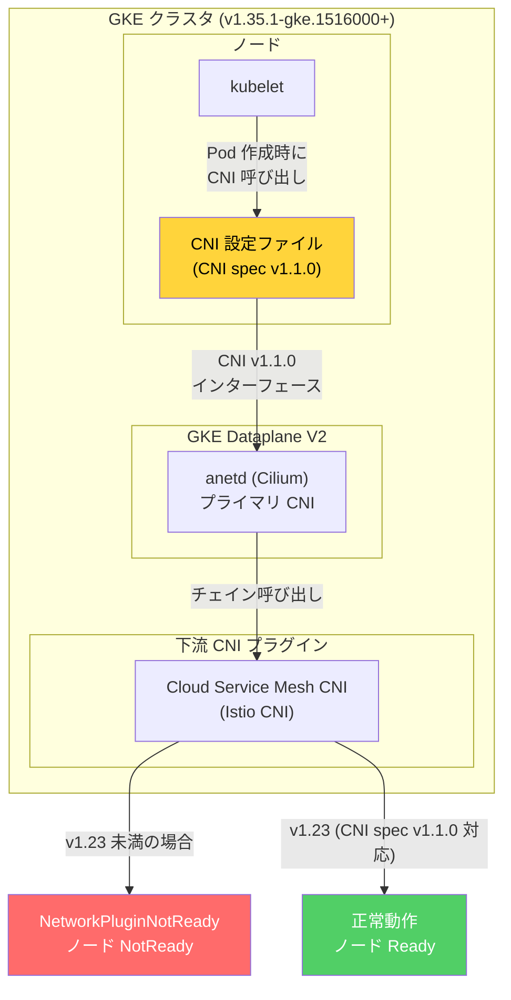

# Google Kubernetes Engine: Dataplane V2 CNI バージョン 1.1.0 への移行 (破壊的変更)

**リリース日**: 2026-07-14

**サービス**: Google Kubernetes Engine (GKE)

**機能**: GKE Dataplane V2 の CNI 設定ファイルにおける CNI バージョン 1.1.0 への移行

**ステータス**: 破壊的変更 (Breaking Change)

[このアップデートのインフォグラフィックを見る](https://takech9203.github.io/google-cloud-news-summary/20260714-gke-dataplane-v2-cni-1-1-0.html)

## 概要

GKE Dataplane V2 クラスタにおいて、バージョン 1.35.1-gke.1516000 以降で CNI 設定ファイルの CNI バージョンが 1.1.0 に更新された。これは破壊的変更であり、下流の CNI プラグインが CNI バージョン 1.1.0 と互換性を持つことが必須となる。

この変更により、セルフマネージドのオープンソース Istio またはクラスタ内のアンマネージド Cloud Service Mesh (CSM) バリアントを使用している場合、CSM CNI バージョンを手動で 1.23 にアップグレードする必要がある。互換性のない CNI バージョンを使用している場合、ノードが Ready 状態に到達できず、`NetworkPluginNotReady` エラーが発生する可能性がある。

対象ユーザーは、GKE Dataplane V2 を有効にしたクラスタで Cloud Service Mesh のインクラスタコントロールプレーンを使用しているプラットフォームエンジニアおよびクラスタ管理者である。Google マネージド Cloud Service Mesh を使用している場合は、Google 側で互換バージョンのロールアウトが行われるが、ロールアウトの遅延によって影響を受ける可能性がある。

**アップデート前の状態**

- GKE Dataplane V2 の CNI 設定ファイルは CNI バージョン 1.1.0 未満を使用していた
- 下流の CNI プラグイン (Istio CNI 等) は旧バージョンの CNI 仕様で動作していた
- CSM CNI のバージョン互換性を意識する必要がなかった

**アップデート後の影響**

- CNI 設定ファイルが CNI バージョン 1.1.0 を要求するようになった
- 互換性のない下流 CNI プラグインを使用しているノードが `NodeNotReady` 状態になる
- セルフマネージド Istio / アンマネージド CSM 利用者は CSM CNI を 1.23 に手動アップグレードが必要

## アーキテクチャ図



GKE Dataplane V2 が CNI 設定ファイルで CNI spec v1.1.0 を指定するため、チェイン呼び出しされる下流 CNI プラグイン (CSM CNI) も同バージョンに対応している必要がある。対応していない場合、ノードが Ready 状態にならない。

## サービスアップデートの詳細

### 主要な変更点

1. **CNI 仕様バージョンの引き上げ**
   - GKE Dataplane V2 クラスタの CNI 設定ファイルが CNI バージョン 1.1.0 を使用するようになった
   - 対象: GKE バージョン 1.35.1-gke.1516000 以降

2. **下流 CNI プラグインの互換性要件**
   - すべての下流 CNI プラグインが CNI バージョン 1.1.0 をサポートしている必要がある
   - 非互換の場合、ノードの初期化に失敗する

3. **Cloud Service Mesh CNI のアップグレード要件**
   - インクラスタコントロールプレーンの CSM を利用している場合、CSM CNI をバージョン 1.23 にアップグレードする必要がある
   - CSM CNI 1.23 が CNI spec v1.1.0 に対応

## 技術仕様

### 影響を受ける構成

| 項目 | 詳細 |
|------|------|
| 対象 GKE バージョン | 1.35.1-gke.1516000 以降 |
| CNI 仕様バージョン | 1.1.0 |
| 必要な CSM CNI バージョン | 1.23 以上 |
| エラーメッセージ | `NetworkPluginNotReady message:Network plugin returns error: missing containerID` |
| 影響を受けるノード状態 | `NodeNotReady` |

### 影響を受けるユーザー

| 構成パターン | 影響 | 対応 |
|-------------|------|------|
| セルフマネージド OSS Istio + Dataplane V2 | あり | CSM CNI を 1.23 に手動アップグレード |
| インクラスタ アンマネージド CSM + Dataplane V2 | あり | CSM CNI を 1.23 に手動アップグレード |
| Google マネージド CSM + Dataplane V2 | ロールアウト遅延時に影響の可能性 | Google 側のロールアウト完了を待つ、または一時的にダウングレード |
| Dataplane V2 なし (レガシーデータプレーン) | なし | 対応不要 |

## 対応手順

### 前提条件

1. GKE Dataplane V2 が有効なクラスタを運用している
2. セルフマネージド Istio またはインクラスタ アンマネージド Cloud Service Mesh を使用している
3. GKE バージョン 1.35.1-gke.1516000 以降へのアップグレードを予定、または既に実施済み

### 手順

#### ステップ 1: 現在の GKE バージョンと CSM CNI バージョンの確認

```bash
# クラスタの GKE バージョンを確認
gcloud container clusters describe CLUSTER_NAME \
  --location LOCATION \
  --format="value(currentMasterVersion)"

# CSM CNI DaemonSet のイメージバージョンを確認
kubectl get daemonset istio-cni-node -n kube-system -o jsonpath='{.spec.template.spec.containers[0].image}'
```

現在のクラスタバージョンが 1.35.1-gke.1516000 以降であるか、またはアップグレード予定があるかを確認する。

#### ステップ 2: CSM CNI を バージョン 1.23 にアップグレード (GKE アップグレード前に実施)

```bash
# Cloud Service Mesh CNI のアップグレード
# インクラスタコントロールプレーンの場合、CSM のドキュメントに従いアップグレードを実施
# CSM CNI 1.23 は CNI spec v1.1.0 に対応
```

GKE クラスタを 1.35.1-gke.1516000 以降にアップグレードする前に、CSM CNI のバージョンを 1.23 に更新することを推奨する。

#### ステップ 3: 問題が発生した場合の緩和策

```bash
# ノードが NodeNotReady 状態の場合、GKE バージョンを 1.35.1-gke.1516000 未満にダウングレード
# または、CSM CNI を速やかに 1.23 にアップグレード

# ノードの状態を確認
kubectl get nodes
kubectl describe node NODE_NAME | grep -A5 "Conditions"
```

既に問題が発生している場合は、クラスタを影響を受ける GKE バージョンより前のバージョンにダウングレードすることで一時的に緩和できる。

## デメリット・制約事項

### 制限事項

- GKE バージョン 1.35.1-gke.1516000 以降へのアップグレードは、CSM CNI 1.23 への事前アップグレードなしには安全に行えない (該当構成の場合)
- Google マネージド Istio のロールアウト遅延により、一部のクラスタでは互換バージョンが未適用の状態でこの変更の影響を受ける可能性がある

### 考慮すべき点

- GKE のリリースチャネル (Rapid, Regular, Stable) を使用している場合、自動アップグレードによって予期せずこの変更の影響を受ける可能性がある
- メンテナンスウィンドウの設定を確認し、事前に CSM CNI のアップグレードを完了させておくことが重要
- カスタム CNI プラグインを使用している場合、CNI spec v1.1.0 への対応状況を確認する必要がある

## 関連サービス・機能

- **Cloud Service Mesh (CSM)**: Istio ベースのサービスメッシュ。CNI プラグインが Dataplane V2 と連携して動作する
- **GKE Dataplane V2**: Cilium ベースの eBPF データプレーン。anetd DaemonSet として各ノードで動作する
- **Container Network Interface (CNI)**: Kubernetes のネットワークプラグイン仕様。プラグインのチェイン呼び出しを定義する

## 参考リンク

- [このアップデートのインフォグラフィック](https://takech9203.github.io/google-cloud-news-summary/20260714-gke-dataplane-v2-cni-1-1-0.html)
- [公式リリースノート](https://docs.cloud.google.com/release-notes#July_14_2026)
- [GKE Dataplane V2 の概要](https://docs.cloud.google.com/kubernetes-engine/docs/concepts/dataplane-v2)
- [GKE Dataplane V2 の有効化とトラブルシューティング](https://docs.cloud.google.com/kubernetes-engine/docs/how-to/dataplane-v2)
- [Cloud Service Mesh ドキュメント](https://docs.cloud.google.com/service-mesh/docs/)

## まとめ

この変更は破壊的変更であり、GKE Dataplane V2 クラスタでセルフマネージド Istio またはアンマネージド Cloud Service Mesh を使用している場合、GKE 1.35.1-gke.1516000 以降へのアップグレード前に CSM CNI をバージョン 1.23 にアップグレードする必要がある。対応を怠るとノードが `NetworkPluginNotReady` エラーで `NotReady` 状態となり、ワークロードのスケジューリングに影響が出る。該当する構成を持つクラスタ管理者は、速やかに CSM CNI のバージョン確認とアップグレード計画の策定を行うことを強く推奨する。

---

**タグ**: #GKE #DataplaneV2 #CNI #BreakingChange #CloudServiceMesh #Istio #NetworkPlugin #Kubernetes
