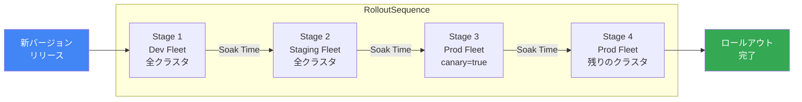

# Google Kubernetes Engine: カスタムステージによるロールアウトシーケンシングが GA

**リリース日**: 2026-07-14

**サービス**: Google Kubernetes Engine (GKE)

**機能**: Rollout Sequencing with Custom Stages

**ステータス**: GA (一般提供)

[このアップデートのインフォグラフィックを見る](https://takech9203.github.io/google-cloud-news-summary/20260714-gke-rollout-sequencing-custom-stages-ga.html)

## 概要

Google Kubernetes Engine (GKE) のカスタムステージによるロールアウトシーケンシングが一般提供 (GA) となった。この機能により、複数の環境にわたる GKE クラスタのアップグレード順序を、カスタム定義されたステージに基づいて制御できるようになる。

ロールアウトシーケンシングは Fleet (フリート) の概念を基盤としており、開発、テスト、ステージング、本番といったデプロイメント環境ごとにクラスタをグループ化し、定義された順序で段階的にアップグレードを実行する。カスタムステージでは、ラベルセレクターを使用してフリート内の特定のクラスタサブセットをターゲットにすることが可能で、カナリアデプロイメントのような高度なロールアウト戦略を実現する。

この機能は、大規模な GKE クラスタ環境を運用するエンタープライズチームや、本番環境のアップグレードリスクを最小化したいプラットフォームエンジニアリングチームを対象としている。

**アップデート前の課題**

- クラスタのアップグレード順序を環境横断で体系的に制御する手段が限られていた
- フリートベースのロールアウトシーケンシングでは、フリート内のクラスタサブセットを個別に制御できなかった
- 特定バージョンへのロールアウト開始や、ロールアウトの一時停止・キャンセルといった細かい制御ができなかった
- パッチバージョンとマイナーバージョンのアップグレードを区別してロールアウト対象を選択できなかった

**アップデート後の改善**

- ラベルセレクターを使用して、フリート内の特定クラスタサブセットをステージとして定義可能になった
- 特定バージョンへのロールアウトを手動で開始できるようになった
- ロールアウトの一時停止、再開、キャンセル、ステージ完了の操作が可能になった
- ロールアウト対象のアップグレードタイプ (パッチ/マイナー、コントロールプレーン/ノード) を選択可能になった
- RolloutSequence と Rollout の API オブジェクトによる可観測性が向上した

## アーキテクチャ図



GKE が新バージョンをリリースすると、定義されたステージ順にクラスタがアップグレードされる。各ステージ間にはソークタイム (安定確認期間) が設定され、問題がないことを確認してから次のステージへ進む。

## サービスアップデートの詳細

### 主要機能

1. **カスタムステージの定義**
   - YAML 設定ファイルでステージの順序、対象フリート、ソークタイムを定義
   - ラベルセレクター (CEL 構文) を使用してフリート内のクラスタサブセットをターゲットに設定
   - 単一フリート内で複数ステージの定義が可能
   - ステージごとにソークタイム (秒単位) を設定

2. **ロールアウトスコープの選択**
   - パッチバージョンのコントロールプレーンアップグレード
   - パッチバージョンのノードアップグレード
   - マイナーバージョンのコントロールプレーンアップグレード
   - マイナーバージョンのノードアップグレード
   - 上記の任意の組み合わせでスコープを制限可能

3. **ロールアウトの開始**
   - GKE が自動アップグレードターゲットを設定した際に自動的にロールアウトを作成
   - 特定バージョンを指定した手動ロールアウトの開始も可能
   - セキュリティ脆弱性の迅速なパッチ適用に有効

4. **ロールアウトの管理**
   - **一時停止 (Pause)**: 進行中のロールアウトを一時停止。最大 90 日間一時停止可能
   - **再開 (Resume)**: 一時停止したロールアウトを再開
   - **キャンセル (Cancel)**: ロールアウトを中止。同一バージョンの自動再作成は行われない
   - **ステージ完了 (Complete Stage)**: ソークタイムをスキップして次のステージに進行

## 技術仕様

### RolloutSequence 設定

| 項目 | 詳細 |
|------|------|
| API オブジェクト | RolloutSequence, Rollout |
| ステージ設定形式 | YAML |
| ラベルセレクター構文 | CEL (Common Expression Language) |
| ソークタイム単位 | 秒 |
| 一時停止上限 | 90 日 (超過でキャンセル) |
| 必須 API | gkehub.googleapis.com |
| 必要な IAM ロール | Fleet Editor (roles/gkehub.editor) |

### 必要な IAM 権限

| 権限 | 用途 |
|------|------|
| gkehub.rolloutsequences.create | ロールアウトシーケンスの作成 |
| gkehub.rolloutsequences.get | ロールアウトシーケンスの参照 |
| gkehub.rolloutsequences.list | ロールアウトシーケンスの一覧取得 |
| gkehub.rolloutsequences.update | ロールアウトシーケンスの更新 |
| gkehub.rolloutsequences.delete | ロールアウトシーケンスの削除 |
| gkehub.fleet.get | フリート情報の取得 |

## 設定方法

### 前提条件

1. 既存の GKE Autopilot または Standard クラスタが存在すること
2. クラスタが Fleet に登録されていること
3. フリートホストプロジェクトで必要な API が有効化されていること
4. Fleet Editor IAM ロール (roles/gkehub.editor) が付与されていること

### 手順

#### ステップ 1: クラスタへのラベル付与 (オプション)

```bash
# カナリアクラスタとしてラベルを設定
gcloud container clusters update CLUSTER_NAME \
  --location=CLUSTER_LOCATION \
  --update-labels=canary=true
```

カスタムステージでフリート内のクラスタサブセットをターゲットにする場合、対象クラスタにラベルを付与する。

#### ステップ 2: ステージ設定ファイルの作成

```yaml
# rollout-sequence.yaml
- stage:
    fleet-projects:
      - projects/dev
    soak-duration: 604800s
- stage:
    fleet-projects:
      - projects/prod
    soak-duration: 604800s
    label-selector: resource.labels.canary=='true'
- stage:
    fleet-projects:
      - projects/prod
    soak-duration: 604800s
```

各ステージで `fleet-projects`、`soak-duration`、`label-selector` (オプション) を定義する。全クラスタを捕捉するため、各フリートにラベルセレクターなしのキャッチオールステージを含める必要がある。

#### ステップ 3: ロールアウトシーケンスの作成

```bash
gcloud container fleet rolloutsequences create ROLLOUT_SEQUENCE_NAME \
  --display-name="My Rollout Sequence" \
  --stage-config=rollout-sequence.yaml
```

#### ステップ 4: ロールアウトの管理

```bash
# ロールアウトの一時停止
gcloud container fleet rollouts pause ROLLOUT_ID

# ロールアウトの再開
gcloud container fleet rollouts resume ROLLOUT_ID

# ロールアウトのキャンセル
gcloud container fleet rollouts cancel ROLLOUT_ID

# ステージの強制完了
gcloud container fleet rollouts force-complete-stage ROLLOUT_ID \
  --stage=STAGE_NUMBER
```

## メリット

### ビジネス面

- **本番環境の安定性向上**: 段階的なロールアウトにより、問題を本番環境全体に波及させる前に検知・対処が可能
- **ダウンタイムリスクの最小化**: カナリアクラスタでの事前検証により、本番影響を最小限に抑制
- **運用効率の向上**: 自動化されたシーケンシングにより、手動でのクラスタ個別アップグレード管理が不要

### 技術面

- **きめ細かい制御**: ラベルセレクターによるクラスタサブセットの指定で、フリート内でも段階的なロールアウトが可能
- **柔軟なスコープ設定**: アップグレードタイプ (パッチ/マイナー) を選択し、必要なアップグレードのみを制御下に配置
- **API による可観測性**: RolloutSequence と Rollout オブジェクトにより、ロールアウトの進行状況をプログラムから監視可能
- **メンテナンスウィンドウとの統合**: 既存のメンテナンスウィンドウと除外設定を尊重し、業務時間外にのみアップグレードを実行

## デメリット・制約事項

### 制限事項

- Google Cloud コンソール (UI) からの操作には対応していない (gcloud CLI のみ)
- 強制自動アップグレード (90 日間未アップグレードまたはサポート終了バージョン) は一時停止・キャンセル不可
- 1 ステージあたり最大 1 フリートのみ参照可能
- 全クラスタが同一リリースチャネルに登録されていることを推奨 (異なるチャネルの場合、最も保守的なチャネルのバージョンが選択される)

### 考慮すべき点

- ロールアウトシーケンスの変更は進行中のロールアウトをキャンセルする可能性がある
- クラスタのラベル更新は既存ラベルを上書きするため、既存ラベルの保持に注意が必要
- ソークタイムの変更は現在および将来の全ロールアウトに影響する

## ユースケース

### ユースケース 1: エンタープライズの段階的本番デプロイ

**シナリオ**: 金融機関が複数リージョンにまたがる GKE クラスタを運用しており、新バージョンのアップグレードを開発 -> ステージング -> 本番カナリア -> 本番全体の順で段階的に実施したい。

**実装例**:
```yaml
# 開発環境 (ソークタイム 3 日)
- stage:
    fleet-projects:
      - projects/dev-fleet
    soak-duration: 259200s
# ステージング環境 (ソークタイム 7 日)
- stage:
    fleet-projects:
      - projects/staging-fleet
    soak-duration: 604800s
# 本番カナリア (ソークタイム 3 日)
- stage:
    fleet-projects:
      - projects/prod-fleet
    soak-duration: 259200s
    label-selector: resource.labels.canary=='true'
# 本番全体
- stage:
    fleet-projects:
      - projects/prod-fleet
    soak-duration: 604800s
```

**効果**: 本番環境全体に影響する前に、カナリアクラスタで問題を早期発見。パッチアップグレード時にはソークタイムを短縮して迅速な適用も可能。

### ユースケース 2: セキュリティパッチの迅速な適用

**シナリオ**: 重大な CVE が発見され、全クラスタに対して特定バージョンへの迅速なアップグレードが必要。ただし、段階的に適用してワークロードへの影響を確認しながら進めたい。

**効果**: 手動で特定バージョンのロールアウトを開始し、各ステージの完了を手動で進行させることで、安全性を保ちながら迅速にパッチを適用可能。問題発生時にはロールアウトを一時停止して調査できる。

## 関連サービス・機能

- **GKE Fleet Management**: ロールアウトシーケンシングの基盤となるクラスタグループ管理機能
- **GKE Release Channels**: ロールアウト対象バージョンの決定に使用されるチャネル管理
- **GKE Maintenance Windows and Exclusions**: ロールアウトシーケンシングと連携し、アップグレード実行タイミングを制御
- **GKE Node Pool Upgrade Strategies**: Surge アップグレードや Blue-Green アップグレードと組み合わせて使用可能

## 参考リンク

- [インフォグラフィック](https://takech9203.github.io/google-cloud-news-summary/20260714-gke-rollout-sequencing-custom-stages-ga.html)
- [公式リリースノート](https://docs.google.com/release-notes#July_14_2026)
- [ドキュメント: About rollout sequencing with custom stages](https://docs.cloud.google.com/kubernetes-engine/docs/concepts/rollout-sequencing-custom-stages/about-rollout-sequencing)
- [ドキュメント: Manage upgrades with rollout sequencing](https://docs.cloud.google.com/kubernetes-engine/docs/how-to/rollout-sequencing-custom-stages/manage-upgrades-with-rollout-sequencing)

## まとめ

GKE のカスタムステージによるロールアウトシーケンシングが GA となり、エンタープライズ環境での本番利用が可能になった。ラベルベースのクラスタサブセット指定、アップグレードタイプのスコープ制限、ロールアウトのライフサイクル管理 (一時停止/再開/キャンセル) といった機能により、大規模 GKE 環境でのクラスタアップグレードを安全かつ体系的に制御できる。複数環境を持つ組織は、この機能を活用して段階的なアップグレード戦略を導入することを推奨する。

---

**タグ**: #GoogleKubernetesEngine #GKE #RolloutSequencing #CustomStages #FleetManagement #ClusterUpgrade #GA #Kubernetes
