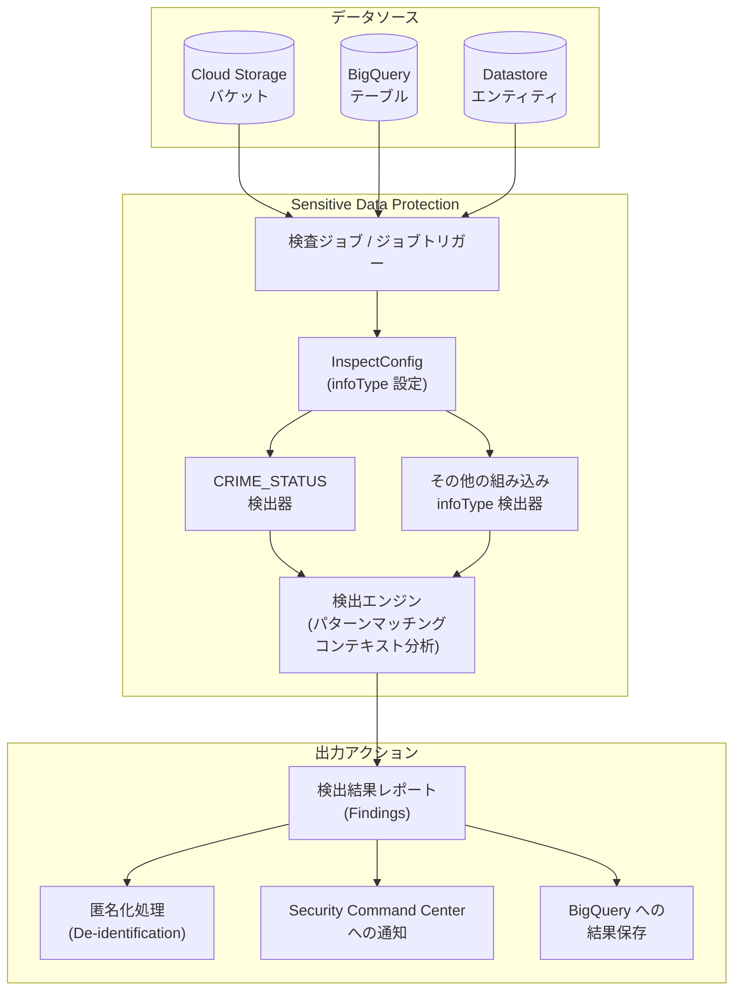

# Sensitive Data Protection: CRIME_STATUS infoType 検出器が全リージョンで利用可能に

**リリース日**: 2026-07-14

**サービス**: Sensitive Data Protection

**機能**: CRIME_STATUS infoType 検出器のグローバル展開

**ステータス**: GA (一般提供)

📊 [このアップデートのインフォグラフィックを見る](https://takech9203.github.io/google-cloud-news-summary/20260714-sensitive-data-protection-crime-status.html)

## 概要

Google Cloud の Sensitive Data Protection (旧 Cloud DLP) に搭載されている組み込み infoType 検出器「CRIME_STATUS」が、全リージョンで利用可能になった。CRIME_STATUS は犯罪被害者のステータスや犯罪歴に関連する機密データを検出するための infoType 検出器であり、グローバルに展開されたことで、世界中のあらゆるリージョンで一貫したデータ保護ポリシーを適用できるようになった。

この infoType は DEMOGRAPHIC カテゴリに分類され、感度スコアは SENSITIVITY_MODERATE に設定されている。犯罪ステータスに関する情報は多くの法域でセンシティブデータとして分類されるため、コンプライアンス要件を満たすための重要な検出器として位置づけられる。

対象ユーザーは、データガバナンスやプライバシー保護を担当するセキュリティエンジニア、コンプライアンス担当者、および個人情報を含む大規模データセットを管理する組織のデータエンジニアである。

**アップデート前の課題**

- CRIME_STATUS infoType 検出器が一部のリージョンでのみ利用可能であり、グローバルに展開する組織では検出ポリシーにギャップが発生する可能性があった
- 犯罪歴や犯罪被害者ステータスに関するデータの検出を手動で設定する必要があり、カスタム infoType での代替が必要だった
- マルチリージョン展開において統一的なデータ保護ポリシーの適用が困難だった

**アップデート後の改善**

- CRIME_STATUS infoType が全リージョン (ANY_LOCATION) で利用可能になり、地域に関係なく一貫した検出が可能になった
- 組み込み検出器として即座に利用可能であり、カスタム設定なしで犯罪ステータス関連データを検出できる
- グローバル規模でのデータガバナンスポリシーの統一的な適用が容易になった

## アーキテクチャ図



Sensitive Data Protection の検査パイプラインにおける CRIME_STATUS infoType 検出器の位置づけを示す。データソースから取り込まれたコンテンツは InspectConfig に基づいて CRIME_STATUS を含む各種 infoType 検出器で分析され、検出結果は匿名化処理や Security Command Center への通知など複数のアクションに連携される。

## サービスアップデートの詳細

### 主要機能

1. **CRIME_STATUS infoType 検出器**
   - 犯罪被害者ステータスや犯罪歴に関連するテキストを自動検出する組み込み infoType
   - 説明: "A crime victim status or criminal record"
   - パターンマッチングとコンテキスト分析を組み合わせた検出手法を使用

2. **グローバルリージョン対応 (ANY_LOCATION)**
   - 全リージョンおよびマルチリージョン (global, us, europe, asia) で利用可能
   - リージョナルエンドポイントでの利用もサポート
   - データレジデンシー要件に対応しつつ、どの処理ロケーションでも検出が可能

3. **既存パイプラインとのシームレスな統合**
   - InspectConfig に CRIME_STATUS を追加するだけで即座に利用開始可能
   - 検査テンプレート、ジョブトリガー、ディスカバリースキャンで利用可能
   - 匿名化 (De-identification) 変換との連携もサポート

## 技術仕様

### infoType 検出器の属性

| 項目 | 詳細 |
|------|------|
| 名前 | `CRIME_STATUS` |
| 説明 | A crime victim status or criminal record |
| ロケーション | GLOBAL |
| カテゴリ | DEMOGRAPHIC |
| 感度スコア | SENSITIVITY_MODERATE |
| 利用可能リージョン | ANY_LOCATION (全リージョン) |
| サポート対象 | INSPECT |

### API 設定例

```json
{
  "inspectConfig": {
    "infoTypes": [
      {
        "name": "CRIME_STATUS"
      }
    ],
    "minLikelihood": "POSSIBLE",
    "includeQuote": true
  },
  "item": {
    "value": "The individual has a prior felony conviction and is currently on parole."
  }
}
```

## 設定方法

### 前提条件

1. Google Cloud プロジェクトで Sensitive Data Protection API (DLP API) が有効化されていること
2. 適切な IAM ロール (`roles/dlp.user` または `roles/dlp.admin`) が付与されていること

### 手順

#### ステップ 1: infoType を検査テンプレートに追加

```bash
# gcloud CLI での検査テンプレート作成例
gcloud dlp inspect-templates create \
  --project=PROJECT_ID \
  --location=global \
  --display-name="Crime Status Detection Template" \
  --description="Detects crime victim status and criminal records" \
  --info-types="CRIME_STATUS,PERSON_NAME" \
  --min-likelihood=POSSIBLE
```

CRIME_STATUS を含む検査テンプレートを作成する。他の infoType と組み合わせて使用することが推奨される。

#### ステップ 2: 検査ジョブの実行

```bash
# REST API でコンテンツ検査を実行
curl -X POST \
  -H "Authorization: Bearer $(gcloud auth print-access-token)" \
  -H "Content-Type: application/json" \
  -d '{
    "inspectConfig": {
      "infoTypes": [{"name": "CRIME_STATUS"}],
      "minLikelihood": "POSSIBLE",
      "includeQuote": true
    },
    "item": {
      "value": "Subject has no criminal record."
    }
  }' \
  "https://dlp.googleapis.com/v2/projects/PROJECT_ID/locations/global/content:inspect"
```

content.inspect メソッドを使用して、テキスト内の犯罪ステータス関連データを同期的に検査する。

#### ステップ 3: 匿名化設定 (オプション)

```json
{
  "deidentifyConfig": {
    "infoTypeTransformations": {
      "transformations": [
        {
          "infoTypes": [{"name": "CRIME_STATUS"}],
          "primitiveTransformation": {
            "replaceWithInfoTypeConfig": {}
          }
        }
      ]
    }
  }
}
```

検出された CRIME_STATUS データを infoType 名で置換する匿名化設定。マスキングや暗号化など他の変換方法も利用可能。

## メリット

### ビジネス面

- **コンプライアンス強化**: GDPR、CCPA、各国の個人情報保護法における犯罪歴データの取り扱い要件に対応。犯罪ステータスは多くの法域でセンシティブデータとして特別な保護が求められる
- **リスク軽減**: 犯罪歴や犯罪被害者情報の意図しない漏洩リスクを自動検出により低減。データ侵害時の影響を最小化
- **グローバル一貫性**: 全リージョンで同一の検出ポリシーを適用でき、多国籍企業のデータガバナンス統一が容易

### 技術面

- **ゼロ設定での利用**: カスタム infoType を構築する必要なく、組み込み検出器として即座に利用可能
- **高精度検出**: パターンマッチングとコンテキスト分析を組み合わせた検出エンジンにより、誤検出を抑制しつつ犯罪関連データを高精度で検出
- **パイプライン統合**: 既存の DLP 検査ジョブ、ジョブトリガー、ディスカバリースキャンに infoType 名を追加するだけで統合完了

## デメリット・制約事項

### 制限事項

- 組み込み infoType 検出器は完全に正確な検出手法ではなく、規制要件への準拠を保証するものではない。Google はテスト実施と要件に合致する設定の確認を推奨している
- CRIME_STATUS は主に英語での検出が最適化されており、他言語でのパフォーマンスはテストが必要
- `minLikelihood` 設定により検出感度を調整可能だが、閾値が低すぎると誤検出が増加する可能性がある

### 考慮すべき点

- 犯罪ステータスデータの定義や保護要件は法域によって異なるため、自社の規制要件に合致するかテストが必要
- 大量データの検査ではコスト管理が重要。サンプリングや timespan 設定で検査対象を限定することを検討
- `CRIME_STATUS` 単独での使用よりも、`PERSON_NAME` や他の PII 検出器と組み合わせてコンテキストを高めることが推奨される

## ユースケース

### ユースケース 1: 人事システムのデータガバナンス

**シナリオ**: 人事部門が管理する従業員データベースに、採用時の身辺調査結果や犯罪歴に関するメモが含まれている。GDPR や各国の労働法に準拠するため、これらのデータを特定し適切な保護措置を講じる必要がある。

**実装例**:
```json
{
  "inspectConfig": {
    "infoTypes": [
      {"name": "CRIME_STATUS"},
      {"name": "PERSON_NAME"},
      {"name": "DATE_OF_BIRTH"}
    ],
    "minLikelihood": "LIKELY"
  },
  "storageConfig": {
    "bigQueryOptions": {
      "tableReference": {
        "projectId": "hr-project",
        "datasetId": "employee_records",
        "tableId": "background_checks"
      }
    }
  }
}
```

**効果**: 犯罪歴データを含むレコードを自動的に特定し、アクセス制御の強化や匿名化処理の対象として管理可能にする。

### ユースケース 2: カスタマーサポートの会話ログ分析

**シナリオ**: 金融機関のカスタマーサポートシステムで、顧客との会話ログに犯罪被害者ステータスや犯罪関連情報が含まれる可能性がある。これらの情報を検出し、適切にマスキングしてから分析パイプラインに送る必要がある。

**効果**: 顧客の機密情報を保護しながら、サポート品質分析のためのデータ活用が可能になる。検出された犯罪ステータス情報は自動的にマスキングまたは置換される。

## 料金

Sensitive Data Protection の料金は検査・変換するデータ量に基づく従量課金制である。

### 料金例

| 使用量 | 月額料金 (概算) |
|--------|-----------------|
| コンテンツ検査 1 GB | $1.00 (最初の 1 GB は無料) |
| ストレージ検査 1 GB | $1.00 - $6.00 (データ量により変動) |
| 匿名化変換 1 GB | $1.00 (最初の 1 GB は無料) |

詳細は [Sensitive Data Protection 料金ページ](https://cloud.google.com/sensitive-data-protection/pricing) を参照。

## 利用可能リージョン

CRIME_STATUS infoType は全リージョン (ANY_LOCATION) で利用可能。Sensitive Data Protection 自体は以下を含む 40 以上のリージョンとマルチリージョンで提供されている:

- **アメリカ**: us-central1, us-east1, us-east4, us-west1, us-west2, northamerica-northeast1 など
- **ヨーロッパ**: europe-west1, europe-west2, europe-west3, europe-west4, europe-north1 など
- **アジア太平洋**: asia-east1, asia-northeast1 (東京), asia-northeast2 (大阪), asia-southeast1 など
- **中東**: me-central1, me-central2, me-west1
- **マルチリージョン**: global, us, europe, asia

## 関連サービス・機能

- **Security Command Center**: DLP 検査結果を Security Command Center に自動公開し、組織全体のセキュリティ態勢を可視化
- **Cloud Storage / BigQuery / Datastore**: Sensitive Data Protection が直接スキャン可能なストレージサービス。CRIME_STATUS を含む検査ジョブで大規模データの自動スキャンが可能
- **Cloud Monitoring**: DLP メトリクス (content_bytes_inspected_count, finding_count) を使用して、CRIME_STATUS 検出数の監視とアラート設定が可能
- **Data Catalog / Dataplex**: データプロファイリングと組み合わせて、組織内のセンシティブデータの所在を包括的に管理

## 参考リンク

- 📊 [インフォグラフィック](https://takech9203.github.io/google-cloud-news-summary/20260714-sensitive-data-protection-crime-status.html)
- [公式リリースノート](https://docs.cloud.google.com/release-notes#July_14_2026)
- [InfoType 検出器リファレンス](https://docs.cloud.google.com/sensitive-data-protection/docs/infotypes-reference)
- [infoType と infoType 検出器の概要](https://docs.cloud.google.com/sensitive-data-protection/docs/concepts-infotypes)
- [検査テンプレートの作成](https://docs.cloud.google.com/sensitive-data-protection/docs/creating-templates-inspect)
- [機密データの匿名化](https://docs.cloud.google.com/sensitive-data-protection/docs/deidentify-sensitive-data)
- [Sensitive Data Protection のロケーション](https://docs.cloud.google.com/sensitive-data-protection/docs/locations)
- [料金ページ](https://cloud.google.com/sensitive-data-protection/pricing)

## まとめ

CRIME_STATUS infoType 検出器の全リージョン展開により、犯罪被害者ステータスや犯罪歴に関する機密データを、地理的制約なくグローバルに検出・保護できるようになった。特に GDPR や各国のプライバシー規制で犯罪関連データが特別カテゴリとして保護される法域において、コンプライアンス対応の自動化に直結する重要なアップデートである。既存の DLP パイプラインへの統合は infoType 名の追加のみで完了するため、即座に導入を検討されたい。

---

**タグ**: #SensitiveDataProtection #DLP #infoType #CRIME_STATUS #データガバナンス #コンプライアンス #プライバシー #匿名化 #セキュリティ
