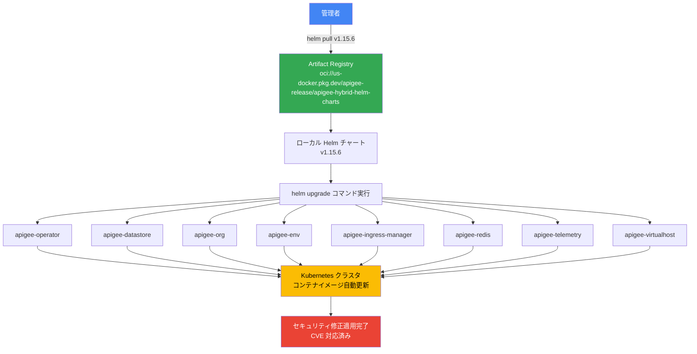

# Apigee hybrid: v1.15.6 セキュリティパッチリリース

**リリース日**: 2026-07-15

**サービス**: Apigee hybrid

**機能**: v1.15.6 セキュリティパッチリリース

**ステータス**: 一般提供 (GA)

📊 [このアップデートのインフォグラフィックを見る](https://takech9203.github.io/google-cloud-news-summary/20260715-apigee-hybrid-v1-15-6.html)

## 概要

2026年7月15日、Google Cloud は Apigee hybrid ソフトウェアの最新パッチバージョン v1.15.6 をリリースしました。本リリースはセキュリティ修正に焦点を当てたパッチリリースであり、複数の CVE (Common Vulnerabilities and Exposures) に対する修正が含まれています。

Apigee hybrid は、Google Cloud の API 管理プラットフォームである Apigee をお客様自身の Kubernetes クラスタ上で実行するためのソフトウェアです。パッチリリースでは、Helm チャートにコンテナイメージが統合されているため、Helm チャート経由でアップグレードするだけで自動的にイメージが更新されます。手動でのイメージ変更は通常不要です。

セキュリティパッチは、既知の脆弱性への対応として迅速に適用することが推奨されます。v1.15.5 からの差分は最小限であり、API トラフィックへの影響なくアップグレードが可能です。

**アップデート前の課題**

- v1.15.5 以前のバージョンには既知のセキュリティ脆弱性 (CVE) が存在していた
- 脆弱性を放置すると、コンテナのエスケープや権限昇格のリスクがあった
- セキュリティコンプライアンス要件を満たすために最新パッチの適用が必要だった

**アップデート後の改善**

- 複数の CVE に対するセキュリティ修正が適用され、脆弱性が解消された
- Helm チャート経由の自動イメージ更新により、手動作業なしでパッチが適用可能になった
- セキュリティポスチャが強化され、コンプライアンス要件への適合が容易になった

## アーキテクチャ図



Apigee hybrid v1.15.6 のパッチアップグレードフローを示しています。管理者が Artifact Registry から Helm チャートを取得し、各コンポーネントに対して helm upgrade を実行すると、Kubernetes クラスタ内のコンテナイメージが自動的に更新されます。

## サービスアップデートの詳細

### 主要機能

1. **セキュリティ脆弱性の修正 (CVE 対応)**
   - 複数の CVE に対するパッチが適用されています
   - コンテナイメージのベースレイヤーにおける脆弱性の解消
   - サードパーティライブラリの脆弱性への対応

2. **Helm チャート統合型イメージ配信**
   - パッチリリースのコンテナイメージは Helm チャートに統合済み
   - helm upgrade コマンド一つでイメージが自動更新
   - 手動でのイメージタグ変更やオーバーライド設定は不要

3. **最小影響アップグレード**
   - パッチリリースのため、API プロキシの設定変更は不要
   - 既存の overrides.yaml をそのまま使用可能
   - ローリングアップデートにより API トラフィックへの影響を最小化

## 技術仕様

### リリース情報

| 項目 | 詳細 |
|------|------|
| バージョン | v1.15.6 |
| リリースタイプ | パッチリリース (セキュリティ修正) |
| 前バージョン | v1.15.5 (2026年7月3日リリース) |
| Helm チャートリポジトリ | `oci://us-docker.pkg.dev/apigee-release/apigee-hybrid-helm-charts` |
| チャートバージョン | 1.15.6 |
| サポート期限 | v1.15 マイナーリリースのサポート期限に準拠 (初期リリース日から12か月) |

### Helm チャート構成

| チャート名 | 用途 |
|------|------|
| apigee-operator | Apigee オペレーターの管理 |
| apigee-datastore | Cassandra データストアの管理 |
| apigee-env | 環境ごとのランタイム設定 |
| apigee-ingress-manager | Ingress ゲートウェイの管理 |
| apigee-org | 組織レベルのコンポーネント (MART, Watcher 等) |
| apigee-redis | Redis キャッシュの管理 |
| apigee-telemetry | テレメトリ・ログ収集 |
| apigee-virtualhost | 仮想ホスト・TLS 設定 |

## 設定方法

### 前提条件

1. 既存の Apigee hybrid v1.15.x インストール環境
2. Helm 3.x がインストールされていること
3. Kubernetes クラスタへの管理者アクセス権限
4. `kubectl` が対象クラスタに接続済みであること

### 手順

#### ステップ 1: Helm チャートのダウンロード

```bash
export CHART_REPO=oci://us-docker.pkg.dev/apigee-release/apigee-hybrid-helm-charts
export CHART_VERSION=1.15.6

helm pull $CHART_REPO/apigee-operator --version $CHART_VERSION --untar
helm pull $CHART_REPO/apigee-datastore --version $CHART_VERSION --untar
helm pull $CHART_REPO/apigee-env --version $CHART_VERSION --untar
helm pull $CHART_REPO/apigee-ingress-manager --version $CHART_VERSION --untar
helm pull $CHART_REPO/apigee-org --version $CHART_VERSION --untar
helm pull $CHART_REPO/apigee-redis --version $CHART_VERSION --untar
helm pull $CHART_REPO/apigee-telemetry --version $CHART_VERSION --untar
helm pull $CHART_REPO/apigee-virtualhost --version $CHART_VERSION --untar
```

Artifact Registry から v1.15.6 の全 Helm チャートをローカルにダウンロードします。

#### ステップ 2: CRD の更新

```bash
kubectl apply -k apigee-operator/etc/crds/default/ \
  --server-side \
  --force-conflicts \
  --validate=false
```

Apigee のカスタムリソース定義 (CRD) を最新版に更新します。

#### ステップ 3: Helm チャートのアップグレード実行

```bash
# Operator のアップグレード
helm upgrade operator apigee-operator/ \
  --install \
  --namespace APIGEE_NAMESPACE \
  --atomic \
  -f overrides.yaml

# Datastore のアップグレード
helm upgrade datastore apigee-datastore/ \
  --install \
  --namespace APIGEE_NAMESPACE \
  --atomic \
  -f overrides.yaml

# Organization のアップグレード
helm upgrade ORG_NAME apigee-org/ \
  --install \
  --namespace APIGEE_NAMESPACE \
  --atomic \
  -f overrides.yaml

# 各環境のアップグレード (環境ごとに繰り返し)
helm upgrade ENV_RELEASE_NAME apigee-env/ \
  --install \
  --namespace APIGEE_NAMESPACE \
  --atomic \
  --set env=ENV_NAME \
  -f overrides.yaml
```

既存の overrides.yaml を使用して各コンポーネントをアップグレードします。パッチリリースのため overrides.yaml の変更は不要です。

#### ステップ 4: アップグレードの検証

```bash
# Pod の状態確認
kubectl -n APIGEE_NAMESPACE get pods

# ランタイム Pod の確認
kubectl -n APIGEE_NAMESPACE get pods -l app=apigee-runtime

# Apigee 組織の状態確認
kubectl -n APIGEE_NAMESPACE get apigeeorg
```

全ての Pod が Running 状態であることを確認します。

## メリット

### ビジネス面

- **セキュリティリスクの低減**: 既知の CVE が修正され、API プラットフォームのセキュリティポスチャが向上する
- **コンプライアンス対応**: セキュリティパッチを迅速に適用することで、PCI DSS や SOC 2 などの監査要件を満たしやすくなる
- **運用コストの最小化**: Helm チャート一つでアップグレードが完了するため、メンテナンスウィンドウが短縮される

### 技術面

- **自動イメージ更新**: Helm チャートにイメージタグが統合されており、手動設定が不要
- **アトミックなデプロイ**: `--atomic` フラグにより、問題発生時は自動ロールバックが実行される
- **ローリングアップデート対応**: API トラフィックを中断することなくパッチを適用可能

## デメリット・制約事項

### 制限事項

- v1.15.x からのパッチアップグレードのみサポート (v1.14.x からの直接アップグレードは不可)
- アップグレード中に新しい環境を作成してはならない
- Cassandra のバックアップが24時間以内に取得されていることが推奨される

### 考慮すべき点

- 本番環境への適用前にステージング環境での検証を推奨
- マルチクラスタ構成の場合、全クラスタに順次適用する必要がある
- cert-manager のバージョン互換性を確認すること (v1.16.3+ または v1.17.2+ を推奨)

## ユースケース

### ユースケース 1: 定期セキュリティパッチ適用

**シナリオ**: 金融機関が PCI DSS コンプライアンスの一環として、API ゲートウェイのセキュリティパッチを30日以内に適用する必要がある。

**実装例**:
```bash
# 事前にステージングで検証
helm upgrade operator apigee-operator/ \
  --install \
  --namespace apigee-staging \
  --atomic \
  -f overrides-staging.yaml

# 検証後、本番に適用
helm upgrade operator apigee-operator/ \
  --install \
  --namespace apigee \
  --atomic \
  -f overrides-prod.yaml
```

**効果**: 最小限のダウンタイムでセキュリティパッチを適用し、コンプライアンス要件を満たしながら API サービスの継続性を維持できる。

### ユースケース 2: マルチクラスタ環境でのローリングパッチ適用

**シナリオ**: 複数リージョンに展開された Apigee hybrid クラスタに対して、カナリアデプロイメント方式でパッチを段階的に適用する。

**効果**: リージョン単位での段階的なアップグレードにより、万が一の問題発生時もグローバルな API サービスへの影響を局所化できる。

## 料金

Apigee hybrid のパッチアップグレード自体に追加料金は発生しません。Apigee hybrid の料金は Apigee のサブスクリプションモデルに基づきます。

### 料金例

| 項目 | 料金 |
|--------|-----------------|
| パッチアップグレード作業 | 無料 (サブスクリプションに含まれる) |
| Apigee hybrid ランタイム | Apigee サブスクリプション料金に含まれる |
| Kubernetes クラスタ (GKE 等) | 各クラウドプロバイダーの料金体系に準拠 |

## 利用可能リージョン

Apigee hybrid はお客様自身の Kubernetes クラスタ上で実行されるため、以下のプラットフォームで利用可能です:

- GKE on Google Cloud
- GKE on AWS / Azure
- Google Distributed Cloud (VMware / bare metal)
- Amazon EKS
- Microsoft AKS
- Red Hat OpenShift
- Rancher Kubernetes Engine (RKE)

## 関連サービス・機能

- **Apigee X (クラウドマネージド版)**: Google Cloud がフルマネージドで提供する Apigee。パッチ適用は Google Cloud が自動で実施
- **Artifact Registry**: Apigee hybrid の Helm チャートとコンテナイメージをホスティング
- **cert-manager**: Apigee hybrid の TLS 証明書管理に使用
- **Google Cloud Pub/Sub**: Apigee hybrid v1.14 以降のアナリティクスデータパイプラインとして使用

## 参考リンク

- 📊 [インフォグラフィック](https://takech9203.github.io/google-cloud-news-summary/20260715-apigee-hybrid-v1-15-6.html)
- [公式リリースノート](https://docs.cloud.google.com/release-notes#July_15_2026)
- [Apigee hybrid リリースノート](https://docs.cloud.google.com/apigee/docs/hybrid/release-notes)
- [v1.15 アップグレードドキュメント](https://docs.cloud.google.com/apigee/docs/hybrid/v1.15/upgrade)
- [Apigee リリースプロセス](https://docs.cloud.google.com/apigee/docs/release/apigee-release-process)
- [Apigee hybrid コンテナイメージ](https://docs.cloud.google.com/apigee/docs/hybrid/v1.15/container-images.html)

## まとめ

Apigee hybrid v1.15.6 は、セキュリティ脆弱性 (CVE) の修正を主目的としたパッチリリースです。Helm チャートベースのアップグレードにより、手動でのイメージ変更なしに迅速なパッチ適用が可能です。本番環境のセキュリティポスチャを維持するため、特にインターネットに公開された API ゲートウェイを運用している環境では、早期のアップグレード適用を推奨します。

---

**タグ**: #Apigee #API管理 #hybrid #セキュリティ #パッチリリース #CVE #Helm #Kubernetes #v1.15.6
