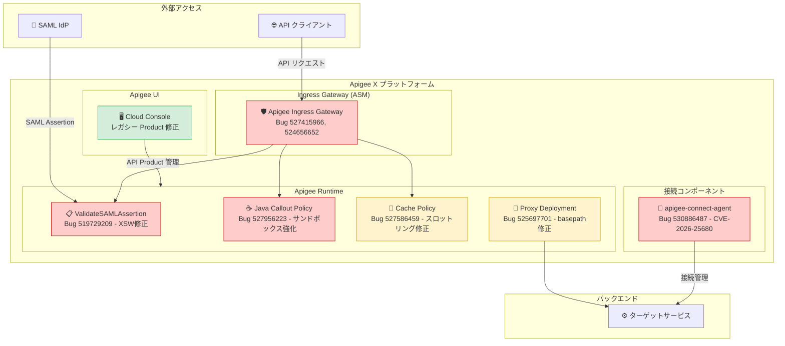

# Apigee X: バージョン 1-18-0-apigee-1 セキュリティ・バグ修正アップデート

**リリース日**: 2026-07-15

**サービス**: Apigee X

**機能**: セキュリティパッチ・バグ修正 (バージョン 1-18-0-apigee-1)

**ステータス**: Announcement

📊 [このアップデートのインフォグラフィックを見る](https://takech9203.github.io/google-cloud-news-summary/20260715-apigee-x-1-18-0-apigee-1-security-update.html)

## 概要

2026 年 7 月 15 日、Google は Apigee X の新バージョン 1-18-0-apigee-1 をリリースした。本アップデートは重要なセキュリティ脆弱性の修正と信頼性向上のためのバグ修正を含む包括的なパッチリリースである。ロールアウトは同日開始され、すべての Google Cloud ゾーンへの展開完了には 4 営業日以上かかる可能性がある。

本リリースでは、SAML XML Signature Wrapping (XSW) 脆弱性の修正、Java Callout ポリシーのサンドボックスエスケープ防止、Apigee Ingress Gateway (ASM) のセキュリティアップグレード、apigee-connect-agent の CVE-2026-25680 パッチなど、複数の重要なセキュリティ修正が適用されている。また、キャッシュポリシーのスロットリングバグや API プロキシデプロイメントのスタック問題も解消された。

このアップデートは、API Gateway のセキュリティを担保する上で極めて重要であり、特に SAML 認証を利用している環境や Java Callout ポリシーを活用しているユーザーにとって早急な適用確認が推奨される。

**アップデート前の課題**

- ValidateSAMLAssertion ポリシーに XML Signature Wrapping (XSW) 脆弱性が存在し、署名検証をバイパスされるリスクがあった
- Java Callout ポリシーのサンドボックスに脆弱性があり、カスタム Java コードからのサンドボックスエスケープが可能だった
- Apigee Ingress Gateway (ASM) に未パッチのセキュリティ脆弱性が存在していた
- apigee-connect-agent に CVE-2026-25680 に該当する脆弱性があった
- CacheThrottlerV2 のキーポイズニングによりキャッシュポリシーの信頼性が低下していた
- basepath マイグレーション中に API プロキシのデプロイメントがスタックすることがあった
- レガシー API Product で API Proxy が選択されている場合、Apigee UI が無応答になる問題があった

**アップデート後の改善**

- SAML XSW 脆弱性が修正され、ValidateSAMLAssertion ポリシーの署名検証が堅牢化された
- Java Callout ポリシーのサンドボックスセキュリティが強化され、エスケープが防止された
- Ingress Gateway が最新のセキュリティパッチ済み ASM バージョンにアップグレードされた
- apigee-connect-agent が CVE-2026-25680 対応済みバージョンに更新された
- キャッシュポリシーのスロットリングバグが修正され、信頼性が向上した
- basepath マイグレーション時のデプロイメントスタック問題が解消された
- レガシー API Product 編集時の UI 無応答問題が修正された

## アーキテクチャ図



本図は、今回のアップデートで修正された各コンポーネントの位置関係を示す。赤色はセキュリティ修正、黄色はバグ修正、緑色は UI 修正を表す。

## サービスアップデートの詳細

### バグ修正一覧

| Bug ID | コンポーネント | 説明 |
|--------|---------------|------|
| 527586459 | Cache Policy | CacheThrottlerV2 のキーポイズニングバグを修正し、キャッシュポリシーの信頼性を向上 |
| 525697701 | Proxy Deployment | Apigee X で basepath マイグレーション中に API プロキシのデプロイメントがスタックする問題を修正 |
| N/A | Infrastructure | インフラストラクチャおよびライブラリの更新 |

### セキュリティ修正一覧

| Bug ID | コンポーネント | 説明 | 重要度 |
|--------|---------------|------|--------|
| 527415966, 524656652 | Ingress Gateway (ASM) | Apigee Ingress Gateway をアップグレードし、セキュリティ脆弱性をパッチ | 高 |
| 527956223 | Java Callout Policy | Java Callout ポリシーのセキュリティを強化し、サンドボックスエスケープを防止 | 高 |
| 519729209 | ValidateSAMLAssertion | SAML XML Signature Wrapping (XSW) 脆弱性を修正 | 高 |
| 530886487 | apigee-connect-agent | CVE-2026-25680 に対応するためエージェントをアップグレード | 高 |
| N/A | Infrastructure | Apigee インフラストラクチャのセキュリティ修正 | 中 |

### Apigee UI 修正

| 問題 | 説明 |
|------|------|
| レガシー API Product 編集時の UI フリーズ | レガシー API Product で API Proxy が選択されている状態で編集すると、Apigee UI が無応答になる問題を修正 |

### 主要機能

1. **SAML XML Signature Wrapping (XSW) 脆弱性修正 (Bug 519729209)**
   - ValidateSAMLAssertion ポリシーにおける XML Signature Wrapping 攻撃への耐性が強化された
   - XSW 攻撃は、署名されたメッセージの構造を操作し、署名検証をバイパスしてアサーションの内容を改ざんする手法である
   - SAML 認証を利用する API プロキシすべてに影響する可能性があったため、修正の適用が重要
   - ValidateSAMLAssertion ポリシーは SignedElementXPath と AssertionXPath の検証ロジックが強化された

2. **Java Callout ポリシーのサンドボックスエスケープ防止 (Bug 527956223)**
   - Apigee は Java Callout ポリシーに対して Java パーミッションポリシーを適用し、カスタムコードのセキュリティを担保している
   - 今回の修正により、サンドボックスの制約を回避する攻撃パスが封じられた
   - Java Callout を使用している場合、ファイルシステムアクセス、ネットワークソケットアクセス、プロセス情報取得などの制限が確実に適用されるようになった

3. **Apigee Ingress Gateway (ASM) アップグレード (Bug 527415966, 524656652)**
   - Apigee の Ingress Gateway として使用される Anthos Service Mesh (ASM) コンポーネントが最新バージョンにアップグレード
   - 直近の 6 月 22 日リリース (1-17-0-apigee-10) でも多数の CVE に対応する Ingress Gateway のアップグレードが実施されており、継続的なセキュリティ強化が行われている

4. **apigee-connect-agent のアップグレード (Bug 530886487)**
   - CVE-2026-25680 に対応するために apigee-connect-agent をアップグレード
   - apigee-connect-agent は Apigee X と顧客のバックエンドサービス間の安全な接続を管理するコンポーネント

5. **CacheThrottlerV2 キーポイズニング修正 (Bug 527586459)**
   - キャッシュポリシーのスロットリングメカニズムにおけるキーポイズニングバグが修正された
   - この問題により、キャッシュの信頼性が低下し、予期しないスロットリング動作が発生していた可能性がある

6. **API プロキシデプロイメントのスタック修正 (Bug 525697701)**
   - basepath マイグレーション (API プロキシの basepath を変更する操作) 中にデプロイメントがスタックする問題が解消された
   - プロキシのルーティング変更を伴う運用において信頼性が向上した

## 技術仕様

### SAML XSW 脆弱性の技術背景

XML Signature Wrapping (XSW) は、署名されたXML文書の構造を悪用する攻撃手法である。

| 項目 | 詳細 |
|------|------|
| 攻撃手法 | XML Signature Wrapping (XSW) |
| 対象ポリシー | ValidateSAMLAssertion |
| 影響範囲 | SAML 認証を使用するすべての API プロキシ |
| 攻撃の原理 | 署名検証の参照先を操作し、未署名のアサーションを正当なものとして処理させる |
| 修正内容 | 署名されたエレメントとアサーションの関係性検証の強化 |

### Java Callout サンドボックスのセキュリティ制約

| 制約カテゴリ | 制限内容 |
|-------------|---------|
| ファイルシステム | 内部ファイルシステムへの読み書きが禁止 |
| ネットワーク | sitelocal, anylocal, loopback, linklocal アドレスへのアクセスが制限 |
| プロセス情報 | 現在のプロセス、プロセスリスト、CPU/メモリ使用率の取得が禁止 |
| パッケージ名 | io.apigee, com.apigee の使用が禁止 (Apigee 内部モジュール用) |
| ライブラリ依存 | Apigee に含まれる Java ライブラリへの依存は非サポート |

### ValidateSAMLAssertion ポリシー設定例

```xml
<ValidateSAMLAssertion name="SAML-Validate" ignoreContentType="false">
  <Source name="request">
    <Namespaces>
      <Namespace prefix='soap'>http://schemas.xmlsoap.org/soap/envelope/</Namespace>
      <Namespace prefix='wsse'>http://docs.oasis-open.org/wss/2004/01/oasis-200401-wss-wssecurity-secext-1.0.xsd</Namespace>
      <Namespace prefix='saml'>urn:oasis:names:tc:SAML:2.0:assertion</Namespace>
    </Namespaces>
    <AssertionXPath>/soap:Envelope/soap:Header/wsse:Security/saml:Assertion</AssertionXPath>
    <SignedElementXPath>/soap:Envelope/soap:Header/wsse:Security/saml:Assertion</SignedElementXPath>
  </Source>
  <TrustStore>TrustStoreName</TrustStore>
  <RemoveAssertion>false</RemoveAssertion>
</ValidateSAMLAssertion>
```

## メリット

### ビジネス面

- **セキュリティリスクの低減**: SAML XSW 脆弱性やサンドボックスエスケープなどの重要な脆弱性が修正され、API 基盤の安全性が向上
- **運用安定性の向上**: デプロイメントスタックやキャッシュポリシーの問題が解消され、API ライフサイクル管理の信頼性が改善
- **コンプライアンス対応**: CVE-2026-25680 への対応により、セキュリティ監査やコンプライアンス要件を満たしやすくなる

### 技術面

- **SAML 認証の堅牢化**: XSW 攻撃に対する防御が強化され、SAML ベースの認証フローの安全性が確保
- **サンドボックス分離の強化**: Java Callout のカスタムコードが確実にサンドボックス内で実行され、プラットフォームレベルのセキュリティが担保
- **Ingress 層のセキュリティ向上**: ASM ベースの Ingress Gateway が最新パッチ適用済みとなり、トラフィック受信ポイントのセキュリティが強化

## デメリット・制約事項

### 制限事項

- ロールアウトは 4 営業日以上かかる可能性があり、すべてのゾーンに即時適用されるわけではない
- ロールアウト完了まで、一部のインスタンスでは修正が有効にならない
- ロールアウトのタイミングを個別に制御することはできない (Google Cloud 側でスケジュールされる)

### 考慮すべき点

- SAML 認証を利用している環境では、ロールアウト完了後に ValidateSAMLAssertion ポリシーの動作に変化がないか確認すべき
- Java Callout ポリシーでサンドボックス制約の境界に近いコードを使用している場合、挙動変化の可能性がある
- basepath マイグレーションに関連する既存のワークアラウンドがある場合、ロールアウト後に不要になる可能性がある

## ユースケース

### ユースケース 1: SAML フェデレーション認証を利用する API プロキシ

**シナリオ**: エンタープライズ環境で IdP (Identity Provider) からの SAML アサーションを検証して API アクセスを制御しているケース

**影響**: XSW 脆弱性の修正により、攻撃者が SAML アサーションを操作して認証バイパスを試みることが不可能になる。ValidateSAMLAssertion ポリシーを使用しているすべてのプロキシで、署名検証のセキュリティが自動的に向上する。

**推奨アクション**: ロールアウト完了後、SAML 認証フローが正常に動作していることを確認するテストを実施する。

### ユースケース 2: Java Callout を使用したカスタムビジネスロジック

**シナリオ**: Java Callout ポリシーでカスタムの認証ロジック、データ変換、外部システム連携などを実装しているケース

**影響**: サンドボックスの強化により、正当なユースケースでの動作に影響はないが、セキュリティ制約の境界に近い操作を行っているカスタムコードでは動作確認が推奨される。

**推奨アクション**: Java Callout を使用しているプロキシのデバッグセッションを実行し、エラーが発生していないことを確認する。

### ユースケース 3: 高頻度 API トラフィック環境でのキャッシュ利用

**シナリオ**: ResponseCache や LookupCache/PopulateCache ポリシーを活用して高頻度 API のレスポンスタイムを最適化しているケース

**影響**: CacheThrottlerV2 のキーポイズニング修正により、キャッシュポリシーのスロットリング動作が正常化される。以前はキャッシュヒット率の予期しない低下が発生していた可能性があり、修正後はより安定したキャッシュ動作が期待できる。

**推奨アクション**: キャッシュヒット率とレスポンスタイムの推移を監視し、改善を確認する。

## 関連サービス・機能

- **Apigee hybrid v1.15.6**: 同日リリースされた hybrid バージョンでも各種セキュリティ修正が含まれている
- **Cloud Service Mesh (ASM)**: Apigee Ingress Gateway の基盤となるサービスメッシュコンポーネント。Ingress Gateway のアップグレードは ASM のセキュリティパッチに基づく
- **Cloud IAM / Identity Platform**: SAML 認証と連携する場合の ID 管理基盤。XSW 修正は認証チェーン全体のセキュリティ向上に寄与
- **Cloud Monitoring / Cloud Logging**: Apigee の動作監視に使用。ロールアウト後の動作確認に活用すべき
- **Apigee Connect**: apigee-connect-agent はApigee X コントロールプレーンとランタイムプレーン間の安全な通信を確保するコンポーネント

## 参考リンク

- 📊 [インフォグラフィック](https://takech9203.github.io/google-cloud-news-summary/20260715-apigee-x-1-18-0-apigee-1-security-update.html)
- [公式リリースノート](https://docs.cloud.google.com/release-notes#July_15_2026)
- [Apigee X リリースノート](https://docs.cloud.google.com/apigee/docs/release/release-notes)
- [ValidateSAMLAssertion ポリシー](https://docs.cloud.google.com/apigee/docs/api-platform/reference/policies/validate-saml-assertion-policy)
- [Java Callout ポリシー](https://docs.cloud.google.com/apigee/docs/api-platform/reference/policies/java-callout-policy)
- [CVE-2026-25680](https://nvd.nist.gov/vuln/detail/CVE-2026-25680)
- [Apigee セキュリティに関するドキュメント](https://docs.cloud.google.com/apigee/docs/api-platform/security)

## まとめ

Apigee X バージョン 1-18-0-apigee-1 は、SAML XSW 脆弱性の修正や Java Callout サンドボックスエスケープ防止など、重要なセキュリティ修正を含む必須アップデートである。特に SAML 認証を利用している組織は、ロールアウト完了後に認証フローの動作確認を行うべきである。ロールアウトの進行状況を監視し、すべてのゾーンへの展開が完了した後に、影響を受けるポリシーの正常動作を検証することを推奨する。

---

**タグ**: #Apigee #Security #BugFix #SAML #JavaCallout #CVE #IngressGateway #APIManagement
