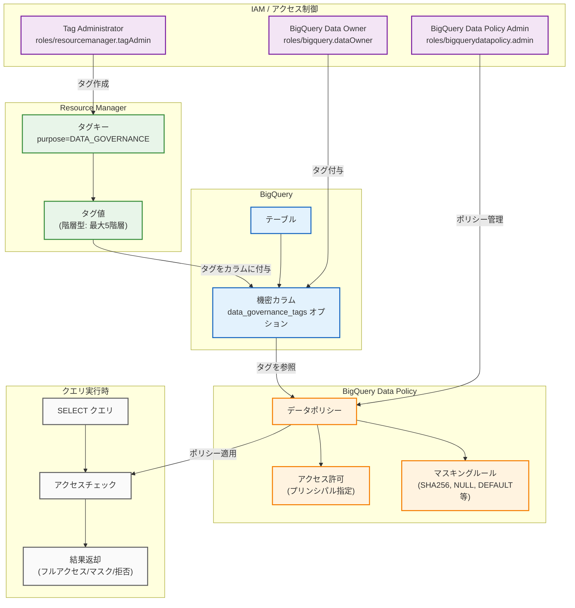

# BigQuery: データガバナンスタグによるカラムレベルセキュリティ (Preview)

**リリース日**: 2026-07-15

**サービス**: BigQuery

**機能**: データガバナンスタグを使用したカラムレベルアクセス制御とデータマスキング

**ステータス**: Preview

[このアップデートのインフォグラフィックを見る](https://takech9203.github.io/google-cloud-news-summary/20260715-bigquery-data-governance-tags-preview.html)

## 概要

BigQuery において、データガバナンスタグによるカラムレベルセキュリティおよびデータマスキング機能が Preview として利用可能になった。データガバナンスタグは Resource Manager タグの一種であり、機密性の高いカラムにタグを付与し、BigQuery データポリシーと連携させることで、ユーザーへの条件付きアクセス制御を実現する。

従来の BigQuery におけるカラムレベルアクセス制御は Data Catalog のポリシータグに基づいていたが、今回新たに Resource Manager タグをベースとしたデータガバナンスタグが導入された。これにより、Google Cloud のリソース管理の統一的な仕組みである Resource Manager タグのエコシステムを活用しながら、BigQuery のカラム単位でのきめ細かなアクセス制御とデータマスキングを構成できるようになった。

本機能は、個人情報 (PII) を扱うデータエンジニアリングチーム、コンプライアンス担当者、およびマルチテナント環境でデータを管理する組織を主な対象としている。BigQuery Enterprise エディションの利用が前提条件となる。

**アップデート前の課題**

本アップデート以前には以下の課題が存在していた。

- カラムレベルアクセス制御には Data Catalog のポリシータグ (タクソノミー) を個別に管理する必要があり、Resource Manager のタグ管理とは別のワークフローが必要だった
- ポリシータグの作成・タクソノミーの設計・アクセス制御の適用という複数ステップの管理が煩雑で、組織全体でのセキュリティポリシーの一貫性を保つことが困難だった
- Resource Manager タグで管理している組織のガバナンス体系と BigQuery のカラムセキュリティを連携させる直接的な手段がなかった

**アップデート後の改善**

今回のアップデートにより以下の改善が実現した。

- Resource Manager タグの仕組みを直接活用してカラムレベルセキュリティを構成できるようになり、タグ管理の一元化が可能になった
- `purpose=DATA_GOVERNANCE` を指定してタグキーを作成するだけでデータガバナンス用途のタグを定義でき、設定の簡素化が実現した
- SQL (CREATE TABLE / ALTER TABLE) から直接 `data_governance_tags` オプションを使用してカラムにタグを付与でき、既存のワークフローに統合しやすくなった
- 階層型タグ値 (最大 5 階層) をサポートし、組織の分類体系に合わせた柔軟なタグ構造を構築できるようになった

## アーキテクチャ図



Resource Manager でデータガバナンスタグを作成し、BigQuery カラムに付与する。データポリシーがタグを参照してクエリ実行時にアクセスチェックを行い、ユーザーの権限に応じてフルアクセス、マスクされたデータ、またはアクセス拒否を返す。

## サービスアップデートの詳細

### 主要機能

1. **データガバナンスタグの作成**
   - Resource Manager タグキーを `purpose=DATA_GOVERNANCE` で作成することで、カラムレベルセキュリティ専用のタグとして区別される
   - タグ値は階層構造 (最大 5 階層) をサポートし、組織のデータ分類体系に合わせた柔軟な構成が可能
   - プロジェクトレベルまたは組織レベルでタグキーを作成可能

2. **BigQuery カラムへのタグ付与**
   - SQL DDL (`CREATE TABLE`, `ALTER TABLE`) の `data_governance_tags` オプションを使用して直接タグを付与可能
   - bq CLI および REST API からも JSON スキーマの `dataGovernanceTagsInfo` フィールドを介してタグを管理可能
   - 既存テーブルのカラムに対しても `ALTER TABLE ... ALTER COLUMN ... SET OPTIONS` でタグを追加可能

3. **データポリシーとの連携**
   - タグ付きカラムに対して BigQuery Data Policy を作成し、マスキングルールやアクセス許可を定義
   - ポリシー作成後、タグが付与されたカラムはポリシーで指定されたプリンシパルのみがアクセス可能
   - 動的データマスキング (SHA-256、NULL、デフォルト値など) との統合をサポート

4. **クロスプロジェクトポリシー適用**
   - デフォルトではテーブルが存在するプロジェクトのデータポリシーのみが評価される
   - 組織レベルでデフォルトデータポリシープロジェクトを設定することで、クロスプロジェクトでのポリシー適用が可能

## 技術仕様

### 必要な IAM ロール

| 操作 | 必要なロール | スコープ |
|------|-------------|---------|
| タグキー/値の作成 | `roles/resourcemanager.tagAdmin` | プロジェクトまたは組織 |
| 組織のタグ表示 | `roles/resourcemanager.organizationViewer` | 組織 |
| カラムへのタグ付与/削除 | `roles/bigquery.dataOwner` | テーブル |
| カラムへのタグ付与/削除 | `roles/resourcemanager.tagUser` | 組織、プロジェクト、またはタグ値 |
| データポリシーの作成/管理 | `roles/bigquerydatapolicy.admin` | プロジェクト |

### タグキーの仕様

| 項目 | 詳細 |
|------|------|
| タグ目的 (purpose) | `DATA_GOVERNANCE` |
| 階層深度 | 最大 5 階層 |
| タグキー形式 | `PROJECT_ID/TAG_KEY` または `ORGANIZATION_ID/TAG_KEY` |
| カラムあたりのタグ数 | 複数のタグを付与可能 |
| 必要なエディション | BigQuery Enterprise |

### マスキングオプション

| マスキングルール | 説明 |
|----------------|------|
| SHA-256 | カラム値を SHA-256 ハッシュに置換 |
| NULL | カラム値を NULL に置換 |
| デフォルト値 | データ型のデフォルト値に置換 |
| カスタムルーチン | ユーザー定義関数によるカスタムマスキング |

## 設定方法

### 前提条件

1. BigQuery Enterprise エディションを使用していること
2. Google Cloud CLI がインストールされ、最新バージョンに更新されていること
3. 適切な IAM ロール (Tag Administrator, BigQuery Data Owner, BigQuery Data Policy Admin) が付与されていること

### 手順

#### ステップ 1: データガバナンスタグキーの作成

```bash
# タグキーを DATA_GOVERNANCE 目的で作成
gcloud resource-manager tags keys create sensitivity_level \
  --parent=projects/my-project-id \
  --purpose=DATA_GOVERNANCE
```

`purpose=DATA_GOVERNANCE` を指定することで、一般的なリソースタグとは区別されたデータガバナンス専用のタグキーが作成される。

#### ステップ 2: タグ値の作成

```bash
# タグ値を作成
gcloud resource-manager tags values create high_sensitivity \
  --parent=my-project-id/sensitivity_level

gcloud resource-manager tags values create medium_sensitivity \
  --parent=my-project-id/sensitivity_level
```

必要に応じて階層型のタグ値を作成し、データの機密性レベルに応じた分類を定義する。

#### ステップ 3: BigQuery カラムへのタグ付与

```sql
-- 新規テーブル作成時にタグを付与
CREATE TABLE my_project.my_dataset.customers (
  customer_id INT64,
  name STRING,
  email STRING OPTIONS (
    data_governance_tags=[("my-project-id/sensitivity_level", "high_sensitivity")]
  ),
  ssn STRING OPTIONS (
    data_governance_tags=[("my-project-id/sensitivity_level", "high_sensitivity")]
  ),
  city STRING
);

-- 既存テーブルのカラムにタグを追加
ALTER TABLE my_project.my_dataset.customers
ALTER COLUMN email
SET OPTIONS (
  data_governance_tags=[("my-project-id/sensitivity_level", "high_sensitivity")]
);
```

SQL DDL を使用して、機密カラムにデータガバナンスタグを直接付与する。

#### ステップ 4: データポリシーの作成

```bash
# データポリシーを作成してマスキングルールを適用
# BigQuery Data Policy API を使用
curl --request POST \
  "https://bigquerydatapolicy.googleapis.com/v1/projects/my-project-id/locations/us/dataPolicies" \
  --header "Authorization: Bearer $(gcloud auth print-access-token)" \
  --header 'Content-Type: application/json' \
  --data '{
    "dataPolicyType": "DATA_MASKING_POLICY",
    "dataMaskingPolicy": {
      "predefinedExpression": "SHA256"
    },
    "dataGovernanceTag": "my-project-id/sensitivity_level/high_sensitivity"
  }'
```

タグを参照するデータポリシーを作成し、該当カラムへのアクセスポリシーを定義する。

## メリット

### ビジネス面

- **コンプライアンス対応の効率化**: GDPR、HIPAA、PCI DSS などの規制要件に対し、タグベースの一元的なポリシー管理により準拠コストを削減できる
- **データ共有の促進**: マスキングにより機密カラムを保護しつつテーブル全体を共有できるため、部門間のデータ活用が促進される
- **監査対応の強化**: Resource Manager タグとデータポリシーの組み合わせにより、誰がどのカテゴリのデータにアクセスできるかが明確に文書化される

### 技術面

- **管理の一元化**: Resource Manager タグのエコシステムを活用し、組織全体のタグ管理と BigQuery カラムセキュリティを統一的に運用可能
- **スケーラビリティ**: 1 つのタグ値に対して 1 つのデータポリシーを定義すれば、そのタグが付与されたすべてのカラムに自動的にポリシーが適用される
- **SQL ネイティブ**: DDL 文で直接タグを管理できるため、既存の IaC (Infrastructure as Code) やスキーマ管理ワークフローに容易に統合可能
- **既存クエリへの影響なし**: データマスキングは既存のクエリを変更することなく透過的に適用され、ユーザーの権限に応じて自動的にマスクされたデータが返される

## デメリット・制約事項

### 制限事項

- Preview 段階であるため、本番環境での利用には制限付きサポートとなる (Pre-GA Offerings Terms が適用)
- BigQuery Enterprise エディションが必須であり、Standard エディションや On-demand では利用不可
- デフォルトではテーブルが存在するプロジェクトのデータポリシーのみが評価され、クロスプロジェクトポリシーには追加設定が必要
- `tabledata.list` API との互換性がなく、このメソッドを使用する場合はすべてのカラムへのフルアクセスが必要

### 考慮すべき点

- タグキーの名前空間形式 (`PROJECT_ID/TAG_KEY`) と短縮名の使い分けに注意が必要で、形式の誤りは `Invalid tagKey` エラーの原因となる
- 行レベルセキュリティと組み合わせる場合、サブクエリを含む行アクセスポリシーでは Fine-Grained Reader アクセスが必要
- コピージョブでは、ソーステーブルのすべてのカラムへのフルアクセス (Fine-Grained Reader) が必要
- コレーションカラムに対してマスキングを適用した場合、マスキングがコレーション前に適用されるため予期しない結果が生じる可能性がある

## ユースケース

### ユースケース 1: PII (個人識別情報) の保護

**シナリオ**: 顧客データベースにおいて、SSN (社会保障番号)、メールアドレス、電話番号などの PII カラムに対して、チームごとに異なるアクセスレベルを設定したい。経理チームはフルアクセス、分析チームはマスクされたデータ、営業チームはアクセス不可とする。

**実装例**:
```sql
-- PII カラムにタグを付与
ALTER TABLE project.dataset.customers
ALTER COLUMN ssn
SET OPTIONS (data_governance_tags=[("my-project/pii_level", "highly_restricted")]);

ALTER TABLE project.dataset.customers
ALTER COLUMN email
SET OPTIONS (data_governance_tags=[("my-project/pii_level", "restricted")]);
```

**効果**: 経理チームはフルアクセスで業務を継続でき、分析チームは SHA-256 ハッシュ化されたデータで統計分析を実施可能。営業チームには該当カラムへのアクセスが拒否され、情報漏洩リスクが大幅に低減される。

### ユースケース 2: GDPR コンプライアンスの実装

**シナリオ**: EU 在住ユーザーのデータを扱うテーブルにおいて、GDPR の「データ最小化」原則に基づき、必要なチーム以外には個人データを公開しない仕組みを構築する。

**実装例**:
```sql
-- GDPR 対象カラムにタグを付与
CREATE TABLE project.dataset.eu_users (
  user_id INT64,
  full_name STRING OPTIONS (
    data_governance_tags=[("my-project/gdpr_category", "personal_data")]
  ),
  ip_address STRING OPTIONS (
    data_governance_tags=[("my-project/gdpr_category", "personal_data")]
  ),
  purchase_amount NUMERIC
);
```

**効果**: GDPR 対象データへのアクセスがポリシーで一元管理され、監査時にも明確なアクセス制御の証跡を提示できる。新たなテーブルやカラムが追加されても、同じタグを付与するだけでポリシーが自動適用される。

### ユースケース 3: マルチテナント環境でのデータ分離

**シナリオ**: SaaS プラットフォームにおいて、テナント固有のデータカラムに対してテナントごとのアクセス制御を実現する。各テナントの管理者は自社データのみを閲覧可能とする。

**効果**: テナント間のデータ漏洩を防止しつつ、共有テーブルでの効率的なデータ管理を維持できる。タグの階層構造を活用して、テナント > データカテゴリという分類体系でポリシーを構成可能。

## 料金

データガバナンスタグ機能自体に追加料金は発生しないが、以下の前提条件と関連コストがある。

### 料金要素

| 項目 | 詳細 |
|------|------|
| BigQuery Enterprise エディション | 必須 (スロットベースの料金) |
| Resource Manager タグ | 追加料金なし |
| BigQuery Data Policy | 追加料金なし |
| カラムレベルアクセス制御 | BigQuery 使用料に含まれる |
| データマスキング | BigQuery 使用料に含まれる |

BigQuery Enterprise エディションのスロット料金が主なコスト要素となる。Enterprise エディションは autoscaling スロットで $0.04/スロット時間 (US リージョン) から利用可能。

## 利用可能リージョン

BigQuery Enterprise エディションが利用可能なすべてのリージョンおよびマルチリージョン (US, EU) で利用可能。データポリシーはリージョン単位で作成する必要がある。

## 関連サービス・機能

- **Resource Manager タグ**: データガバナンスタグの基盤となるタグ管理サービス。組織全体のリソースにタグを付与し、IAM 条件やポリシーで活用する
- **BigQuery Data Policy API**: カラムに対するデータマスキングポリシーを作成・管理する API。データガバナンスタグと連携してアクセス制御を実現する
- **Data Catalog ポリシータグ**: 従来のカラムレベルアクセス制御の仕組み。データガバナンスタグは代替手段として位置づけられる
- **Sensitive Data Protection**: テーブル内の機密データを自動検出し、どのカラムにタグを付与すべきかの判断を支援する
- **BigQuery 行レベルセキュリティ**: 行単位でのアクセス制御。カラムレベルセキュリティと組み合わせて多次元的なデータ保護を実現できる
- **IAM Conditions**: タグに基づく条件付きアクセス制御。Resource Manager タグをIAM ポリシーの条件として使用可能

## 参考リンク

- [インフォグラフィック](https://takech9203.github.io/google-cloud-news-summary/20260715-bigquery-data-governance-tags-preview.html)
- [公式リリースノート](https://docs.cloud.google.com/release-notes#July_15_2026)
- [カラムレベルアクセス制御の概要](https://docs.cloud.google.com/bigquery/docs/column-level-security-intro)
- [データマスキングの概要](https://docs.cloud.google.com/bigquery/docs/column-data-masking-intro)
- [BigQuery タグ (データガバナンスタグ)](https://docs.cloud.google.com/bigquery/docs/tags#data-governance-tags)
- [BigQuery 料金](https://cloud.google.com/bigquery/pricing)
- [Resource Manager タグの概要](https://docs.cloud.google.com/resource-manager/docs/tags/tags-overview)

## まとめ

BigQuery のデータガバナンスタグ機能は、Resource Manager タグのエコシステムを活用してカラムレベルのセキュリティとデータマスキングを統一的に管理できる重要な機能強化である。従来の Data Catalog ポリシータグに加えて、組織のタグ管理体系に直接統合できる新たな選択肢が提供された。Preview 段階ではあるが、PII 保護やコンプライアンス対応が求められる環境において、BigQuery Enterprise エディションを利用中の組織は早期に検証を開始し、GA に向けた準備を進めることが推奨される。

---

**タグ**: #BigQuery #Security #DataGovernance #ColumnLevelSecurity #DataMasking #ResourceManager #Preview #Compliance #PII #GDPR
