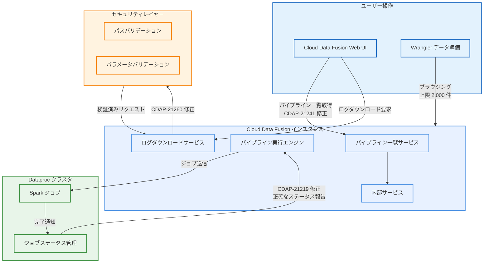

# Cloud Data Fusion: v6.11.1.4 GA リリース (レースコンディション修正とセキュリティ強化)

**リリース日**: 2026-07-15

**サービス**: Cloud Data Fusion

**機能**: Dataproc ジョブステータス修正、パイプライン一覧ハング修正、ログダウンロードセキュリティ修正、Wrangler ブラウジング制限拡大

**ステータス**: GA (一般提供)

[このアップデートのインフォグラフィックを見る](https://takech9203.github.io/google-cloud-news-summary/20260715-cloud-data-fusion-v6-11-1-4.html)

## 概要

Cloud Data Fusion バージョン 6.11.1.4 が一般提供 (GA) として公開された。本リリースは、パイプライン実行の信頼性に直接影響する 2 件のレースコンディション修正、1 件のセキュリティ脆弱性修正、および 1 件のユーザビリティ改善を含むパッチリビジョンである。

最も重要な修正として、正常に完了した Dataproc ジョブがプログラムの早期キャンセルにより Dataproc コンソール上で誤って失敗とマークされる問題 (CDAP-21219) が解消された。これにより、パイプライン運用チームがジョブの実際のステータスを正確に把握できるようになった。また、内部サービスのレースコンディションによりパイプライン一覧ページがハングする問題 (CDAP-21241) も修正され、Cloud Data Fusion Web UI の安定性が向上している。

セキュリティ面では、ログダウンロード機能において要求されたログパスおよびクエリパラメータに対する厳格なバリデーションが実装され、不正アクセスを防止する脆弱性修正 (CDAP-21260) が含まれている。本アップデートは、Cloud Data Fusion を利用してデータ統合パイプラインを運用するすべてのユーザーに推奨される。

**アップデート前の課題**

本アップデート以前には以下の課題が存在していた。

- Dataproc で正常に完了したジョブがプログラムの早期キャンセルにより誤って失敗とマークされ、運用チームが実際のジョブステータスを把握できなかった (CDAP-21219)
- 内部サービスのレースコンディションによりパイプライン一覧ページがハングし、ユーザーがパイプラインの管理操作を実行できなかった (CDAP-21241)
- ログダウンロード機能でログパスおよびクエリパラメータのバリデーションが不十分であり、不正アクセスのリスクが存在していた (CDAP-21260)
- Wrangler のブラウジング制限がデフォルトで低く設定されており、大量のデータセットやファイルを持つ環境でのデータ探索に制約があった (CDAP-21259)

**アップデート後の改善**

今回のアップデートにより以下の改善が実現した。

- Dataproc ジョブのステータス報告が正確になり、正常完了したジョブが正しく成功としてマークされるようになった
- パイプライン一覧ページのハング問題が解消され、Web UI の安定性と応答性が向上した
- ログダウンロードのパスおよびクエリパラメータに厳格なバリデーションが適用され、不正アクセスが防止されるようになった
- Wrangler のデフォルトブラウジング制限が 2,000 アイテムに拡大され、より多くのデータソースを一度に探索できるようになった

## アーキテクチャ図



Cloud Data Fusion v6.11.1.4 では、パイプライン実行時の Dataproc ジョブステータス報告の正確性、Web UI のパイプライン一覧サービスの安定性、ログダウンロードのセキュリティバリデーション、および Wrangler のブラウジング制限が改善されている。

## サービスアップデートの詳細

### 主要機能

1. **Dataproc ジョブステータスのレースコンディション修正 (CDAP-21219)**
   - 正常に完了した Dataproc ジョブが、プログラムの早期キャンセルにより Dataproc コンソール上で誤って失敗とマークされる問題が修正された
   - Cloud Data Fusion がジョブ完了を確認する前にプログラムキャンセル信号が発行されるタイミング問題が解消された
   - これにより、パイプライン実行のステータスが Dataproc コンソールと Cloud Data Fusion UI の間で一貫するようになった

2. **パイプライン一覧ページのハング修正 (CDAP-21241)**
   - 内部サービスのレースコンディションによりパイプライン一覧ページがハングする問題が修正された
   - パイプライン一覧の取得時に発生していた並行処理の競合状態が解消された
   - Web UI の応答性が改善され、大量のパイプラインを持つインスタンスでも安定した一覧表示が可能になった

3. **ログダウンロードのセキュリティ脆弱性修正 (CDAP-21260)**
   - ログダウンロード機能において、要求されたログパスおよびクエリパラメータに対する厳格なバリデーションが実装された
   - パストラバーサルや不正なクエリパラメータによる認可されていないアクセスが防止されるようになった
   - ログファイルへのアクセスが意図されたスコープ内に限定されるよう強化された

4. **Wrangler ブラウジング制限の拡大 (CDAP-21259)**
   - Wrangler のデフォルトブラウジング制限が 2,000 アイテムに増加された
   - データソース接続時のファイルやテーブルの一覧表示で、より多くのアイテムを一度に確認できるようになった
   - 大規模なデータレイクやデータウェアハウス環境でのデータ探索効率が向上した

## 技術仕様

### 修正内容の詳細

| CDAP ID | 種別 | 影響範囲 | 説明 |
|---------|------|---------|------|
| CDAP-21219 | Bug Fix | パイプライン実行 | Dataproc ジョブの早期キャンセルによる誤ったステータス報告の修正 |
| CDAP-21241 | Bug Fix | Web UI | 内部サービスのレースコンディションによるパイプライン一覧ハングの修正 |
| CDAP-21260 | Security Fix | ログ管理 | ログダウンロードのパスおよびパラメータバリデーション強化 |
| CDAP-21259 | Change | Wrangler | デフォルトブラウジング制限を 2,000 アイテムに増加 |

### Dataproc ジョブステータスのレースコンディション (CDAP-21219)

修正前のジョブ完了フローでは、以下のタイミング問題が発生していた。

```
[修正前]
1. Cloud Data Fusion がパイプラインを Dataproc に送信
2. Dataproc が Spark ジョブを実行し正常完了
3. プログラムキャンセル信号がジョブ完了確認前に発行される (レースコンディション)
4. Dataproc コンソールでジョブが「失敗」としてマークされる

[修正後]
1. Cloud Data Fusion がパイプラインを Dataproc に送信
2. Dataproc が Spark ジョブを実行し正常完了
3. ジョブ完了が確認された後にプログラムのクリーンアップが実行される
4. Dataproc コンソールでジョブが正しく「成功」としてマークされる
```

### Wrangler ブラウジング制限の変更

| 項目 | 変更前 | 変更後 |
|------|--------|--------|
| デフォルトブラウジング制限 | 低い値 (非公開) | 2,000 アイテム |
| 影響範囲 | データソース接続時のファイル/テーブル一覧 | 同左 |
| カスタマイズ | インスタンス設定で変更可能 | 同左 |

## 設定方法

### 前提条件

1. Cloud Data Fusion インスタンスがバージョン 6.11.1 系であること
2. `gcloud` CLI が認証済みであること
3. アップグレード前にすべての実行中パイプラインを停止し、スケジュールを一時停止すること

### 手順

#### ステップ 1: 実行中パイプラインの停止

```bash
# パイプラインスケジュールの一時停止を確認
# Cloud Data Fusion Web UI から実行中パイプラインを停止する
```

アップグレード中にパイプラインが実行されていると、予期しない結果が生じる可能性がある。

#### ステップ 2: パッチリビジョンへのアップグレード

```bash
gcloud beta data-fusion instances update INSTANCE_ID \
  --project=PROJECT_ID \
  --location=LOCATION \
  --version=6.11.1 \
  --patch_revision=6.11.1.4
```

以下を置き換える。
- `INSTANCE_ID`: Cloud Data Fusion インスタンス名
- `PROJECT_ID`: Google Cloud プロジェクト ID
- `LOCATION`: インスタンスのリージョン (例: `us-central1`)

#### ステップ 3: アップグレードの確認

```bash
gcloud beta data-fusion instances describe INSTANCE_ID \
  --project=PROJECT_ID \
  --location=LOCATION
```

出力の `patchRevision` フィールドが `6.11.1.4` に更新されていることを確認する。

#### ステップ 4: パイプラインスケジュールの再開

アップグレード完了後、一時停止していたパイプラインスケジュールとトリガーを再開する。

## メリット

### ビジネス面

- **運用信頼性の向上**: Dataproc ジョブステータスの正確な報告により、パイプライン運用チームが実際の処理結果を正しく把握でき、誤った障害対応の削減につながる
- **セキュリティ態勢の強化**: ログダウンロードのバリデーション強化により、コンプライアンス要件への適合性が向上する
- **生産性の向上**: パイプライン一覧ページのハング解消と Wrangler ブラウジング制限の拡大により、日常的な開発・運用作業の効率が改善される

### 技術面

- **レースコンディションの解消**: Dataproc ジョブステータスおよびパイプライン一覧サービスにおける並行処理の競合状態が根本的に修正された
- **セキュリティバリデーションの強化**: パストラバーサル攻撃や不正なクエリパラメータによるログへの不正アクセスが防止される
- **データ探索の拡張**: Wrangler のブラウジング制限が 2,000 アイテムに拡大され、大規模データソース環境でのデータ準備ワークフローが効率化される
- **Dataproc との整合性**: Cloud Data Fusion と Dataproc コンソール間でジョブステータスが一貫するようになり、トラブルシューティングが容易になる

## デメリット・制約事項

### 制限事項

- パッチリビジョンのアップグレードにはダウンタイムが必要であり、事前にパイプラインの停止とスケジュールの一時停止が必要
- Wrangler のブラウジング制限拡大により、大量のアイテムを持つデータソースでのレスポンス時間が若干増加する可能性がある
- 本パッチはバージョン 6.11.1 系のみに適用可能であり、それ以前のバージョンには直接適用できない

### 考慮すべき点

- アップグレード中にパイプラインが実行されていると予期しない結果が生じる可能性があるため、計画的なメンテナンスウィンドウでの適用を推奨する
- CDAP-21219 の修正前に誤って失敗とマークされたジョブについては、実際のデータ処理結果を確認する必要がある場合がある
- CDAP-21260 のセキュリティ修正により、これまで許可されていた一部の非標準的なログパスやクエリパラメータがブロックされる可能性がある

## ユースケース

### ユースケース 1: 大規模パイプライン運用環境での安定性向上

**シナリオ**: 数百のバッチパイプラインを運用する企業が、パイプライン一覧ページのハングにより運用管理に支障をきたしている。また、Dataproc コンソールで一部のジョブが誤って失敗と表示されるため、運用チームが不必要な障害調査に時間を費やしている。

**実装例**:
```bash
# パッチリビジョン 6.11.1.4 へのアップグレード
gcloud beta data-fusion instances update production-instance \
  --project=my-data-platform \
  --location=us-central1 \
  --version=6.11.1 \
  --patch_revision=6.11.1.4
```

**効果**: パイプライン一覧ページのハングが解消され、運用チームはすべてのパイプラインの状態を即座に確認できるようになる。Dataproc ジョブステータスの正確な報告により、誤った障害アラートが削減され、運用効率が向上する。

### ユースケース 2: セキュリティ監査対応

**シナリオ**: 金融機関がセキュリティ監査でログアクセスの制御に関する脆弱性を指摘され、早急な対応が求められている。

**効果**: CDAP-21260 の修正により、ログダウンロード機能にパストラバーサル防止およびクエリパラメータバリデーションが実装され、監査指摘事項への対応が完了する。ログへのアクセスが意図されたスコープ内に限定され、不正アクセスのリスクが排除される。

### ユースケース 3: 大規模データレイクでの Wrangler 活用

**シナリオ**: Cloud Storage に数千のファイルを格納するデータレイク環境で、データエンジニアが Wrangler を使用してデータ準備を行う際、ブラウジング制限により目的のファイルを見つけるのに時間がかかっている。

**効果**: デフォルトブラウジング制限が 2,000 アイテムに拡大されたことで、より多くのファイルやテーブルを一覧表示でき、目的のデータソースへのアクセスが迅速になる。

## 料金

Cloud Data Fusion の料金はインスタンスのエディションと実行時間に基づいて課金される。本パッチリビジョン (v6.11.1.4) の適用による追加料金は発生しない。

### エディション別料金の目安

| エディション | 用途 | 料金体系 |
|-------------|------|---------|
| Developer | 開発・テスト | 時間単位課金 (最小コスト) |
| Basic | 中規模本番環境 | 時間単位課金 |
| Enterprise | 大規模ミッションクリティカル | 時間単位課金 (RBAC 対応) |

詳細な料金情報については、[Cloud Data Fusion 料金ページ](https://cloud.google.com/data-fusion/pricing) を参照。

## 利用可能リージョン

Cloud Data Fusion v6.11.1.4 は、Cloud Data Fusion がサポートするすべてのリージョンで利用可能。サポートされるリージョンの一覧については、[Cloud Data Fusion のサポート対象リージョン](https://cloud.google.com/data-fusion/pricing#supported_regions) を参照。

## 関連サービス・機能

- **Dataproc (Managed Service for Apache Spark)**: Cloud Data Fusion がパイプライン実行時にエフェメラル Dataproc クラスタをプロビジョニングする実行環境。CDAP-21219 の修正により、ジョブステータスの整合性が向上
- **Cloud Data Fusion Wrangler**: データ準備ツール。CDAP-21259 によりブラウジング制限が 2,000 アイテムに拡大
- **Cloud Logging**: ログダウンロード機能のセキュリティが CDAP-21260 により強化
- **Cloud Data Fusion v6.11.1.1 (前パッチ)**: InstanceV3 モニタリングリソース導入、プレビューランナーセキュリティ修正、タスクワーカーハング修正を含む

## 参考リンク

- [インフォグラフィック](https://takech9203.github.io/google-cloud-news-summary/20260715-cloud-data-fusion-v6-11-1-4.html)
- [公式リリースノート](https://docs.cloud.google.com/release-notes#July_15_2026)
- [Cloud Data Fusion ドキュメント](https://docs.cloud.google.com/data-fusion/docs/concepts/overview)
- [パッチリビジョンへのアップグレード手順](https://docs.cloud.google.com/data-fusion/docs/how-to/upgrade-to-patch-revision)
- [利用可能なバージョンアップグレード](https://docs.cloud.google.com/data-fusion/docs/concepts/available-upgrades)
- [Wrangler 概要](https://docs.cloud.google.com/data-fusion/docs/concepts/wrangler-overview)
- [料金ページ](https://cloud.google.com/data-fusion/pricing)

## まとめ

Cloud Data Fusion v6.11.1.4 は、パイプライン実行の信頼性とセキュリティを強化する重要なパッチリビジョンである。特に Dataproc ジョブステータスのレースコンディション修正は、パイプライン運用における誤検知を排除し、運用効率を大幅に改善する。ログダウンロードのセキュリティ脆弱性修正はセキュリティ監査対応としても重要であり、6.11.1 系を利用するすべてのユーザーに早期のパッチ適用を推奨する。

---

**タグ**: #CloudDataFusion #GA #パッチリビジョン #レースコンディション修正 #Dataproc #セキュリティ修正 #Wrangler #CDAP21219 #CDAP21241 #CDAP21260 #DataIntegration
