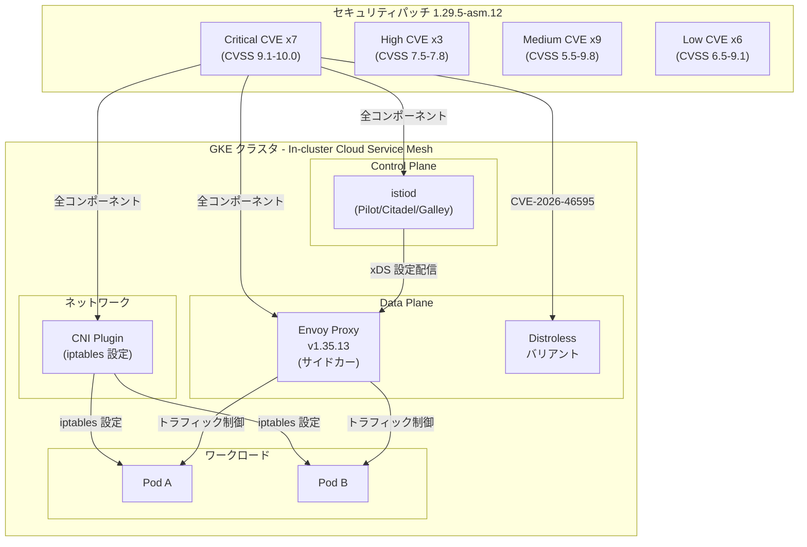

# Cloud Service Mesh: 1.29.5-asm.12 緊急セキュリティパッチ (複数の Critical CVE 修正)

**リリース日**: 2026-07-15

**サービス**: Cloud Service Mesh

**機能**: In-cluster Cloud Service Mesh セキュリティパッチリリース (1.29.5-asm.12)

**ステータス**: Fixed (Security - CRITICAL)

[このアップデートのインフォグラフィックを見る](https://takech9203.github.io/google-cloud-news-summary/20260715-cloud-service-mesh-1-29-5-asm-12-cve.html)

## 概要

Google Cloud は、in-cluster Cloud Service Mesh に対して緊急セキュリティパッチ 1.29.5-asm.12 をリリースした。本リリースでは Envoy v1.35.13 を使用し、25 件の CVE に対する修正が含まれている。そのうち 7 件が Critical (CVSS 9.1-10.0)、3 件が High (CVSS 7.5-7.8) と評価されており、極めて深刻度の高いセキュリティアップデートである。

影響を受けるコンポーネントは Proxy (Envoy サイドカー)、Control Plane (istiod)、Distroless バリアント、および CNI プラグインと多岐にわたる。特に CVE-2026-46595 は CVSS 10.0 (最大深刻度) で全主要コンポーネントに影響するため、すべての in-cluster Cloud Service Mesh ユーザーに対して即時アップグレードが強く推奨される。

対象ユーザーは、in-cluster Cloud Service Mesh 1.29.x を使用しているすべての GKE クラスタ管理者、プラットフォームエンジニア、およびセキュリティチームである。Critical CVE が 7 件含まれることから、本パッチは最優先で適用すべきアップデートである。

**アップデート前の課題**

- CVE-2026-46595 (CVSS 10.0) により、Proxy、Control Plane、Distroless、CNI の全コンポーネントがリモートからの攻撃に対して脆弱な状態であった
- CVE-2026-39830 から CVE-2026-39834、CVE-2026-42508 (各 CVSS 9.1) により、全コンポーネントに Critical レベルの脆弱性が存在していた
- 複数の High/Medium 深刻度の脆弱性により、サービスメッシュ内のトラフィック制御やネットワークポリシーのバイパスが可能な状態であった
- CNI プラグインの脆弱性により、Pod のネットワーク設定段階でのセキュリティリスクが存在していた

**アップデート後の改善**

- 25 件すべての CVE が修正され、Proxy、Control Plane、Distroless、CNI の全コンポーネントの脆弱性が解消される
- Envoy v1.35.13 への更新により、データプレーンのセキュリティが大幅に強化される
- CNI プラグインの脆弱性修正により、Pod ネットワーク設定のセキュリティが向上する
- サービスメッシュ全体のセキュリティ境界が再確立される

## アーキテクチャ図



Cloud Service Mesh の主要コンポーネント (Control Plane、Proxy、Distroless、CNI) に対する CVE の影響範囲を示す。Critical CVE は全コンポーネントに影響し、サービスメッシュの全レイヤーにおけるセキュリティリスクを表している。

## サービスアップデートの詳細

### 主要機能

1. **Critical CVE の修正 (CVSS 9.1-10.0) - 7 件**
   - CVE-2026-46595 (CVSS 10.0): Proxy、Control Plane、Distroless、CNI の全コンポーネントに影響する最大深刻度の脆弱性
   - CVE-2026-39830 ~ CVE-2026-39834 (各 CVSS 9.1): 全コンポーネントに影響する Critical 脆弱性群
   - CVE-2026-42508 (CVSS 9.1): 全コンポーネントに影響する Critical 脆弱性

2. **High CVE の修正 (CVSS 7.5-7.8) - 3 件**
   - CVE-2026-39822 (CVSS 7.8): 全コンポーネントに影響
   - CVE-2026-39829 (CVSS 7.5): 全コンポーネントに影響
   - CVE-2026-46597 (CVSS 7.5): 全コンポーネントに影響

3. **Envoy v1.35.13 への更新**
   - データプレーンの基盤となる Envoy プロキシが最新のセキュリティパッチ済みバージョンに更新
   - 前バージョン (1.29.5-asm.5 で使用されていた Envoy v1.37.5) からの累積的なセキュリティ修正を含む

## 技術仕様

### CVE 一覧 (深刻度順)

| CVE | 深刻度 | CVSS | Proxy | Control Plane | Distroless | CNI |
|-----|--------|------|-------|---------------|------------|-----|
| CVE-2026-46595 | Critical | 10.0 | Yes | Yes | Yes | Yes |
| CVE-2026-8376 | Medium | 9.8 | Yes | Yes | No | Yes |
| CVE-2026-8925 | Medium | 9.8 | Yes | Yes | No | Yes |
| CVE-2026-39830 | Critical | 9.1 | Yes | Yes | Yes | Yes |
| CVE-2026-39831 | Critical | 9.1 | Yes | Yes | Yes | Yes |
| CVE-2026-39832 | Critical | 9.1 | Yes | Yes | Yes | Yes |
| CVE-2026-39833 | Critical | 9.1 | Yes | Yes | Yes | Yes |
| CVE-2026-39834 | Critical | 9.1 | Yes | Yes | Yes | Yes |
| CVE-2026-42496 | Medium | 9.1 | Yes | Yes | No | Yes |
| CVE-2026-42508 | Critical | 9.1 | Yes | Yes | Yes | Yes |
| CVE-2026-8924 | Low | 9.1 | Yes | Yes | No | Yes |
| CVE-2026-8927 | Medium | 9.1 | Yes | Yes | No | Yes |
| CVE-2026-8286 | Low | 8.1 | Yes | Yes | No | Yes |
| CVE-2025-69720 | Low | 7.8 | Yes | Yes | No | Yes |
| CVE-2026-39822 | High | 7.8 | Yes | Yes | Yes | Yes |
| CVE-2026-39829 | High | 7.5 | Yes | Yes | Yes | Yes |
| CVE-2026-41992 | Medium | 7.5 | Yes | Yes | No | Yes |
| CVE-2026-46597 | High | 7.5 | Yes | Yes | Yes | Yes |
| CVE-2026-9547 | Low | 7.4 | Yes | Yes | No | Yes |
| CVE-2026-25680 | Medium | 6.5 | Yes | Yes | Yes | Yes |
| CVE-2026-39827 | Medium | 6.5 | Yes | Yes | Yes | Yes |
| CVE-2026-8458 | Low | 6.5 | Yes | Yes | No | Yes |
| CVE-2026-39828 | Medium | 6.3 | Yes | Yes | Yes | Yes |
| CVE-2026-5704 | Medium | 5.5 | Yes | Yes | No | Yes |
| CVE-2026-58055 | - | - | Yes | Yes | No | Yes |

### コンポーネント別影響サマリ

| コンポーネント | 影響 CVE 数 | Critical | High | Medium | Low |
|---------------|------------|----------|------|--------|-----|
| Proxy (Envoy) | 25 | 7 | 3 | 9 | 6 |
| Control Plane (istiod) | 25 | 7 | 3 | 9 | 6 |
| Distroless | 12 | 7 | 3 | 2 | 0 |
| CNI | 25 | 7 | 3 | 9 | 6 |

### パッチバージョン情報

| 項目 | 詳細 |
|------|------|
| パッチバージョン | 1.29.5-asm.12 |
| Envoy バージョン | v1.35.13 |
| 対象環境 | In-cluster Cloud Service Mesh |
| 修正 CVE 数 | 25 件 |
| Critical CVE 数 | 7 件 |
| 前バージョン | 1.29.5-asm.5 (Envoy v1.37.5) |

## 設定方法

### 前提条件

1. In-cluster Cloud Service Mesh 1.29.x が既にインストールされた GKE クラスタ
2. `asmcli` ツールの最新版がダウンロード済みであること
3. クラスタに対する `container.admin` または同等の IAM 権限
4. `kubectl` がターゲットクラスタに接続されていること

### 手順

#### ステップ 1: 現在のバージョンを確認

```bash
# 現在の Cloud Service Mesh バージョンを確認
kubectl get pods -n istio-system -o jsonpath='{range .items[*]}{.metadata.name}{"\t"}{.spec.containers[0].image}{"\n"}{end}'

# istiod のバージョンを確認
kubectl get deployment istiod -n istio-system -o jsonpath='{.spec.template.spec.containers[0].image}'
```

現在のバージョンが 1.29.5-asm.12 より古い場合、直ちにアップグレードを実施する。

#### ステップ 2: asmcli を使用してアップグレード

```bash
# asmcli のダウンロード (最新版)
curl https://storage.googleapis.com/csm-artifacts/asm/asmcli_1.29 > asmcli
chmod +x asmcli

# In-cluster Cloud Service Mesh のアップグレード
./asmcli install \
  --project_id PROJECT_ID \
  --cluster_name CLUSTER_NAME \
  --cluster_location CLUSTER_LOCATION \
  --fleet_id FLEET_PROJECT_ID \
  --output_dir ./asm_output \
  --enable_all
```

asmcli install コマンドにより、Control Plane (istiod) が 1.29.5-asm.12 に更新される。

#### ステップ 3: ワークロードの再デプロイ

```bash
# 名前空間ごとにワークロードを再起動してサイドカープロキシを更新
kubectl rollout restart deployment -n NAMESPACE

# ロールアウト状況を確認
kubectl rollout status deployment -n NAMESPACE --timeout=300s

# 更新後のプロキシバージョンを確認
kubectl get pods -n NAMESPACE -o jsonpath='{range .items[*]}{.metadata.name}{"\t"}{.spec.containers[?(@.name=="istio-proxy")].image}{"\n"}{end}'
```

Control Plane の更新後、各ワークロードの Pod を再起動してサイドカープロキシ (Envoy) を最新バージョンに更新する。

#### ステップ 4: CNI プラグインの更新確認

```bash
# CNI DaemonSet の状態を確認
kubectl get daemonset istio-cni-node -n kube-system

# CNI のバージョンを確認
kubectl get daemonset istio-cni-node -n kube-system -o jsonpath='{.spec.template.spec.containers[0].image}'
```

CNI プラグインも脆弱性の対象であるため、更新が正しく適用されていることを確認する。

#### ステップ 5: Ingress Gateway の更新 (使用している場合)

```bash
# Ingress Gateway の再起動
kubectl rollout restart deployment istio-ingressgateway -n istio-system

# ステータス確認
kubectl rollout status deployment istio-ingressgateway -n istio-system
```

## メリット

### ビジネス面

- **重大なセキュリティリスクの排除**: CVSS 10.0 を含む 7 件の Critical CVE が修正され、サービスメッシュに対する攻撃リスクが大幅に低減される
- **コンプライアンス維持**: PCI DSS、SOC 2、ISO 27001 などのセキュリティ基準で求められるパッチ適用の迅速性を満たすことができる
- **事業継続性の確保**: 脆弱性を放置した場合のインシデント発生リスクを回避し、サービスの安定的な提供を維持できる

### 技術面

- **全レイヤーのセキュリティ強化**: Proxy、Control Plane、CNI の全コンポーネントにわたる包括的なセキュリティ修正
- **Envoy v1.35.13 による堅牢化**: データプレーンの基盤がセキュリティ強化された最新バージョンに更新される
- **CNI セキュリティの改善**: Pod ネットワーク設定段階でのセキュリティが向上し、iptables ルール構成の安全性が確保される

## デメリット・制約事項

### 制限事項

- In-cluster Cloud Service Mesh 専用のパッチであり、Managed Cloud Service Mesh は別途自動更新される
- Cloud Service Mesh v1.26 以前のバージョンはサポート終了のため、この CVE 修正はバックポートされない。v1.27 以上への移行が必要
- asmcli によるアップグレードには一時的な Control Plane のダウンタイムが発生する可能性がある (既存の接続には影響しない)

### 考慮すべき点

- 25 件の CVE 修正を含む大規模パッチであるため、アップグレード前にステージング環境での検証を推奨する (ただし Critical CVE のため迅速な対応を優先すべき)
- ワークロードの再デプロイが必要であり、Pod の再起動によるサービスへの影響を PodDisruptionBudget で制御する必要がある
- マルチクラスタメッシュの場合、すべてのクラスタで同時にアップグレードを実施することが推奨される
- CNI プラグインの更新により、一時的に新規 Pod のネットワーク設定に影響が出る可能性がある

## ユースケース

### ユースケース 1: 本番環境の緊急パッチ適用

**シナリオ**: 本番環境で in-cluster Cloud Service Mesh 1.29.x を使用しており、CVE-2026-46595 (CVSS 10.0) に対する緊急パッチを適用する必要がある場合

**実装例**:
```bash
# ステージング環境で先行検証 (可能であれば)
./asmcli install \
  --project_id PROJECT_ID \
  --cluster_name staging-cluster \
  --cluster_location us-central1 \
  --fleet_id FLEET_PROJECT_ID \
  --output_dir ./asm_output \
  --enable_all

# 検証後、本番環境に適用
./asmcli install \
  --project_id PROJECT_ID \
  --cluster_name production-cluster \
  --cluster_location us-central1 \
  --fleet_id FLEET_PROJECT_ID \
  --output_dir ./asm_output \
  --enable_all

# PDB を考慮した段階的ワークロード再起動
for ns in app-namespace-1 app-namespace-2 app-namespace-3; do
  kubectl rollout restart deployment -n $ns
  kubectl rollout status deployment -n $ns --timeout=600s
  echo "Namespace $ns updated successfully"
done
```

**効果**: Critical CVE を含む全脆弱性が修正され、サービスメッシュのセキュリティが回復する。PDB によりサービスの可用性を維持しながらパッチが適用される。

### ユースケース 2: マルチクラスタメッシュのアップグレード

**シナリオ**: 複数の GKE クラスタで in-cluster Cloud Service Mesh を運用しており、全クラスタにセキュリティパッチを適用する必要がある場合

**実装例**:
```bash
# マルチクラスタメッシュの信頼設定を更新
./asmcli create-mesh \
  FLEET_PROJECT_ID \
  PROJECT_ID/us-central1/cluster-1 \
  PROJECT_ID/us-east1/cluster-2 \
  PROJECT_ID/europe-west1/cluster-3

# 各クラスタを順次アップグレード
for cluster in cluster-1 cluster-2 cluster-3; do
  ./asmcli install \
    --project_id PROJECT_ID \
    --cluster_name $cluster \
    --cluster_location LOCATION \
    --fleet_id FLEET_PROJECT_ID \
    --output_dir ./asm_output \
    --enable_all
done
```

**効果**: マルチクラスタ環境全体でセキュリティパッチが統一的に適用され、クラスタ間通信のセキュリティが確保される。

## 料金

Cloud Service Mesh のセキュリティパッチ適用に追加料金は発生しない。Cloud Service Mesh は GKE Enterprise の一部として提供されており、パッチの適用自体にコストはかからない。

ただし、ワークロードの再デプロイに伴い一時的にリソース使用量が増加する可能性がある (ローリングアップデート中の新旧 Pod の並行稼働)。

詳細は [Cloud Service Mesh の料金ページ](https://cloud.google.com/service-mesh/pricing) を参照。

## 関連サービス・機能

- **Google Kubernetes Engine (GKE)**: Cloud Service Mesh の実行基盤。In-cluster Cloud Service Mesh は GKE クラスタ上で動作する
- **Cloud Service Mesh セキュリティ速報**: CVE の詳細と影響範囲、推奨アクションが公開される。[XML フィード](https://cloud.google.com/feeds/cloud-service-mesh-security-bulletins.xml) で購読可能
- **Envoy Proxy**: Cloud Service Mesh のデータプレーンを構成するプロキシ。本パッチで v1.35.13 に更新される
- **Istio CNI Plugin**: Pod のネットワーク設定を行う CNI プラグイン。iptables ルールの構成によりトラフィックリダイレクトを実現する
- **Cloud Monitoring / Cloud Logging**: パッチ適用後のサービスメッシュの動作監視に活用。異常なトラフィックパターンや接続エラーの検知に使用
- **Binary Authorization**: コンテナイメージの署名検証により、パッチ適用済みのイメージのみがデプロイされることを保証する

## 参考リンク

- [インフォグラフィック](https://takech9203.github.io/google-cloud-news-summary/20260715-cloud-service-mesh-1-29-5-asm-12-cve.html)
- [公式リリースノート](https://docs.cloud.google.com/release-notes#July_15_2026)
- [Cloud Service Mesh リリースノート](https://cloud.google.com/service-mesh/docs/release-notes)
- [Cloud Service Mesh セキュリティ速報](https://cloud.google.com/service-mesh/docs/security-bulletins)
- [Cloud Service Mesh アップグレード手順](https://cloud.google.com/service-mesh/docs/upgrade/upgrade)
- [In-cluster Cloud Service Mesh サポートされる機能](https://cloud.google.com/service-mesh/docs/supported-features-in-cluster)
- [料金ページ](https://cloud.google.com/service-mesh/pricing)

## まとめ

Cloud Service Mesh 1.29.5-asm.12 は、CVSS 10.0 の最大深刻度を含む 7 件の Critical CVE を修正する極めて重要な緊急セキュリティパッチである。Proxy、Control Plane、Distroless、CNI の全コンポーネントが影響を受けるため、in-cluster Cloud Service Mesh を使用しているすべての環境で即時アップグレードを実施することが強く推奨される。アップグレードには `asmcli install` コマンドを使用し、その後ワークロードの再デプロイを行うことで、サイドカープロキシが Envoy v1.35.13 に更新される。

---

**タグ**: #CloudServiceMesh #Security #CVE #Critical #GKE #ServiceMesh #Envoy #Proxy #ControlPlane #CNI #Distroless #緊急パッチ #InCluster
