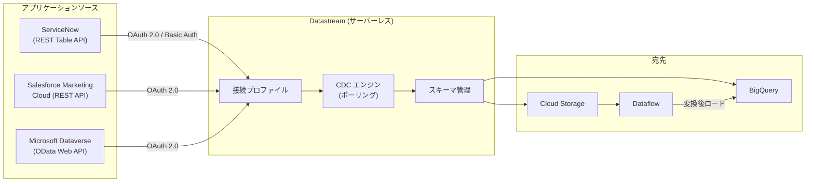

# Datastream: アプリケーションソースレプリケーション (ServiceNow, Salesforce Marketing Cloud, Microsoft Dataverse) - Preview

**リリース日**: 2026-07-15

**サービス**: Datastream

**機能**: アプリケーションソースレプリケーション (ServiceNow, Salesforce Marketing Cloud, Microsoft Dataverse) - Preview

**ステータス**: Preview

📊 [このアップデートのインフォグラフィックを見る](https://takech9203.github.io/google-cloud-news-summary/20260715-datastream-application-sources-preview.html)

## 概要

Google Cloud の CDC (Change Data Capture) およびレプリケーションサービスである Datastream に、新たに 3 つのアプリケーションソースが Preview として追加されました。ServiceNow、Salesforce Marketing Cloud、Microsoft Dataverse からの変更データレプリケーションが可能になり、これらの SaaS アプリケーションのデータを BigQuery や Cloud Storage にニアリアルタイムで連携できるようになります。

これまで Datastream はデータベースソース (MySQL、Oracle、PostgreSQL、SQL Server、MongoDB、Spanner) および Salesforce をサポートしていましたが、今回のアップデートにより、エンタープライズ IT サービス管理 (ServiceNow)、デジタルマーケティング (Salesforce Marketing Cloud)、ビジネスアプリケーションプラットフォーム (Microsoft Dataverse) のデータもサーバーレスで統合できるようになります。

対象ユーザーは、これらの SaaS アプリケーションのデータを Google Cloud のデータウェアハウスやデータレイクに統合し、分析やレポーティングを行いたい組織のデータエンジニアやアナリストです。

**アップデート前の課題**

- ServiceNow、Salesforce Marketing Cloud、Microsoft Dataverse のデータを BigQuery に取り込むには、サードパーティの ETL ツールやカスタムパイプラインの構築が必要だった
- 各 SaaS からのデータ抽出を個別に管理する必要があり、運用負荷が高かった
- ニアリアルタイムでの変更データキャプチャが困難で、バッチ処理に依存していた

**アップデート後の改善**

- Datastream のサーバーレスアーキテクチャにより、インフラ管理なしで 3 つの SaaS ソースからのデータレプリケーションが可能になった
- 統一された管理インターフェースで、データベースソースと SaaS ソースを一元管理できるようになった
- ポーリングベースの増分同期により、変更データをニアリアルタイムで BigQuery や Cloud Storage に連携できるようになった

## アーキテクチャ図



Datastream は各アプリケーションソースの API を通じて認証し、ポーリングベースで変更データを検出してサーバーレスに宛先へストリーミングします。

## サービスアップデートの詳細

### 主要機能

1. **ServiceNow ソースレプリケーション**
   - ServiceNow REST Table API (V2) を使用したデータレプリケーション
   - キーセットベースのページネーションによる信頼性の高い初期バックフィル
   - `sys_updated_on` フィールドを使用した増分同期
   - 動的なスキーマ検出とテーブルフィルタリング (仮想テーブル、プライベートテーブルを除外)
   - OAuth 2.0 クライアント認証情報フローまたは Basic 認証に対応

2. **Salesforce Marketing Cloud ソースレプリケーション**
   - Salesforce Marketing Cloud REST API を使用したデータレプリケーション
   - Assets、Email definitions、Campaigns、Journeys、Contacts などの主要オブジェクトに対応
   - 増分同期対応オブジェクトと定期フルリフレッシュオブジェクト (Data Extensions) の両方をサポート
   - サーバー間 OAuth 2.0 フローによる認証

3. **Microsoft Dataverse ソースレプリケーション**
   - Dataverse Web API (OData v9.1) を使用したデータレプリケーション
   - OAuth 2.0 クライアント認証情報フロー (Azure AD 経由) による認証
   - `/EntityDefinitions` エンドポイントによる動的スキーマ検出
   - `modifiedon` フィールドを使用したタイムスタンプベースの増分同期
   - 標準テーブルとカスタムテーブルの両方をサポート

## 技術仕様

### サポートされるソースとレプリケーション方式

| ソース | API | 認証方式 | バックフィル | 増分同期 | 削除検出 |
|--------|-----|----------|-------------|----------|----------|
| ServiceNow | REST Table API V2 | OAuth 2.0 / Basic Auth | キーセットページネーション | `sys_updated_on` ベース | 非対応 |
| Salesforce Marketing Cloud | REST API | OAuth 2.0 (Server-to-Server) | 自動ページネーション | オブジェクト依存 | 非対応 |
| Microsoft Dataverse | Web API (OData v9.1) | OAuth 2.0 (Azure AD) | `@odata.nextLink` ページネーション | `modifiedon` タイムスタンプ | 非対応 |

### Salesforce Marketing Cloud サポートオブジェクト

| オブジェクト | レプリケーション方式 |
|-------------|---------------------|
| Assets (テキスト、ファイル、メール、メッセージ) | バックフィル + 増分同期 |
| Email definitions | バックフィル + 増分同期 |
| Push definitions | バックフィル + 増分同期 |
| OTT definitions | バックフィル + 増分同期 |
| SMS definitions | バックフィル + 増分同期 |
| Campaigns | バックフィル + 増分同期 |
| Data extensions (カスタムオブジェクト) | バックフィル + 定期フルリフレッシュ |
| Journeys | バックフィル + 増分同期 |
| Security events | バックフィル + 増分同期 |
| Audit events | バックフィル + 増分同期 |
| Contacts | バックフィル + 増分同期 |

## 設定方法

### 前提条件

1. Google Cloud プロジェクトで Datastream API が有効化されていること
2. 各アプリケーションソースへの管理者アクセス権限

### 手順

#### ステップ 1: ソースの設定 (ServiceNow の例)

```bash
# ServiceNow インスタンスで Web Services Access を有効化し、
# OAuth 2.0 を設定後、Datastream 接続プロファイルを作成
gcloud datastream connection-profiles create servicenow-profile \
    --location=us-central1 \
    --type=SERVICENOW \
    --display-name="ServiceNow Production"
```

ServiceNow の場合、OAuth 2.0 プラグインを有効化し、クライアント認証情報を生成します。テーブルの `ws_access=true` 設定も必要です。

#### ステップ 2: ソースの設定 (Microsoft Dataverse の例)

```bash
# Azure AD でアプリケーション登録後、Dataverse 接続プロファイルを作成
gcloud datastream connection-profiles create dataverse-profile \
    --location=us-central1 \
    --type=DATAVERSE \
    --display-name="Dataverse Production"
```

Azure AD でアプリケーションを登録し、Client ID、Tenant ID、Client Secret を取得します。Dataverse 環境でアプリケーションユーザーを作成し、必要なテーブルへの読み取り権限を付与します。

#### ステップ 3: ストリームの作成

```bash
# BigQuery を宛先としたストリームの作成
gcloud datastream streams create my-stream \
    --location=us-central1 \
    --source=servicenow-profile \
    --destination=bigquery-profile \
    --display-name="ServiceNow to BigQuery"
```

ストリーム作成時にポーリング間隔を設定し、データフレッシュネスの要件に合わせます。

## メリット

### ビジネス面

- **データサイロの解消**: ServiceNow のインシデント管理データ、Salesforce Marketing Cloud のキャンペーンデータ、Dataverse のビジネスデータを BigQuery に統合し、組織横断的な分析が可能
- **迅速な分析**: ニアリアルタイムでのデータレプリケーションにより、最新のビジネスデータに基づいた意思決定を支援
- **運用コスト削減**: サーバーレスアーキテクチャにより、カスタム ETL パイプラインの構築・運用が不要

### 技術面

- **サーバーレス**: インフラの管理やスケーリングが不要で、データ量に応じて自動スケール
- **統一管理**: データベースソースと SaaS ソースを同一の Datastream コンソールで管理可能
- **Knowledge Catalog 連携**: Datastream リソースを Knowledge Catalog で検索・ブラウズでき、データリネージの追跡が容易

## デメリット・制約事項

### 制限事項

- 3 つのソース全てにおいて、削除イベントの検出は非対応
- Preview ステータスのため、SLA の対象外であり、本番環境での使用は推奨されない
- ServiceNow: 内部プラットフォームテーブル (ts_、v_、imp_ プレフィックス等) は自動的に除外される
- Salesforce Marketing Cloud: Marketing Cloud Account Engagement および Agentforce Marketing との統合は非対応。SOAP 専用オブジェクト (Lists、Subscriptions、Links) は非対応
- Microsoft Dataverse: 仮想テーブルとプライベートテーブルは非対応。Delta Link ベースの変更追跡は非サポート

### 考慮すべき点

- ポーリング間隔の設定がデータフレッシュネスと API クォータ消費のトレードオフとなる
- Preview 機能のため、GA までに仕様変更の可能性がある
- 各ソースの API クォータ制限 (特に Salesforce の 24 時間ローリングウィンドウ) を事前に確認する必要がある

## ユースケース

### ユースケース 1: IT サービス管理データの分析基盤構築

**シナリオ**: エンタープライズ企業が ServiceNow のインシデント管理、変更管理、サービスリクエストのデータを BigQuery に集約し、IT 運用のトレンド分析やSLA 遵守状況のダッシュボードを構築する。

**効果**: リアルタイムに近いデータで IT 運用の可視化が実現し、問題の早期発見とプロアクティブな対応が可能になる。カスタム ETL パイプラインの構築・運用コストも削減される。

### ユースケース 2: マーケティングキャンペーン効果のクロスチャネル分析

**シナリオ**: マーケティングチームが Salesforce Marketing Cloud のメールキャンペーン、SMS、プッシュ通知のデータを BigQuery に連携し、他のチャネルデータ (Web アナリティクス、広告データ) と統合して ROI 分析を行う。

**効果**: キャンペーンのパフォーマンスをニアリアルタイムで追跡し、チャネル横断の顧客ジャーニー分析が可能になる。

### ユースケース 3: ビジネスアプリケーションデータの統合データウェアハウス

**シナリオ**: Microsoft Dynamics 365 を使用する組織が Dataverse のビジネスデータ (顧客、商談、注文) を BigQuery に連携し、Google Cloud の ML/AI サービスと組み合わせて予測分析を実施する。

**効果**: Dataverse のビジネスデータと他のデータソースを統合し、Vertex AI による売上予測や顧客離脱予測などの高度な分析が実現する。

## 料金

Datastream は宛先にストリーミングされたデータ量 (GB) に基づいて課金されます。

| 項目 | 詳細 |
|------|------|
| 課金単位 | 宛先にストリーミングされたデータ量 (GB) |
| 無料枠 | Google Cloud ソース (AlloyDB, Spanner) の CDC データは月 100 GiB まで無料 |
| 追加費用 | BigQuery や Dataflow を宛先として使用する場合、各サービスの料金が別途発生 |

**注意**: アプリケーションソース (ServiceNow、Salesforce Marketing Cloud、Microsoft Dataverse) への無料枠の適用有無については、[公式料金ページ](https://cloud.google.com/datastream/pricing)を確認してください。

## 利用可能リージョン

Datastream は世界中の 35 以上のリージョンで利用可能です。主要なリージョンは以下の通りです。

| 地域 | リージョン |
|------|-----------|
| アジア太平洋 | asia-east1 (台湾), asia-northeast1 (東京), asia-northeast2 (大阪), asia-northeast3 (ソウル), asia-south1 (ムンバイ), asia-southeast1 (シンガポール), australia-southeast1 (シドニー) |
| ヨーロッパ | europe-west1 (ベルギー), europe-west2 (ロンドン), europe-west3 (フランクフルト), europe-west4 (オランダ), europe-north1 (フィンランド) |
| 北米 | us-central1 (アイオワ), us-east1 (サウスカロライナ), us-east4 (バージニア北部), us-west1 (オレゴン), northamerica-northeast1 (モントリオール) |
| 中東 | me-central1 (ドーハ), me-west1 (テルアビブ) |

## 関連サービス・機能

- **BigQuery**: Datastream の主要な宛先。CDC データをリアルタイムにロードし、分析クエリを実行
- **Cloud Storage**: もう一つの宛先オプション。Avro/JSON 形式でイベントストリームを保存
- **Dataflow**: Cloud Storage に書き込まれたデータを変換し、Cloud SQL や Spanner などにロードするテンプレートを提供
- **Knowledge Catalog**: Datastream リソースのメタデータとリネージを一元管理
- **Salesforce ソース (GA)**: 今回の Marketing Cloud とは別に、標準の Salesforce CRM は既に GA として利用可能

## 参考リンク

- 📊 [インフォグラフィック](https://takech9203.github.io/google-cloud-news-summary/20260715-datastream-application-sources-preview.html)
- [公式リリースノート](https://cloud.google.com/datastream/docs/release-notes#July_15_2026)
- [ServiceNow ソースドキュメント](https://cloud.google.com/datastream/docs/sources-servicenow)
- [Salesforce Marketing Cloud ソースドキュメント](https://cloud.google.com/datastream/docs/sources-salesforce-marketing-cloud)
- [Microsoft Dataverse ソースドキュメント](https://cloud.google.com/datastream/docs/sources-dataverse)
- [Datastream 概要](https://cloud.google.com/datastream/docs/overview)
- [料金ページ](https://cloud.google.com/datastream/pricing)

## まとめ

Datastream へのアプリケーションソース (ServiceNow、Salesforce Marketing Cloud、Microsoft Dataverse) のサポート追加は、Google Cloud のデータ統合エコシステムを大幅に強化するアップデートです。サーバーレスで SaaS データのニアリアルタイムレプリケーションを実現することで、従来カスタム開発が必要だったデータパイプラインを大幅に簡素化します。現在 Preview 段階のため、まずは開発環境での検証から始め、GA を待って本番環境への導入を計画することを推奨します。

---

**タグ**: #Datastream #CDC #ServiceNow #SalesforceMarketingCloud #MicrosoftDataverse #BigQuery #DataIntegration #Preview #SaaS
