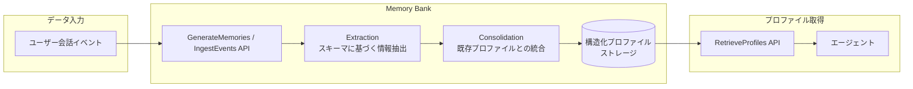

# Gemini Enterprise Agent Platform: Memory Bank Memory Profiles GA

**リリース日**: 2026-07-15

**サービス**: Gemini Enterprise Agent Platform

**機能**: Memory Bank Memory Profiles GA (一般提供開始)

**ステータス**: GA (一般提供)

[このアップデートのインフォグラフィックを見る](https://takech9203.github.io/google-cloud-news-summary/20260715-gemini-enterprise-agent-platform-memory-profiles-ga.html)

## 概要

Gemini Enterprise Agent Platform の Memory Bank において、構造化メモリプロファイル (Memory Profiles) が一般提供 (GA) になりました。Memory Profiles は、Pydantic モデルなどで定義した固定スキーマに基づき、LLM を使用して会話データからユーザー情報を自動的に抽出・更新する構造化データ機能です。

この機能により、エージェントはセッション開始時に高価な検索オペレーションを実行することなく、ユーザーの技術スタック、好み、目標などの進化する情報に低レイテンシでアクセスできるようになります。従来の自然言語メモリと異なり、スキーマに沿った一貫性のあるフォーマットでデータが管理されるため、エージェントがコンテキストを即座に把握し、パーソナライズされた応答を提供することが可能です。

対象ユーザーは、Gemini Enterprise Agent Platform 上でエージェントを構築・運用する開発者、特にユーザーのプリファレンスや状態を長期的に追跡し、セッションをまたいだパーソナライゼーションを実現したい開発チームです。

**アップデート前の課題**

- セッション開始時にユーザー情報を取得するために、類似検索 (similarity search) を実行する必要があり、レイテンシが発生していた
- 自然言語メモリは非構造化テキストであるため、特定のフィールド情報を確実に取得することが困難だった
- ユーザー情報のフォーマットが一貫しておらず、エージェントが情報を解釈するために追加の処理が必要だった

**アップデート後の改善**

- 固定スキーマに基づく構造化プロファイルにより、低レイテンシで即座に情報取得が可能になった
- RetrieveProfiles API でスコープ (ユーザー ID など) を指定するだけで、最新の統合済みプロファイルを取得可能になった
- LLM が自動的に情報の抽出 (Extraction) と統合 (Consolidation) を行い、プロファイルを継続的に最新状態に保つ

## アーキテクチャ図



Memory Bank はユーザー会話から情報を抽出し、定義済みスキーマに沿ってプロファイルを生成・更新します。エージェントは RetrieveProfiles API を通じて低レイテンシでプロファイルにアクセスし、パーソナライズされた応答を実現します。

## サービスアップデートの詳細

### 主要機能

1. **スキーマ定義によるプロファイル構造化**
   - Pydantic モデルを使用してプロファイルのフィールドと型を定義
   - 複数の独立したプロファイルスキーマを一つの Memory Bank インスタンスに設定可能
   - 各スキーマは一意の ID で識別される

2. **LLM による自動抽出と統合**
   - 会話データから定義済みスキーマに合致する情報のみを自動抽出
   - 新しい情報が既存プロファイルのフィールドと統合 (Consolidation) される
   - フィールドが未設定の場合は直接値が設定され、既存値がある場合は LLM が最適な更新方法を判断

3. **スコープベースのデータ分離**
   - プロファイルはスコープ (例: `{"user_id": "123"}`) ごとに完全に分離
   - 各スキーマとスコープの組み合わせに対して単一のプロファイルが管理される
   - IAM 条件によるスコープレベルのアクセス制御が可能

4. **リビジョン履歴によるフィールド監査**
   - 各フィールドの変更履歴を Memory Revisions で追跡可能
   - どの会話コンテキストがフィールドの変更をトリガーしたかを確認可能
   - フィールドレベルのメタデータと TTL の個別管理

## 技術仕様

### プロファイル設定パラメータ

| 項目 | 詳細 |
|------|------|
| スキーマ定義方式 | Pydantic モデル (JSON Schema に変換) |
| スキーマ数 | 複数の独立スキーマを設定可能 |
| メモリ生成 LLM | gemini-3.5-flash (デフォルト) |
| プロファイル取得 API | `RetrieveProfiles` |
| データ分離単位 | スコープ (任意のキーバリュー) |
| メモリタイプ | `STRUCTURED_PROFILE` |

### スキーマ定義例

```python
from pydantic import BaseModel, Field
from typing import Literal

class UserProfile(BaseModel):
    name: str = Field(
        description="Name of the user."
    )
    technical_stack: str = Field(
        description="Comma-separated list tools or languages used by the user."
    )
    primary_goal: str = Field(
        description="The main objective the user is pursuing."
    )
    expertise_level: str = Field(
        description="Current skill level (e.g., Junior, Senior)."
    )
    job_status: Literal['unemployed', 'part_time', 'full_time', 'student'] = Field(
        description="The job status of the individual"
    )
```

### Memory Bank インスタンスへのスキーマ登録

```python
import vertexai

client = vertexai.Client(project="PROJECT_ID", location="LOCATION")

schema_config = {
    "id": "user-profile",
    "memory_schema": UserProfile.model_json_schema()
}

memory_bank = client.agent_engines.create(
    config={
        "context_spec": {
            "memory_bank_config": {
                "structured_memory_configs": [
                    {
                        "schema_configs": [schema_config]
                    }
                ]
            }
        }
    }
)
```

## 設定方法

### 前提条件

1. Google Cloud プロジェクトで Agent Platform API が有効化されていること
2. `google-cloud-aiplatform>=1.111.0` がインストールされていること
3. IAM ロール `roles/aiplatform.user` (Agent Platform User) が付与されていること

### 手順

#### ステップ 1: 環境セットアップ

```bash
pip install google-cloud-aiplatform>=1.111.0
```

Agent Platform SDK クライアントを初期化します。

```python
import vertexai

client = vertexai.Client(
    project="YOUR_PROJECT_ID",
    location="us-central1",  # サポートされるリージョンを指定
)
```

#### ステップ 2: スキーマを定義して Memory Bank を作成

```python
from pydantic import BaseModel, Field

class CustomerProfile(BaseModel):
    preferred_language: str = Field(description="Preferred programming language")
    experience_level: str = Field(description="Experience level of the user")
    current_project: str = Field(description="Description of current project")

schema_config = {
    "id": "customer-profile",
    "memory_schema": CustomerProfile.model_json_schema()
}

memory_bank = client.agent_engines.create(
    config={
        "context_spec": {
            "memory_bank_config": {
                "structured_memory_configs": [
                    {"schema_configs": [schema_config]}
                ]
            }
        }
    }
)
```

#### ステップ 3: 会話からプロファイルを生成

```python
client.agent_engines.memories.generate(
    name=memory_bank.api_resource.name,
    scope={"user_id": "user-123"},
    direct_contents_source={
        "events": [
            {"content": {
                "parts": [{"text": "I'm building a microservice in Go and need help with error handling patterns."}]
            }}
        ]
    }
)
```

#### ステップ 4: プロファイルを取得

```python
result = client.agent_engines.memories.retrieve_profiles(
    name=memory_bank.api_resource.name,
    scope={"user_id": "user-123"},
)

for profile in result.profiles.values():
    print(profile)
# Output: {'preferred_language': 'Go', 'current_project': 'microservice development'}
```

## メリット

### ビジネス面

- **パーソナライゼーションの向上**: ユーザーの好みや状態を構造的に把握し、初回セッションから高品質なパーソナライズ体験を提供可能
- **開発コストの削減**: プロファイル管理ロジックを自前で構築する必要がなく、スキーマ定義のみで LLM が自動的に情報を管理
- **応答速度の改善**: セッション開始時の類似検索が不要になり、エンドユーザーの待ち時間を短縮

### 技術面

- **低レイテンシアクセス**: 構造化プロファイルは取得時に検索不要で、即座にアクセス可能
- **データ一貫性**: 固定スキーマにより、取得データのフォーマットが常に一定で解析しやすい
- **自動進化**: LLM が会話から情報を継続的に抽出・統合し、プロファイルを最新に保つ
- **監査可能性**: リビジョン履歴によりプロファイルの変更経緯を追跡可能

## デメリット・制約事項

### 制限事項

- スキーマは事前に定義する必要があり、動的なフィールド追加はスキーマ更新 (Memory Bank インスタンスの update) が必要
- 一部のリージョン (asia-southeast2, australia-southeast2, northamerica-northeast2) では Memory Bank がサポートされていない
- global エンドポイント使用時は CMEK (顧客管理暗号鍵) を利用できない

### 考慮すべき点

- スキーマ設計が適切でない場合、LLM が情報を正しく抽出できない可能性がある
- プロファイル生成には LLM のトークンを消費するため、大量の会話データを処理する場合はコストへの影響を考慮する必要がある
- Consolidation 時の revisions_per_candidate_count を増やすとメモリ品質が向上するが、トークン消費量も増加する

## ユースケース

### ユースケース 1: カスタマーサポートエージェント

**シナリオ**: テクニカルサポートエージェントがユーザーの技術スタック、過去の問題、スキルレベルを追跡し、セッション開始時に適切なレベルの説明を提供する。

**実装例**:
```python
class SupportProfile(BaseModel):
    tech_stack: str = Field(description="Technologies the customer uses")
    skill_level: str = Field(description="Technical expertise level")
    past_issues: str = Field(description="Summary of previously reported issues")
    preferred_communication: str = Field(description="Preferred explanation style")
```

**効果**: ユーザーが毎回環境情報を説明する手間が省け、過去のコンテキストに基づいた的確なサポートを即座に提供可能。

### ユースケース 2: パーソナライズド学習アシスタント

**シナリオ**: 教育プラットフォームのエージェントが学習者の進捗、理解度、学習スタイルを構造化プロファイルで管理し、最適な学習コンテンツを推薦する。

**効果**: 学習者ごとの進捗を低レイテンシで参照し、セッション冒頭から適切な難易度と形式で学習体験を提供。長期的な学習軌跡の追跡が構造化データとして保持される。

### ユースケース 3: エンタープライズ営業支援エージェント

**シナリオ**: 営業担当者向けエージェントが顧客の業界、課題、予算規模、意思決定プロセスをプロファイルとして管理し、次のアクション提案を最適化する。

**効果**: 営業チームが顧客情報を再確認する時間を削減し、過去の会話履歴に基づいた戦略的なアプローチを支援。

## 利用可能リージョン

Memory Bank は以下のリージョンおよびマルチリージョンで利用可能です。

| エンドポイント | 説明 |
|------|------|
| `global` | グローバルエンドポイント (CMEK 不可) |
| `us` | 米国マルチリージョン |
| `eu` | 欧州マルチリージョン |
| `us-central1` | アイオワ |
| `us-east1` | サウスカロライナ |
| `us-east4` | バージニア北部 |
| `us-west1` | オレゴン |
| `europe-west1` | ベルギー |
| `europe-west2` | ロンドン |
| `europe-west3` | フランクフルト |
| `europe-west4` | オランダ |
| `asia-east1` | 台湾 |
| `asia-northeast1` | 東京 |
| `asia-south1` | ムンバイ |
| `asia-southeast1` | シンガポール |

※ asia-southeast2 (ジャカルタ)、australia-southeast2 (メルボルン)、northamerica-northeast2 (トロント) では Memory Bank は非サポート。

## 関連サービス・機能

- **Memory Bank 自然言語メモリ**: 非構造化テキストとして会話から意味のある情報を抽出・保持する基本機能。構造化プロファイルと併用可能
- **Memory Bank IngestEvents API (GA)**: イベントストリーミングによる継続的なメモリ生成。バッチルールに基づき自動トリガー
- **Agent Platform Sessions**: セッション管理機能。Memory Bank と組み合わせてセッション間の状態を永続化
- **Agent Development Kit (ADK)**: Memory Bank と統合された VertexAiMemoryBankService を提供し、エージェントからのメモリ操作をサポート
- **Memory Revisions**: メモリの不変バージョン履歴を自動管理し、プロファイルフィールドの変更追跡を実現

## 参考リンク

- [インフォグラフィック](https://takech9203.github.io/google-cloud-news-summary/20260715-gemini-enterprise-agent-platform-memory-profiles-ga.html)
- [公式リリースノート](https://docs.cloud.google.com/gemini-enterprise-agent-platform/release-notes#July_15_2026)
- [Memory Profiles ドキュメント](https://docs.cloud.google.com/gemini-enterprise-agent-platform/scale/memory-bank/profiles)
- [Memory Bank セットアップガイド](https://docs.cloud.google.com/gemini-enterprise-agent-platform/scale/memory-bank/setup)
- [サポートリージョン](https://docs.cloud.google.com/gemini-enterprise-agent-platform/resources/agent-locations)

## まとめ

Memory Bank Memory Profiles の GA は、エージェントのパーソナライゼーションを構造的かつ低レイテンシで実現する重要なアップデートです。Pydantic モデルでスキーマを定義するだけで、LLM が会話データから情報を自動的に抽出・統合し、プロファイルを継続的に進化させます。エージェントの応答品質向上とユーザー体験のパーソナライズを目指す開発者は、既存の自然言語メモリと併用する形で構造化プロファイルの導入を検討することを推奨します。

---

**タグ**: #GeminiEnterpriseAgentPlatform #MemoryBank #MemoryProfiles #GA #StructuredData #AgentDevelopment #Personalization #LLM
