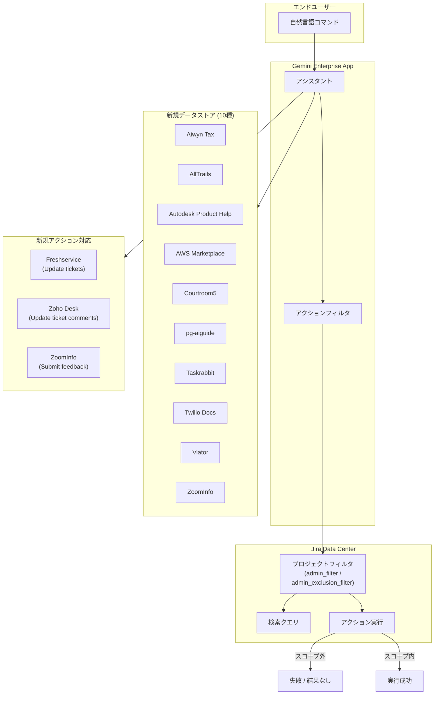

# Gemini Enterprise: 新規データストア、新規アクション、Jira Data Center アクションフィルタリング (Preview)

**リリース日**: 2026-07-15

**サービス**: Gemini Enterprise

**機能**: New data stores, new actions, and Jira Data Center action-filtering (Preview)

**ステータス**: Public Preview

📊 [このアップデートのインフォグラフィックを見る](https://takech9203.github.io/google-cloud-news-summary/20260715-gemini-enterprise-data-stores-actions-jira.html)

## 概要

Gemini Enterprise において、サードパーティデータソースのエコシステムが大幅に拡張された。新たに 10 種類のデータストア（Aiwyn Tax、AllTrails、Autodesk Product Help、AWS Marketplace、Courtroom5、pg-aiguide、Taskrabbit、Twilio Docs、Viator、ZoomInfo）が Public Preview として利用可能になり、企業が接続できる外部データソースの選択肢が広がった。

また、既存のデータストアに対する新しいアクション（書き込み操作）のサポートも追加された。Freshservice（チケット更新）、Zoho Desk（チケットコメント更新）、ZoomInfo（フィードバック送信）において、自然言語コマンドによる書き込み操作が Public Preview で利用可能になった。

さらに、Jira Data Center のフェデレーテッドデータストアにおいて、アクションフィルタリング機能が Public Preview として導入された。これにより、管理者が設定したフィルタが検索クエリだけでなくアクション実行にも適用され、スコープ外のデータに対する変更や取得が失敗するようになり、セキュリティとガバナンスが強化された。

**アップデート前の課題**

- 特定の業界向けサービス（税務、旅行、開発者ドキュメントなど）のデータを Gemini Enterprise に接続する手段が限られていた
- Freshservice や Zoho Desk では検索のみが可能で、チケットの更新操作を自然言語で実行することができなかった
- Jira Data Center のフィルタは検索結果にのみ適用され、アクション実行時にはスコープ外のプロジェクトに対する操作が制限されていなかった

**アップデート後の改善**

- 10 種類の新しいデータストアにより、税務、アウトドア、製造設計、クラウドマーケットプレイス、法律、タスク管理、通信、旅行、営業インテリジェンスなど多様な分野のデータ統合が可能になった
- Freshservice、Zoho Desk、ZoomInfo において自然言語による書き込みアクションが追加され、検索だけでなくワークフローの自動化が実現した
- Jira Data Center のアクションフィルタリングにより、プロジェクト単位でのアクセス制御がアクション実行にも一貫して適用されるようになった

## アーキテクチャ図



Gemini Enterprise アプリのアシスタントが自然言語コマンドを受け取り、新規データストアへの検索、新規アクションの実行、および Jira Data Center のフィルタリングを経由したアクション実行を行うフローを示している。

## サービスアップデートの詳細

### 主要機能

1. **新規データストア 10 種類の追加 (Public Preview)**
   - Aiwyn Tax: 税務管理プラットフォームのデータ統合
   - AllTrails: アウトドア・ハイキング情報の検索
   - Autodesk Product Help: Autodesk 製品のヘルプドキュメント検索
   - AWS Marketplace: AWS マーケットプレイスの製品情報検索
   - Courtroom5: 法律関連情報の検索
   - pg-aiguide: AI ガイドデータの統合
   - Taskrabbit: タスク管理サービスのデータ検索
   - Twilio Docs: Twilio ドキュメントの検索
   - Viator: 旅行・ツアー情報の検索
   - ZoomInfo: 営業インテリジェンスデータの検索とアクション

2. **既存データストアへの新規アクション追加 (Public Preview)**
   - Freshservice: `Update tickets` - 既存チケットの詳細（ステータス、優先度、担当者など）を更新
   - Zoho Desk: `Update ticket comments` - チケットに付けられたコメントを更新
   - ZoomInfo: `Submit feedback` - ZoomInfo MCP やその他のフィードバックを送信

3. **Jira Data Center アクションフィルタリング (Public Preview)**
   - 包含フィルタ (`admin_filter`): 指定したプロジェクトのみにアクセスを許可
   - 除外フィルタ (`admin_exclusion_filter`): 指定したプロジェクトへのアクセスをブロック
   - 検索クエリとアクション実行の両方にフィルタが一貫して適用
   - スコープ外のプロジェクトに対する変更（mutation）や取得（retrieval）は失敗またはゼロ結果を返す

## 技術仕様

### 新規データストア一覧

| データストア | カテゴリ | 想定される用途 |
|------|------|------|
| Aiwyn Tax | 税務 | 税務ドキュメント・クライアント情報の検索 |
| AllTrails | アウトドア | トレイル・ハイキング情報の検索 |
| Autodesk Product Help | 設計・製造 | 製品ヘルプドキュメントの検索 |
| AWS Marketplace | クラウド | マーケットプレイス製品情報の検索 |
| Courtroom5 | 法律 | 法律関連情報の検索 |
| pg-aiguide | AI | AI ガイド情報の検索 |
| Taskrabbit | タスク管理 | タスク・サービス情報の検索 |
| Twilio Docs | 通信 | API ドキュメントの検索 |
| Viator | 旅行 | ツアー・アクティビティ情報の検索 |
| ZoomInfo | 営業 | 企業・コンタクト情報の検索、フィードバック送信 |

### Jira Data Center フィルタ設定

フィルタは API を通じて `params` オブジェクト内で設定する。

| フィルタ名 | フィルタキー | 説明 | 値の例 |
|------|------|------|------|
| Project | `Project` | 特定の Jira プロジェクトキーに検索結果とアクションを制限 | ENG, HR, SUPPORT |

### フィルタタイプ

| タイプ | パラメータ | 動作 |
|------|------|------|
| 包含フィルタ | `admin_filter` | 指定プロジェクトのみ検索・アクション可能 |
| 除外フィルタ | `admin_exclusion_filter` | 指定プロジェクトを検索・アクションから除外 |

## 設定方法

### 前提条件

1. Gemini Enterprise のライセンス（Business、Standard、Plus、または Frontline エディション）を取得済みであること
2. Google Cloud プロジェクトで Gemini Enterprise が有効化されていること
3. 接続するサードパーティサービスの管理者権限を持っていること

### 手順

#### ステップ 1: 新規データストアの作成

1. Google Cloud コンソールで Gemini Enterprise ページに移動
2. ナビゲーションメニューから「Data stores」をクリック
3. 「Create data store」をクリック
4. Source セクションで接続したいデータストア（例: ZoomInfo）を検索して選択
5. エンティティと接続モード（フェデレーテッド検索など）を選択
6. アクションを有効にする場合は Actions セクションで対象アクションを選択
7. リージョンと暗号化設定を構成して作成

#### ステップ 2: Jira Data Center のアクションフィルタリング設定

API を使用してフィルタを設定する。

包含フィルタの例（特定プロジェクトのみ許可）:

```json
{
  "params": {
    "admin_filter": {
      "Project": ["ENG", "HR", "SUPPORT"]
    }
  }
}
```

除外フィルタの例（特定プロジェクトをブロック）:

```json
{
  "params": {
    "admin_exclusion_filter": {
      "Project": ["INTERNAL", "SECRET"]
    }
  }
}
```

#### ステップ 3: アプリへのデータストア接続

1. 既存のアプリに新しいデータストアを接続、または新しいアプリを作成
2. ユーザー認証を設定してサードパーティサービスへのアクセスを許可
3. エンドユーザーがアシスタントを通じて自然言語で操作可能に

## メリット

### ビジネス面

- **データサイロの解消**: 10 種類の新しいデータストアにより、税務、法律、旅行、通信など多様な業界のデータを一元的に検索可能になり、情報アクセスが大幅に効率化
- **ワークフロー自動化の拡張**: Freshservice や Zoho Desk でのチケット更新を自然言語で実行可能になり、IT サービス管理やカスタマーサポートの生産性が向上
- **コンプライアンス強化**: Jira Data Center のアクションフィルタリングにより、プロジェクト単位のアクセス制御がアクションにも適用され、権限管理の一貫性が確保

### 技術面

- **統一インターフェース**: 異なるサードパーティサービスのデータを Gemini Enterprise の単一インターフェースから検索・操作可能
- **フェデレーテッドアーキテクチャ**: データをコピーせずにリアルタイムで外部ソースに問い合わせるため、データの鮮度が保たれる
- **きめ細かなアクセス制御**: フィルタがアクション実行にも適用されることで、意図しないデータ変更のリスクを低減

## デメリット・制約事項

### 制限事項

- 全機能が Public Preview であり、本番環境での利用にはリスクが伴う（Pre-GA Offerings Terms が適用）
- サポートが限定的である可能性がある
- データストアは global、us、eu ロケーションでのみサポート
- 同一コネクタタイプのデータストアを複数同じアプリに接続することは推奨されない
- 既存の Jira Data Center データストアへの VPC Service Controls の後付け適用は非サポート（再作成が必要）

### 考慮すべき点

- フェデレーテッド検索ではデータがインデックス化されないため、検索品質がインジェスト方式に比べて低下する可能性がある
- サードパーティにクエリ文字列が送信されるため、データハンドリングポリシーの確認が必要
- LLM によるクエリ書き換えにより、セッション内のクエリ履歴の一部がサードパーティ API に送信される可能性がある

## ユースケース

### ユースケース 1: IT サービス管理の効率化

**シナリオ**: IT ヘルプデスク担当者が、Freshservice のチケット管理と Gemini Enterprise を統合し、自然言語でチケットの検索・更新を行う。

**実装例**:
```
ユーザー: "高優先度の未解決チケットを表示して"
アシスタント: [Freshservice から高優先度チケットを検索して表示]

ユーザー: "チケット INC-1234 のステータスを進行中に変更して、担当者を田中さんに割り当てて"
アシスタント: [Freshservice の Update tickets アクションを実行]
```

**効果**: ヘルプデスク担当者が Freshservice の UI に切り替えることなく、Gemini Enterprise のアシスタント経由でチケット管理を完結できる。

### ユースケース 2: Jira プロジェクトのガバナンス強化

**シナリオ**: 大規模組織で複数のチームが Jira Data Center を使用しており、各チームが自身のプロジェクトのみにアクセスできるよう制限する必要がある。

**実装例**:
```json
{
  "params": {
    "admin_filter": {
      "Project": ["TEAM-A", "TEAM-A-SUPPORT"]
    }
  }
}
```

**効果**: チーム A のメンバーは TEAM-A および TEAM-A-SUPPORT プロジェクトのみ検索・アクション可能。他チームのプロジェクトに対する変更リクエストは自動的に拒否される。

### ユースケース 3: マルチソース情報統合による営業活動支援

**シナリオ**: 営業チームが ZoomInfo のコンタクト・企業情報と Twilio のコミュニケーション API ドキュメントを Gemini Enterprise で統合し、見込み顧客への提案準備を効率化する。

**効果**: 複数のサードパーティツールの情報を横断的に検索し、営業準備時間を短縮。ZoomInfo のフィードバック送信アクションにより、データ品質の改善にも貢献。

## 料金

Gemini Enterprise はサブスクリプション・シートベースの課金モデルを採用している。

| エディション | 月額料金 (1シートあたり) | ストレージ/データインデックス |
|--------|-----------------|-----------------|
| Business | $21 USD から | 25 GiB（プール） |
| Standard | $30 USD から | 30 GiB（プール） |
| Plus | $30 USD から | 75 GiB（プール） |
| Frontline | 要問い合わせ | 2 GiB（プール） |

- サブスクリプション制限を超えた使用量には従量課金（オーバーレージ）が発生
- 日割り計算で課金（月額 $30 の場合、約 $1/日）
- 新規データストアおよびアクションの利用に追加料金は不要（サブスクリプションに含まれる）

## 利用可能リージョン

新規データストアおよびアクションフィルタリング機能は以下のロケーションで利用可能:

- Global
- US（米国）
- EU（欧州連合）

## 関連サービス・機能

- **Vertex AI Search**: Gemini Enterprise の検索機能の基盤となるサービス（サービス ID: 74B1-77CF-C302）
- **VPC Service Controls**: データストアへのアクセスをネットワークレベルで制御するためのセキュリティ機能
- **Customer-Managed Encryption Keys (CMEK)**: US/EU リージョンでのデータ暗号化に使用可能
- **Gemini Enterprise No-Code Agent Designer**: カスタムエージェント構築ツール（Preview）
- **Agent Development Kit (ADK)**: フルコードエージェント構築フレームワーク

## 参考リンク

- 📊 [インフォグラフィック](https://takech9203.github.io/google-cloud-news-summary/20260715-gemini-enterprise-data-stores-actions-jira.html)
- [公式リリースノート](https://docs.cloud.google.com/gemini/enterprise/docs/release-notes)
- [サードパーティデータソースの接続](https://docs.cloud.google.com/gemini/enterprise/docs/connectors/connect-third-party-data-source)
- [Jira Data Center コネクタ](https://docs.cloud.google.com/gemini/enterprise/docs/connectors/jira-dc)
- [Jira Data Center フィルタ設定](https://docs.cloud.google.com/gemini/enterprise/docs/connectors/jira-dc/add-filters-to-jira-data-store)
- [Freshservice コネクタ](https://docs.cloud.google.com/gemini/enterprise/docs/connectors/freshservice)
- [Zoho Desk コネクタ](https://docs.cloud.google.com/gemini/enterprise/docs/connectors/zohodesk)
- [ZoomInfo コネクタ](https://docs.cloud.google.com/gemini/enterprise/docs/connectors/zoominfo)
- [Gemini Enterprise エディション比較](https://docs.cloud.google.com/gemini/enterprise/docs/editions)
- [料金情報](https://cloud.google.com/gemini-enterprise)

## まとめ

今回のアップデートにより、Gemini Enterprise のサードパーティデータ統合エコシステムが大幅に拡張され、10 種類の新規データストア追加、3 つのデータストアへの書き込みアクション追加、および Jira Data Center のアクションフィルタリング機能が Public Preview として提供された。特にアクションフィルタリングは、エンタープライズ環境におけるガバナンスとセキュリティの要件に直接応える機能であり、Jira Data Center を利用する大規模組織にとって重要な進歩である。新規データストアの追加を検討する組織は、各サービスの管理者権限とスコープ設定の準備を進めることを推奨する。

---

**タグ**: #GeminiEnterprise #DataStores #Actions #JiraDataCenter #ThirdPartyConnectors #FederatedSearch #ActionFiltering #Preview #EnterpriseSearch #ITServiceManagement
