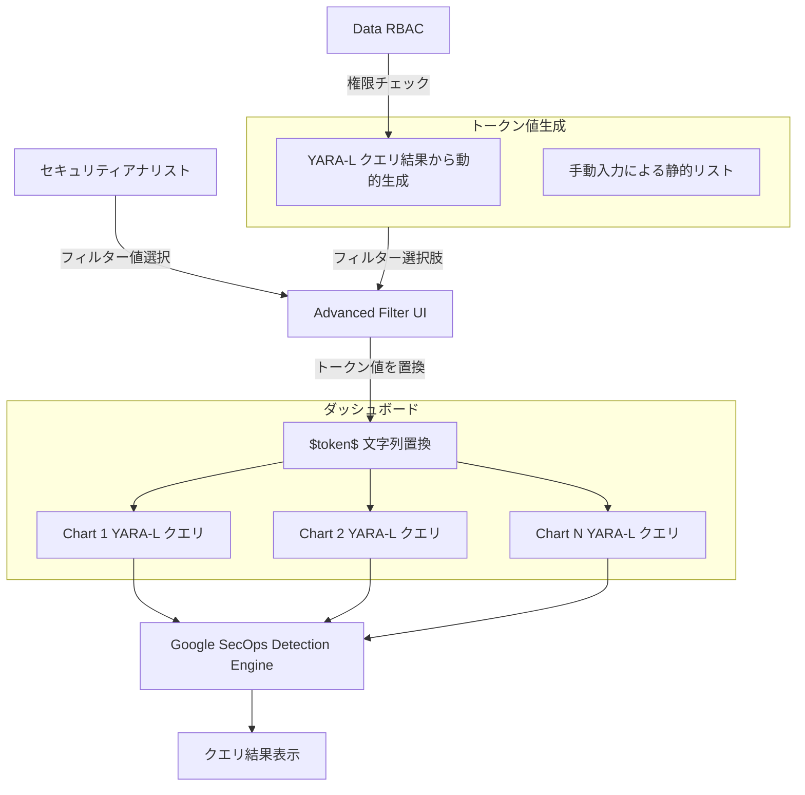

# Google SecOps (SIEM): ダッシュボードの高度なフィルタリング機能 (Preview)

**リリース日**: 2026-07-15

**サービス**: Google SecOps (SIEM)

**機能**: Advanced Filtering in Dashboards (Preview)

**ステータス**: Preview (プレビュー)

[このアップデートのインフォグラフィックを見る](https://takech9203.github.io/google-cloud-news-summary/20260715-google-secops-advanced-filtering-dashboards.html)

## 概要

Google SecOps (SIEM) のネイティブダッシュボードにおいて、高度なフィルタリング機能 (Advanced Filtering) がプレビューとして利用可能になりました。この機能により、セキュリティアナリストはクエリ変数 (トークン) を使用して、動的な値、複雑な正規表現、またはブーリアンロジックを YARA-L クエリに実行時に直接注入できるようになります。

従来の基本フィルターが特定のフィールドに紐づいていたのに対し、高度なフィルターはクエリ変数として動作します。単一のフィルター入力 (`$token$`) で、ダッシュボード内の複数チャートにまたがる複数フィールドを同時にフィルタリングすることが可能です。これにより、セキュリティオペレーションにおけるダッシュボードの表現力と柔軟性が大幅に向上します。

この機能は、SOC (Security Operations Center) のアナリストやセキュリティエンジニアを主な対象としており、日常的な脅威モニタリングやインシデント調査のワークフローを効率化します。

**アップデート前の課題**

- ダッシュボードフィルターは特定のフィールドに紐づいており、複数フィールドにまたがる柔軟なフィルタリングができなかった
- 動的な値や正規表現を用いたフィルタリングには、個別のクエリを手動で書き換える必要があった
- 複数の値を OR 条件で組み合わせたフィルタリングがダッシュボード上で直接行えなかった
- ダッシュボードの自動レポート (Scheduled Reports) で動的なフィルター条件を適用することが困難だった

**アップデート後の改善**

- トークン変数を定義してダッシュボード全体の複数チャートを一括フィルタリング可能に
- YARA-L クエリの結果から動的にフィルター選択肢を生成できるようになった
- プレフィックス・サフィックスの設定で正規表現や IN 句など柔軟なフォーマットが可能に
- マルチセレクト対応により、複数値の同時選択とカスタムデリミタによる結合が実現
- デフォルト値の設定により、ダッシュボードロード時に即座にデータを表示可能に

## アーキテクチャ図



高度なフィルターは文字列置換メカニズムとして動作し、ユーザーが選択したトークン値をダッシュボード内の各チャートの YARA-L クエリに注入した後、Detection Engine がクエリを実行します。

## サービスアップデートの詳細

### 主要機能

1. **トークン変数の定義 (Token Variable Definition)**
   - ダッシュボードごとにユニークなトークン変数を定義可能
   - 変数名は英数字とアンダースコアのみ許可 (`^[a-zA-Z0-9_]+$`)
   - チャートのクエリ内で `$token_name$` の形式で参照
   - トークン名の重複がある場合はフィルター保存時に警告

2. **フィルター値の動的生成 (Dynamic Filter Value Generation)**
   - YARA-L クエリの実行結果からフィルター選択肢を動的に生成 (Generate from Query)
   - 手動入力による静的リストの定義も可能 (Manual Entry)
   - 動的ドロップダウンにより常に最新データからの選択を保証
   - Data RBAC に基づき、閲覧ユーザーの権限範囲内の値のみ表示

3. **カスタマイズ可能なラッパー (Customizable Wrappers)**
   - プレフィックスとサフィックスでトークン値をラッピング
   - 正規表現用: プレフィックス `/^`、サフィックス `$/` で anchored regex を実現
   - YARA-L クエリ内で `/` で囲む場合はラッパー不要
   - IN 句やその他のクエリパターンにも対応

4. **マルチセレクト対応 (Multi-Select Support)**
   - 単一トークンに対して複数値の選択を有効化可能
   - カスタムデリミタの設定 (例: `|` で正規表現の OR ロジック)
   - デフォルト値の設定でダッシュボードの初期表示を最適化

## 技術仕様

### トークン変数の仕様

| 項目 | 詳細 |
|------|------|
| 命名規則 | 英数字とアンダースコアのみ (`^[a-zA-Z0-9_]+$`) |
| 一意性 | ダッシュボード内で重複不可 |
| 参照構文 | `$token_name$` (ドル記号で囲む) |
| 置換方式 | 文字列置換 (find and replace) |
| 値の生成方法 | YARA-L クエリ結果 / 手動入力 |
| マルチセレクト | 有効/無効切り替え可能 |
| デリミタ | カスタム設定可能 (例: `\|`, `,`) |

### 必要な IAM 権限

| IAM Permission | 用途 |
|------|------|
| `nativedashboards.update` | 高度なフィルターの作成・設定 |
| `nativeDashboards.get` | ダッシュボードの閲覧とフィルター入力の使用 |
| `dashboardQueries.execute` | トークン置換後の最終クエリの実行 |

### クエリでのトークン使用例

```yaml
# ホスト名による完全一致フィルタリング
principal.hostname = $hostname$

# 正規表現によるIPアドレスフィルタリング
re.regex(target.ip, $ip_regex$)

# 正規表現デリミタ内でのトークン使用
principal.ip = /$ip_pattern$/
```

## 設定方法

### 前提条件

1. Google SecOps の有効なサブスクリプション (Standard 以上)
2. `nativedashboards.update` 権限を持つ IAM ロール
3. ネイティブダッシュボードへのアクセス権限

### 手順

#### ステップ 1: 高度なフィルターの作成

1. Google SecOps コンソールでダッシュボードを開く
2. [Manage Filters] ダイアログを開く
3. [Add] をクリックし、Filter Type として [Advanced Filter] を選択
4. Filter Name (表示ラベル) と Token Variable (例: `hostname`) を入力

#### ステップ 2: フィルター値の設定

**動的生成 (Generate from Query) の場合:**
1. YARA-L クエリを入力し、Time Range を設定
2. [Run Search] をクリック
3. [Select Column] ドロップダウンから対象列を選択
4. [Preview Filter Dropdown] で値のプレビューを確認

**手動入力 (Manual Entry) の場合:**
1. Manual Entry フィールドに値を入力
2. [Add] をクリックして追加

#### ステップ 3: ラッパーとマルチセレクトの設定

1. 必要に応じて Prefix と Suffix を設定
2. [Allow Selection of Multiple Options] を有効化し、Delimiter を指定 (例: `|`)
3. Default Value をドロップダウンから選択
4. [Done] をクリックして保存

#### ステップ 4: チャートクエリへのトークン挿入

```yaml
# チャートのクエリエディタで手動でトークンを挿入
events:
  $e.principal.hostname = $hostname$
  $e.metadata.event_type = "NETWORK_CONNECTION"
```

## メリット

### ビジネス面

- **調査時間の短縮**: 複数チャートを一括フィルタリングすることで、インシデント調査のワークフローが効率化
- **レポート自動化の強化**: デフォルト値設定により、Scheduled Reports での動的フィルター適用が可能に
- **SOC 生産性の向上**: アナリストがクエリを手動で書き換える必要がなくなり、より多くのアラートに対応可能

### 技術面

- **柔軟なクエリ構築**: 正規表現、ブーリアンロジック、IN 句など多様なクエリパターンをフィルターで実現
- **Data RBAC の遵守**: 動的ドロップダウンがユーザー権限に基づいてフィルタリングされ、セキュリティが確保
- **追加権限不要**: 既存の RBAC 権限で動作し、新たな権限設定が不要

## デメリット・制約事項

### 制限事項

- 現在 Preview ステータスのため、Pre-GA Offerings Terms が適用される
- Pre-GA 機能は限定的なサポートとなる可能性がある
- Pre-GA バージョン間での互換性が保証されない場合がある
- トークン変数名の変更時、既存チャートクエリを手動で更新する必要がある

### 考慮すべき点

- トークン置換は純粋な文字列置換であり、システムがロジックを解釈しない。最終的なクエリが構文的に正しいことはユーザーの責任
- 未定義のトークンをクエリで使用した場合、リテラル文字列として扱われる (黄色の警告バナーが表示)
- トークン名の変更は既存クエリに影響するため、事前に影響範囲を確認すべき

## ユースケース

### ユースケース 1: 動的な IP アドレスフィルタリング

**シナリオ**: SOC アナリストが、特定の不審な IP アドレスに関連するネットワークトラフィックを複数の視点 (接続先、送信元、横移動) でダッシュボード全体にわたって同時に調査したい場合。

**実装例**:
```yaml
# トークン定義
# Token Variable: suspicious_ip
# Generate from Query: 
#   events: $e.metadata.event_type = "NETWORK_CONNECTION"
#   outcome: $ip = $e.target.ip
# Prefix: /^
# Suffix: $/
# Multi-Select: enabled, Delimiter: |

# Chart 1: 送信元としての活動
principal.ip = /$suspicious_ip$/

# Chart 2: 宛先としての活動  
target.ip = /$suspicious_ip$/

# Chart 3: 正規表現マッチ
re.regex(principal.ip, $suspicious_ip$)
```

**効果**: 1つのフィルター操作でダッシュボード全体の全チャートが更新され、複数の不審 IP を OR 条件で同時調査可能。

### ユースケース 2: ユーザー行動分析のための動的ホストフィルタリング

**シナリオ**: セキュリティチームが特定のホスト群における認証失敗やアカウントロックアウトを監視し、内部脅威の可能性を調査する場合。

**実装例**:
```yaml
# トークン定義
# Token Variable: target_hosts
# Manual Entry: ["dc01.corp.local", "dc02.corp.local", "vpn-gw.corp.local"]
# Prefix: (なし)
# Suffix: (なし)
# Multi-Select: enabled, Delimiter: ,

# チャートクエリ
events:
  $e.principal.hostname = $target_hosts$
  $e.metadata.event_type = "USER_LOGIN"
  $e.security_result.action = "FAIL"
```

**効果**: 監視対象ホストをフィルターで柔軟に切り替えながら、認証失敗パターンをリアルタイムに可視化。

## 料金

Advanced Filtering in Dashboards は Google SecOps のダッシュボード機能の一部として提供されます。追加料金は発生しません。

Google SecOps の料金体系はデータ取り込み量 (ingestion volume) に基づいており、以下の 3 つのパッケージが提供されています:

| パッケージ | 主な特徴 |
|--------|---------|
| Standard | 基本的な SIEM/SOAR 機能、12 ヶ月のホットデータ保持 |
| Enterprise | Standard + UEBA、Gemini AI 支援、OSINT 脅威インテリジェンス |
| Enterprise Plus | Enterprise + Google Threat Intelligence、高度なデータパイプライン |

具体的な料金については、Google Cloud の営業担当またはパートナーへの問い合わせが必要です。

## 関連サービス・機能

- **Google SecOps YARA-L**: 高度なフィルターで使用されるクエリ言語。トークン変数はYARA-Lクエリ内で動的値として機能する
- **Google SecOps Detection Engine**: トークン置換後の最終クエリを実行するエンジン
- **Google SecOps Scheduled Reports**: デフォルト値設定により、自動レポートでの高度なフィルター活用が可能
- **Data RBAC**: 動的ドロップダウンの値生成時にユーザー権限を適用し、アクセス制御を維持

## 参考リンク

- [インフォグラフィック](https://takech9203.github.io/google-cloud-news-summary/20260715-google-secops-advanced-filtering-dashboards.html)
- [公式ドキュメント: Dashboard filters](https://docs.cloud.google.com/chronicle/docs/reports/native-dashboards-filters)
- [Google SecOps パッケージ概要](https://docs.cloud.google.com/chronicle/docs/secops/secops-packages)
- [YARA-L 入門ガイド](https://docs.cloud.google.com/chronicle/docs/yara-l/getting-started)
- [Google SecOps リリースノート](https://docs.cloud.google.com/chronicle/docs/release-notes)

## まとめ

Google SecOps ダッシュボードの高度なフィルタリング機能は、セキュリティアナリストの調査効率を大幅に向上させる重要なアップデートです。トークン変数による文字列置換メカニズムはシンプルながら強力で、正規表現やブーリアンロジックを含む複雑なフィルタリングシナリオに対応します。SOC チームはこの機能を活用して、ダッシュボードベースの脅威モニタリングと調査ワークフローの効率化を検討することを推奨します。

---

**タグ**: #GoogleSecOps #SIEM #Dashboard #AdvancedFiltering #YARA-L #SecurityOperations #Preview
