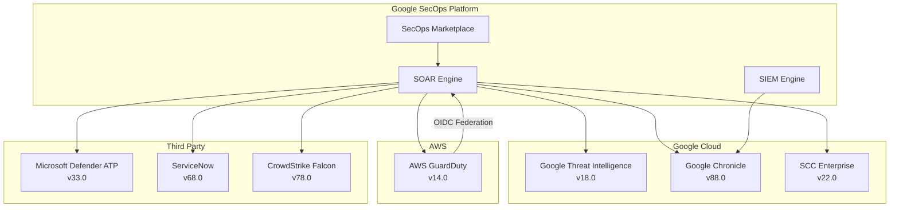

# Google SecOps Marketplace: コネクタ・インテグレーション複数アップデート (2026年7月)

**リリース日**: 2026-07-15

**サービス**: Google SecOps Marketplace

**機能**: コネクタおよびインテグレーションの複数アップデート

**ステータス**: GA (一般提供)

[このアップデートのインフォグラフィックを見る](https://takech9203.github.io/google-cloud-news-summary/20260715-google-secops-marketplace-connector-updates-july.html)

## 概要

Google SecOps (旧 Chronicle SOAR) Marketplace において、7つの主要インテグレーションに対する一括アップデートがリリースされました。AWS GuardDuty、SCC Enterprise、Google Threat Intelligence、Google Chronicle、Microsoft Defender ATP、ServiceNow、CrowdStrike Falcon の各コネクタ・インテグレーションが新バージョンに更新され、認証方式の拡張、パフォーマンス最適化、バグ修正などが含まれています。

今回のアップデートは、マルチクラウドセキュリティ運用における相互接続性の強化と、大規模環境での安定性向上を主眼としています。特に AWS GuardDuty の OIDC フェデレーション認証対応は、クラウド間の ID 連携をシンプルにし、Google Threat Intelligence の Active Group パラメータ追加はマルチテナント組織でのルーティング制御を可能にします。

これらのアップデートは、Google SecOps の Standard、Enterprise、Enterprise Plus すべてのパッケージで利用可能であり、SOC チームの日常的なセキュリティオペレーションの効率化に直接貢献します。

**アップデート前の課題**

- AWS GuardDuty 連携では AWS アクセスキーによる静的認証のみサポートされており、Google Cloud 環境からのアクセスでもキー管理が必要だった
- SCC Enterprise インテグレーションの実行パフォーマンスに最適化の余地があり、大量のファインディング処理時にオーバーヘッドが発生していた
- Google Threat Intelligence のマルチテナント環境では、組織コンテキストのルーティングが限定的でテナント間の分離が困難だった
- Chronicle Alerts Connector のメタデータ正規化オプションが制限されており、カスタム API ルートによる拡張ができなかった
- CrowdStrike Falcon の Get Host Information アクションで大量ホスト取得時にページネーションが無限ループに陥る可能性があった
- ServiceNow の Sync Incidents Job で参照キーが欠落している CI が存在する場合にエラーが発生していた

**アップデート後の改善**

- AWS GuardDuty が Google Cloud Web Identity (OIDC) フェデレーション認証に対応し、静的キー不要の安全な接続が可能に
- SCC Enterprise のコード基盤がリファクタリングされ、実行パフォーマンスが向上
- Google Threat Intelligence に Active Group パラメータが追加され、マルチテナントでの組織コンテキストルーティングが実現
- Chronicle Alerts Connector に api_root パラメータが追加され、アラート拡張の正規化メタデータオプションが拡張
- Microsoft Defender ATP の Execute Live Response Command アクションのバックエンドトラッキング安定性が向上
- ServiceNow の Sync Incidents Job が欠落参照キーをスムーズに処理可能に
- CrowdStrike Falcon のページネーション無限タイムアウト問題が修正

## アーキテクチャ図



Google SecOps Marketplace を通じて SOAR エンジンが各セキュリティ製品と連携し、統合的なセキュリティオペレーションを実現するアーキテクチャです。今回のアップデートにより各接続ポイントの信頼性と柔軟性が向上しています。

## サービスアップデートの詳細

### 主要機能

1. **AWS GuardDuty v14.0 - OIDC フェデレーション認証**
   - Google Cloud Web Identity (OIDC) Federation 認証のサポートを追加
   - 従来の AWS アクセスキー/シークレットキーによる静的認証に加え、OIDC トークンベースの認証が選択可能に
   - Google Cloud Workload Identity Federation と組み合わせることで、長期間有効な認証情報の管理が不要になる
   - セキュリティポスチャの向上とキーローテーション運用負荷の削減に貢献

2. **SCC Enterprise v22.0 - 実行パフォーマンス最適化**
   - インテグレーションコードの基盤をリファクタリング
   - 内部実行エンジンのパフォーマンスを最適化
   - 大量のセキュリティファインディング処理時の応答速度が改善
   - Security Command Center Enterprise との連携における全体的なスループット向上

3. **Google Threat Intelligence v18.0 - マルチテナント対応強化**
   - オプションの Active Group パラメータを新規追加
   - マルチテナント組織におけるコンテキストルーティングをサポート
   - インテグレーション設定および ASM Issues Connector の両方で利用可能
   - 複数テナントを持つ MSSP や大規模企業において、テナントごとの脅威インテリジェンスフィードの分離管理が可能に

4. **Google Chronicle v88.0 - アラート正規化メタデータ拡張**
   - Chronicle Alerts Connector のアラート拡張に api_root パラメータを追加
   - 正規化メタデータオプションの拡張により、カスタムデプロイメント環境への対応力が向上
   - リージョン固有の API エンドポイントや専用テナントのルートを指定可能

5. **Microsoft Defender ATP v33.0 - Live Response 安定性改善**
   - Execute Live Response Command アクションの実行処理ロジックを更新
   - バックエンドトラッキングの安定性が向上
   - 非同期コマンド実行時のステータス追跡が改善され、長時間実行コマンドの管理が向上

6. **ServiceNow v68.0 - 参照キー欠落時の耐障害性向上**
   - Sync Incidents Job における影響 CI (Configuration Items) の処理ロジックを更新
   - 参照キーが欠落している場合でもスムーズに処理を継続可能に
   - CMDB データの不整合がある環境でもジョブの安定動作を保証

7. **CrowdStrike Falcon v78.0 - ページネーション無限ループ修正**
   - Get Host Information アクションのページネーションループロジックを修正
   - 大量ホストスイープ時の無限タイムアウトを防止
   - 大規模環境 (数千台以上のエンドポイント) での安定したホスト情報取得が可能に

## 技術仕様

### バージョン一覧

| インテグレーション | 新バージョン | 変更種別 | 主な影響範囲 |
|------|------|------|------|
| AWS GuardDuty | v14.0 | 機能追加 | 認証設定 |
| SCC Enterprise | v22.0 | パフォーマンス改善 | 実行エンジン |
| Google Threat Intelligence | v18.0 | 機能追加 | コネクタ設定、ASM |
| Google Chronicle | v88.0 | 機能追加 | コネクタ設定 |
| Microsoft Defender ATP | v33.0 | 安定性改善 | アクション実行 |
| ServiceNow | v68.0 | バグ修正 | ジョブ実行 |
| CrowdStrike Falcon | v78.0 | バグ修正 | アクション実行 |

### AWS GuardDuty OIDC フェデレーション認証パラメータ

従来のパラメータに加え、OIDC Federation 認証を使用する場合は以下の設定が追加されます:

| パラメータ | 説明 |
|------|------|
| AWS Access Key ID | AWS アクセスキー ID (静的認証使用時) |
| AWS Secret Key | AWS シークレットキー (静的認証使用時) |
| AWS Default Region | デフォルトリージョン (例: us-west-1) |
| OIDC Federation | Google Cloud Web Identity フェデレーション認証の有効化 |

### Google Threat Intelligence Active Group 設定

```json
{
  "API Root": "https://www.virustotal.com",
  "API Key": "<YOUR_GTI_API_KEY>",
  "ASM Project Name": "<PROJECT_NAME>",
  "Active Group": "<TENANT_GROUP_IDENTIFIER>",
  "Verify SSL": true
}
```

## 設定方法

### 前提条件

1. Google SecOps の有効なサブスクリプション (Standard 以上)
2. 対象インテグレーションの設定に必要な API キーおよび認証情報
3. Google SecOps Marketplace へのアクセス権限

### 手順

#### ステップ 1: Marketplace からインテグレーションを更新

Google SecOps コンソールから Marketplace にアクセスし、該当インテグレーションの更新を適用します。

1. Google SecOps コンソールにログイン
2. Settings > Integrations に移動
3. 該当するインテグレーションを選択
4. 新バージョンへのアップデートを実行

#### ステップ 2: AWS GuardDuty OIDC 認証の設定 (該当する場合)

AWS GuardDuty で OIDC フェデレーション認証を利用する場合は、Google Cloud 側で Workload Identity Pool を設定し、AWS 側で IAM ロールの信頼ポリシーを更新します。

#### ステップ 3: Google Threat Intelligence Active Group の設定 (該当する場合)

マルチテナント環境で Active Group パラメータを使用する場合は、インテグレーション設定画面で組織グループ識別子を指定します。

## メリット

### ビジネス面

- **マルチクラウドセキュリティの強化**: AWS GuardDuty の OIDC 対応により、Google Cloud と AWS 間のシームレスかつセキュアな連携が実現し、統合 SOC 運用の基盤が強化される
- **大規模環境での運用安定性**: CrowdStrike Falcon と ServiceNow のバグ修正により、数千台規模のエンドポイント環境やCMDB に不整合があるエンタープライズ環境でも安定した運用が可能
- **MSSP ビジネスの拡張性**: Google Threat Intelligence のマルチテナント対応により、MSSP (マネージドセキュリティサービスプロバイダ) がテナントごとの脅威インテリジェンスを効率的に管理可能

### 技術面

- **認証情報管理の簡素化**: OIDC フェデレーションにより静的クレデンシャルの排除が可能になり、シークレット管理の複雑性が低減
- **パフォーマンス向上**: SCC Enterprise のリファクタリングにより、セキュリティファインディングの処理スループットが改善
- **メタデータ正規化の柔軟性**: Chronicle Alerts Connector の api_root パラメータにより、カスタムデプロイメント環境での正規化制御が拡張

## デメリット・制約事項

### 制限事項

- AWS GuardDuty の OIDC フェデレーション使用には Google Cloud 側での Workload Identity Pool の事前設定が必要
- Google Threat Intelligence の Active Group パラメータはオプションであり、既存環境への影響は最小限だが、マルチテナント設定を有効にする場合はテナント識別子の事前設計が必要
- 各インテグレーションの更新は個別に適用する必要があり、一括更新機能は提供されていない

### 考慮すべき点

- バージョン更新後は既存のプレイブックが期待通り動作するかテスト環境で検証することを推奨
- CrowdStrike Falcon の Get Host Information アクションを大量に並列実行している場合は、ページネーション修正後の動作確認が重要
- ServiceNow との連携で Sync Incidents Job を使用している場合、既存の TICKET_ID コンテキスト値との互換性を確認すること

## ユースケース

### ユースケース 1: マルチクラウド脅威検出パイプライン (OIDC 認証活用)

**シナリオ**: Google Cloud を主要プラットフォームとして使用しつつ、AWS 上にもワークロードを展開している企業が、AWS GuardDuty の脅威検出結果を Google SecOps に統合する。

**効果**: OIDC フェデレーション認証により、AWS アクセスキーの定期ローテーション運用が不要になり、セキュリティチームの運用負荷が削減される。Workload Identity Federation を通じた短命トークンベースの認証により、認証情報漏洩リスクも低減される。

### ユースケース 2: MSSP マルチテナント脅威インテリジェンス管理

**シナリオ**: MSSP が複数の顧客テナントを管理しており、各テナントに対して Google Threat Intelligence の脅威フィードと ASM Issues の情報を適切にルーティングする必要がある。

**効果**: Active Group パラメータにより、テナントごとのコンテキスト分離が実現し、顧客間のデータ混在リスクが排除される。また、ASM Issues Connector での組織コンテキストルーティングにより、各顧客の攻撃対象領域管理が効率化される。

### ユースケース 3: 大規模 EDR 環境でのインシデントレスポンス自動化

**シナリオ**: 数万台のエンドポイントを CrowdStrike Falcon で保護している企業が、Google SecOps のプレイブックから Get Host Information アクションを使用して感染ホストの情報を大量取得する。

**効果**: ページネーションループ修正により、大量ホスト情報取得時の無限タイムアウトが解消され、自動化プレイブックの信頼性が向上する。インシデント発生時の平均対応時間 (MTTR) の短縮に貢献する。

## 料金

Google SecOps Marketplace のインテグレーション更新自体には追加料金は発生しません。料金は Google SecOps のサブスクリプションパッケージに基づきます。

| パッケージ | SOAR インテグレーション | 備考 |
|--------|-----------------|------|
| Standard | 300以上のプリビルトインテグレーション | 基本的な SOAR 機能を含む |
| Enterprise | Standard の全機能 + マルチ環境 (MSSP) | Gemini AI 支援を含む |
| Enterprise Plus | Enterprise の全機能 + 高度な脅威インテリジェンス | Google Threat Intelligence Enterprise を含む |

料金はインジェスト量に基づく従量制です。詳細は Google Cloud の営業担当またはパートナーにお問い合わせください。

## 関連サービス・機能

- **Google SecOps SIEM**: セキュリティイベントの収集・検索・調査機能。今回の Chronicle v88.0 アップデートで Alerts Connector の柔軟性が向上
- **Security Command Center Enterprise**: Google Cloud のセキュリティポスチャ管理。SCC Enterprise v22.0 でパフォーマンスが最適化
- **Google Threat Intelligence**: 脅威インテリジェンスプラットフォーム。v18.0 でマルチテナント組織対応が強化
- **Workload Identity Federation**: Google Cloud の ID 連携サービス。AWS GuardDuty OIDC 認証の基盤として使用

## 参考リンク

- [インフォグラフィック](https://takech9203.github.io/google-cloud-news-summary/20260715-google-secops-marketplace-connector-updates-july.html)
- [Google SecOps Marketplace インテグレーション一覧](https://docs.cloud.google.com/chronicle/docs/soar/marketplace-integrations)
- [AWS GuardDuty インテグレーション](https://docs.cloud.google.com/chronicle/docs/soar/marketplace-integrations/amazon-guard-duty)
- [Google Threat Intelligence インテグレーション](https://docs.cloud.google.com/chronicle/docs/soar/marketplace-integrations/google-threat-intelligence)
- [Google Chronicle インテグレーション](https://docs.cloud.google.com/chronicle/docs/soar/marketplace-integrations/google-chronicle)
- [Microsoft Defender ATP インテグレーション](https://docs.cloud.google.com/chronicle/docs/soar/marketplace-integrations/microsoft-defender-atp)
- [ServiceNow インテグレーション](https://docs.cloud.google.com/chronicle/docs/soar/marketplace-integrations/servicenow)
- [CrowdStrike Falcon インテグレーション](https://docs.cloud.google.com/chronicle/docs/soar/marketplace-integrations/crowdstrike-falcon)
- [Google SecOps パッケージ概要](https://docs.cloud.google.com/chronicle/docs/secops/secops-packages)

## まとめ

今回の Google SecOps Marketplace 一括アップデートは、マルチクラウド・マルチベンダー環境でのセキュリティオペレーション統合を一段と強化するものです。特に AWS GuardDuty の OIDC フェデレーション認証対応は、クラウド間の ID 管理を近代化する重要なステップであり、Google Threat Intelligence のマルチテナント対応は MSSP や大規模企業にとって実運用上の大きな改善となります。SOC チームは各インテグレーションの更新を計画的に適用し、既存プレイブックとの互換性を確認した上で本番環境に展開することを推奨します。

---

**タグ**: #GoogleSecOps #Chronicle #SOAR #Marketplace #AWSGuardDuty #OIDC #SecurityCommandCenter #GoogleThreatIntelligence #CrowdStrike #MicrosoftDefender #ServiceNow #MultiCloud #SecurityOperations
