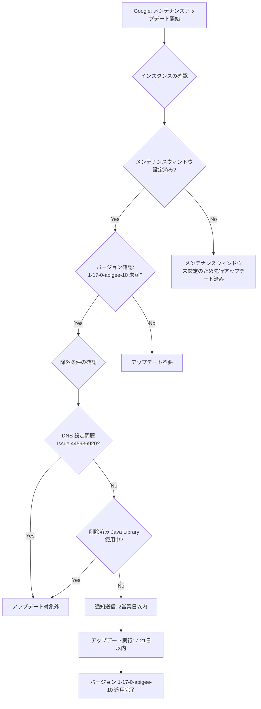

# Apigee X: メンテナンスアップデート (1-17-0-apigee-10)

**リリース日**: 2026-07-16

**サービス**: Apigee X

**機能**: メンテナンスウィンドウによるインスタンス自動アップデート

**ステータス**: Announcement

[このアップデートのインフォグラフィックを見る](https://takech9203.github.io/google-cloud-news-summary/20260716-apigee-x-maintenance-update-1-17-0-apigee-10.html)

## 概要

2026年7月16日、Google はメンテナンスウィンドウが設定されている Apigee インスタンスに対して、メンテナンスアップデートの適用を開始しました。対象となるインスタンスは、現在のバージョンが `1-17-0-apigee-10` 未満のものであり、今後7日から21日以内にバージョン `1-17-0-apigee-10` へアップデートされます。

アップデートの正確な日時を含む通知は、次の2営業日以内に対象ユーザーへ送信されます。これにより、ユーザーはアップデートに備えた準備やテストを行う時間を確保できます。

なお、DNS 設定に問題があるインスタンス (Known Issue 445936920) や、削除済みの Apigee Java Library を使用しているインスタンス (2025年10月16日のリリースノート参照) は、今回のアップデート対象から除外されます。

**アップデート前の課題**

- メンテナンスウィンドウを設定していない場合、アップデートのタイミングが予測できず、ピーク時に適用される可能性があった
- インスタンスが古いバージョンのまま放置されると、セキュリティパッチや新機能が適用されない状態が続く
- アップデートの通知を受け取るには事前のオプトイン設定が必要であり、設定を忘れると通知を受けられない

**アップデート後の改善**

- メンテナンスウィンドウを設定済みのインスタンスは、指定した時間帯に自動的にアップデートが適用される
- 事前通知により、アップデート前にテスト環境での検証が可能になった
- `1-17-0-apigee-10` への統一により、最新のセキュリティパッチとパフォーマンス改善が全対象インスタンスに行き渡る

## アーキテクチャ図



メンテナンスアップデートのフローを示しています。Google がアップデートを開始してから、インスタンスの条件確認、除外判定、通知、実際のアップデート適用までの一連のプロセスを表現しています。

## サービスアップデートの詳細

### 主要機能

1. **スケジュールされたメンテナンスアップデート**
   - メンテナンスウィンドウが設定されたインスタンスに対し、指定された時間帯にアップデートを適用
   - バージョン `1-17-0-apigee-10` 未満のインスタンスが対象
   - 7日から21日以内にアップデートが完了

2. **事前通知システム**
   - アップデート予定日を含む通知が2営業日以内に送信される
   - メンテナンス通知のオプトイン設定を行っているユーザーが対象
   - Week 1 設定の場合は少なくとも1週間前、Week 2 設定の場合は少なくとも2週間前に通知

3. **除外条件による安全性確保**
   - DNS 設定に問題があるインスタンスは自動的に除外 (Known Issue 445936920)
   - 削除済み Apigee Java Library を使用しているインスタンスも除外
   - 互換性の問題によるアップデート失敗を未然に防止

## 技術仕様

### アップデート対象条件

| 項目 | 詳細 |
|------|------|
| 対象バージョン | `1-17-0-apigee-10` 未満 |
| アップデート先バージョン | `1-17-0-apigee-10` |
| 適用期間 | 7日から21日以内 |
| 通知タイミング | 2営業日以内 |
| 前提条件 | メンテナンスウィンドウが設定済みであること |

### 除外条件

| 条件 | 関連情報 |
|------|----------|
| DNS 設定の問題 | Known Issue 445936920 - DNS フォールバック機能削除により DNS エラーが発生する場合 |
| 削除済み Java Library の使用 | 2025年10月16日のリリースノートに記載の Apigee Java Library |

### メンテナンスウィンドウ設定例

```json
{
  "maintenanceUpdatePolicy": {
    "maintenanceWindows": [
      {
        "day": "SUNDAY",
        "startTime": {
          "hours": 23
        }
      }
    ],
    "maintenanceChannel": "WEEK2"
  }
}
```

## 設定方法

### 前提条件

1. Apigee Organization Admin ロール (`roles/apigee.admin`) または `apigee.instances.update` 権限を持つロール
2. メンテナンス通知を受け取るための Google Cloud Console でのオプトイン設定

### 手順

#### ステップ 1: 現在のメンテナンス設定とスケジュールを確認

```bash
AUTH="Authorization: Bearer $(gcloud auth print-access-token)"
curl -H "$AUTH" \
  "https://apigee.googleapis.com/v1/organizations/ORGANIZATION_ID/instances/INSTANCE_ID"
```

レスポンスの `scheduledMaintenance` フィールドで今後のメンテナンススケジュールを、`maintenanceUpdatePolicy` フィールドで現在の設定を確認できます。

#### ステップ 2: メンテナンスウィンドウの設定 (未設定の場合)

```bash
AUTH="Authorization: Bearer $(gcloud auth print-access-token)"
curl -X PATCH \
  -H "$AUTH" \
  -H "Content-Type: application/json" \
  -d '{
    "maintenanceUpdatePolicy": {
      "maintenanceWindows": [
        {
          "day": "SUNDAY",
          "startTime": {
            "hours": 23
          }
        }
      ],
      "maintenanceChannel": "WEEK2"
    }
  }' \
  "https://apigee.googleapis.com/v1/organizations/ORGANIZATION_ID/instances/INSTANCE_ID?updateMask=maintenanceUpdatePolicy.maintenanceWindows,maintenanceUpdatePolicy.maintenanceChannel"
```

`day` はメンテナンス開始の曜日、`startTime.hours` は UTC での開始時刻を指定します。`maintenanceChannel` で Week 1 または Week 2 のアップデート順序を設定します。

#### ステップ 3: メンテナンス通知のオプトイン

1. Google Cloud Console で **User preferences > Communication** ページに移動
2. **Apigee, Maintenance window** の行で Email を **On** に設定

通知を受け取る必要がある各ユーザーが個別にオプトインする必要があります。

## メリット

### ビジネス面

- **計画的なメンテナンス**: ビジネスのピーク時間帯を避けてアップデートを実施できるため、サービス影響を最小化
- **事前通知による準備期間の確保**: アップデート前にテスト環境での検証やチームへの周知が可能

### 技術面

- **セキュリティの最新化**: 最新のセキュリティパッチが適用され、脆弱性リスクを低減
- **パフォーマンス改善**: 最新バージョンのパフォーマンス最適化が反映される
- **自動化による運用負荷軽減**: 手動でのアップデート作業が不要になり、SRE チームの負担を削減

## デメリット・制約事項

### 制限事項

- メンテナンス中はインスタンスの作成、環境のアタッチ、エンドポイントアタッチメントの作成などが実施不可
- メンテナンスウィンドウは1インスタンスにつき1つのみ設定可能
- 同一組織内の複数インスタンスには、少なくとも12時間の間隔を空けたウィンドウを設定する必要あり

### 考慮すべき点

- DNS 設定に問題がある場合 (Known Issue 445936920)、アップデートが適用されないため手動対応が必要
- 削除済み Java Library を使用している場合は、まずライブラリの移行を完了させる必要あり
- メンテナンスウィンドウは「ベストエフォート」であり、セキュリティ上の緊急対応などでは指定時間外にアップデートが実施される可能性あり
- メンテナンスの所要時間は構成によって異なるが、通常数時間を要する

## ユースケース

### ユースケース 1: 本番環境のアップデート管理

**シナリオ**: ECサイトを運営する企業が、Apigee X を API ゲートウェイとして使用しており、平日日中のトラフィックが高い状況でのメンテナンスを避けたい。

**実装例**:
```bash
# 本番環境: 日曜深夜 (UTC 15:00 = JST 翌0:00) に Week 2 で設定
curl -X PATCH \
  -H "$AUTH" \
  -H "Content-Type: application/json" \
  -d '{
    "maintenanceUpdatePolicy": {
      "maintenanceWindows": [{"day": "SUNDAY", "startTime": {"hours": 15}}],
      "maintenanceChannel": "WEEK2"
    }
  }' \
  "https://apigee.googleapis.com/v1/organizations/ORG_ID/instances/prod-instance?updateMask=maintenanceUpdatePolicy.maintenanceWindows,maintenanceUpdatePolicy.maintenanceChannel"
```

**効果**: Week 2 設定により本番環境は最後にアップデートされ、開発・ステージング環境で事前に問題がないことを確認した上で適用できる。

### ユースケース 2: 段階的ロールアウト戦略

**シナリオ**: 複数環境 (開発、ステージング、本番) を持つ企業が、安全にアップデートを段階的に適用したい。

**効果**: 開発環境はメンテナンスウィンドウなし (最初にアップデート)、ステージングは Week 1、本番は Week 2 と設定することで、問題発生時に本番到達前に検知・対処が可能。

## 料金

メンテナンスアップデートの適用に追加料金は発生しません。Apigee X の通常の利用料金のみが適用されます。

### 料金例

| プラン | 月額料金 (概算) |
|--------|-----------------|
| Apigee X Standard | USD $2,500/月 (API コール量に応じて変動) |
| Apigee X Enterprise | USD $12,500/月 (API コール量に応じて変動) |

※ メンテナンスアップデート自体には追加費用なし

## 利用可能リージョン

Apigee X がサポートする全リージョンで利用可能です。メンテナンスウィンドウの設定はインスタンス単位で行われ、リージョンによる制限はありません。

## 関連サービス・機能

- **Apigee メンテナンスウィンドウ**: インスタンスのメンテナンス時間帯を指定する機能
- **Apigee メンテナンス通知**: アップデート予定のメール通知機能
- **Cloud Monitoring**: メンテナンス前後のインスタンス状態監視に活用
- **Cloud Logging**: メンテナンス中の DNS エラーなどの検出に使用 (Known Issue 445936920 関連)

## 参考リンク

- [インフォグラフィック](https://takech9203.github.io/google-cloud-news-summary/20260716-apigee-x-maintenance-update-1-17-0-apigee-10.html)
- [公式リリースノート](https://docs.cloud.google.com/release-notes#July_16_2026)
- [Apigee メンテナンス概要](https://docs.cloud.google.com/apigee/docs/api-platform/system-administration/maintenance)
- [Apigee メンテナンスウィンドウの管理](https://docs.cloud.google.com/apigee/docs/api-platform/system-administration/maintenance-windows)
- [Apigee 既知の問題一覧](https://docs.cloud.google.com/apigee/docs/release/known-issues)

## まとめ

今回のメンテナンスアップデートにより、メンテナンスウィンドウを設定済みの Apigee X インスタンスがバージョン `1-17-0-apigee-10` に自動アップデートされます。ユーザーは通知を確認し、除外条件 (DNS 設定問題や削除済み Java Library の使用) に該当しないことを確認した上で、必要に応じてテスト環境での事前検証を行うことを推奨します。メンテナンスウィンドウを未設定の場合は、今後の計画的なアップデート管理のために設定を検討してください。

---

**タグ**: #ApigeeX #Maintenance #メンテナンス #APIManagement #セキュリティアップデート #GoogleCloud
