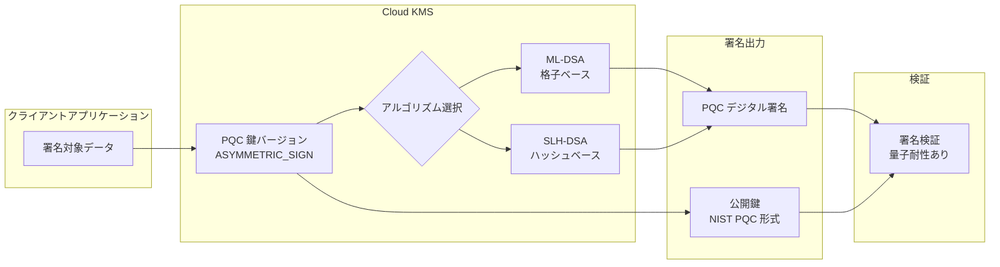

# Cloud KMS: ポスト量子コンピューティング (PQC) 署名アルゴリズムが GA

**リリース日**: 2026-07-16

**サービス**: Cloud Key Management Service (Cloud KMS)

**機能**: ポスト量子コンピューティング (PQC) 署名アルゴリズムの一般提供開始

**ステータス**: GA (General Availability)

[このアップデートのインフォグラフィックを見る](https://takech9203.github.io/google-cloud-news-summary/20260716-cloud-kms-pqc-signing-algorithms-ga.html)

## 概要

Cloud KMS がポスト量子コンピューティング (PQC) に対応したデジタル署名アルゴリズムを一般提供 (GA) として正式リリースしました。今回のリリースでは、ML-DSA (FIPS 204) および SLH-DSA (FIPS 205) に基づく合計 8 種類のアルゴリズムが利用可能になります。これにより、量子コンピュータによる攻撃に耐性を持つデジタル署名を、本番環境で安心して利用できるようになりました。

これらのアルゴリズムは 2025 年 2 月にパブリックプレビューとして導入され、約 1 年半の検証期間を経て GA に昇格しました。NIST が策定した PQC 標準規格に準拠しており、従来の RSA や ECDSA アルゴリズムに代わる量子耐性を備えた署名ソリューションを提供します。

対象ユーザーは、長期的なデータ完全性と否認防止を必要とする金融機関、政府機関、医療機関、および将来の量子コンピュータによる脅威に事前対策を講じたいすべての組織です。

**アップデート前の課題**

PQC 署名アルゴリズムが GA になる前は、以下の課題がありました。

- Cloud KMS で利用可能な PQC 署名アルゴリズムは PQ_SIGN_ML_DSA_65 と PQ_SIGN_SLH_DSA_SHA2_128S の 2 種類のみで、プレビュー段階であったため本番利用には適さなかった
- ML-DSA-44 や ML-DSA-87 などのセキュリティレベルが異なるバリエーションが利用できず、ユースケースに応じた最適なアルゴリズム選択ができなかった
- EXTERNAL_MU バリアントが存在しなかったため、外部でハッシュを計算するワークフローに対応できなかった

**アップデート後の改善**

今回の GA リリースにより、以下の改善が実現されました。

- 8 種類の PQC 署名アルゴリズムが GA として利用可能になり、SLA に裏打ちされた本番環境での利用が保証された
- ML-DSA のセキュリティレベル 2 (ML-DSA-44)、3 (ML-DSA-65)、5 (ML-DSA-87) の全レベルが利用可能になり、パフォーマンスとセキュリティのバランスを選択できるようになった
- EXTERNAL_MU バリアントの追加により、事前にハッシュ計算を行う外部システムとの統合が容易になった

## アーキテクチャ図



Cloud KMS の PQC 署名フローを示しています。クライアントアプリケーションが署名対象データを Cloud KMS に送信し、選択されたアルゴリズム (ML-DSA または SLH-DSA) で署名が生成されます。公開鍵は NIST PQC 形式で取得でき、第三者による署名検証が可能です。

## サービスアップデートの詳細

### 主要機能

1. **ML-DSA (Module-Lattice-Based Digital Signature Algorithm)**
   - NIST FIPS 204 に基づくモジュール格子ベースのデジタル署名アルゴリズム
   - セキュリティレベル 2 (ML-DSA-44)、3 (ML-DSA-65)、5 (ML-DSA-87) の 3 段階を提供
   - 高速な署名生成と検証が特徴で、従来の RSA に比べて署名サイズが小さい

2. **SLH-DSA (Stateless Hash-Based Digital Signature Algorithm)**
   - NIST FIPS 205 に基づくステートレスハッシュベースのデジタル署名アルゴリズム
   - 格子問題に依存しないため、ML-DSA とは異なる数学的基盤による多層防御を提供
   - Pure バリアント (PQ_SIGN_SLH_DSA_SHA2_128S) と Pre-hash バリアント (PQ_SIGN_HASH_SLH_DSA_SHA2_128S_SHA256) を提供

3. **EXTERNAL_MU バリアント**
   - ML-DSA-44、ML-DSA-65、ML-DSA-87 のそれぞれに EXTERNAL_MU バリアントを提供
   - 外部でメッセージのハッシュ (mu) を計算してから署名 API に渡すワークフローに対応
   - 大容量データの署名や分散システムでの署名処理に適している

## 技術仕様

### 対応アルゴリズム一覧

| アルゴリズム (API) | SDK 名 | ベース規格 | バリアント | セキュリティレベル |
|---|---|---|---|---|
| PQ_SIGN_ML_DSA_44 | pq-sign-ml-dsa-44 | FIPS 204 (ML-DSA) | Pure | レベル 2 |
| PQ_SIGN_ML_DSA_44_EXTERNAL_MU | pq-sign-ml-dsa-44-external-mu | FIPS 204 (ML-DSA) | External MU | レベル 2 |
| PQ_SIGN_ML_DSA_65 | pq-sign-ml-dsa-65 | FIPS 204 (ML-DSA) | Pure | レベル 3 |
| PQ_SIGN_ML_DSA_65_EXTERNAL_MU | pq-sign-ml-dsa-65-external-mu | FIPS 204 (ML-DSA) | External MU | レベル 3 |
| PQ_SIGN_ML_DSA_87 | pq-sign-ml-dsa-87 | FIPS 204 (ML-DSA) | Pure | レベル 5 |
| PQ_SIGN_ML_DSA_87_EXTERNAL_MU | pq-sign-ml-dsa-87-external-mu | FIPS 204 (ML-DSA) | External MU | レベル 5 |
| PQ_SIGN_SLH_DSA_SHA2_128S | pq-sign-slh-dsa-sha2-128s | FIPS 205 (SLH-DSA) | Pure | レベル 1 |
| PQ_SIGN_HASH_SLH_DSA_SHA2_128S_SHA256 | pq-sign-hash-slh-dsa-sha2-128s-sha256 | FIPS 205 (SLH-DSA) | Pre-hash | レベル 1 |

### 鍵と署名のサイズ (バイト)

| アルゴリズム | 秘密鍵 | 公開鍵 | 署名サイズ |
|---|---|---|---|
| ML-DSA-44 | 2560 | 1312 | 2420 |
| ML-DSA-65 | 4032 | 1952 | 3309 |
| ML-DSA-87 | 4896 | 2592 | 4627 |
| SLH-DSA-SHA2-128s | 64 | 32 | 7856 |
| HASH-SLH-DSA-SHA2-128s-SHA256 | 64 | 32 | 7856 |

### 鍵の用途と設定

```json
{
  "purpose": "ASYMMETRIC_SIGN",
  "versionTemplate": {
    "algorithm": "PQ_SIGN_ML_DSA_65",
    "protectionLevel": "SOFTWARE"
  }
}
```

## 設定方法

### 前提条件

1. Cloud KMS API が有効化されたプロジェクト
2. `roles/cloudkms.admin` または `roles/cloudkms.signerVerifier` の IAM ロール
3. gcloud CLI の最新バージョン (PQC 対応版)

### 手順

#### ステップ 1: PQC 署名鍵の作成

```bash
# キーリングの作成 (未作成の場合)
gcloud kms keyrings create my-keyring \
    --location=global

# ML-DSA-65 アルゴリズムで PQC 署名鍵を作成
gcloud kms keys create my-pqc-signing-key \
    --location=global \
    --keyring=my-keyring \
    --purpose=asymmetric-signing \
    --default-algorithm=pq-sign-ml-dsa-65
```

ML-DSA-65 は NIST セキュリティレベル 3 に対応し、パフォーマンスとセキュリティのバランスが良い推奨オプションです。

#### ステップ 2: データへの署名

```bash
# ファイルに署名を付与
gcloud kms asymmetric-sign \
    --location=global \
    --keyring=my-keyring \
    --key=my-pqc-signing-key \
    --version=1 \
    --input-file=data.bin \
    --signature-file=signature.sig
```

PQC アルゴリズムでは生データが直接入力として使用されます (Pure バリアントの場合)。

#### ステップ 3: 公開鍵の取得と署名検証

```bash
# 公開鍵の取得 (NIST PQC 形式)
gcloud kms keys versions get-public-key 1 \
    --location=global \
    --keyring=my-keyring \
    --key=my-pqc-signing-key \
    --public-key-format=nist-pqc \
    --output-file=public_key.pem
```

公開鍵を取得する際は `--public-key-format=nist-pqc` フラグを指定する必要があります。

## メリット

### ビジネス面

- **将来の量子脅威への事前対策**: 量子コンピュータが実用化された場合でも、既存の署名の否認防止性が維持される
- **コンプライアンス対応**: NIST PQC 標準 (FIPS 204/205) に準拠しており、規制要件を満たす
- **信頼性の向上**: GA ステータスにより SLA が適用され、本番ワークロードでの利用が公式にサポートされる

### 技術面

- **多様なアルゴリズム選択**: 8 種類のアルゴリズムから、用途に応じた最適な選択が可能
- **多層防御**: 格子ベース (ML-DSA) とハッシュベース (SLH-DSA) の異なる数学的基盤によるアルゴリズムを併用可能
- **既存ワークフローとの統合**: EXTERNAL_MU バリアントにより、既存の署名パイプラインへの組み込みが容易

## デメリット・制約事項

### 制限事項

- ハイブリッド署名 (PQC + 古典暗号の組み合わせ) は、標準化が未完了のため現時点ではサポートされていない
- PQC 署名はソフトウェア保護レベルでのみ利用可能 (Cloud HSM での PQC サポートは今後の対応)
- 署名サイズが従来のアルゴリズム (ECDSA: 64 バイト) と比較して大幅に大きい (ML-DSA-65: 3,309 バイト、SLH-DSA: 7,856 バイト)

### 考慮すべき点

- PQC アルゴリズムは比較的新しい標準であり、既存のクライアントライブラリやツールでの対応状況を確認する必要がある
- 署名サイズの増大により、帯域幅やストレージコストに影響が出る可能性がある
- 古典アルゴリズムから PQC への移行は段階的に計画し、互換性テストを十分に行うことが推奨される

## ユースケース

### ユースケース 1: 金融機関の長期保存文書への署名

**シナリオ**: 銀行が法的に 30 年以上保存が義務付けられている契約書や取引記録にデジタル署名を付与する。量子コンピュータが実用化された後も署名の有効性を維持する必要がある。

**実装例**:
```bash
# ML-DSA-87 (セキュリティレベル 5) で最高セキュリティの署名鍵を作成
gcloud kms keys create financial-doc-signing-key \
    --location=us \
    --keyring=compliance-keyring \
    --purpose=asymmetric-signing \
    --default-algorithm=pq-sign-ml-dsa-87
```

**効果**: 将来の量子攻撃に対しても署名の完全性と否認防止性が保証され、長期的なコンプライアンス要件を満たすことができる。

### ユースケース 2: IoT デバイスのファームウェア署名

**シナリオ**: 20 年以上稼働する産業用 IoT デバイスに配信するファームウェアアップデートの正真性を、量子コンピュータ時代においても保証する。

**実装例**:
```bash
# SLH-DSA はハッシュベースのため、格子問題の安全性仮定に依存しない
gcloud kms keys create firmware-signing-key \
    --location=global \
    --keyring=iot-keyring \
    --purpose=asymmetric-signing \
    --default-algorithm=pq-sign-slh-dsa-sha2-128s
```

**効果**: ハッシュベースの SLH-DSA を使用することで、格子ベースアルゴリズムとは異なる安全性仮定に基づく多層防御を実現。デバイスのライフサイクル全体を通じてファームウェアの正当性を検証可能。

### ユースケース 3: CI/CD パイプラインでのアーティファクト署名

**シナリオ**: ソフトウェアサプライチェーンのセキュリティ強化のため、ビルドアーティファクトに PQC 署名を付与し、デプロイ時に検証する。

**効果**: ソフトウェアの出所証明 (provenance) が量子耐性を持つようになり、将来的な脅威に対してもサプライチェーンの完全性が維持される。

## 料金

Cloud KMS の PQC 署名鍵は、標準のソフトウェア鍵と同じ料金体系が適用されます。

### 料金例

| 項目 | 料金 |
|------|------|
| アクティブな鍵バージョン | $0.06 / 月 |
| 暗号化オペレーション (署名/検証) | $0.03 / 10,000 オペレーション |
| 鍵管理オペレーション (作成/ローテーション等) | 無料 |

Autokey で作成した鍵については、月間 100 アクティブ鍵バージョンおよび 10,000 暗号化オペレーションまでの無料枠があります。

## 利用可能リージョン

Cloud KMS の PQC 署名アルゴリズムは、Cloud KMS がサポートするすべてのリージョンおよびマルチリージョンで利用可能です。主要なロケーションには以下が含まれます。

- グローバル (global)
- 米国 (us)、ヨーロッパ (europe)、アジア (asia)
- 個別リージョン (us-central1、europe-west1、asia-northeast1 など)

最新のロケーション一覧は [Cloud KMS locations](https://cloud.google.com/kms/docs/locations) を参照してください。

## 関連サービス・機能

- **Cloud KMS Key Encapsulation Mechanisms (KEM)**: PQC 対応の鍵カプセル化 (ML-KEM-768、ML-KEM-1024、KEM-XWING) でデータ暗号化の量子耐性を確保
- **Cloud HSM**: ハードウェアセキュリティモジュールによる鍵保護 (現時点では PQC は SOFTWARE レベルのみ)
- **Cloud Asset Inventory**: PQC 鍵と古典鍵のインベントリ管理および移行計画に活用可能
- **Binary Authorization**: コンテナイメージの署名検証と組み合わせたサプライチェーンセキュリティ

## 参考リンク

- [インフォグラフィック](https://takech9203.github.io/google-cloud-news-summary/20260716-cloud-kms-pqc-signing-algorithms-ga.html)
- [公式リリースノート](https://docs.cloud.google.com/release-notes#July_16_2026)
- [PQC 署名アルゴリズム一覧](https://cloud.google.com/kms/docs/algorithms#pqc_signing_algorithms)
- [ポスト量子暗号 (PQC) デジタル署名](https://cloud.google.com/kms/docs/digital-signatures#pqc)
- [Cloud KMS 料金](https://cloud.google.com/kms/pricing)
- [PQC インサイトの確認](https://cloud.google.com/kms/docs/view-pqc-insights)

## まとめ

Cloud KMS の PQC 署名アルゴリズム GA は、Google Cloud における量子耐性暗号化の重要なマイルストーンです。NIST FIPS 204/205 に準拠した 8 種類のアルゴリズムが本番利用可能になったことで、組織は今すぐ量子コンピュータ時代に向けた暗号化モダナイゼーションを開始できます。特に、長期保存データの署名や規制対応が求められる業界では、早期の移行計画策定と検証を推奨します。

---

**タグ**: #CloudKMS #PostQuantumCryptography #PQC #ML-DSA #SLH-DSA #FIPS204 #FIPS205 #デジタル署名 #量子耐性 #セキュリティ #GA
