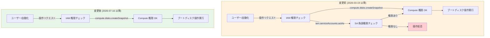

# Compute Engine: ブートディスク操作で iam.serviceAccounts.actAs 権限が不要に

**リリース日**: 2026-07-16

**サービス**: Compute Engine

**機能**: ブートディスク操作における iam.serviceAccounts.actAs 権限要件の撤廃

**ステータス**: Changed (変更)

[このアップデートのインフォグラフィックを見る](https://takech9203.github.io/google-cloud-news-summary/20260716-compute-engine-boot-disk-iam-permission-change.html)

## 概要

2026年7月16日、Google Cloud は Compute Engine インスタンスのブートディスクに対する複数の操作において、`iam.serviceAccounts.actAs` 権限の要件を撤廃しました。これにより、サービスアカウントがアタッチされたインスタンスのブートディスクに対するスナップショット作成、ディスクのクローン、マシンイメージの作成などの操作が、サービスアカウントの偽装権限なしで実行可能になります。

この変更は、2026年3月19日に導入された「ブートディスク操作に `iam.serviceAccounts.actAs` 権限を必須とする」という Breaking Change を撤回するものです。当初の変更はセキュリティ強化を目的としていましたが、ディスクのバックアップやレプリケーションといった日常的な運用タスクに対して過度な権限要件を課していたため、運用上の負担が大きいと判断されました。

対象となるユーザーは、Compute Engine インスタンスの管理者、バックアップ運用担当者、DR (ディザスタリカバリ) 担当者など、ブートディスクの操作を日常的に行うすべてのチームです。

**アップデート前の課題**

2026年3月19日以降、サービスアカウントがアタッチされたインスタンスのブートディスク操作には `iam.serviceAccounts.actAs` 権限が必要でした。

- スナップショット作成やディスクのクローンといった基本的なバックアップ操作にも、サービスアカウントの偽装権限が必要だった
- `roles/compute.instanceAdmin.v1` ロールだけでは不十分で、追加で `roles/iam.serviceAccountUser` ロールの付与が必要だった
- 最小権限の原則に基づいて権限を絞っていた環境で、既存のワークフローが突然失敗する可能性があった
- 自動バックアップスクリプトや CI/CD パイプラインで権限エラーが発生するリスクがあった

**アップデート後の改善**

- ブートディスクのスナップショット作成、クローン、イメージ作成などの操作に `iam.serviceAccounts.actAs` 権限が不要になった
- `roles/compute.instanceAdmin.v1` ロールのみでブートディスク関連の操作が完結可能に
- バックアップや DR のワークフローがシンプルな権限設定で動作するようになった
- 権限の最小化を図りつつ、運用に必要な操作を妨げない設計に改善された

## アーキテクチャ図



変更前は Compute 権限に加えてサービスアカウント偽装権限のチェックが必要でしたが、変更後は Compute 権限のみで操作が可能になりました。

## サービスアップデートの詳細

### 対象操作一覧

以下の操作が、サービスアカウントがアタッチされたインスタンスのブートディスク (ソースディスク) に対して `iam.serviceAccounts.actAs` 権限なしで実行可能になりました。

1. **標準スナップショットまたはアーカイブスナップショットの作成**
   - ソースディスクのスナップショットを作成する操作
   - 定期バックアップやポイントインタイムリカバリに利用

2. **ディスクのクローン**
   - ソースディスクのクローンを作成する操作
   - テスト環境の構築やデータ分析用途に利用

3. **マシンイメージの作成**
   - インスタンス全体のマシンイメージを作成する操作
   - インスタンスの完全なバックアップとして利用

4. **カスタムイメージの作成**
   - ソースディスクからカスタムイメージを作成する操作
   - ゴールデンイメージの管理に利用

5. **非同期レプリケーションの開始**
   - ソースディスクを別リージョンへ非同期レプリケーションする操作
   - DR (ディザスタリカバリ) 構成に利用

6. **インスタントスナップショットからの新規ディスク作成**
   - ソースディスクのインスタントスナップショットから新規ディスクを作成してインスタンスを構築する操作

## 技術仕様

### 権限要件の変更

| 操作 | 変更前の必要権限 | 変更後の必要権限 |
|------|-----------------|-----------------|
| スナップショット作成 | `compute.disks.createSnapshot` + `iam.serviceAccounts.actAs` | `compute.disks.createSnapshot` |
| ディスクのクローン | `compute.disks.create` + `iam.serviceAccounts.actAs` | `compute.disks.create` |
| マシンイメージ作成 | `compute.machineImages.create` + `iam.serviceAccounts.actAs` | `compute.machineImages.create` |
| カスタムイメージ作成 | `compute.images.create` + `iam.serviceAccounts.actAs` | `compute.images.create` |
| 非同期レプリケーション | `compute.disks.startAsyncReplication` + `iam.serviceAccounts.actAs` | `compute.disks.startAsyncReplication` |

### 関連する IAM ロール

| ロール | 説明 | 今回の変更での影響 |
|--------|------|-------------------|
| `roles/compute.instanceAdmin.v1` | Compute Engine インスタンス、ディスク、スナップショット、イメージの完全管理 | このロールだけでブートディスク操作が完結可能に |
| `roles/iam.serviceAccountUser` | サービスアカウントの偽装権限を付与 | ブートディスク操作目的では付与不要に |
| `roles/compute.admin` | Compute Engine リソースの完全管理 | 影響なし (元々十分な権限あり) |

## 設定方法

### 確認事項

今回の変更は Google Cloud 側で自動的に適用されるため、ユーザー側での設定変更は不要です。ただし、以下の点を確認することを推奨します。

#### ステップ 1: 現在の IAM 設定の確認

```bash
# プロジェクトの IAM ポリシーを確認
gcloud projects get-iam-policy PROJECT_ID \
  --format="table(bindings.role, bindings.members)" \
  --filter="bindings.role:roles/iam.serviceAccountUser"
```

ブートディスク操作のためだけに `roles/iam.serviceAccountUser` を付与していた場合、権限の見直しが可能です。

#### ステップ 2: 不要になった権限の削除 (任意)

```bash
# ブートディスク操作のためだけに付与していた場合のみ
gcloud projects remove-iam-policy-binding PROJECT_ID \
  --member="user:USER_EMAIL" \
  --role="roles/iam.serviceAccountUser"
```

注意: `roles/iam.serviceAccountUser` は他の用途 (インスタンスへのサービスアカウントのアタッチなど) でも使用されるため、削除前に他の用途で必要ないことを確認してください。

#### ステップ 3: 動作確認

```bash
# スナップショット作成のテスト
gcloud compute disks snapshot DISK_NAME \
  --zone=ZONE \
  --snapshot-names=test-snapshot
```

## メリット

### ビジネス面

- **運用コストの削減**: バックアップや DR のワークフローで権限に関するトラブルシューティングが減少し、運用チームの負担が軽減される
- **デプロイ速度の向上**: 権限不足によるパイプライン失敗が減少し、デプロイやバックアップの自動化が安定する

### 技術面

- **最小権限の原則との両立**: ブートディスク操作に必要な権限がシンプルになり、過剰な権限付与を避けられる
- **権限管理の簡素化**: `roles/compute.instanceAdmin.v1` のみでディスク管理が完結し、IAM ポリシーの複雑さが低減される
- **自動化の信頼性向上**: CI/CD パイプラインや自動バックアップスクリプトが、権限の問題で失敗するリスクが減少する

## デメリット・制約事項

### 考慮すべき点

- この変更はブートディスクへの操作のみが対象であり、インスタンスへのサービスアカウントのアタッチ操作には引き続き `iam.serviceAccounts.actAs` が必要
- セキュリティポリシーで `iam.serviceAccounts.actAs` をブートディスク操作のゲートとして利用していた場合、代替の制御手段を検討する必要がある
- 組織ポリシーや VPC Service Controls など、他のセキュリティレイヤーとの組み合わせでアクセス制御を担保することが推奨される

## ユースケース

### ユースケース 1: 自動バックアップパイプライン

**シナリオ**: 夜間バッチで本番環境の全インスタンスのスナップショットを自動取得している。インスタンスにはそれぞれ異なるサービスアカウントがアタッチされている。

**実装例**:
```bash
# バックアップ用サービスアカウントに compute.instanceAdmin.v1 のみ付与
# (iam.serviceAccountUser は不要)
gcloud projects add-iam-policy-binding PROJECT_ID \
  --member="serviceAccount:backup-sa@PROJECT_ID.iam.gserviceaccount.com" \
  --role="roles/compute.instanceAdmin.v1"

# スナップショット作成 (iam.serviceAccounts.actAs なしで成功)
gcloud compute disks snapshot boot-disk-prod-01 \
  --zone=asia-northeast1-a \
  --snapshot-names=backup-$(date +%Y%m%d)
```

**効果**: バックアップ用サービスアカウントの権限を最小化しつつ、全インスタンスのバックアップが安定して動作する

### ユースケース 2: クロスリージョン DR 構成

**シナリオ**: 本番環境のブートディスクを別リージョンに非同期レプリケーションして DR 環境を維持している。

**効果**: DR チームが `iam.serviceAccountUser` を保持していなくても、レプリケーション設定の管理が可能になり、DR 運用の権限設計がシンプルになる

### ユースケース 3: ゴールデンイメージの管理

**シナリオ**: サービスアカウントがアタッチされた本番インスタンスのブートディスクからカスタムイメージを定期的に作成し、新規インスタンスのデプロイに使用している。

**効果**: イメージ管理チームに `iam.serviceAccountUser` を付与する必要がなくなり、権限の分離が容易になる

## 関連サービス・機能

- **Cloud IAM**: `iam.serviceAccounts.actAs` 権限とサービスアカウント偽装の仕組みを管理
- **Persistent Disk**: スナップショット、クローン、レプリケーションの対象となるストレージリソース
- **Cloud Backup and DR**: Compute Engine のバックアップソリューションとして関連 (別途 `iam.serviceAccounts.actAs` が必要)
- **Cloud Storage**: スナップショットの保存先として利用

## 参考リンク

- [インフォグラフィック](https://takech9203.github.io/google-cloud-news-summary/20260716-compute-engine-boot-disk-iam-permission-change.html)
- [公式リリースノート](https://cloud.google.com/compute/docs/release-notes#July_16_2026)
- [ドキュメント: サービスアカウントの actAs 権限](https://cloud.google.com/iam/docs/service-accounts-actas)
- [ドキュメント: Compute Engine IAM ロール](https://cloud.google.com/compute/docs/access/iam)

## まとめ

今回の変更により、Compute Engine のブートディスク操作における権限要件が簡素化され、バックアップや DR の運用がよりスムーズになります。2026年3月の Breaking Change で影響を受けていた環境では、不要になった `iam.serviceAccountUser` ロールの付与を見直し、最小権限の原則に沿った IAM 設計を改めて検討することを推奨します。

---

**タグ**: #ComputeEngine #IAM #セキュリティ #権限管理 #ブートディスク #スナップショット #バックアップ #DR
