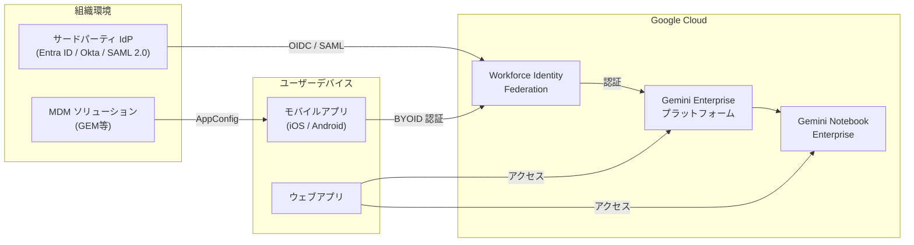

# Gemini Enterprise: BYOID モバイルアプリ GA + NotebookLM Enterprise から Gemini Notebook Enterprise へのリブランド

**リリース日**: 2026-07-16

**サービス**: Gemini Enterprise

**機能**: BYOID モバイルアプリ GA + NotebookLM Enterprise から Gemini Notebook Enterprise へのリブランド

**ステータス**: GA (一般提供) / 変更

📊 [このアップデートのインフォグラフィックを見る](https://takech9203.github.io/google-cloud-news-summary/20260716-gemini-enterprise-byoid-mobile-notebook-rebrand.html)

## 概要

本アップデートでは、Gemini Enterprise に関する 2 つの重要な変更が発表されました。第一に、サードパーティ ID プロバイダーを使用する組織向けの Gemini Enterprise モバイルアプリが一般提供 (GA) となりました。これにより、Bring Your Own Identity (BYOID) 機能を活用して、許可リストへの登録なしにモバイルアプリをサードパーティ ID プロバイダーに接続できます。

第二に、NotebookLM Enterprise が Gemini Notebook Enterprise にリブランドされました。これは名称変更のみであり、製品の機能や API エンドポイントに変更はありません。Gemini Enterprise ウェブアプリと管理コンソールでは新しい名称が表示されますが、サブスクリプションページでは引き続き NotebookLM Enterprise と表示されます。

これらのアップデートは、Gemini Enterprise プラットフォームの統合と、非 Google ID プロバイダーを使用するエンタープライズユーザーのモバイルアクセス拡大を目的としています。

**アップデート前の課題**

- サードパーティ ID プロバイダーを使用する組織では、モバイルアプリの利用に許可リスト (allowlist) への登録が必要だった
- BYOID モバイルアプリはプレビュー段階であり、本番環境での利用が制限されていた
- NotebookLM Enterprise という名称が Gemini Enterprise プラットフォーム全体のブランディングと統一されていなかった

**アップデート後の改善**

- サードパーティ ID プロバイダーを使用する組織が許可リストなしでモバイルアプリを利用可能になった
- BYOID モバイルアプリが GA となり、本番ワークロードでのサポートが保証された
- Gemini Notebook Enterprise への名称統一により、Gemini Enterprise 製品ファミリー内の位置づけが明確になった

## アーキテクチャ図



本図は、サードパーティ ID プロバイダーから Workforce Identity Federation を経由して Gemini Enterprise プラットフォーム (Gemini Notebook Enterprise を含む) へ認証するフローと、MDM を通じたモバイルアプリ配布の全体像を示しています。

## サービスアップデートの詳細

### 主要機能

1. **BYOID モバイルアプリ (GA)**
   - サードパーティ ID プロバイダー (Microsoft Entra ID、Okta、その他 OIDC/SAML 2.0 対応 IdP) を使用した認証がモバイルアプリで一般提供
   - 許可リスト不要で即座にデプロイ可能
   - MDM ソリューション、QR コード、アクセスリンクの 3 つの配布方法をサポート

2. **モバイルアプリ配布方法**
   - MDM ソリューション: AppConfig パラメータを使用してリモートインストールおよび設定
   - QR コード: Gemini Enterprise ウェブアプリ内で QR コードを有効化し、ユーザーがスキャンして設定
   - アクセスリンク: 管理者がリンクを生成してユーザーに配布

3. **Gemini Notebook Enterprise リブランド**
   - NotebookLM Enterprise から Gemini Notebook Enterprise への名称変更
   - API エンドポイントは従来通り変更なし
   - 製品機能は完全に同一のまま維持
   - 管理コンソールとウェブアプリでは新名称を表示

## 技術仕様

### BYOID モバイルアプリ設定パラメータ

| パラメータ (ディープリンク) | MDM 設定キー | MDM 設定名 | 説明 |
|------|------|------|------|
| cid | config_id | Configuration ID | アプリ設定 ID |
| cid_location | location | Location | リージョン (例: global) |
| idp | identity_provider | Identity Provider | Workforce Pool プロバイダーのパス |

### サポートされる ID プロバイダー

| ID プロバイダー | プロトコル |
|------|------|
| Microsoft Entra ID | OIDC / SAML 2.0 |
| Okta | OIDC / SAML 2.0 |
| Active Directory Federation Services (AD FS) | SAML 2.0 |
| その他 OIDC 対応 IdP | OIDC |
| その他 SAML 2.0 対応 IdP | SAML 2.0 |

### モバイルアプリ URL フォーマット (サードパーティ IdP)

```
https://vertexaisearch.cloud.google.com/mobile?cid=123&cid_location=global&idp=locations/global/workforcePools/my-pool/providers/my-provider
```

## 設定方法

### 前提条件

1. Gemini Enterprise のサブスクリプションが有効であること
2. Workforce Identity Federation が設定済みであること
3. サードパーティ ID プロバイダーとの連携が構成済みであること
4. Gemini Enterprise Admin ロールを持つ管理者アカウント

### 手順

#### ステップ 1: ID プロバイダーの設定確認

Google Cloud コンソールで Gemini Enterprise ページに移動し、Settings > Authentication から ID プロバイダーが正しく設定されていることを確認します。

```
Gemini Enterprise ページ > Settings > Authentication > Add identity provider
> 3rd party identity を選択 > Workforce Pool を選択 > Save changes
```

#### ステップ 2: モバイルアプリの配布設定 (MDM の場合)

1. Google Cloud コンソールで Gemini Enterprise ページに移動
2. 対象アプリをクリック
3. Overview ページで「Copy URL」をクリックしてモバイルリンクをコピー
4. MDM 管理コンソールで AppConfig パラメータを設定

iOS の場合の設定例:

```xml
<dict>
  <key>config_id</key>
  <string>123</string>
  <key>location</key>
  <string>global</string>
  <key>identity_provider</key>
  <string>locations/global/workforcePools/my-pool/providers/my-provider</string>
</dict>
```

#### ステップ 3: ユーザーへのロール付与

```bash
# Gemini Enterprise User ロールの付与
gcloud projects add-iam-policy-binding PROJECT_ID \
  --member="principalSet://iam.googleapis.com/locations/global/workforcePools/POOL_ID/*" \
  --role="roles/discoveryengine.agentspaceUser"
```

## メリット

### ビジネス面

- **モバイルワーカーへのリーチ拡大**: サードパーティ IdP を使用する全ユーザーがモバイルデバイスから Gemini Enterprise にアクセス可能になり、外出先での生産性が向上
- **IT 管理の簡素化**: 許可リスト管理が不要になり、管理者の運用負荷が軽減
- **ブランド統一による認知向上**: Gemini Notebook Enterprise への名称統一により、製品ポートフォリオの理解が容易に

### 技術面

- **認証基盤の一貫性**: Workforce Identity Federation を通じた統一的な認証フロー
- **MDM 統合**: AppConfig 標準に準拠し、既存の MDM インフラストラクチャとシームレスに統合
- **API 後方互換性**: リブランドにもかかわらず API エンドポイントに変更なし

## デメリット・制約事項

### 制限事項

- サブスクリプションページでは引き続き NotebookLM Enterprise と表示される (完全な名称移行は未完了)
- MDM 設定がデバイスに適用されている場合、QR コードやアクセスリンクによる設定は上書きされる
- 単一デバイスで複数の ID プロバイダーを使用してサインインすると「Incomplete sign-in details」エラーが発生する可能性がある

### 考慮すべき点

- 既存の Workforce Identity Federation 設定の属性マッピングが正しいことを事前に確認する必要がある
- ライセンス割り当ては大文字・小文字を区別するため、google.subject にはユーザーのメールアドレスを小文字で設定することを推奨

## ユースケース

### ユースケース 1: サードパーティ IdP を使用するグローバル企業のモバイル展開

**シナリオ**: Microsoft Entra ID を社内標準の IdP として使用しているグローバル企業が、フィールドワーカーや営業担当者にモバイルデバイスから Gemini Enterprise を利用させたい。

**効果**: 許可リストへの登録申請を待つことなく、MDM を通じて全対象ユーザーのモバイルデバイスに即座にアプリを展開でき、社内ナレッジベースへのモバイルアクセスを実現。

### ユースケース 2: Okta を使用する中規模企業の段階的導入

**シナリオ**: Okta を IdP として使用する中規模企業が、まず一部チームへ QR コードでモバイルアプリを配布し、利用状況を確認した後に MDM で全社展開する。

**効果**: QR コードによる低コストな初期展開から MDM による管理された全社展開まで、段階的なロールアウトが可能。

## 料金

Gemini Enterprise はサブスクリプション (座席ベース) で課金されます。モバイルアプリの利用に追加料金はかかりません。

### エディション別料金

| エディション | 月額料金 (1 シートあたり) | 座席数 |
|--------|-----------------|--------|
| Business | $21 USD から | 1-300 |
| Standard | $30 USD から | 無制限 |
| Plus | $30 USD から (追加機能あり) | 無制限 |

Gemini Notebook Enterprise は単体でも購入可能 (最大 5,000 ライセンスまでセルフサービス、それ以上は営業担当に問い合わせ)。

## 関連サービス・機能

- **Workforce Identity Federation**: サードパーティ IdP と Google Cloud を統合するための基盤サービス
- **Gemini Notebook Enterprise**: AI を活用したリサーチ・ライティングツールのエンタープライズ版 (旧 NotebookLM Enterprise)
- **Google Endpoint Management (GEM)**: モバイルデバイス管理ソリューション
- **Gemini Code Assist**: Standard/Plus エディションに含まれる AI コーディングアシスタント

## 参考リンク

- 📊 [インフォグラフィック](https://takech9203.github.io/google-cloud-news-summary/20260716-gemini-enterprise-byoid-mobile-notebook-rebrand.html)
- [公式リリースノート](https://docs.cloud.google.com/gemini/enterprise/docs/release-notes)
- [モバイルアプリの設定ドキュメント](https://docs.cloud.google.com/gemini/enterprise/docs/configure-mobile-app)
- [ID プロバイダーの設定](https://docs.cloud.google.com/gemini/enterprise/docs/configure-identity-provider)
- [Gemini Notebook Enterprise 概要](https://docs.cloud.google.com/gemini/enterprise/notebooklm-enterprise/docs/overview)
- [ノートブックの作成と管理 (API)](https://docs.cloud.google.com/gemini/enterprise/notebooklm-enterprise/docs/api-notebooks)
- [エディション比較](https://docs.cloud.google.com/gemini/enterprise/docs/editions)
- [ライセンス管理](https://docs.cloud.google.com/gemini/enterprise/docs/licenses)

## まとめ

本アップデートにより、サードパーティ ID プロバイダーを使用する組織は許可リスト不要で Gemini Enterprise モバイルアプリを本番展開できるようになりました。また、NotebookLM Enterprise から Gemini Notebook Enterprise へのリブランドは名称変更のみで機能や API に影響がないため、既存の統合に変更は不要です。サードパーティ IdP を使用する組織の管理者は、モバイルアプリの展開計画を策定し、MDM またはその他の配布方法を通じたユーザーへの配布を検討することを推奨します。

---

**タグ**: #GeminiEnterprise #BYOID #MobileApp #WorkforceIdentityFederation #GeminiNotebookEnterprise #NotebookLM #GA #リブランド
