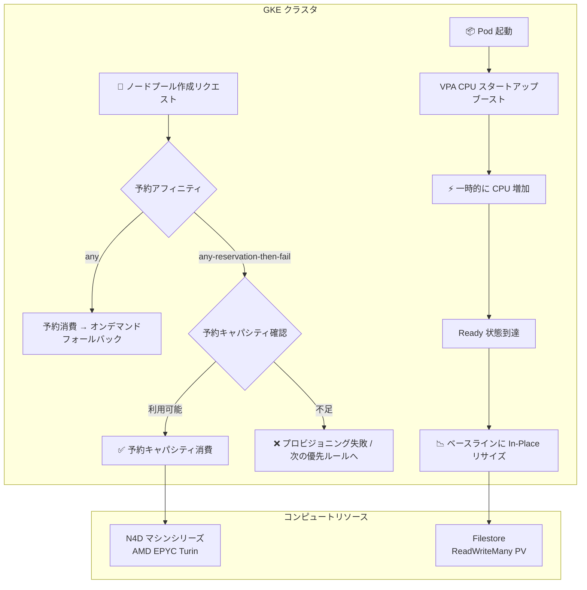

# Google Kubernetes Engine (GKE): Filestore API デフォルト有効化、予約アフィニティ any-reservation-then-fail、N4D マシンシリーズ対応、VPA CPU スタートアップブースト

**リリース日**: 2026-07-16

**サービス**: Google Kubernetes Engine (GKE)

**機能**: Filestore API デフォルト有効化、予約アフィニティ any-reservation-then-fail、N4D マシンシリーズ対応、VPA CPU スタートアップブースト

**ステータス**: GA / Preview (機能により異なる)

📊 [このアップデートのインフォグラフィックを見る](https://takech9203.github.io/google-cloud-news-summary/20260716-gke-filestore-reservation-n4d-vpa-boost.html)

## 概要

Google Kubernetes Engine (GKE) に 4 つの機能強化が同時にリリースされた。Filestore API のデフォルト有効化によるストレージ設定の簡素化、予約キャパシティ消費時のフォールバック制御、AMD EPYC Turin ベースの N4D マシンシリーズのサポート拡大、そして VPA による CPU スタートアップブースト機能のプレビュー提供である。

これらのアップデートは、GKE を利用する幅広いユーザーに影響を与える。ストレージ管理者、インフラストラクチャコスト管理者、パフォーマンス最適化を行うアプリケーション開発者が主な対象ユーザーとなる。

**アップデート前の課題**

- Filestore を GKE で使用する際、Kubernetes Engine API とは別に Filestore API を手動で有効化する必要があった
- 予約キャパシティが不足した場合、GKE は自動的にオンデマンドキャパシティにフォールバックし、予期しないコスト増加が発生する可能性があった
- N4D マシンシリーズは GKE 1.34 以降でのみノードプール自動作成に対応しており、1.33 系では利用できなかった
- アプリケーション起動時に CPU リソースが不足し、起動に時間がかかる問題に対して、手動でリソースを過剰プロビジョニングするか起動遅延を受け入れるしかなかった

**アップデート後の改善**

- 2026年6月30日以降、Kubernetes Engine API を有効にすると Filestore API も自動的に有効化されるようになった
- `any-reservation-then-fail` アフィニティにより、予約キャパシティが利用できない場合にオンデマンドへのフォールバックを防止できるようになった
- GKE 1.33 系でも N4D マシンシリーズがノードプール自動作成と Autopilot で利用可能になった
- VPA の CPU スタートアップブースト機能により、起動時に一時的に CPU リソースを増加させ、起動完了後に自動的にベースラインに戻すことが可能になった

## アーキテクチャ図



GKE クラスタにおける予約キャパシティ消費フローと VPA CPU スタートアップブーストのライフサイクルを示す。予約アフィニティの設定により、オンデマンドフォールバックの挙動を制御できる。

## サービスアップデートの詳細

### 主要機能

1. **Filestore API デフォルト有効化**
   - 2026年6月30日以降、Kubernetes Engine API (`container.googleapis.com`) を有効にすると Filestore API (`file.googleapis.com`) が自動的に有効化される
   - ReadWriteMany (RWX) アクセスモードの PersistentVolume に Filestore API が必要
   - Autopilot クラスタでは Filestore CSI ドライバーがデフォルトで有効
   - Standard クラスタでは別途 CSI ドライバーの有効化が必要

2. **予約アフィニティ `any-reservation-then-fail`**
   - GKE バージョン 1.36.0-gke.3204000 以降で利用可能
   - ノードプール作成リクエスト、Pod 仕様、ComputeClass 仕様で指定可能
   - 予約キャパシティが利用できない場合、オンデマンドキャパシティへのフォールバックを防止
   - ComputeClass では、予約不足時に次の優先ルールに移行 (オンデマンドリソースを作成しない)
   - 予約を超えるノード数をリクエストした場合、超過分はキャパシティが確保されるまでプロビジョニングを再試行

3. **N4D マシンシリーズのサポート拡大**
   - GKE 1.33 系でのノードプール自動作成: 1.33.12-gke.1208000 以降
   - GKE 1.33 系での Autopilot: 1.33.13-gke.1079000 以降
   - AMD EPYC Turin (第5世代) プロセッサ搭載
   - 最大 96 vCPU、768 GB DDR5 メモリ
   - Titanium による高速ネットワーキング対応

4. **VPA CPU スタートアップブースト (Preview)**
   - GKE バージョン 1.36.0-gke.4447000 以降で利用可能
   - アプリケーション起動時に一時的に CPU リクエストを増加
   - 起動完了後に Kubernetes In-Place Pod Resize (IPPR) を使用してコンテナ再起動なしにベースラインに戻す
   - Factor (乗数) または Quantity (絶対値追加) で増加量を指定可能

## 技術仕様

### 予約アフィニティのオプション比較

| アフィニティタイプ | 動作 | フォールバック | 対応バージョン |
|---|---|---|---|
| `any` (デフォルト) | 一致する予約を消費 | オンデマンドにフォールバック | 全バージョン |
| `any-reservation-then-fail` | 一致する予約を消費 | フォールバックなし (失敗) | 1.36.0-gke.3204000+ |
| `specific` | 特定の予約を消費 | フォールバックなし (失敗) | 全バージョン |

### N4D マシンシリーズの主要スペック

| 項目 | 詳細 |
|---|---|
| プロセッサ | AMD EPYC Turin (第5世代) |
| 最大 vCPU | 96 |
| 最大メモリ | 768 GB DDR5 |
| ネットワーク帯域 | 最大 50 Gbps |
| ストレージ | Hyperdisk のみ対応 |
| Local SSD | 非対応 |
| 構成タイプ | standard (4GB/vCPU), highcpu (2GB/vCPU), highmem (8GB/vCPU) |
| カスタムマシンタイプ | 対応 (2-96 vCPU, 0.5-8 GB/vCPU) |

### VPA CPU スタートアップブーストの設定パラメータ

| パラメータ | 説明 | 値の例 |
|---|---|---|
| `type` | ブースト計算方式 | `Factor` または `Quantity` |
| `factor` | CPU 乗数 (Factor タイプ) | `2` (ベースの2倍) |
| `quantity` | CPU 追加量 (Quantity タイプ) | `"2"` (2 vCPU 追加) |
| `durationSeconds` | ブースト持続時間 | `10` (Ready 後10秒) |

## 設定方法

### 予約アフィニティ `any-reservation-then-fail` の設定

#### ステップ 1: 予約の作成

```bash
gcloud compute reservations create my-reservation \
    --machine-type=n4d-standard-8 --vm-count=3
```

#### ステップ 2: フォールバックなしの予約消費でノードプールを作成

```bash
gcloud container node-pools create my-node-pool \
    --cluster my-cluster --num-nodes=3 \
    --machine-type=n4d-standard-8 \
    --reservation-affinity=any-reservation-then-fail
```

予約キャパシティが不足している場合、超過分のノードはプロビジョニングに失敗し、キャパシティが確保されるまで再試行される。

### VPA CPU スタートアップブーストの設定

#### ステップ 1: VPA マニフェストの作成 (ブーストのみ使用)

```yaml
apiVersion: "autoscaling.k8s.io/v1"
kind: VerticalPodAutoscaler
metadata:
  name: example-vpa
spec:
  targetRef:
    apiVersion: "apps/v1"
    kind: Deployment
    name: example
  updatePolicy:
    updateMode: "Off"
  startupBoost:
    cpu:
      type: "Factor"
      factor: 2
      durationSeconds: 10
```

#### ステップ 2: VPA とブーストの両方を有効化する場合

```yaml
apiVersion: "autoscaling.k8s.io/v1"
kind: VerticalPodAutoscaler
metadata:
  name: example-vpa
spec:
  targetRef:
    apiVersion: "apps/v1"
    kind: Deployment
    name: example
  updatePolicy:
    updateMode: "InPlaceOrRecreate"
  startupBoost:
    cpu:
      type: "Factor"
      factor: 2
      durationSeconds: 10
```

起動時に CPU リクエストが2倍に増加され、Pod が Ready 状態になってから10秒後にベースラインに戻る。

## メリット

### ビジネス面

- **コスト管理の厳格化**: `any-reservation-then-fail` により予約キャパシティの範囲内でのみリソースを消費でき、予期しないオンデマンドコストを防止
- **運用効率の向上**: Filestore API の自動有効化により、初期セットアップの手順が削減される
- **コスト最適化**: N4D マシンシリーズの動的リソース管理により、ホストマシンリソースの効率的な利用が可能

### 技術面

- **起動パフォーマンスの改善**: VPA CPU スタートアップブーストにより、Java/Node.js/Python などのリソース集約型アプリケーションの起動が高速化
- **リソース効率**: ブースト後に In-Place リサイズでベースラインに戻るため、定常運用時の過剰プロビジョニングが不要
- **柔軟なキャパシティプランニング**: ComputeClass と予約アフィニティの組み合わせにより、優先度ベースのリソース割り当てが実現

## デメリット・制約事項

### 制限事項

- VPA CPU スタートアップブーストは Preview 段階であり、SLA の対象外
- CPU スタートアップブーストは Pod 作成時のみ適用され、コンテナ再起動時には適用されない
- N4D マシンシリーズは Local SSD に非対応
- N4D マシンシリーズは per VM Tier_1 ネットワーキングパフォーマンスに非対応
- `any-reservation-then-fail` は GKE 1.36.0-gke.3204000 以降が必要

### 考慮すべき点

- CPU スタートアップブーストと HPA を併用する場合、`readinessProbe` の定義と `durationSeconds: 0` の設定が必要
- Standard クラスタで CPU スタートアップブーストを使用する場合、一時的なスケールアップ後のノード削除による Pod エビクションループに注意 (Autopilot 推奨)
- `any-reservation-then-fail` を使用する場合、予約不足時にノードがプロビジョニングされないため、ワークロードの可用性に影響する可能性がある

## ユースケース

### ユースケース 1: 予約ベースの GPU ワークロード管理

**シナリオ**: GPU 予約を確保している環境で、予約を超えるオンデマンド GPU コストを防止したい場合

**実装例**:
```bash
gcloud container node-pools create gpu-pool \
    --cluster my-cluster \
    --accelerator type=nvidia-tesla-t4,count=1 \
    --machine-type=n1-standard-8 \
    --num-nodes=4 \
    --reservation-affinity=any-reservation-then-fail \
    --node-locations=us-central1-a
```

**効果**: 予約キャパシティの範囲内でのみ GPU ノードが作成され、予期しないオンデマンド GPU 課金を防止できる。

### ユースケース 2: Java アプリケーションの起動高速化

**シナリオ**: Spring Boot アプリケーションの起動に 30 秒以上かかり、ReadinessProbe のタイムアウトが発生しやすい環境

**実装例**:
```yaml
apiVersion: "autoscaling.k8s.io/v1"
kind: VerticalPodAutoscaler
metadata:
  name: spring-boot-vpa
spec:
  targetRef:
    apiVersion: "apps/v1"
    kind: Deployment
    name: spring-boot-app
  updatePolicy:
    updateMode: "Off"
  startupBoost:
    cpu:
      type: "Factor"
      factor: 3
      durationSeconds: 0
```

**効果**: 起動時に CPU リクエストが3倍に増加し、JVM のウォームアップとアプリケーション初期化が高速化される。`durationSeconds: 0` により Ready 状態到達後即座にベースラインに戻る。

### ユースケース 3: コスト効率の高い汎用ワークロード

**シナリオ**: N4D マシンシリーズを使用してコスト効率の高い汎用ワークロードを Autopilot で実行

**実装例**:
```yaml
apiVersion: cloud.google.com/v1
kind: ComputeClass
metadata:
  name: cost-optimized
spec:
  priorities:
    - machineFamily: n4d
    - machineFamily: n4
  whenUnsatisfiable: ScaleUpAnyway
  nodePoolAutoCreation:
    enabled: true
```

**効果**: AMD EPYC Turin プロセッサの高い価格性能比と動的リソース管理により、汎用ワークロードのコストを最適化できる。

## 関連サービス・機能

- **Compute Engine 予約**: GKE ノードプールが消費するゾーンリソース予約の基盤
- **Filestore**: GKE で ReadWriteMany アクセスモードの PersistentVolume を提供する NFS ストレージ
- **Vertical Pod Autoscaler (VPA)**: Pod のリソースリクエストを自動調整する GKE のオートスケーリング機能
- **ComputeClass**: ノード構成の優先順位を定義するカスタムリソース
- **Cluster Autoscaler**: ノードプールの自動スケーリング機能

## 参考リンク

- 📊 [インフォグラフィック](https://takech9203.github.io/google-cloud-news-summary/20260716-gke-filestore-reservation-n4d-vpa-boost.html)
- [GKE 新機能リリースノート](https://cloud.google.com/kubernetes-engine/docs/release-notes-new-features#July_16_2026)
- [Filestore CSI ドライバー](https://cloud.google.com/kubernetes-engine/docs/how-to/persistent-volumes/filestore-csi-driver)
- [予約済みゾーンリソースの消費](https://cloud.google.com/kubernetes-engine/docs/how-to/consuming-reservations)
- [N4D マシンシリーズ](https://cloud.google.com/compute/docs/general-purpose-machines#n4d_series)
- [CPU スタートアップブースト](https://cloud.google.com/kubernetes-engine/docs/how-to/boost-application-startup)
- [ノードプール自動作成](https://cloud.google.com/kubernetes-engine/docs/concepts/node-auto-provisioning)
- [GKE 料金ページ](https://cloud.google.com/kubernetes-engine/pricing)

## まとめ

今回の GKE アップデートは、ストレージ設定の簡素化、コスト管理の厳格化、コンピュート選択肢の拡大、起動パフォーマンスの最適化という 4 つの側面で GKE の運用体験を向上させる。特に `any-reservation-then-fail` 予約アフィニティと VPA CPU スタートアップブーストは、コスト最適化とパフォーマンス改善を両立させたい環境で即座に検討すべき機能である。N4D マシンシリーズの 1.33 系へのバックポートにより、最新バージョンにアップグレードできない環境でも AMD EPYC Turin の恩恵を受けられるようになった。

---

**タグ**: #GKE #Kubernetes #Filestore #Reservation #N4D #VPA #AutoScaling #CostOptimization #Performance #Preview
