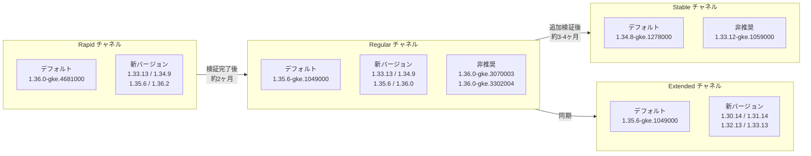

# Google Kubernetes Engine (GKE): バージョンアップデート 2026-R30

**リリース日**: 2026-07-16

**サービス**: Google Kubernetes Engine (GKE)

**機能**: クラスタバージョンの更新 (2026-R30)

**ステータス**: Change (Version Update)

[このアップデートのインフォグラフィックを見る](https://takech9203.github.io/google-cloud-news-summary/20260716-gke-version-updates-2026-r30.html)

## 概要

Google Kubernetes Engine (GKE) の全 4 リリースチャネル (Rapid, Regular, Stable, Extended) において、クラスタバージョンが更新された。今回の 2026-R30 アップデートでは、各チャネルのデフォルトバージョンが変更され、新しいパッチバージョンが利用可能になるとともに、一部のバージョンが非推奨となった。

Rapid チャネルでは Kubernetes 1.36 がデフォルトとなり、Regular チャネルでは 1.35 がデフォルトに昇格している。Stable チャネルは 1.34 がデフォルトとなり、Extended チャネルでは 1.35 がデフォルトに設定された。これにより、各チャネルのバージョンが一段階ずつ進行し、最新の Kubernetes 機能がより安定したチャネルへと順次展開されている。

このアップデートは、GKE クラスタを運用するすべてのプラットフォーム管理者およびインフラエンジニアに影響する。特に自動アップグレードを有効にしているクラスタでは、新しいデフォルトバージョンへの自動昇格が順次実施される。

**アップデート前の課題**

- 各チャネルの以前のデフォルトバージョンには、最新のセキュリティパッチやバグ修正が含まれていなかった
- Rapid チャネルでの Kubernetes 1.36 の安定性検証が進行中であった
- 一部のパッチバージョンにはセキュリティ上の既知の問題が存在していた

**アップデート後の改善**

- 全チャネルで最新のセキュリティパッチが適用されたバージョンがデフォルトに設定された
- Kubernetes 1.36 の新機能 (Mutating Admission Policies GA、CoreDNS ベースの kube-dns、L4 ILB の NEG デフォルト化) がより広いチャネルで利用可能に
- 非推奨バージョンの明確化により、アップグレード計画の策定が容易に

## アーキテクチャ図



GKE のリリースチャネルはバージョンの安定性を段階的に検証するパイプラインとして機能する。Rapid で最初に導入されたバージョンが検証を経て Regular、Stable へと順次展開される。

## サービスアップデートの詳細

### チャネル別バージョン一覧

| チャネル | デフォルトバージョン | 新規追加バージョン | 非推奨バージョン |
|---------|---------------------|-------------------|-----------------|
| Rapid | 1.36.0-gke.4681000 | 1.33.13-gke.1109000, 1.34.9-gke.1322000, 1.35.6-gke.1258000, 1.36.2-gke.1498000 | - |
| Regular | 1.35.6-gke.1049000 | 1.33.13-gke.1011000, 1.34.9-gke.1131000, 1.35.6-gke.1127000, 1.36.0-gke.4447000 | 1.36.0-gke.3070003, 1.36.0-gke.3302004 |
| Stable | 1.34.8-gke.1278000 | - | 1.33.12-gke.1059000 |
| Extended | 1.35.6-gke.1049000 | 1.30.14, 1.31.14, 1.32.13, 1.33.13 シリーズ | - |

### 自動アップグレードターゲット

| チャネル | アップグレードパス |
|---------|------------------|
| Rapid | 1.32 → 1.33, 1.33 → 1.34, 1.34 → 1.35, 1.35 → 1.36 |
| Regular | 1.32 → 1.33, 1.33 → 1.34, 1.34 → 1.35 |
| Stable | 1.32 → 1.33, 1.33 → 1.34 |

### 主要機能

1. **Rapid チャネルで Kubernetes 1.36.2 が利用可能に**
   - Rapid チャネルに 1.36.2-gke.1498000 が新規追加
   - 1.36.0-gke.4681000 がデフォルトとして設定
   - Kubernetes 1.36 の最新パッチが適用済み

2. **Regular チャネルの 1.36 バージョン整理**
   - 古い 1.36.0 パッチ (gke.3070003, gke.3302004) が非推奨に
   - 新しい 1.36.0-gke.4447000 が利用可能に (VPA CPU Startup Boost 対応)
   - バージョン整理により、推奨パッチへの移行を促進

3. **Extended チャネルの長期サポートバージョン更新**
   - 1.30.14、1.31.14、1.32.13、1.33.13 シリーズの新パッチが追加
   - 最大 24 ヶ月のサポート期間内での継続的なセキュリティパッチ提供
   - レガシーバージョンの運用継続が可能

## 技術仕様

### Kubernetes 1.36 の主要な新機能

今回のアップデートにより Regular チャネルで 1.36 が広く利用可能になったことで、以下の新機能が実質的に本番環境で使えるようになった。

| 機能 | 説明 | ステータス |
|------|------|-----------|
| Mutating Admission Policies | CEL 式によるリソース変更 (Webhook 不要) | GA |
| CoreDNS ベースの kube-dns | より効率的な DNS 実装 | GA |
| L4 ILB の NEG デフォルト化 | NEG ベースのサブセッティングがデフォルトに | GA |
| VPA CPU Startup Boost | アプリ起動時の CPU リクエスト一時増加 | Preview (1.36.0-gke.4447000+) |

### リリースチャネルの特性

| チャネル | マイナーバージョン範囲 | 安定性 | アップグレード頻度 | SLA |
|---------|---------------------|--------|------------------|-----|
| Rapid | 1.33 - 1.36 | 最新機能優先 | 高頻度 | 対象外 |
| Regular | 1.33 - 1.36 | バランス重視 | 中頻度 | 対象 |
| Stable | 1.33 - 1.35 | 安定性優先 | 低頻度 | 対象 |
| Extended | 1.30 - 1.36 | 長期サポート | 低頻度 (パッチのみ) | 対象 |

## 設定方法

### 前提条件

1. Google Cloud プロジェクトで GKE API が有効であること
2. `gcloud` CLI がインストール・認証済みであること
3. クラスタの適切な IAM 権限 (`container.admin` ロール) を保持していること

### 手順

#### ステップ 1: 現在のクラスタバージョンを確認

```bash
gcloud container clusters list \
  --format="table(name,location,currentMasterVersion,releaseChannel.channel)"
```

#### ステップ 2: 利用可能なバージョンを確認

```bash
# Regular チャネルのデフォルトバージョンと利用可能バージョンを確認
gcloud container get-server-config \
  --flatten="channels" \
  --filter="channels.channel=REGULAR" \
  --format="yaml(channels.channel,channels.defaultVersion,channels.validVersions)" \
  --location=us-central1
```

#### ステップ 3: 手動アップグレード (必要な場合)

```bash
# コントロールプレーンのアップグレード
gcloud container clusters upgrade CLUSTER_NAME \
  --master \
  --cluster-version=1.35.6-gke.1049000 \
  --location=LOCATION

# ノードプールのアップグレード
gcloud container clusters upgrade CLUSTER_NAME \
  --node-pool=NODE_POOL_NAME \
  --cluster-version=1.35.6-gke.1049000 \
  --location=LOCATION
```

#### ステップ 4: メンテナンスウィンドウの設定 (推奨)

```bash
# メンテナンスウィンドウを設定して自動アップグレードのタイミングを制御
gcloud container clusters update CLUSTER_NAME \
  --maintenance-window-start="2026-07-17T02:00:00Z" \
  --maintenance-window-end="2026-07-17T06:00:00Z" \
  --maintenance-window-recurrence="FREQ=WEEKLY;BYDAY=SA,SU" \
  --location=LOCATION
```

## メリット

### ビジネス面

- **セキュリティリスクの低減**: 最新のセキュリティパッチが適用されたバージョンへの自動アップグレードにより、脆弱性の露出時間を短縮
- **運用コストの削減**: 自動アップグレードにより、手動でのバージョン管理作業が不要
- **コンプライアンス対応**: サポート対象バージョンを維持することで、SLA の適用範囲内を維持

### 技術面

- **最新 Kubernetes 機能の利用**: Mutating Admission Policies (GA) により Webhook の管理オーバーヘッドを削減
- **DNS パフォーマンスの向上**: CoreDNS ベースの kube-dns により、大規模 Headless Service やアップストリーム DNS の処理能力が向上
- **ネットワーク効率の改善**: L4 ILB の NEG デフォルト化により、ロードバランサの同期速度とスケーラビリティが向上

## デメリット・制約事項

### 制限事項

- 自動アップグレードの無効化には、メンテナンス除外期間の設定が必要 (最大 90 日間)
- マイナーバージョンのスキップアップグレードはコントロールプレーンでは不可 (1 バージョンずつ順次アップグレードが必要)
- Extended チャネルの拡張サポート期間中はセキュリティパッチのみ提供 (新機能追加なし)
- Rapid チャネルのバージョンは GKE SLA の対象外

### 考慮すべき点

- 非推奨バージョンからのアップグレード計画を早期に策定すること (非推奨バージョンは 90 日間の猶予後に削除)
- ノードのバージョンスキューポリシー (コントロールプレーンとノードの差は最大 2 マイナーバージョン) に注意
- Kubernetes API の非推奨・削除に伴うワークロードへの影響を事前にテストすること
- 1.36 へのアップグレード時は CNI バージョン 1.1.0 への互換性を確認 (特に自己管理 Istio / CSM 利用環境)

## ユースケース

### ユースケース 1: プロダクション環境のセキュリティ維持

**シナリオ**: Regular チャネルを使用するプロダクションクラスタで、最新のセキュリティパッチを適用しつつ安定性を確保したい。

**実装例**:
```bash
# Regular チャネルに登録 (デフォルト 1.35.6-gke.1049000 が適用される)
gcloud container clusters update my-prod-cluster \
  --release-channel=regular \
  --location=asia-northeast1

# メンテナンスウィンドウで業務時間外にアップグレードを制限
gcloud container clusters update my-prod-cluster \
  --maintenance-window-start="2026-07-20T18:00:00+09:00" \
  --maintenance-window-end="2026-07-20T22:00:00+09:00" \
  --maintenance-window-recurrence="FREQ=WEEKLY;BYDAY=SA" \
  --location=asia-northeast1
```

**効果**: 最新のセキュリティパッチが業務影響の少ない時間帯に自動適用され、手動介入なしでセキュリティレベルを維持できる。

### ユースケース 2: レガシーシステムの長期安定運用

**シナリオ**: Kubernetes 1.31 ベースのワークロードを変更せずに運用し続けたいが、セキュリティパッチは必要。

**実装例**:
```bash
# Extended チャネルに登録して長期サポートを利用
gcloud container clusters update my-legacy-cluster \
  --release-channel=extended \
  --location=us-central1

# マイナーバージョンアップグレードを一時的に除外
gcloud container clusters update my-legacy-cluster \
  --add-maintenance-exclusion-name="no-minor-upgrade" \
  --add-maintenance-exclusion-start="2026-07-16T00:00:00Z" \
  --add-maintenance-exclusion-end="2026-10-14T00:00:00Z" \
  --add-maintenance-exclusion-scope="no_minor_or_node_upgrades" \
  --location=us-central1
```

**効果**: Extended チャネルにより 1.31.14 シリーズのセキュリティパッチを継続的に受け取りながら、マイナーバージョンの変更を最大 24 ヶ月間回避できる。

### ユースケース 3: 段階的ロールアウトによるリスク低減

**シナリオ**: 開発/ステージング/プロダクションの複数環境で段階的にバージョンをロールアウトしたい。

**効果**: Rollout Sequencing with Custom Stages (GA) を使用し、開発環境の Rapid チャネルで新バージョンを検証後、プロダクション環境の Regular/Stable チャネルに順次展開することで、本番障害リスクを最小化できる。

## 料金

GKE のバージョンアップデート自体には追加料金は発生しない。ただし、以下の料金体系を理解しておくことが重要。

### 料金例

| 項目 | 料金 |
|------|------|
| GKE クラスタ管理費 (Standard) | $0.10 / クラスタ / 時間 |
| GKE クラスタ管理費 (Autopilot) | $0.00 (管理費無料) |
| Extended サポート追加料金 | 拡張サポート期間に入ったクラスタに追加費用が発生 |
| ノードのコンピューティング費用 | 通常の Compute Engine 料金 |

詳細は [GKE 料金ページ](https://cloud.google.com/kubernetes-engine/pricing) を参照。

## 利用可能リージョン

GKE バージョンアップデートは全リージョンで利用可能。ただし、新しいバージョンのロールアウトはリージョンごとに段階的に行われるため、一部リージョンでは利用可能になるタイミングが異なる場合がある。

利用可能なバージョンはリージョンごとに確認可能:

```bash
gcloud container get-server-config --location=LOCATION
```

## 関連サービス・機能

- **Cloud Monitoring**: クラスタのアップグレード状態やバージョン情報を監視し、アラートポリシーでアップグレードイベントを通知
- **Cloud Logging**: アップグレードイベントのログを記録し、トラブルシューティングに活用
- **Binary Authorization**: クラスタバージョンに基づいたデプロイポリシーの適用
- **GKE Rollout Sequencing**: 複数クラスタ間でのバージョンロールアウトの順序制御 (GA)
- **Container-Optimized OS**: GKE ノードの OS イメージ (バージョンと連動して更新)
- **GKE Security Posture**: クラスタのセキュリティ状態の継続的評価とバージョン推奨

## 参考リンク

- [このアップデートのインフォグラフィック](https://takech9203.github.io/google-cloud-news-summary/20260716-gke-version-updates-2026-r30.html)
- [公式リリースノート](https://docs.cloud.google.com/release-notes#July_16_2026)
- [GKE リリースノート](https://docs.cloud.google.com/kubernetes-engine/docs/release-notes)
- [GKE バージョニングとサポート](https://docs.cloud.google.com/kubernetes-engine/versioning)
- [リリースチャネルの概要](https://docs.cloud.google.com/kubernetes-engine/docs/concepts/release-channels)
- [クラスタアップグレードのベストプラクティス](https://docs.cloud.google.com/kubernetes-engine/docs/best-practices/upgrading-clusters)
- [GKE リリーススケジュール](https://docs.cloud.google.com/kubernetes-engine/docs/release-schedule)
- [料金ページ](https://cloud.google.com/kubernetes-engine/pricing)

## まとめ

GKE 2026-R30 バージョンアップデートにより、全 4 チャネルのデフォルトバージョンが更新され、最新のセキュリティパッチと機能が適用された。特に Regular チャネルで Kubernetes 1.36 が利用可能になったことで、Mutating Admission Policies や CoreDNS ベースの DNS など、運用効率を向上させる新機能が本番環境で活用可能になった。クラスタ管理者は、自動アップグレードの設定を確認し、非推奨バージョンからのマイグレーション計画を策定することを推奨する。

---

**タグ**: #GKE #Kubernetes #VersionUpdate #ReleaseChannel #ClusterUpgrade #2026-R30
