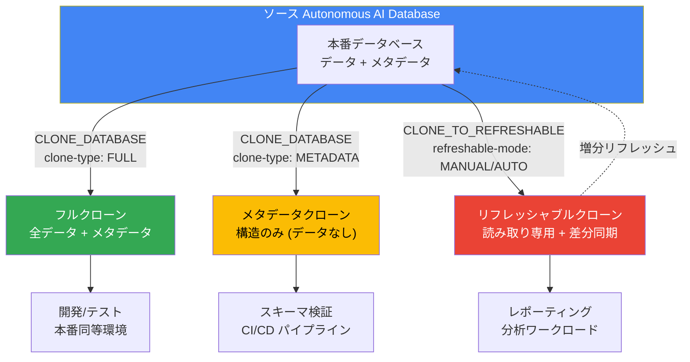

# Oracle Database@Google Cloud: Autonomous AI Database のクローニングが GA

**リリース日**: 2026-07-16

**サービス**: Oracle Database@Google Cloud

**機能**: Autonomous AI Database Cloning

**ステータス**: GA (一般提供)

[このアップデートのインフォグラフィックを見る](https://takech9203.github.io/google-cloud-news-summary/20260716-oracle-database-autonomous-ai-db-cloning-ga.html)

## 概要

Oracle Database@Google Cloud において、Autonomous AI Database のクローニング機能が一般提供 (GA) となった。この機能により、既存の Autonomous AI Database から新しいデータベースインスタンスを作成でき、ソースデータベースに影響を与えることなくデータやメタデータの複製が可能になる。

クローニングは Google Cloud CLI および Oracle Database@Google Cloud API を使用して実行でき、フルクローン、メタデータクローン、リフレッシャブルクローンの 3 種類が提供される。フルクローンはソースデータベースの全データとメタデータを含み、メタデータクローンはスキーマ構造のみを複製する。リフレッシャブルクローンはソースデータベースとの差分同期が可能な読み取り専用コピーであり、レポーティングワークロードのオフロードやテスト環境の維持に最適である。

この機能は、開発/テスト環境の迅速な構築、データ分析用の本番データ複製、ビジネスユニット間でのデータ共有といったユースケースを持つエンタープライズデータベース管理者やプラットフォームエンジニアを主な対象としている。

**アップデート前の課題**

- Autonomous AI Database の複製には手動でのエクスポート/インポート作業やバックアップからのリストアが必要だった
- 本番データベースの構造のみを開発環境に複製する標準的な手段がなかった
- テスト環境やレポーティング環境を本番データと定期的に同期する仕組みがなく、運用負荷が高かった

**アップデート後の改善**

- gcloud CLI または API で簡単にデータベースのクローンを作成可能になった
- 用途に応じてフルクローン、メタデータクローン、リフレッシャブルクローンの 3 種類から選択可能になった
- リフレッシャブルクローンにより、本番環境のパフォーマンスに影響を与えずにデータの増分同期が可能になった
- バックアップからのクローン作成にも対応し、特定時点のデータを復元可能になった

## アーキテクチャ図



ソースの Autonomous AI Database から 3 種類のクローンを作成できる。リフレッシャブルクローンはソースとの増分同期機能を持ち、読み取り専用コピーとして継続的にデータを反映できる。

## サービスアップデートの詳細

### 主要機能

1. **フルクローン (Full Clone)**
   - ソースデータベースの全データおよびメタデータを含む完全なコピーを作成
   - データベースインスタンスから直接クローンするか、最新のバックアップからクローンするかを選択可能
   - クローン後は独立したデータベースとして動作し、読み書きが可能
   - 本番データの完全な複製が必要な開発/テストシナリオに最適

2. **メタデータクローン (Metadata Clone)**
   - ソースデータベースのメタデータ (ユーザー、ロール、テーブル、その他のデータベース構造) のみを複製
   - 実データは含まれないため、クローン作成が高速
   - スキーマの検証、CI/CD パイプラインでの構造テスト、新規環境の初期セットアップに最適
   - バックアップからのメタデータクローンも可能

3. **リフレッシャブルクローン (Refreshable Clone)**
   - ソースデータベースの読み取り専用コピーとして作成
   - 増分リフレッシュにより、フル再クローンのオーバーヘッドなしにソースと同期可能
   - 独立したコンピュートおよびストレージリソースで動作し、ソースのパフォーマンスに影響しない
   - 手動リフレッシュモードまたは自動リフレッシュモードを選択可能
   - レポーティングワークロードのオフロード、最新テスト環境の維持、ビジネスユニット間でのデータ共有に最適

## 技術仕様

### クローンタイプの比較

| 項目 | フルクローン | メタデータクローン | リフレッシャブルクローン |
|------|------------|------------------|----------------------|
| データ含有 | 全データ + メタデータ | メタデータのみ | 全データ + メタデータ |
| 読み書き | 読み書き可能 | 読み書き可能 | 読み取り専用 |
| ソースとの同期 | なし (独立) | なし (独立) | 増分リフレッシュ対応 |
| 作成速度 | データ量に依存 | 高速 | データ量に依存 |
| バックアップからの作成 | 対応 | 対応 | 非対応 |
| sourceType | CLONE_DATABASE / BACKUP_FROM_TIMESTAMP | CLONE_DATABASE / BACKUP_FROM_TIMESTAMP | CLONE_TO_REFRESHABLE |

### 必要な IAM ロール

```
roles/oracledatabase.autonomousDatabaseAdmin
```

### ワークロードタイプ

| ワークロード | 識別子 | 説明 |
|------------|--------|------|
| Autonomous JSON Database | ajd | JSON ドキュメント処理向け |
| Oracle APEX | apex | APEX アプリケーション開発向け |
| Autonomous Data Warehouse | dw | 分析ワークロード向け |
| Autonomous Transaction Processing | oltp | トランザクション処理向け |

## 設定方法

### 前提条件

1. クローンのソースとなる既存の Autonomous AI Database が必要
2. `roles/oracledatabase.autonomousDatabaseAdmin` IAM ロールが付与されていること
3. Oracle Database@Google Cloud の環境セットアップが完了していること

### 手順

#### ステップ 1: フルクローンの作成 (gcloud CLI)

```bash
gcloud oracle-database autonomous-databases create CLONE_ID \
  --project=PROJECT_ID \
  --location=REGION \
  --admin-password=ADMIN_PASSWORD \
  --database=CLONE_NAME \
  --display-name=DISPLAY_NAME \
  --properties-license-type=LICENSE_TYPE \
  --properties-compute-count=COMPUTE_COUNT \
  --properties-db-version=DATABASE_VERSION \
  --properties-db-workload=WORKLOAD_TYPE \
  --properties-data-storage-size-gb=STORAGE_SIZE \
  --properties-mtls-connection-required \
  --source-config-autonomous-database="projects/PROJECT_ID/locations/REGION/autonomousDatabases/SOURCE_DATABASE_ID" \
  --source-config-type="CLONE_DATABASE" \
  --source-config-clone-type="FULL"
```

ソースデータベースの全データとメタデータを含むフルクローンを作成する。

#### ステップ 2: メタデータクローンの作成 (gcloud CLI)

```bash
gcloud oracle-database autonomous-databases create CLONE_ID \
  --project=PROJECT_ID \
  --location=REGION \
  --admin-password=ADMIN_PASSWORD \
  --database=CLONE_NAME \
  --display-name=DISPLAY_NAME \
  --properties-license-type=LICENSE_TYPE \
  --properties-compute-count=COMPUTE_COUNT \
  --properties-db-version=DATABASE_VERSION \
  --properties-db-workload=WORKLOAD_TYPE \
  --properties-data-storage-size-gb=STORAGE_SIZE \
  --properties-mtls-connection-required \
  --source-config-autonomous-database="projects/PROJECT_ID/locations/REGION/autonomousDatabases/SOURCE_DATABASE_ID" \
  --source-config-type="CLONE_DATABASE" \
  --source-config-clone-type="METADATA"
```

データベース構造のみを複製するメタデータクローンを作成する。

#### ステップ 3: リフレッシャブルクローンの作成 (REST API)

```bash
curl -X POST \
  -H "Authorization: Bearer $(gcloud auth print-access-token)" \
  -H "Content-Type: application/json" \
  "https://oracledatabase.googleapis.com/v1/projects/PROJECT_ID/locations/REGION/autonomousDatabases/CLONE_ID" -d \
  '{
    "name": "projects/PROJECT_ID/locations/REGION/autonomousDatabases/CLONE_ID",
    "database": "CLONE_NAME",
    "displayName": "DISPLAY_NAME",
    "properties": {
      "licenseType": "LICENSE_TYPE",
      "computeCount": COMPUTE_COUNT,
      "dbVersion": "DATABASE_VERSION",
      "dbWorkload": "WORKLOAD_TYPE",
      "dataStorageSizeTb": STORAGE_SIZE,
      "mtlsConnectionRequired": true
    },
    "sourceConfig": {
      "sourceType": "CLONE_TO_REFRESHABLE",
      "autonomousDatabase": "projects/PROJECT_ID/locations/REGION/autonomousDatabases/SOURCE_DATABASE_ID",
      "cloneType": "FULL",
      "refreshableMode": "MANUAL"
    }
  }'
```

手動リフレッシュモードのリフレッシャブルクローンを作成する。`refreshableMode` を `AUTOMATIC` に設定すると自動リフレッシュも可能。

## メリット

### ビジネス面

- **開発サイクルの短縮**: 本番同等のデータベース環境を数分で構築でき、開発チームの待機時間を大幅に削減
- **コスト最適化**: メタデータクローンやリフレッシャブルクローンにより、不要なデータコピーを避けてストレージコストを削減
- **データガバナンスの向上**: プロジェクト内でのクローン管理により、データアクセスの統制が容易に

### 技術面

- **ソースへの影響なし**: クローン操作はソースデータベースのパフォーマンスに影響を与えない
- **増分同期**: リフレッシャブルクローンにより、フル再作成なしにデータを最新状態に維持可能
- **API/CLI 対応**: Infrastructure as Code (IaC) ワークフローに統合可能で、自動化が容易
- **クロスリージョン対応**: サブスクライブ済みの利用可能リージョンにクローンを作成可能

## デメリット・制約事項

### 制限事項

- クローンは同一 Google Cloud プロジェクト内でのみ作成可能
- スタンバイデータベースインスタンスからのクローン作成は非対応 (ソースはプライマリデータベースである必要がある)
- 複数のクローンの同時作成は非対応 (クローン操作は順次実行する必要がある)
- リフレッシャブルクローンのソースデータベースでは暗号化キーの変更が非対応

### 考慮すべき点

- ストレージサイズは 0.02 TiB から 384 TiB の範囲で指定可能 (Data Warehouse ワークロードは 1 TiB から 384 TiB)
- クローン名は英字で始まり、最大 30 文字の英数字で、OCI テナンシ内で一意である必要がある
- 管理者パスワードの設定が必須 (リフレッシャブルクローンは不要)
- クローン作成にはソースデータベースの完全なリソースパスの指定が必要

## ユースケース

### ユースケース 1: 開発/テスト環境の迅速な構築

**シナリオ**: 開発チームが本番データを使用した統合テストを実施する必要があるが、本番データベースへの直接アクセスはセキュリティポリシーで禁止されている。

**実装例**:
```bash
# 本番データベースのフルクローンを開発プロジェクトに作成
gcloud oracle-database autonomous-databases create dev-clone-001 \
  --project=my-dev-project \
  --location=us-east4 \
  --admin-password="SecurePassword123!" \
  --database=DEVCLONE001 \
  --display-name="Dev Integration Test Clone" \
  --properties-license-type=license-included \
  --properties-compute-count=2 \
  --properties-db-version="19c" \
  --properties-db-workload=oltp \
  --properties-data-storage-size-gb=1024 \
  --properties-mtls-connection-required \
  --source-config-autonomous-database="projects/my-dev-project/locations/us-east4/autonomousDatabases/prod-db-001" \
  --source-config-type="CLONE_DATABASE" \
  --source-config-clone-type="FULL"
```

**効果**: テスト環境の構築時間を数日から数分に短縮し、本番同等のデータでの品質検証が可能になる。

### ユースケース 2: レポーティング/分析ワークロードのオフロード

**シナリオ**: ビジネスインテリジェンスチームが本番データに対してリアルタイムに近い分析クエリを実行したいが、本番データベースの OLTP パフォーマンスへの影響を回避したい。

**効果**: リフレッシャブルクローンにより、本番環境のパフォーマンスに影響を与えず、最新データに対する分析クエリの実行が可能になる。独立したコンピュートリソースで動作するため、重い分析処理もソースに影響しない。

### ユースケース 3: CI/CD パイプラインでのスキーマ検証

**シナリオ**: データベーススキーマの変更を本番適用する前に、自動テストでマイグレーションスクリプトの正当性を検証したい。

**効果**: メタデータクローンにより、データベースの構造のみを高速に複製し、マイグレーションスクリプトのテストに必要な環境を即座に提供できる。データ転送が不要なため作成が高速で、CI/CD パイプラインに容易に組み込める。

## 料金

Oracle Database@Google Cloud の料金は Oracle Cloud Infrastructure (OCI) のリソース使用量に基づいて課金される。

### 料金モデル

| 項目 | 説明 |
|------|------|
| パブリック (従量課金) | 標準のオンデマンド料金。OCPU 時間とストレージ GB 単位で課金 |
| プライベート | Oracle 営業チームとのカスタム料金交渉。長期契約による割引が可能 |

### 課金の仕組み

- クローンされたデータベースは独立したリソースとして課金される (コンピュート + ストレージ)
- メタデータクローンはデータを含まないため、ストレージ課金が最小限
- リフレッシャブルクローンは独自のコンピュートおよびストレージリソースで動作するため、それぞれ課金対象
- Google Cloud の請求書に Oracle サービスの使用量が一元表示される

詳細な料金情報は [Oracle Database@Google Cloud pricing](https://www.oracle.com/cloud/google/oracle-database-at-google-cloud/pricing/) を参照。

## 利用可能リージョン

Autonomous AI Database Service は以下のリージョンで利用可能。クローンはソースデータベースと同一プロジェクト内で、サブスクライブ済みの任意の利用可能リージョンに作成できる。

| リージョン | ロケーション |
|-----------|-------------|
| asia-northeast1 | 東京、日本 |
| asia-northeast2 | 大阪、日本 |
| australia-southeast1 | シドニー、オーストラリア |
| australia-southeast2 | メルボルン、オーストラリア |
| asia-south1 | ムンバイ、インド |
| asia-south2 | デリー、インド |
| northamerica-northeast1 | モントリオール、カナダ |
| northamerica-northeast2 | トロント、カナダ |
| us-central1 | アイオワ、米国 |
| us-east4 | 北バージニア、米国 |
| us-west3 | ソルトレイクシティ、米国 |
| southamerica-east1 | サンパウロ、ブラジル |
| europe-west2 | ロンドン、英国 |
| europe-west3 | フランクフルト、ドイツ |
| europe-west8 | ミラノ、イタリア |

## 関連サービス・機能

- **Oracle Data Guard**: Autonomous AI Database のスタンバイ構成。クローンはプライマリデータベースからのみ作成可能
- **Oracle GoldenGate**: 異なるデータベース間のリアルタイムデータレプリケーション。クローンと組み合わせた高度なデータ移行パターンに利用可能
- **Zero Data Loss Autonomous Recovery Service**: データベースのバックアップと復旧サービス。バックアップからのクローン作成機能と連携
- **Google Cloud IAM**: クローン操作の権限管理に使用。`roles/oracledatabase.autonomousDatabaseAdmin` ロールが必要
- **BigQuery**: Oracle GoldenGate との統合により、クローンデータベースから BigQuery への分析データ連携が可能

## 参考リンク

- [インフォグラフィック](https://takech9203.github.io/google-cloud-news-summary/20260716-oracle-database-autonomous-ai-db-cloning-ga.html)
- [公式リリースノート](https://docs.cloud.google.com/release-notes#July_16_2026)
- [Clone an Autonomous AI Database ドキュメント](https://docs.cloud.google.com/oracle/database/docs/clone-autonomous-database)
- [Oracle Database@Google Cloud 概要](https://docs.cloud.google.com/oracle/database/docs/overview)
- [料金ページ](https://www.oracle.com/cloud/google/oracle-database-at-google-cloud/pricing/)
- [リージョンとゾーン](https://docs.cloud.google.com/oracle/database/docs/regions-and-zones)

## まとめ

Oracle Database@Google Cloud の Autonomous AI Database クローニング機能の GA により、エンタープライズデータベース運用における環境複製の課題が大幅に解消される。フルクローン、メタデータクローン、リフレッシャブルクローンの 3 種類を目的に応じて使い分けることで、開発/テスト環境の構築、分析ワークロードのオフロード、CI/CD パイプラインへの統合が容易になる。Oracle Database@Google Cloud を利用中の組織は、gcloud CLI または API を通じてこの機能を即座に活用し、データベース環境管理の効率化を推進することを推奨する。

---

**タグ**: #OracleDatabase #GoogleCloud #AutonomousAIDatabase #Cloning #GA #DatabaseManagement #DevOps #DataReplication
